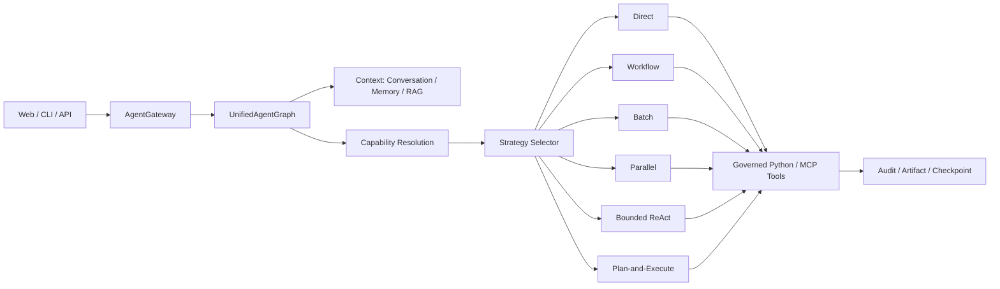

# AgentKit

AgentKit 是一个面向企业的通用 AI Agent 框架，目标是让业务 Agent 可快速交付，同时具备稳定性、并发能力、可追溯性、可维护性、可扩展性、可评测性和可控的 Token 成本。

当前仓库只有 3 个对外业务 Agent：

- `customer_service`：客服问答、订单、物流和退款。
- `hr_recruiter`：候选人批量评估与排序。
- `xhs_growth`：小红书研究、策略、文案、审核、发布与指标。

运行时不再注册隐式的平台 Agent，所有请求都由显式选择的业务 Agent 进入同一张 LangGraph。

## 核心设计



统一不等于所有任务都由 LLM 自由决策。框架优先选择确定性路径：

- 稳定的业务流程使用 `workflow`。
- 单能力使用 `direct`，大数据集使用 `batch`。
- 无依赖的多能力可使用 `parallel`。
- 需要根据 Observation 动态选择只读工具时使用有预算的 `react`。
- 多步依赖、运行时才能确定路径的任务使用 `plan_execute`。

LLM 可以建议策略，但不能扩大 Agent 的 Skill 白名单、Tool 白名单、权限或预算。

## 目录

```text
agents/<agent-id>/agent.md       Agent 唯一声明：上下文、策略、预算、Skill
skills/<package>/skill.yaml      Capability 与 Tool 机器可读契约
skills/<package>/SKILL.md        人与 Codex / Claude Code 可读的业务说明
skills/<package>/scripts/        可跨平台复用的 Handler 与 Tool 脚本
tenants/<tenant>.json            租户 Agent 白名单、RBAC 与部署参数
src/agentkit/core/execution/     6 种执行策略与预算治理
src/agentkit/runtime/            声明编译、会话上下文与启动器
tests/                           单元、集成、持久恢复和并发隔离测试
```

`skills` 是业务实现的主要载体。Agent 本身不应重复实现业务逻辑，只声明它可使用哪些能力、上下文和执行边界。

## 快速开始

```powershell
python -m venv .venv
.\.venv\Scripts\Activate.ps1
pip install -e ".[dev]"
python -m playwright install chromium
copy .env.example .env
agentkit --tenant company_alpha validate-catalog
agentkit --tenant company_alpha doctor --skip-db
agentkit --tenant company_alpha web
```

Web 控制台默认地址为 `http://127.0.0.1:8501`。

## 声明式扩展

```powershell
agentkit new-agent finance_agent
agentkit new-skill invoice-query
agentkit --tenant company_alpha validate-catalog
```

新 Agent 创建后，需要在租户的 `enabled_agents` 中显式启用。新 Skill 需要：

1. 在 `skill.yaml` 声明 Capability、Tool、Schema、风险和预算。
2. 在 `scripts/` 实现 Handler/Tool。
3. 将 Capability ID 加入目标 `agent.md` 的 `skills`。
4. 补充权限、审批、失败、越权和并发测试。

## Tool 与 MCP

Python Tool 通过 `entrypoint` 加载；MCP Tool 通过 `server` 和 `tool` 声明。两者共用同一层：

- JSON Schema 输入校验。
- Agent/Skill Tool 白名单。
- RBAC 权限。
- `read_only / governed / side_effect` 风险。
- 超时、重试、幂等和审计。

副作用 Tool 不得在 ReAct 循环中直接执行，必须通过 Workflow/Plan 的审批检查点恢复。

## Memory 与 RAG

上下文作用域固定为 `(tenant, agent, user, conversation)`。`agent.md` 独立声明：

- 近期会话窗口。
- 长期 Memory 语义检索数量。
- RAG 是否开启、Collection 和 Top-K。
- Artifact 可读/可写类型。

`customer_service` 开启 RAG，`xhs_growth` 关闭 RAG。全局 `AGENTKIT_RAG_ENABLED` 是部署开关；Agent 声明是能力边界，两者都允许时才读取知识。

## 审批与可恢复执行

LangGraph Checkpointer 支持 Memory、SQLite 和 PostgreSQL。等待审批时返回 `thread_id`；恢复时从原检查点继续，不重跑前置研究或文案生成。

XHS 发布会冻结内容 Hash和预览，审批后顺序执行发布和指标 Tool。未确定的发布结果必须先对账，不能盲目重试。

## 质量门禁

```powershell
pytest tests/unit -q
pytest tests/integration -q
ruff check src skills tests
mypy src
agentkit --tenant company_alpha validate-catalog
agentkit --tenant company_alpha doctor --skip-db
```

更详细的设计见 [docs/ARCHITECTURE.md](docs/ARCHITECTURE.md)，系统学习顺序见 [docs/AI_AGENT_系统学习与面试指南.md](docs/AI_AGENT_%E7%B3%BB%E7%BB%9F%E5%AD%A6%E4%B9%A0%E4%B8%8E%E9%9D%A2%E8%AF%95%E6%8C%87%E5%8D%97.md)。
