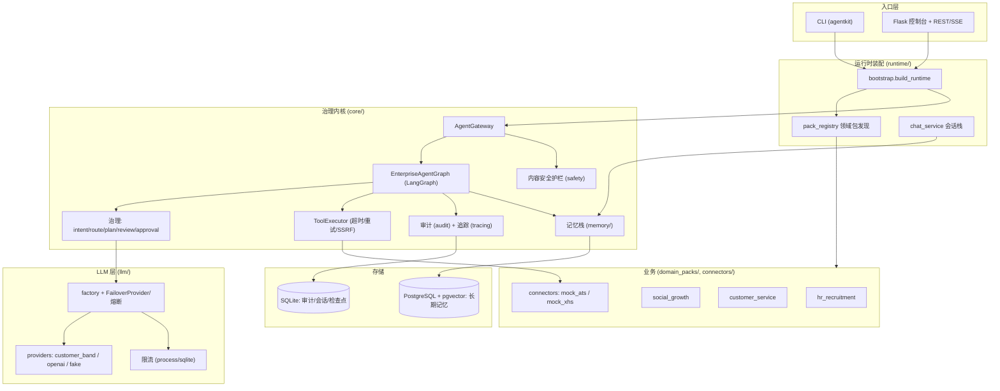
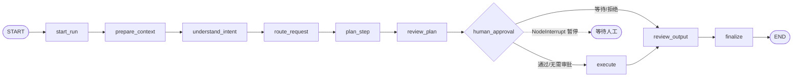
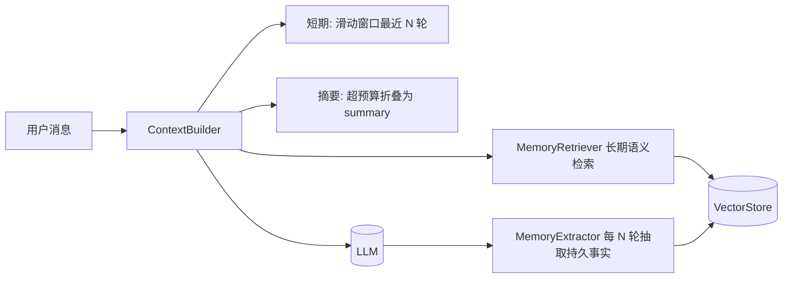
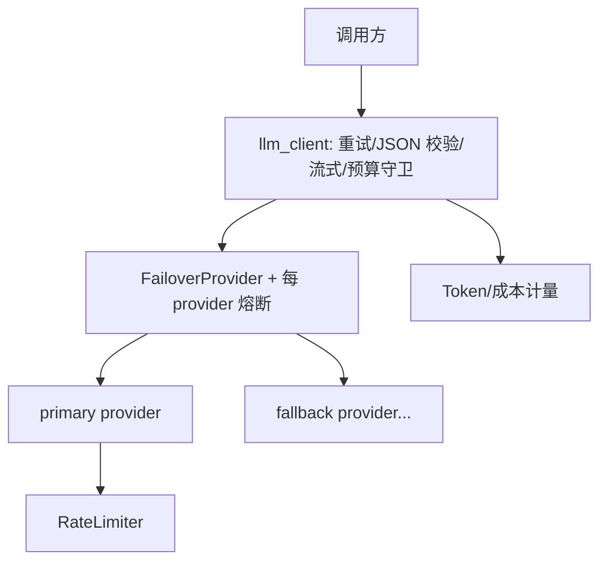

# AgentKit 架构与技术设计文档

AgentKit 是一个**通用的企业级 LLM Agent 框架**，核心是一条受治理（governed）的 LangGraph 运行时管线。框架本身与业务无关，业务能力以「领域包（domain pack）+ 技能（skill）+ 工具（tool）」的形式插入。

> 配套文档：安装与启动见 [`DEPLOYMENT.md`](./DEPLOYMENT.md)。

---

## 1. 设计目标与原则

1. **业务无关的内核**：编排、治理、记忆、可观测性、安全在内核；业务逻辑全部在可插拔的领域包中。
2. **治理优先**：意图理解 → 路由 → 计划 → 计划评审 → 人工审批 → 执行 → 输出评审，每步留痕审计。
3. **多租户隔离**：每租户独立配置、独立审计库、记忆按 `(tenant, agent, user)` 严格隔离。
4. **可插拔的外部依赖**：LLM provider、向量存储、限流后端、身份源、审批检查点都在工厂/协议接缝后，替换不影响调用方。
5. **导入安全（import-safe）**：可选依赖（psycopg / otel 等）惰性导入，未安装也不影响其余功能。
6. **生产可落地**：故障转移 + 熔断、成本/Token 计量与预算、分布式限流、内容安全护栏、RBAC、链路追踪、评测回归门禁。

---

## 2. 顶层组件

---

## 3. 核心数据契约（`core/contracts.py`）

整条管线在以下不可变 dataclass 之间传递数据：

| 契约 | 作用 |
| --- | --- |
| `TaskRequest` | 输入：`user_id`、`roles`、`text`、`context` |
| `IntentFrame` | 意图理解结果：类型/目标/边界/实体/置信度/澄清 |
| `RouteDecision` | 路由到的 `skill_name` + 原因 + 置信度 |
| `TaskPlan` / `PlanStep` | 执行计划（步骤、模式、依赖、告警） |
| `TaskResponse` | 输出 + 计划 + 审计事件列表 |
| `AgentProfile` | Agent 画像（允许的技能/工具、提示词文件） |
| `SkillDefinition` | 技能（输入/输出 JSON Schema、权限、执行模式、handler） |
| `ToolDefinition` | 工具（handler、是否幂等 `idempotent`、超时） |
| `SkillContext` | 技能执行上下文，`call_tool` 经可选 hardened invoker |

执行模式 `ExecutionMode`：`react` / `plan_execute` / `batch` / `workflow` / `no_tool`。

---

## 4. 请求生命周期（LangGraph 管线）

核心图 `EnterpriseAgentGraph`（`core/langgraph_agent.py`）：

各节点职责：

| 节点 | 职责 |
| --- | --- |
| `start_run` | 分配 `run_id`，绑定日志关联，启动审计 |
| `prepare_context` | 组装运行时上下文（租户、角色、上下文键） |
| `understand_intent` | LLM 意图拆解为 `IntentFrame`（含快路径/合并路径分支） |
| `route_request` | 将意图路由到具体技能 `RouteDecision` |
| `plan_step` | 生成 `TaskPlan`（技能步骤 + 模式 + 依赖） |
| `review_plan` | 计划评审（治理建议） |
| `human_approval` | 审批门：需要时 `NodeInterrupt` 暂停，等人工决策 |
| `execute` | `PlanExecutor` 执行技能（经策略守卫 + 工具调用） |
| `review_output` | 输出评审 |
| `finalize` | 汇总治理信息、状态、审计，产出 `TaskResponse` |

### 4.1 治理组件（`core/governance.py`、`intent.py`、`router.py`、`planner.py`、`executor.py`、`policy.py`）

- `IntentDecomposer`：把自然语言转成 `IntentFrame`；提供确定性版本供快路径用。
- `IntentRouter`：基于 `routing_hints` + LLM 选技能；提供确定性路由 + 置信度。
- `Planner`：把路由结果展开为可执行计划。
- `PlanReviewer` / `OutputReviewer` / `HumanApprovalGate`：治理评审与审批评估。
- `PlanExecutor` + `PolicyGuard`：按 RBAC/权限校验后执行技能，技能通过 `SkillContext.call_tool` 调工具。

---

## 5. 性能优化路径

两个可选开关，在保持治理可见性的前提下减少 LLM 往返：

- **确定性快路径**（`AGENTKIT_DETERMINISTIC_FASTPATH=true`）：当规则路由以**高置信度**解析出技能时，跳过 intent/route/plan/plan_review/审批评估的咨询性 LLM 调用，直接用确定性结果（0 次 LLM）。无法高置信解析的请求仍走完整 LLM 管线。
- **意图+路由合并**（`AGENTKIT_COMBINED_INTENT_ROUTE=true`）：必须走 LLM 时，把 IntentFrame 与路由在**一次** LLM 调用内解析，route 节点只做确定性校验（2 次往返 → 1 次）。

两者互补：快路径处理规则可解析的请求，合并路径为其余请求减半往返。

---

## 6. 人工审批：检查点与原地恢复（`core/gateway.py`、Phase 5）

- `human_approval` 节点在需要审批时抛 `NodeInterrupt` 暂停图。
- `AGENTKIT_APPROVAL_CHECKPOINTER`：
  - `memory`：进程内暂停/恢复（单进程）；
  - `sqlite`：检查点落盘（`data/<tenant>_checkpoints.sqlite`），**跨进程/多 worker/重启可恢复**——生产推荐；连接以 `check_same_thread=False` 创建，支持 worker 线程池跨线程 resume；
  - `none`：旧路径（输出 waiting + 全量重提）。
- `gateway.resume(thread_id, approved_skills, rejected_skills)` 注入人工决策并从暂停点继续，复用原 `run_id` 保持日志关联。

---

## 7. 记忆架构（`core/memory/`，Phase 4）

仅对 `mode: "chat"` 的会话型 Agent 生效（如 `customer_service`）。

- 上下文按 token 预算组装：`persona + 检索到的长期记忆 + summary + 最近几轮原文 + 当前问题`；超预算把更早轮次折叠进 summary。
- `MemoryExtractor` 每隔 N 轮用 LLM 抽取「持久事实」存入向量库；检索按余弦相似度（去重 + 最低分阈值）。
- 组件：`tokenizer`(HeuristicTokenEstimator)、`store`(ConversationStore)、`summarizer`、`context_builder`、`manager`、`embeddings`、`retrieval`、`extractor`。

### 7.1 VectorStore 抽象（`core/memory/vector_store.py`）

职责拆分为 **embedding（文本→向量）** 与 **`VectorStore`（向量持久化 + 近邻检索，按 `(tenant, agent, user)` 隔离）**。

| 实现 | 说明 |
| --- | --- |
| `SqliteVectorStore`（默认） | 复用每租户 SQLite `memories` 表线性 cosine 扫描；按用户隔离，单 scope 通常几十~几百条，亚毫秒级 |
| `PgVectorStore`（可选） | PostgreSQL + pgvector，余弦距离 `<=>` 精确近邻；惰性建表；只依赖 `psycopg`（向量以文本字面量传入） |

`build_vector_store()` 是唯一切换点（`AGENTKIT_VECTOR_STORE_BACKEND`：`sqlite`/`postgres`）；`MemoryRetriever` 及以上调用方不变。嵌入后端 `AGENTKIT_EMBEDDING_PROVIDER`（`fake` 离线确定性 / `openai` 兼容 `/embeddings`）。

---

## 8. LLM 层（`llm/`、`core/llm_client.py`）

- **Provider 协议**（`llm/base.py`）：`complete(system,user)`、可选 `stream(...)`、`LLMUsage` Token 计量。
- **provider 实现**：`customer_band`（内网网关）、`openai_compatible`、`fake`（离线确定性）。
- **工厂**（`llm/factory.py`）：`_build_single` 构建单个 provider；配置了 `AGENTKIT_LLM_FALLBACK_PROVIDERS` 时用 `FailoverProvider` 包裹。
- **弹性**（`llm/resilient.py`）：`CircuitBreaker`（closed/open/half-open）+ `FailoverProvider`（按序尝试、跳过熔断打开的 provider；流式仅在首 chunk 前可故障转移）。
- **限流**（`llm/rate_limit.py`）：`process`（进程内令牌桶）/ `sqlite`（跨 worker 共享桶）。
- **客户端**（`core/llm_client.py`）：重试、JSON 模式校验、流式 sink、预算守卫（`enforce_budget`）。
- **成本/Token 计量**（`core/cost.py`）：`LLMUsage`、`CostTracker`、`cost_tracking` 上下文、`LLMBudgetExceededError`（超 `AGENTKIT_LLM_RUN_BUDGET_USD` fail-closed）。

---

## 9. 工具 / 连接器执行加固（`core/tool_executor.py`、`core/net.py`）

- `ToolExecutor`：每次工具调用提供超时（`ThreadPoolExecutor`）、重试（仅对幂等工具或带 `_idempotency_key`）、幂等缓存、审计与追踪、`contextvars` 传播。
- `ToolDefinition.idempotent` / `timeout_seconds` 控制重试与超时语义。
- **SSRF 防护**（`core/net.py`）：`EgressPolicy` + `validate_url` + `safe_request`——默认仅允许 https 到**公网 IP**，禁私网/环回；`AGENTKIT_EGRESS_ALLOWED_DOMAINS` 白名单进一步收紧，`egress_max_response_bytes` 限制响应大小。
- 连接器示例：`connectors/mock_ats.py`、`connectors/mock_xhs.py`。

---

## 10. 身份与授权（`core/identity.py`、`web/identity.py`、`web/security.py`）

两层 RBAC：

1. **控制台动作 RBAC**：`Principal`（subject/roles/auth_method/claims）+ 权限（`task:run`、`task:approve`、`chat:use`、`governance:view`、`runs:view`、`*`）+ 角色（`admin`/`operator`/`member`/`viewer`）。Web 端点用 `require_permission` 装饰器强制。
2. **租户业务 RBAC**：`tenant_config.role_permissions` + `PolicyGuard`，控制技能可执行权限。

身份解析（`resolve_principal`）支持：开发模式、共享令牌映射角色、可信反代头（OIDC/SAML 由反代终结后转发 `X-Forwarded-User/Email/Roles`）。仅当反代为唯一入口时才信任这些头。

---

## 11. 内容安全护栏（`core/safety.py`）

在网关入口、LLM 调用前运行：

- **PII 检测/脱敏**：邮箱、IPv4、SSN、信用卡（Luhn 校验）、密钥（AWS/Stripe/GitHub/Google/JWT）。
- **提示注入检测**：指令覆盖、系统提示外泄、角色越权、越狱（中英文规则）。
- **审核钩子**：`ModerationProvider` 协议（默认 `NullModerationProvider`，可接外部审核）。
- `ContentSafetyGuard.inspect_input`：`block`（高风险注入直接拒绝，0 LLM 调用）/ `flag`（标注 + 审计）/ `allow`。流式输出无法回收已发 token，故对流式仅做检测+审计。
- 开关：`AGENTKIT_SAFETY_ENABLED`、`AGENTKIT_SAFETY_BLOCK_ON_INJECTION`、`AGENTKIT_SAFETY_DETECT_PII`。

---

## 12. 可观测性（`core/audit.py`、`log_context.py`、`metrics.py`、`tracing.py`）

- **审计**：`SQLiteAuditLog` 每 run 落库；`events_for(run_id)` 取证；`event_timing_summary()` 按事件类型聚合耗时。
- **run_id 关联日志**：`start_run` 绑定 contextvar，运行期所有日志自动带 `[run_id=...]`；不输出密钥/完整提示词。
- **节点耗时**：各节点记录 `node_timing`（`duration_ms`、`ok`），失败也记录后再抛。
- **链路追踪（可选 OTel）**：`init_tracing` + `span` 上下文，未装 SDK 或未开启时为 no-op；网关 `handle/resume`、LLM 调用已插桩。

---

## 13. 评测框架（`eval/`）

- 数据模型：`CheckSpec`、`EvalCase`、`CheckOutcome`、`CaseResult`、`EvalReport`（pass_rate、mean_score、`gate()`）。
- 确定性检查：`contains` / `regex` / `equals` / `min_length` / `no_pii` / `no_injection` 等。
- **LLM-as-Judge**：`LLMJudge` 按 rubric 用 `require_chat_json` 打分。
- 目标：`llm_target`（裸 LLM）/ `make_gateway_target`（走完整网关）。
- 数据集：`.jsonl` / `.json`（golden datasets）。
- CLI：`agentkit eval <dataset> --target llm|gateway --threshold ... --min-mean-score ... [--no-judge] [--json]`，回归门禁返回退出码。

---

## 14. 多租户与领域包（`runtime/`、`domain_packs/`）

- `bootstrap.build_runtime`：解析租户 → 加载提示词 → 发现并注册租户 `enabled_domains` 中的包 → 注册平台 Agent（router/general）→ 装配技能/工具 → 构建网关 + 审批检查点 + 会话服务。
- `pack_registry.discover_packs`：仓库内扫描 + 安装的 entry points，自动发现领域包。
- 内置包：`hr_recruitment`（候选人排序）、`social_growth`（小红书涨粉）、`customer_service`（会话型，带记忆）。
- 租户配置（`tenants/<id>.json`）关键字段：`enabled_domains`、`chat_agents`（`mode: command|chat`）、`role_permissions`、`approval_required_skills`、`routing_hints`、`prompt_files`、各包专属配置。

### 14.1 扩展方式

| 要加什么 | 怎么做 |
| --- | --- |
| 新业务域 | `agentkit new-pack <domain>`，实现 `pack.py` 注册技能/工具，租户 `enabled_domains` 加一行 |
| 新技能 | 在包内定义 `SkillDefinition`（输入/输出 Schema + handler） |
| 新工具/连接器 | 定义 `ToolDefinition`（标注 `idempotent`/超时），经 `SkillContext.call_tool` 调用 |
| 新 LLM provider | 实现 `LLMProvider` 协议，在 `llm/factory.py` 加分支 |
| 新向量后端 | 实现 `VectorStore` 协议，在 `build_vector_store` 加分支 |

---

## 15. 存储与持久化模型

| 数据 | 默认 | 可选 |
| --- | --- | --- |
| 审计事件 | SQLite `data/<tenant>.sqlite` | — |
| 会话历史/消息 | SQLite（per-tenant） | — |
| 长期语义记忆 | SQLite `memories` 表 | PostgreSQL + pgvector |
| 审批检查点 | 内存 / SQLite | — |
| 限流令牌桶 | 进程内 / SQLite | （接缝可接 Redis） |

所有表均运行时幂等创建，无独立迁移工具。

---

## 16. 技术栈

| 领域 | 选型 |
| --- | --- |
| 语言/运行时 | Python 3.11+ |
| 编排 | LangGraph（`StateGraph` + checkpointer + `NodeInterrupt`） |
| LLM 接入 | langchain-core / langchain-openai + 自有 provider 抽象 |
| Web | Flask（控制台 + REST + SSE 流式） |
| 配置 | pydantic-settings（`AGENTKIT_` 前缀） |
| 校验 | jsonschema（技能 I/O Schema） |
| 存储 | SQLite（内置）/ PostgreSQL + pgvector（可选） |
| 部署 | gunicorn + Docker/Compose（非 root、只读根、cap_drop、healthcheck） |
| 质量门禁 | pytest / ruff / mypy / pre-commit |
| 可观测 | 自有审计 + OpenTelemetry（可选） |

---

## 17. Web API 速览（`web/app.py`，均受控制台鉴权 + CSRF）

| 方法/路径 | 说明 |
| --- | --- |
| `GET /healthz` | 健康检查（免鉴权） |
| `GET /` `/command` `/operations` `/governance` | 控制台页面 |
| `POST /api/tasks` · `/api/tasks/stream` | 提交任务（含 SSE 流式） |
| `POST /api/tasks/resume` · `/resume/stream` | 审批后恢复任务 |
| `POST /api/chat` · `/api/chat/stream` | 会话型对话（含 SSE 流式） |
| `GET/POST /api/conversations` · `GET /api/conversations/<id>/messages` | 会话管理 |
| `GET /api/runs` · `/api/runs/<run_id>` | 运行记录与审计事件 |
| `GET /api/registry` | 已注册 Agent/技能/工具清单 |
