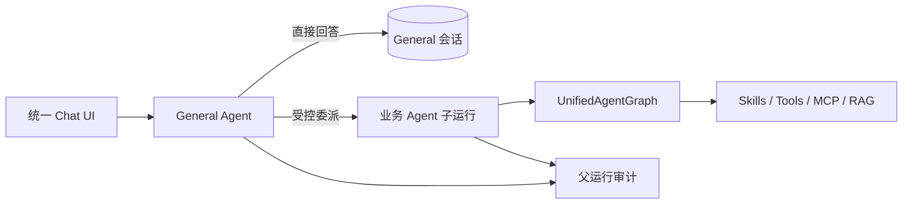
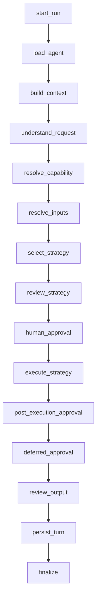
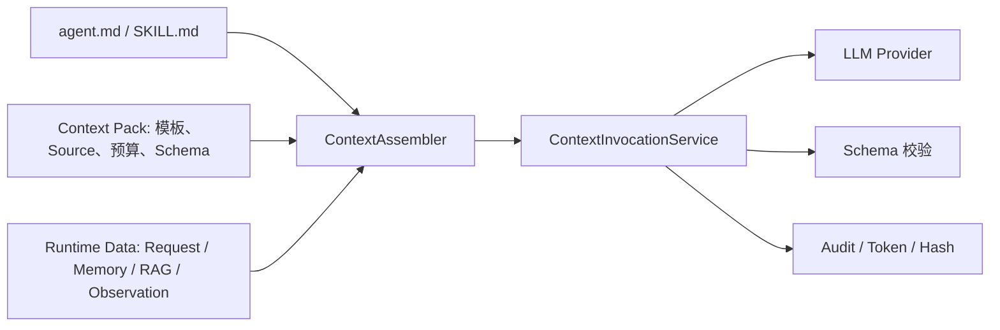

# AgentKit 统一 Agent 架构

> 需要下钻到接口、Agent、Skill/Tool、执行 Runtime、Context、Memory/RAG、可靠执行、评估、
> 安全和扩展细节时，请从[详细框架模块手册](framework/README.md)进入。

## 1. 架构目标

本框架面向企业 Agent 流程的快速交付，优先级为：

1. 稳定性与可恢复性。
2. 权限、风险、审批和租户隔离。
3. 可追溯、可评测和可观测。
4. 可控的 LLM/Tool/Token/时间预算。
5. 通过 Skill、Python Tool 和 MCP Tool 扩展业务。

当前注册 1 个协调 Agent 和 3 个业务 Agent：`general_agent`、`customer_service`、`hr_recruiter`、`xhs_growth`。General Agent 是统一会话所有者；Intent 理解和能力解析仍是图节点，不是额外 Agent。

## 2. 五层模型

| 层 | 职责 | 不负责 |
|---|---|---|
| Agent | 定义业务身份、可用 Skill、上下文、策略和预算 | 重复实现业务脚本 |
| Skill/Capability | 定义可复用能力、Schema、编排和 Tool 边界 | 越过 Agent 白名单 |
| Context Pack | 定义 LLM 节点的 System/User 分层、输入白名单、Token 与输出 Schema | 保存运行时数据或授予权限 |
| Tool | 封装企业 API、RPA、数据库或 MCP | 自行绕过权限与审计 |
| Runtime | 统一路由、策略、预算、审批、持久化和审计 | 包含特定业务逻辑 |

Agent 声明位于 `agents/<id>/agent.md`；Skill 契约位于 `skills/<package>/skill.yaml`；脚本位于
`skills/<package>/scripts/`；框架公共 LLM 节点位于 `contexts/runtime/`，业务 LLM 节点位于
`contexts/business/`。`agent.md` 正文和 `SKILL.md` 正文分别是
Agent 指令与 Skill 业务指令的唯一来源。

根目录 `skills/` 是完整业务能力与跨平台复用单元；`contexts/business/` 只是单次业务 LLM 调用的
输入、预算、模板和输出契约。每个业务 Context Pack 必须声明 `owner_skill`，Registry 启动时严格校验归属。

### 2.1 LangChain / LangGraph Runtime 基线

当前 Runtime 基于 LangChain Core 1.x、LangChain OpenAI 1.x 和 LangGraph 1.x。AgentKit
继续使用自定义 `StateGraph`，因为统一业务图需要显式节点、策略、审批、持久化和审计边界；
LangChain `create_agent` 适用于标准 Tool Calling Agent，但不替代本框架的治理图。

所有同步图调用通过 `langgraph_runtime.invoke_graph_v2` 使用 v2 `GraphOutput` 协议。业务代码
只消费 `GraphOutput.value`，不直接读取旧的 `__interrupt__` 字段；审批暂停与恢复使用公开的
`langgraph.types.interrupt` 和 `Command` API。这里的 v2 是 LangGraph 1.1+ 的输出协议，
不是 LangGraph 2.0。

## 3. General Agent 与统一业务图

Web 聊天先进入 `MultiAgentCoordinator`。显式 `@招聘` 等提及只解析当前消息；未提及的消息由 General Agent 根据能力卡返回 `answer / clarify / delegate`。Runtime 校验目标后，业务 Agent 才进入统一 LangGraph。



General Agent 只拥有对话与委派能力，不拥有业务工具。业务 Agent 获得 General 会话的限长摘要与近期消息，但 Memory、RAG、Skills 和 Tools 仍使用目标 Agent 自己的作用域与白名单。

### 3.1 统一业务图



`/api/chat` 调用 `MultiAgentCoordinator.handle/resume`，负责 General 会话和父子运行；`/api/tasks` 与 CLI 继续调用 `AgentGateway.handle/resume`，用于明确指定 Agent 的系统集成。两条入口最终共用同一 `UnifiedAgentGraph`、Tool 治理和审计存储。

`resolve_inputs` 不是各 Agent 自己实现的参数判断。Runtime 先合并显式参数、请求上下文和 `runtime.intent` 提取的实体；若所选 Skill 的输入 Schema 仍缺少必填字段，再调用统一的 `runtime.input-resolve`。该节点只补全 Schema 允许且有消息或会话依据的字段，结果必须通过 JSON Schema 校验；仍不能确定时才返回自然语言追问。这样招聘、客服和小红书 Agent 使用同一判断流程，只由各自 Skill Schema 表达输入差异。

## 4. 策略选择

| 条件 | 策略 | 企业约束 |
|---|---|---|
| 单一、明确能力 | Direct | 不产生额外计划 |
| 开发期已知步骤 | Workflow | 优先承载稳定业务流 |
| 同一能力的大数据集 | Batch | 分片、合并、并发上限 |
| 多个无依赖只读能力 | Parallel | 禁止副作用 |
| 单能力需根据观测选 Tool | ReAct | 只读、重复动作检测、硬预算 |
| 多步依赖与动态计划 | Plan-and-Execute | DAG 校验、有限重规划、冻结副作用 |

`StrategySelector` 先根据 `ComplexityAssessment` 确定性选择。只有 Agent 和所有候选 Skill 都允许动态选择时，LLM 才能提供建议。建议仍需通过：

- Agent `allowed_strategies`。
- Agent `allowed_skills`。
- Skill 编排和 Tool Policy。
- 副作用矩阵。
- 全局、Agent、Skill 逐层收紧的 `AutonomyBudget`。

## 5. 预算与终止

ReAct 和 Plan 子图共享以下硬上限：

- `max_model_calls`
- `max_tool_calls`
- `max_iterations`
- `max_plan_steps`
- `max_replans`
- `max_tokens`
- `timeout_seconds`

任一上限达到后返回受控状态，不继续尝试。系统只记录决策摘要、Tool/Skill、参数摘要、Observation/Artifact 引用和预算，不保存隐藏思维链。

## 6. 上下文与隔离

```text
tenant_id
  └─ general_agent
      └─ user_id
          └─ conversation_id
              └─ Turn（一次用户输入）
                  ├─ User Message（路由前持久化）
                  └─ Attempt 1..N（首次执行与 Retry）
                      ├─ Assistant Message / Revision
                      └─ Action（审批决策与预览）
```

`ConversationContextService` 在该作用域内组装：

1. 当前会话摘要，以及 Conversation Projection 选出的 canonical 成功 Attempt 输入/输出。
2. 当前 Agent+用户的长期 Memory。
3. Agent 允许的 RAG Collection。
4. 当前运行可读的 Artifact。

Chat 在路由、Agent 或 Tool 执行前先创建 Turn、User Message 和 Attempt，因此后续失败不能抹掉用户输入。Assistant 输出、审批预览、修订和失败摘要都追加到所属 Attempt；Retry 创建 Attempt N+1，不覆盖旧 Attempt。`ConversationPersistenceService` 只在成功 Attempt 成为 canonical 后更新摘要和长期 Memory。`ExtractingMemoryWriter` 从成功对话中提取稳定事实，Memory 失败不中断主业务。

委派时不创建第二个业务会话。`build_for_delegation` 在验证 General 会话归属后，复用其摘要和近期消息，同时按目标 Agent 读取长期 Memory 与 RAG。`task_runs.parent_run_id`、`agent_id` 和 `conversation_id` 将 General 父运行、业务子运行与会话关联；审批恢复通过子运行线程回到同一个父运行。

### 6.1 Context Pack 装配与调用



装配顺序固定为：不可覆盖安全 Fragment → 节点 System → 显式允许的 Agent/Skill 指令。动态数据只进入
`UNTRUSTED_DATA_BEGIN/END` 包裹的 User Message，未在 `context.yaml` 声明的值会被忽略。预算取 Model Context
Window、Agent、Skill、Run 剩余预算与 Pack 上限的最小值，再按优先级做确定性裁剪。

Registry 启动时校验路径、Source、Serializer、Truncator、模板变量、JSON Schema 与租户 Override，并把 15 个 Pack（11 个 Runtime、4 个 Business）的
Hash 写入 Runtime Manifest。等待审批的 Checkpoint 同时保存 Context Manifest Hash；恢复时 Hash 不一致会拒绝执行并要求
重新发起任务。治理页面只展示 ID、Version、Hash、Override Hash 和预算，不展示 Prompt 或运行时内容。

## 7. Tool 治理

`ToolExecutor` 对 Python 和 MCP 采用同一治理顺序：

1. Tool 是否在当前 Skill 白名单。
2. Tool 风险是否与当前策略匹配。
3. 业务角色是否拥有所需权限。
4. JSON Schema 是否有效。
5. 副作用是否有审批决策。
6. 幂等、超时和重试规则是否允许执行。
7. 记录开始、结束、失败和结果摘要。

MCP Server 由租户 `mcp_servers` 配置，Capability 只引用 Tool ID，因此替换 Python/API/MCP 后端不会改变 Agent 治理边界。

## 8. 审批与持久执行

副作用有两种检查点：

- 执行前：Skill 本身是 `side_effect`。
- 执行后：Workflow 先生成冻结内容，返回 `deferred_action`。

图通过公开的 `interrupt()` 暂停。`resume` 校验待审 Skill，将决策写入原
`TaskRequest.context`，再通过 `Command(resume=True)` 从 Checkpoint 继续。
SQLite/PostgreSQL Checkpointer 可以跨进程重启恢复。生产环境的 `approval_checkpointer` 必须是 `sqlite` 或 `postgres`，不能使用 `memory` 或 `none`；多实例必须使用共享 PostgreSQL。

审批 Action 与 preview 是 Conversation Projection 中的 durable 记录，浏览器刷新后从 Timeline 重建。若 Checkpoint 缺失或失效，Runtime 不会重放副作用：Action 标记为 `invalidated`，Attempt 标记为 `interrupted`，已有 User/Assistant Message 与 preview 保留，用户只能创建新的 Retry Attempt。审批已批准但恢复执行失败时，Action 仍保留 `approved` 决策，Attempt 与失败摘要标记为 `failed`。

### 8.1 会话执行状态与删除门控

Conversation Timeline 是聊天 UI 的显示事实来源，按 Turn 展开全部 Attempt、Message、Revision 和 Action；LLM Context 只消费每个 Turn 的 canonical 成功 Attempt。`ConversationRunStateResolver` 仅保留给父子 Run 的运行追踪、历史对账和删除决策，不再根据空 `messages` 猜测聊天恢复状态。失败会话在原 Turn 创建 Attempt N+1；旧 Attempt、Run 和审计事件均不覆盖。

删除策略由 `ConversationDeletionService` 强制执行，不能只依赖前端按钮状态：

- `running`：拒绝普通删除和强制删除，返回冲突；必须等待本次执行完成。当前版本不把手动停止混入删除流程，手动停止属于独立的后续能力。
- `waiting_for_approval`：前端要求两次确认；强删时先将相关父子 Run 关闭为 `cancelled`，再删除会话消息、摘要和来源长期记忆。
- `failed`：前端要求两次确认，可直接强删会话数据。
- 其他稳定终态：一次确认后删除。

强删不会删除企业运行追踪、审计事件或运行 Artifact，也不会尝试回滚已经发生的外部 Tool 副作用。
框架不使用 `deletion_pending`、后台删除轮询或执行器协作取消，因此不会因删除操作改变运行中任务的状态。

## 9. 并发与一致性

- 每个请求有独立 `run_id/thread_id/conversation_id`。
- Artifact Store 按租户和运行隔离。
- 幂等键防止副作用重复提交。
- Parallel/Batch 都有显式并发上限。
- 已完成的 Plan 副作用 Step 会冻结，重规划不能修改。

## 10. 扩展点

- 新业务：增加 Agent Manifest 或 Skill Package。
- 新 Tool 后端：实现 `ToolExecutionBackend`。
- 新 Memory/RAG：实现现有 Reader/Store Protocol。
- 新策略：实现 `ExecutionStrategy`，显式注册并增加 Policy 矩阵。
- 高风险隔离：Tool Backend 可替换为容器、微虚拟机或远程沙箱，不改变上层契约。

### 10.1 媒体理解 Provider

`agentkit.core.media` 定义与业务平台无关的 `MediaAsset`、`MediaEvidence`、
`MediaUnderstandingResult` 和 `MediaUnderstandingProvider`。浏览器连接器只采集可信媒体 URL，
Provider 负责将媒体资产转换为带来源、模型和置信度的结构化证据，Skill 与 Review 只消费标准结果。

媒体注册表提供 `none` 和 `ocr` 场景适配器。`ocr` 本身不绑定厂商模型，实际实现由共享 OCR
Provider 决定；未知 Provider ID 在浏览器启动前失败，防止配置错误被静默忽略。租户只需声明
是否对 XHS 启用 OCR，以及最多处理多少图片：

```json
{
  "media_understanding_provider": "ocr",
  "media_understanding_max_images": 3,
  "media_understanding_min_confidence": 0.75
}
```

真实 Provider 返回的证据会进入文章生成和内容 Review。启用媒体理解并不降低审核标准：具体工具、场景、
效果或推荐仍须能关联到 DOM 或媒体证据；Provider 失败会记录为 `failed`，不会伪装为 `skipped`，也不会
删除已经抓取到的文本证据。

### 10.2 共享 OCR Provider

`agentkit.core.ocr` 定义 XHS 与 RAG 共用的结果和 Provider 契约，`agentkit.runtime.ocr`
是唯一配置装配入口。当前支持 `none` 与 `ollama`；Ollama 实现调用显式配置的本机
`/api/generate`，默认模型为 `glm-ocr:latest`。

XHS 与 RAG 共享 URL、模型、超时和图片大小上限，但分别由
`AGENTKIT_MEDIA_UNDERSTANDING_PROVIDER=ocr` 和 `AGENTKIT_RAG_OCR_ENABLED=true`
启用。`AGENTKIT_OCR_PROVIDER=none` 是全局硬关闭：不得发起 HTTP 请求、不得遍历媒体
执行 OCR，也不得隐式回退到 Tesseract。XHS 记录 `skipped/ocr_not_configured`，RAG 按未启用
OCR 处理。

Ollama Endpoint 默认只允许 `localhost`、`127.0.0.1`、`::1` 或 Docker 宿主机别名
`host.docker.internal`，路径必须严格为 `/api/generate`，禁止重定向并限制请求图片与响应体大小。
Docker 容器可通过该宿主机别名访问宿主机或已映射的 WSL Ollama 服务。单张图片或单页失败只影响该资产；
全部 XHS 图片失败才返回媒体理解失败。GLM-OCR 未返回可信置信度时保持 `None`，不能因此
降低 Review 标准。

小红书详情页触发会话挑战时，当前案例记录为“已尝试失败”，其余案例记录为
`detail_skipped_reason=session_challenge`，以区分真实抓取失败和未尝试条目。

## 11. 部署建议

开发环境可使用 SQLite；多实例生产环境建议使用 PostgreSQL 审计、幂等、会话和 Checkpoint，将 Artifact 放入对象存储。RPA 浏览器是特定 Tool 的部署需求，不是框架核心前提。

## 12. 质量门禁

- Manifest 严格校验，未知字段失败。
- Agent/Skill 预算不能超过上层上限。
- 单元测试覆盖策略、Policy、Schema、Tool 和业务 Handler。
- 集成测试覆盖恢复、并发隔离、Web RBAC、安全和 XHS 冻结发布。
- `ruff` / `mypy` / 声明目录验证 / 部署预检作为 CI 门禁。
