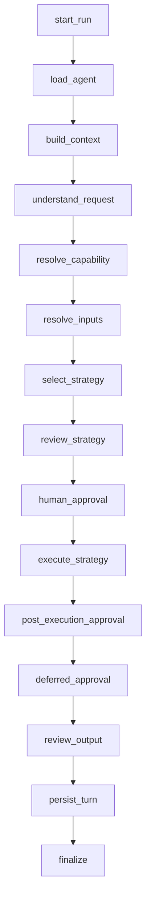
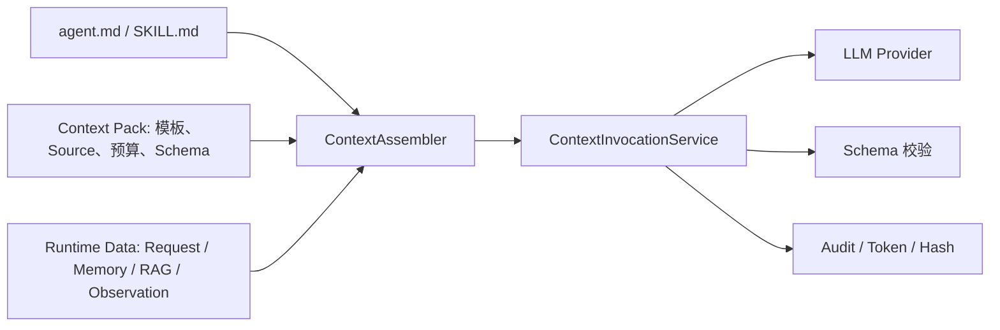

# AgentKit 统一 Agent 架构

## 1. 架构目标

本框架面向企业 Agent 流程的快速交付，优先级为：

1. 稳定性与可恢复性。
2. 权限、风险、审批和租户隔离。
3. 可追溯、可评测和可观测。
4. 可控的 LLM/Tool/Token/时间预算。
5. 通过 Skill、Python Tool 和 MCP Tool 扩展业务。

当前只有 3 个运行时 Agent：`customer_service`、`hr_recruiter`、`xhs_growth`。Intent 理解和能力解析是图节点，不是额外 Agent。

## 2. 五层模型

| 层 | 职责 | 不负责 |
|---|---|---|
| Agent | 定义业务身份、可用 Skill、上下文、策略和预算 | 重复实现业务脚本 |
| Skill/Capability | 定义可复用能力、Schema、编排和 Tool 边界 | 越过 Agent 白名单 |
| Context Pack | 定义 LLM 节点的 System/User 分层、输入白名单、Token 与输出 Schema | 保存运行时数据或授予权限 |
| Tool | 封装企业 API、RPA、数据库或 MCP | 自行绕过权限与审计 |
| Runtime | 统一路由、策略、预算、审批、持久化和审计 | 包含特定业务逻辑 |

Agent 声明位于 `agents/<id>/agent.md`；Skill 契约位于 `skills/<package>/skill.yaml`；脚本位于
`skills/<package>/scripts/`；LLM 节点上下文契约位于 `contexts/`。`agent.md` 正文和 `SKILL.md` 正文分别是
Agent 指令与 Skill 业务指令的唯一来源。

## 3. 统一主图



入口只有 `AgentGateway.handle/resume`。Web 的 `/api/chat` 和 `/api/tasks` 只是权限不同的传输入口，都构造 `TaskRequest` 并调用同一 Gateway。

## 4. 策略选择

| 条件 | 策略 | 企业约束 |
|---|---|---|
| 单一、明确能力 | Direct | 不产生额外计划 |
| 开发期已知步骤 | Workflow | 优先承载稳定业务流 |
| 同一能力的大数据集 | Batch | 分片、合并、并发上限 |
| 多个无依赖只读能力 | Parallel | 禁止副作用 |
| 单能力需根据观测选 Tool | ReAct | 只读、重复动作检测、硬预算 |
| 多步依赖与动态计划 | Plan-and-Execute | DAG 校验、有限重规划、冻结副作用 |

`StrategySelector` 先根据 `ComplexityAssessment` 确定性选择。只有 Agent 和所有候选 Skill 都允许动态选择时，LLM 才能提供建议。建议仍需通过：

- Agent `allowed_strategies`。
- Agent `allowed_skills`。
- Skill 编排和 Tool Policy。
- 副作用矩阵。
- 全局、Agent、Skill 逐层收紧的 `AutonomyBudget`。

## 5. 预算与终止

ReAct 和 Plan 子图共享以下硬上限：

- `max_model_calls`
- `max_tool_calls`
- `max_iterations`
- `max_plan_steps`
- `max_replans`
- `max_tokens`
- `timeout_seconds`

任一上限达到后返回受控状态，不继续尝试。系统只记录决策摘要、Tool/Skill、参数摘要、Observation/Artifact 引用和预算，不保存隐藏思维链。

## 6. 上下文与隔离

```text
tenant_id
  └─ agent_id
      └─ user_id
          └─ conversation_id
```

`ConversationContextService` 在该作用域内组装：

1. 当前会话摘要和近期消息。
2. 当前 Agent+用户的长期 Memory。
3. Agent 允许的 RAG Collection。
4. 当前运行可读的 Artifact。

`ConversationPersistenceService` 只在成功或受控终止后写入消息。`ExtractingMemoryWriter` 从对话中提取稳定事实，Memory 失败不中断主业务。

### 6.1 Context Pack 装配与调用



装配顺序固定为：不可覆盖安全 Fragment → 节点 System → 显式允许的 Agent/Skill 指令。动态数据只进入
`UNTRUSTED_DATA_BEGIN/END` 包裹的 User Message，未在 `context.yaml` 声明的值会被忽略。预算取 Model Context
Window、Agent、Skill、Run 剩余预算与 Pack 上限的最小值，再按优先级做确定性裁剪。

Registry 启动时校验路径、Source、Serializer、Truncator、模板变量、JSON Schema 与租户 Override，并把 11 个 Pack 的
Hash 写入 Runtime Manifest。等待审批的 Checkpoint 同时保存 Context Manifest Hash；恢复时 Hash 不一致会拒绝执行并要求
重新发起任务。治理页面只展示 ID、Version、Hash、Override Hash 和预算，不展示 Prompt 或运行时内容。

## 7. Tool 治理

`ToolExecutor` 对 Python 和 MCP 采用同一治理顺序：

1. Tool 是否在当前 Skill 白名单。
2. Tool 风险是否与当前策略匹配。
3. 业务角色是否拥有所需权限。
4. JSON Schema 是否有效。
5. 副作用是否有审批决策。
6. 幂等、超时和重试规则是否允许执行。
7. 记录开始、结束、失败和结果摘要。

MCP Server 由租户 `mcp_servers` 配置，Capability 只引用 Tool ID，因此替换 Python/API/MCP 后端不会改变 Agent 治理边界。

## 8. 审批与持久执行

副作用有两种检查点：

- 执行前：Skill 本身是 `side_effect`。
- 执行后：Workflow 先生成冻结内容，返回 `deferred_action`。

图通过 `NodeInterrupt` 暂停。`resume` 校验待审 Skill，将决策写入原 `TaskRequest.context`，然后从 Checkpoint 继续。SQLite/PostgreSQL Checkpointer 可以跨进程重启恢复。

## 9. 并发与一致性

- 每个请求有独立 `run_id/thread_id/conversation_id`。
- Artifact Store 按租户和运行隔离。
- 幂等键防止副作用重复提交。
- Parallel/Batch 都有显式并发上限。
- 已完成的 Plan 副作用 Step 会冻结，重规划不能修改。

## 10. 扩展点

- 新业务：增加 Agent Manifest 或 Skill Package。
- 新 Tool 后端：实现 `ToolExecutionBackend`。
- 新 Memory/RAG：实现现有 Reader/Store Protocol。
- 新策略：实现 `ExecutionStrategy`，显式注册并增加 Policy 矩阵。
- 高风险隔离：Tool Backend 可替换为容器、微虚拟机或远程沙箱，不改变上层契约。

## 11. 部署建议

开发环境可使用 SQLite；多实例生产环境建议使用 PostgreSQL 审计、幂等、会话和 Checkpoint，将 Artifact 放入对象存储。RPA 浏览器是特定 Tool 的部署需求，不是框架核心前提。

## 12. 质量门禁

- Manifest 严格校验，未知字段失败。
- Agent/Skill 预算不能超过上层上限。
- 单元测试覆盖策略、Policy、Schema、Tool 和业务 Handler。
- 集成测试覆盖恢复、并发隔离、Web RBAC、安全和 XHS 冻结发布。
- `ruff` / `mypy` / 声明目录验证 / 部署预检作为 CI 门禁。
