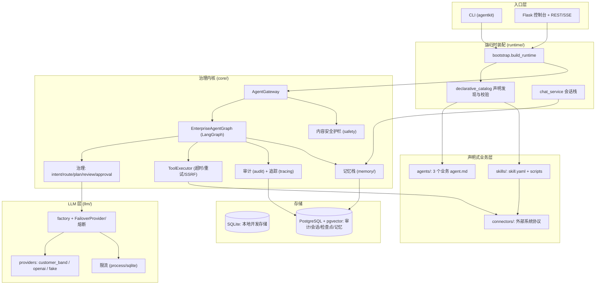
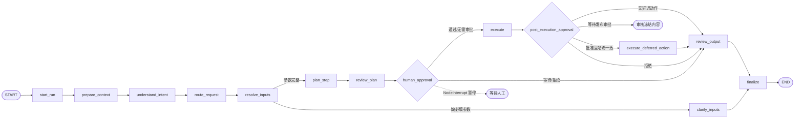
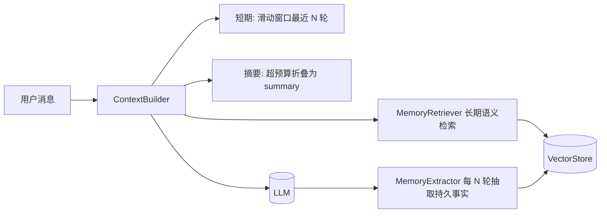
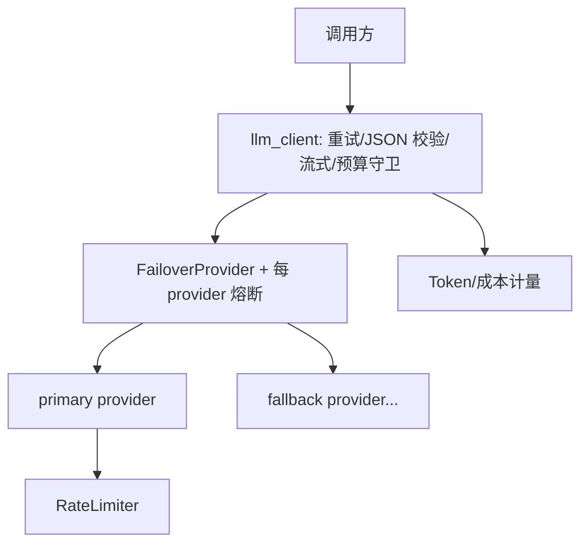

# AgentKit 架构与技术设计文档

AgentKit 是一个**通用的企业级 LLM Agent 框架**，核心是一条受治理（governed）的 LangGraph 运行时管线。框架本身与业务无关：业务 Agent 在 `agents/*/agent.md` 中声明，上下文边界、技能与工具在 `skills/*/skill.yaml` 及其脚本中声明，外部系统协议由 `connectors/` 承担。

当前仓库只有 3 个对外业务 Agent：`hr_recruiter`、`xhs_growth`、`customer_service`。运行时还注册 `router`、`general` 两个内部平台角色，它们用于路由和通用兜底，不属于租户配置的业务 Agent，也不应计入业务 Agent 数量。

> 配套文档：安装与启动见 [`DEPLOYMENT.md`](./DEPLOYMENT.md)。

---

## 1. 设计目标与原则

1. **业务无关的内核**：编排、治理、记忆、可观测性、安全在内核；业务声明与实现分别位于可插拔的 `agents/`、`skills/` 与 `connectors/`。
2. **治理优先**：意图理解 → 路由 → 计划 → 计划评审 → 人工审批 → 执行 → 输出评审，每步留痕审计。
3. **多租户隔离**：每租户独立配置；SQLite 模式按文件隔离，PostgreSQL 模式按 tenant 字段隔离；记忆按 `(tenant, agent, user)` 严格隔离。
4. **可插拔的外部依赖**：LLM provider、runtime storage、向量存储、限流后端、身份源、审批检查点都在工厂/协议接缝后，替换不影响调用方。
5. **导入安全（import-safe）**：可选依赖（psycopg / otel 等）惰性导入，未安装也不影响其余功能。
6. **生产可落地**：故障转移 + 熔断、成本/Token 计量与预算、分布式限流、内容安全护栏、RBAC、链路追踪、评测回归门禁。

---

## 2. 顶层组件

---

## 3. 核心数据契约（`core/contracts.py`）

整条管线在以下不可变 dataclass 之间传递数据：

| 契约 | 作用 |
| --- | --- |
| `TaskRequest` | 输入：`user_id`、`roles`、`text`、`context` |
| `IntentFrame` | 意图理解结果：类型/目标/边界/实体/置信度/澄清 |
| `RouteDecision` | 路由到的 `skill_name` + 原因 + 置信度 |
| `TaskPlan` / `PlanStep` | 执行计划（步骤、模式、依赖、告警） |
| `TaskResponse` | 输出 + 计划 + 审计事件列表 |
| `AgentManifest` | 从 `agent.md` 解析出的业务 Agent 声明（技能、提示词、Token 和上下文策略） |
| `CapabilityManifest` / `ToolManifest` | 从 `skill.yaml` 解析出的能力与工具声明 |
| `AgentProfile` | 声明式清单编译后的运行时 Agent 画像 |
| `SkillDefinition` | 技能（输入/输出 JSON Schema、权限、执行模式、handler） |
| `ToolDefinition` | 工具（handler、是否幂等 `idempotent`、超时） |
| `SkillContext` | 技能执行上下文，`call_tool` 经可选 hardened invoker |

执行模式 `ExecutionMode`：`react` / `plan_execute` / `batch` / `workflow` / `no_tool`。

---

## 4. 请求生命周期（LangGraph 管线）

核心图 `EnterpriseAgentGraph`（`core/langgraph_agent.py`）是通用平台图，不包含 HR / 社媒 / 客服等客制化业务代码；业务差异来自声明式目录编译得到的 `AgentProfile`、`SkillDefinition`、`ToolDefinition` 以及 tenant 配置：

各节点职责：

| 节点 | 职责 |
| --- | --- |
| `start_run` | 分配 `run_id`，绑定日志关联，启动审计 |
| `prepare_context` | 组装运行时上下文（租户、角色、上下文键） |
| `understand_intent` | LLM 意图拆解为 `IntentFrame`（含快路径/合并路径分支） |
| `route_request` | 将意图路由到具体技能 `RouteDecision` |
| `resolve_inputs` | 依据 skill `input_schema` 合并结构化参数、意图实体、语义抽取和默认值；记录来源与置信度 |
| `clarify_inputs` | 必填参数仍缺失时返回 `needs_clarification`，在审批和工具执行前停止 |
| `plan_step` | 生成 `TaskPlan`（技能步骤 + 模式 + 依赖） |
| `review_plan` | 计划评审（治理建议） |
| `human_approval` | 审批门：需要时 `NodeInterrupt` 暂停，等人工决策 |
| `execute` | `PlanExecutor` 执行技能（经策略守卫 + 工具调用） |
| `post_execution_approval` | 对 review 后产生的冻结副作用执行二阶段审批；批准绑定内容哈希 |
| `execute_deferred_action` | 只执行原 skill 声明的延迟 tools；不重新生成内容，保留幂等和审计 |
| `review_output` | 输出评审 |
| `finalize` | 汇总治理信息、状态、审计，产出 `TaskResponse` |

### 4.1 治理组件（`core/governance.py`、`intent.py`、`router.py`、`input_resolution.py`、`planner.py`、`executor.py`、`policy.py`）

- `IntentDecomposer`：把自然语言转成 `IntentFrame`；提供确定性版本供快路径用。
- `IntentRouter`：基于 `routing_hints` + LLM 选技能；提供确定性路由 + 置信度。
- `SkillInputResolver`：把自由文本映射到已选 skill 的 JSON Schema；必填项低置信/缺失时澄清，不静默使用业务默认值。
- `Planner`：把路由结果展开为可执行计划。
- `PlanReviewer` / `OutputReviewer` / `HumanApprovalGate`：治理评审与审批评估。
- `PlanExecutor` + `PolicyGuard`：按 RBAC/权限校验后执行技能，技能通过 `SkillContext.call_tool` 调工具。

---

## 5. 性能优化路径

两个可选开关，在保持治理可见性的前提下减少 LLM 往返：

- **确定性快路径**（`AGENTKIT_DETERMINISTIC_FASTPATH=true`）：当规则路由以**高置信度**解析出技能时，跳过 intent/route/plan/plan_review/审批评估的咨询性 LLM 调用。参数已完整时为 0 次 LLM；参数需从自由文本语义抽取时增加 1 次 slot extraction。无法高置信解析的请求仍走完整 LLM 管线。
- **意图+路由合并**（`AGENTKIT_COMBINED_INTENT_ROUTE=true`）：必须走 LLM 时，把 IntentFrame 与路由在**一次** LLM 调用内解析，route 节点只做确定性校验（2 次往返 → 1 次）。

两者互补：快路径处理规则可解析的请求，合并路径为其余请求减半往返。

---

## 6. 人工审批：检查点与原地恢复（`core/gateway.py`、Phase 5）

- `human_approval` 节点在需要审批时抛 `NodeInterrupt` 暂停图。
- `AGENTKIT_APPROVAL_CHECKPOINTER`：
  - `memory`：进程内暂停/恢复（单进程）；
  - `sqlite`：检查点落盘（`data/<tenant>_checkpoints.sqlite`），**跨进程/多 worker/重启可恢复**；连接以 `check_same_thread=False` 创建，支持 worker 线程池跨线程 resume；
  - `postgres`：检查点写入配置的 PostgreSQL，与审计、会话、向量记忆共用同一持久化，Docker/企业部署推荐；
  - `none`：无检查点模式（输出 waiting + 受保护全量重提）。
- `gateway.resume(thread_id, approved_skills, rejected_skills, decision_context)` 注入人工决策并从暂停点继续，复用原 `run_id` 保持日志关联；Web 层会把审批人 `Principal` 写入 `decision_context`。
- resume 会校验 thread 仍处于暂停状态、决策非空、批准/拒绝不重叠，且决策 skill 必须是当前等待审批的 skill；过期 checkpoint 返回 409，非法决策返回 400，不会对已完成或无关 thread 写 `run_resumed`。

---

## 7. 记忆架构（`core/memory/`，Phase 4）

对所有配置在 `chat_agents` 中的 chat-first Agent 生效。回答型 agent 直接用记忆生成回复；行动型 agent 在进入 LangGraph 前读取同一套 summary / recent messages / semantic memories，并在任务完成或等待审批后写回会话。

- 上下文按 token 预算组装：`persona + 检索到的长期记忆 + summary + 最近几轮原文 + 当前问题`；超预算把更早轮次折叠进 summary。
- `MemoryExtractor` 每隔 N 轮用 LLM 抽取「持久事实」存入向量库；检索按余弦相似度（去重 + 最低分阈值）。
- 组件：`tokenizer`(HeuristicTokenEstimator)、`store`(ConversationStore / PgConversationStore)、`summarizer`、`context_builder`、`manager`、`embeddings`、`retrieval`、`extractor`。

### 7.1 VectorStore 抽象（`core/memory/vector_store.py`）

职责拆分为 **embedding（文本→向量）** 与 **`VectorStore`（向量持久化 + 近邻检索，按 `(tenant, agent, user)` 隔离）**。

| 实现 | 说明 |
| --- | --- |
| `SqliteVectorStore`（默认） | 复用每租户 SQLite `memories` 表线性 cosine 扫描；按用户隔离，单 scope 通常几十~几百条，亚毫秒级 |
| `PgVectorStore`（可选） | PostgreSQL + pgvector，余弦距离 `<=>` 精确近邻；惰性建表；只依赖 `psycopg`（向量以文本字面量传入） |

`build_vector_store()` 是唯一切换点（`AGENTKIT_VECTOR_STORE_BACKEND`：`sqlite`/`postgres`）；`MemoryRetriever` 及以上调用方不变。嵌入后端 `AGENTKIT_EMBEDDING_PROVIDER`（`fake` 离线确定性 / `openai` 兼容 `/embeddings`）。

---

## 7.2 企业知识库 RAG 框架（`core/rag/`）

会话记忆解决的是 `(tenant, agent, user)` 范围内的个人历史事实；企业 RAG 解决的是制度、手册、FAQ、案例、产品资料等共享知识。当前实现已经包含从文件夹入库到 chat 上下文装载的闭环：

- 数据契约：`KnowledgeDocument` / `KnowledgeChunk` / `RetrievalQuery` / `RetrievalHit`，包含 tenant、metadata、URI、ACL roles。
- 文件摄取：`DocumentFolderLoader` 支持 `pdf/docx/txt/md/html/json/csv`；PDF 优先文本抽取，扫描件可启用 OCR；Word 抽取段落、表格，并可对嵌入图片 OCR。图表/柱状图等图片内容通过 `ImageAnalyzer` 接口接入，默认实现为 Tesseract OCR，后续可替换成多模态图表理解 provider。
- Chunk 策略：`AdaptiveTextChunker` 优先保留页、表格、OCR 块、图片块等结构边界；超长块才做 overlap split；chunk metadata 保留 `pages/content_kinds/source_path/extractors`，便于引用与追溯。
- 持久化：`ChromaKnowledgeStore` 为默认 RAG 后端，持久化 chunk、metadata、ACL 和 embedding；`InMemoryKnowledgeStore` 用于测试。
- 检索：`KeywordRetriever` 使用 BM25；`VectorRetriever` 使用 embedding cosine；`HybridRetriever` 做加权 fusion，并支持 `NoopQueryRewriter` / `LLMQueryRewriter`。
- 重排：默认 `IdentityReranker`；可选 `KeywordOverlapReranker` 或 `LLMReranker`。小客户默认关闭 LLM rewrite/rerank 以控制 token 成本。
- 运行时接入：`ChatService` 在 `AGENTKIT_RAG_ENABLED=true` 时把 `Relevant knowledge` 注入回答型 agent prompt；行动型 agent 在进入 LangGraph 前把 `retrieved_knowledge` 写入 `TaskRequest.context.chat_memory`。
- 评估：`RAGEvalCase` / `evaluate_retriever` 输出 hit-rate、recall@k、precision@k、MRR，可作为 CI 回归门禁。

默认 `AGENTKIT_RAG_ENABLED=false`，不会影响当前 agent 行为。RAG 检索严格按 tenant 隔离，并用入库时的 `acl_roles` 与后端可信解析出的 business roles 做过滤；浏览器 payload 中的 roles 不参与授权。

---

## 8. LLM 层（`llm/`、`core/llm_client.py`）

- **Provider 协议**（`llm/base.py`）：`complete(system,user)`、可选 `stream(...)`、`LLMUsage` Token 计量。
- **provider 实现**：`customer_band`（内网网关）、`openai_compatible`、`fake`（离线确定性）。
- **工厂**（`llm/factory.py`）：`_build_single` 构建单个 provider；配置了 `AGENTKIT_LLM_FALLBACK_PROVIDERS` 时用 `FailoverProvider` 包裹。
- **弹性**（`llm/resilient.py`）：`CircuitBreaker`（closed/open/half-open）+ `FailoverProvider`（按序尝试、跳过熔断打开的 provider；流式仅在首 chunk 前可故障转移）。
- **限流**（`llm/rate_limit.py`）：`process`（进程内令牌桶）/ `sqlite`（跨 worker 共享桶）。
- **客户端**（`core/llm_client.py`）：重试、JSON 模式校验、流式 sink、预算守卫（`enforce_budget`）。
- **成本/Token 计量**（`core/cost.py`）：`LLMUsage`、`CostTracker`、`cost_tracking` 上下文、`LLMBudgetExceededError`（超 `AGENTKIT_LLM_RUN_BUDGET_USD` fail-closed）。

---

## 9. 工具 / 连接器执行加固（`core/tool_executor.py`、`core/net.py`）

- `ToolExecutor`：每次工具调用进入共享有界 `ThreadPoolExecutor`（`AGENTKIT_TOOL_MAX_WORKERS`），提供超时、重试（仅对幂等工具或带 `_idempotency_key`）、审计与追踪、`contextvars` 传播。带 key 的 durable ledger 是 `tool_idempotency_records`，scope 为 `(tenant, tool, key)`；同 key 的不同业务 payload 被拒绝，keyed 超时或持久化歧义记录 `idempotency_outcome_unknown`，需要对账，不能视为 exactly-once。
- `ToolDefinition.idempotent` / `timeout_seconds` 控制重试与超时语义。
- **SSRF 防护**（`core/net.py`）：`EgressPolicy` + `validate_url` + `safe_request`——默认仅允许 https 到**公网 IP**，禁私网/环回；`AGENTKIT_EGRESS_ALLOWED_DOMAINS` 白名单进一步收紧，`egress_max_response_bytes` 限制响应大小。
- 连接器示例：`connectors/mock_ats.py`、`connectors/mock_xhs.py`。

---

## 10. 身份与授权（`core/identity.py`、`web/identity.py`、`web/security.py`）

两层 RBAC：

1. **控制台动作 RBAC**：`Principal`（subject/roles/auth_method/claims）+ 权限（`task:run`、`task:approve`、`chat:use`、`governance:view`、`runs:view`、`runtime:admin`、`*`）+ 角色（`admin`/`operator`/`member`/`viewer`）。Web 端点用 `require_permission` 装饰器强制。
2. **租户业务 RBAC**：`tenant_config.role_permissions` + `PolicyGuard`，控制技能可执行权限。Web 入口的业务角色来自受信 business-role header、`principal_business_roles` 映射或本地默认值；payload `roles` 不参与授权。

身份解析（`resolve_principal`）支持：开发模式、共享令牌映射角色、可信反代头（OIDC/SAML 由反代终结后转发 `X-Forwarded-User/Email/Roles`）。仅当反代为唯一入口时才信任这些头。

---

## 11. 内容安全护栏（`core/safety.py`）

在网关入口、LLM 调用前运行：

- **PII 检测/脱敏**：邮箱、IPv4、SSN、信用卡（Luhn 校验）、密钥（AWS/Stripe/GitHub/Google/JWT）。
- **提示注入检测**：指令覆盖、系统提示外泄、角色越权、越狱（中英文规则）。
- **审核钩子**：`ModerationProvider` 协议（默认 `NullModerationProvider`，可接外部审核）。
- `ContentSafetyGuard.inspect_input`：`block`（高风险注入直接拒绝，0 LLM 调用）/ `flag`（标注 + 审计）/ `allow`。流式输出无法回收已发 token，故对流式仅做检测+审计。
- 开关：`AGENTKIT_SAFETY_ENABLED`、`AGENTKIT_SAFETY_BLOCK_ON_INJECTION`、`AGENTKIT_SAFETY_DETECT_PII`。

---

## 12. 可观测性（`core/audit.py`、`log_context.py`、`metrics.py`、`tracing.py`）

- **审计**：`SQLiteAuditLog` / `PostgresAuditLog` 每 run 落库；`events_for(run_id)` 取证；`event_timing_summary()` 按事件类型聚合耗时。
- **运行清单**：`build_runtime()` 生成 `runtime_manifest`（tenant JSON / prompt SHA-256、启用 domain、root），`context_prepared` 审计事件随 run 记录，用于复现当次配置。
- **生命周期事件**：等待审批写 `run_paused`，恢复写 `run_resumed`，最终结束才写 `run_finished`。
- **run_id 关联日志**：`start_run` 绑定 contextvar，运行期所有日志自动带 `[run_id=...]`；不输出密钥/完整提示词。
- **节点耗时**：各节点记录 `node_timing`（`duration_ms`、`ok`），失败也记录后再抛。
- **链路追踪（可选 OTel）**：`init_tracing` + `span` 上下文，未装 SDK 或未开启时为 no-op；网关 `handle/resume`、LLM 调用已插桩。

---

## 13. 评测框架（`eval/`）

- 数据模型：`CheckSpec`、`EvalCase`、`CheckOutcome`、`CaseResult`、`EvalReport`（pass_rate、mean_score、`gate()`）。
- 确定性检查：`contains` / `regex` / `equals` / `min_length` / `no_pii` / `no_injection` 等。
- **LLM-as-Judge**：`LLMJudge` 按 rubric 用 `require_chat_json` 打分。
- 目标：`llm_target`（裸 LLM）/ `make_gateway_target`（走完整网关文本）/ `make_gateway_trace_target`（完整 response + audit event types JSON，用于轨迹回归）。
- 数据集：`.jsonl` / `.json`（golden datasets）。
- CLI：`agentkit eval <dataset> --target llm|gateway|gateway-trace --threshold ... --min-mean-score ... [--no-judge] [--json]`，回归门禁返回退出码。
- `gateway-trace` 返回完整 response + audit event types 的 JSON envelope，并支持 `context._eval_resume` 自动恢复审批，用来断言 `run_paused -> run_resumed -> run_finished` 这类轨迹闭环。

---

## 14. 多租户与声明式业务目录（`agents/`、`skills/`、`runtime/`）

### 14.1 当前业务 Agent

业务 Agent 的唯一声明入口是 `agents/<agent-id>/agent.md`。当前仓库包含且只包含以下 3 个业务 Agent：

| Agent ID | 领域 | 能力与上下文边界 |
| --- | --- | --- |
| `hr_recruiter` | `hr.recruitment` | 使用 `candidate.rank`；只读取招聘知识与候选人排序 Artifact |
| `xhs_growth` | `marketing.social_growth` | 使用小红书研究、策略、文案、审批、发布准备和指标技能；只读写社媒工作流 Artifact |
| `customer_service` | `support.customer_service` | Chat-only，无行动型 Skill；只读取客服 FAQ 和自身会话记忆 |

每个 `agent.md` 的 YAML front matter 声明：

- `id`、`domain`、`description` 与 `prompt_file`；
- 允许使用的 `skills` 和 Agent 级 `max_tokens`；
- `memory_scope`、`session_key`、`knowledge_collections`；
- `readable_artifact_kinds` 与 `writable_artifact_kinds`。

这些字段不是文档备注，而是由 `declarative_catalog` 编译进 `AgentProfile.context_policy` 的运行时边界。租户通过 `enabled_agents` 显式启用业务 Agent。`enabled_domains` 仅作为未配置 `enabled_agents` 时的迁移兼容选择器。

`router` 与 `general` 由 `bootstrap._register_platform_agents` 始终注册：前者负责平台级路由，后者负责通用对话兜底。它们没有独立 `agent.md`，不是业务 Agent，也不属于上述 3 个 Agent。

### 14.2 启动装配与兼容层

- `bootstrap.build_runtime`：解析租户 → 加载提示词 → `load_catalog` 扫描 `agents/` 与 `skills/` → 根据 `enabled_agents` 选择业务 Agent → 编译并注册其 Skill/Tool → 注册内部 `router/general` → 构建网关、审批检查点和会话服务。
- `declarative_catalog.load_catalog`：解析所有 `agent.md` 与 `skill.yaml`，启动前校验 Agent、Capability、Tool、entrypoint 和相互引用。
- `declarative_catalog.register_catalog`：只注册已启用 Agent 可达的 Capability 与 Tool，防止未启用业务能力进入运行时注册表。
- `agentkit doctor`：组合存储检查、运行时构建、租户 Agent/审批/路由/角色引用检查，不调用 LLM，适合 CI 或容器启动门禁。
- `runtime/pack_registry.py` 与 `src/agentkit/domain_packs/` 是迁移期兼容层，保留旧包契约验证和历史引用；当前 `bootstrap.build_runtime` 不通过它们加载业务 Agent。
- 租户配置（`tenants/<id>.json`）的主要字段为 `enabled_agents`、`chat_agents`、`role_permissions`、`approval_required_skills`、`routing_hints`、`prompt_files` 与各业务专属配置。

### 14.3 Workflow 与 Artifact Handoff

复杂业务流程不要把所有 skill 说明、上游结果、RPA payload 都塞进同一个 LLM
上下文。`agentkit.core.workflow.WorkflowRunner` 提供顺序 workflow 的轻量执行框架：

- 每个 step 重新构造 `SkillContext`，只暴露该 step 允许的 tools。
- 每个 step 可写入 run-scoped JSON artifact，返回给下游的是 `summary + artifact_id`；runtime 将它持久化到 `workflow_artifacts`。
- artifact 写入会产生 `artifact_written` / `artifact_persisted` 审计事件，便于追溯；payload 上限由 `AGENTKIT_ARTIFACT_MAX_PAYLOAD_BYTES` 控制（默认 `1048576` bytes）。

`social_growth` 是参考实现：`xhs.growth.campaign` 编排
`xhs.trend.research -> xhs.case.extract -> xhs.case.compare -> xhs.strategy.plan
-> xhs.copy.generate -> xhs.copy.review -> xhs.publish.prepare -> 人工审批
-> xhs.rpa.publish_note -> xhs.metrics.track`。
该工作流由 `skills/xhs-growth-campaign/skill.yaml` 声明，编排 handler 位于
`skills/xhs-growth-campaign/scripts/handlers.py`；外部 provider 组装位于
`skills/xhs-growth-campaign/scripts/providers.py`，稳定的 Tool 入口位于
`skills/xhs-growth-campaign/scripts/tools.py`。接真实小红书/RPA/指标系统时，
替换 provider 或向工具工厂注入 provider bundle，保持 Tool ID、审批和审计语义不变。

真实网页研究与发布由 `connectors/browser_search.py` 管理 Playwright 生命周期、持久会话、
并发锁和错误分类；`connectors/xhs_playwright.py` 只保存小红书 URL/DOM 协议和结果
标准化逻辑；`connectors/xhs_publisher_playwright.py` 保存创作中心发布协议、冻结媒体生成和
发布 ledger。新增网站时实现 `SiteSearchAdapter` 并注入业务 provider，不需要复制浏览器
启动、超时和资源清理代码。小红书搜索默认仍使用 mock，通过
`AGENTKIT_XHS_RESEARCH_PROVIDER=playwright` 或 tenant `social_growth.research_provider`
显式启用搜索；真实发布还必须单独设置
`AGENTKIT_XHS_PUBLISHING_PROVIDER=playwright`。详细说明见 `docs/XHS_WEB_SEARCH.md`。

### 14.4 扩展方式

| 要加什么 | 怎么做 |
| --- | --- |
| 新业务 Agent | 新建 `agents/<agent-id>/agent.md`，声明可用 Skill 与上下文策略，并把 ID 加入租户 `enabled_agents` |
| 新 Skill 包 | 新建 `skills/<package-id>/skill.yaml` 与 `scripts/`；Capability 声明输入/输出 Schema、权限、模式和 entrypoint |
| 新工具/连接器 | 在 `skill.yaml` 声明 Tool 元数据与 entrypoint，在 `scripts/` 或 `connectors/` 实现受控边界 |
| 新 workflow | 在 `skill.yaml` 声明顶层 workflow Capability，用 `WorkflowRunner` 调用 scoped 子能力并通过 Artifact 交接 |
| 新 RPA/API provider | 在对应 Skill 的 `scripts/providers.py` 实现 provider 协议，经工具工厂注册为稳定 Tool ID |
| 新 LLM provider | 实现 `LLMProvider` 协议，在 `llm/factory.py` 加分支 |
| 新向量后端 | 实现 `VectorStore` 协议，在 `build_vector_store` 加分支 |
| 新 RAG 检索后端 | 实现 `KnowledgeStore` / `Retriever` / `Reranker` 协议，接入 `agentkit.core.rag` |

---

## 15. 存储与持久化模型

| 数据 | 默认 | 可选 |
| --- | --- | --- |
| 审计事件 | SQLite `data/<tenant>.sqlite` | PostgreSQL `task_runs` / `audit_events` |
| 会话历史/消息 | SQLite（per-tenant） | PostgreSQL `conversations` / `messages` / `conversation_summaries` |
| 长期语义记忆 | SQLite `memories` 表 | PostgreSQL + pgvector `memories` |
| 企业知识库 RAG | Chroma `data/chroma` + `agentkit.core.rag` | OpenSearch / Milvus / pgvector / custom reranker |
| Workflow artifacts | SQLite / PostgreSQL `workflow_artifacts`（JSON、run-scoped） | object store（需自定义） |
| Tool idempotency | SQLite / PostgreSQL `tool_idempotency_records`（`tenant/tool/key`） | 集中式 ledger（需自定义） |
| 审批检查点 | 内存 / SQLite | PostgreSQL LangGraph checkpointer |
| 限流令牌桶 | 进程内 / SQLite | （接缝可接 Redis） |

`agentkit init-db` 和 `bootstrap.build_runtime` 都会应用 runtime schema migrations；迁移包含上述 durable tables。

---

## 16. 技术栈

| 领域 | 选型 |
| --- | --- |
| 语言/运行时 | Python 3.11+ |
| 编排 | LangGraph（`StateGraph` + checkpointer + `NodeInterrupt`） |
| LLM 接入 | langchain-core / langchain-openai + 自有 provider 抽象 |
| Web | Flask（控制台 + REST + SSE 流式） |
| 配置 | pydantic-settings（`AGENTKIT_` 前缀） |
| 校验 | jsonschema（技能 I/O Schema） |
| 存储 | SQLite（本地）/ PostgreSQL + pgvector（Docker/企业） |
| 部署 | gunicorn + Docker/Compose（非 root、只读根、cap_drop、healthcheck） |
| 质量门禁 | pytest / ruff / mypy / pre-commit / `agentkit doctor` / `agentkit validate-packs` / `agentkit eval` |
| 可观测 | 自有审计 + OpenTelemetry（可选） |

---

## 17. Web API 速览（`web/app.py`，均受控制台鉴权 + CSRF）

| 方法/路径 | 说明 |
| --- | --- |
| `GET /healthz` | 健康检查（免鉴权） |
| `GET /` `/chat` `/operations` `/governance` | 控制台页面 |
| `POST /api/chat` · `/api/chat/stream` | 统一前端入口（`chat:use`）；回答型 agent 走记忆会话，行动型 agent 额外校验 `task:run` 后进入 LangGraph；`context.approval` 额外校验 `task:approve` |
| `POST /api/tasks` · `/api/tasks/stream` | 脚本/系统 action API：提交行动型任务（`task:run`，agent 必须在租户 action allowlist） |
| `POST /api/tasks/approve` · `/approve/stream` | 无 checkpoint 时的审批保护全量重提（`task:approve`） |
| `POST /api/tasks/resume` · `/resume/stream` | 审批后原地恢复任务（`task:approve`） |
| `GET/POST /api/conversations` · `GET /api/conversations/<id>/messages` | 会话管理 |
| `GET /api/runs` · `/api/runs/<run_id>` | 运行记录与审计事件 |
| `GET /api/registry` | 已注册 Agent/技能/工具清单（`governance:view`） |
| `POST /api/admin/reload` | 清理运行时/LLM provider 缓存并重建（`runtime:admin`） |

前端统一使用 `/api/chat/stream`；返回 payload 含 `response` 时表示行动型 graph
结构化结果，含 `conversation_id` 时表示会话已持久化。行动型任务 SSE 在默认 `warn` 输出复核策略下转发 token 帧；当租户把
`output_review_policy` 设为 `block` / `block_on_failed` / `fail_closed` 时，
任务流式入口会丢弃 token、只在 output review 完成后发 `final`，避免被复核阻断的
内容在最终拦截前泄露。回答型 agent 不经过任务 output review 管线，保持实时聊天流式体验。
