# RAG Workflow: Ingestion, Retrieval, and Evaluation

本文档描述 AgentKit 企业知识库 RAG 的完整流程：从文件夹入库，到用户查询时的召回、融合、重排、上下文注入，再到离线评估和线上调优。它面向两类读者：

- 平台开发者：需要理解代码边界、替换 provider/store/reranker。
- 业务交付者：需要知道如何把企业文档入库、如何验证检索质量、如何控制成本。

当前实现位于 `src/agentkit/core/rag/`，默认后端为 Chroma。RAG 默认关闭，设置 `AGENTKIT_RAG_ENABLED=true` 后才会在 chat agent 上下文中注入知识库片段。

---

## 1. End-to-End Overview

```mermaid
flowchart LR
  FS["Folder / File\npdf, docx, txt, md, html, json, csv"] --> LOAD["DocumentFolderLoader\nparse text, tables, OCR blocks"]
  LOAD --> DOC["KnowledgeDocument\ntext + metadata + ACL roles"]
  DOC --> CHUNK["AdaptiveTextChunker\npage/table/OCR-aware chunks"]
  CHUNK --> EMB["EmbeddingProvider\nfake or OpenAI-compatible"]
  EMB --> STORE["ChromaKnowledgeStore\nchunk + metadata + vector"]

  Q["User query"] --> RW{"Query rewrite?"}
  RW -- none --> RET["HybridRetriever"]
  RW -- llm --> RET
  STORE --> RET
  RET --> KW["BM25 keyword hits"]
  RET --> VEC["Vector hits"]
  KW --> FUSE["Weighted fusion"]
  VEC --> FUSE
  FUSE --> RR{"Rerank?"}
  RR -- none/keyword/llm --> CTX["Relevant knowledge context"]
  CTX --> CHAT["ChatService / LangGraph action context"]
  CHAT --> LLM["Final answer with KB source ids"]
```



RAG 和 conversation memory 是两套不同能力：

| 能力 | 解决什么问题 | 隔离范围 | 存储 |
| --- | --- | --- | --- |
| Conversation memory | 用户自己的历史事实、偏好、上下文 | `(tenant, agent, user)` | SQLite/Postgres memories |
| Enterprise RAG | 企业共享知识，如制度、手册、FAQ、产品资料、案例 | `tenant + acl_roles` | Chroma `data/chroma` |

---

## 2. Configuration

`.env` 中的核心配置：

```env
AGENTKIT_RAG_ENABLED=true
AGENTKIT_RAG_STORE_BACKEND=chroma
AGENTKIT_RAG_CHROMA_PATH=data/chroma
AGENTKIT_RAG_CHROMA_COLLECTION=agentkit_knowledge

AGENTKIT_RAG_TOP_K=5
AGENTKIT_RAG_CONTEXT_CAP_TOKENS=1000
AGENTKIT_RAG_CHUNK_MAX_CHARS=1200
AGENTKIT_RAG_CHUNK_OVERLAP_CHARS=120
AGENTKIT_RAG_TABLE_CHUNK_MAX_CHARS=900
AGENTKIT_RAG_OCR_CHUNK_MAX_CHARS=900

AGENTKIT_RAG_KEYWORD_WEIGHT=0.4
AGENTKIT_RAG_VECTOR_WEIGHT=0.6
AGENTKIT_RAG_MIN_VECTOR_SCORE=0.0

AGENTKIT_RAG_QUERY_REWRITE=none
AGENTKIT_RAG_QUERY_REWRITE_MAX=3
AGENTKIT_RAG_RERANKER=none
AGENTKIT_RAG_RERANK_CANDIDATES=12

AGENTKIT_RAG_OCR_ENABLED=false
AGENTKIT_RAG_OCR_LANGUAGES=eng+chi_sim
```

Embedding 复用全局 embedding provider：

```env
# 离线确定性，适合测试和 smoke
AGENTKIT_EMBEDDING_PROVIDER=fake

# 生产建议使用 OpenAI-compatible embedding endpoint
AGENTKIT_EMBEDDING_PROVIDER=openai
AGENTKIT_EMBEDDING_BASE_URL=http://host.docker.internal:11434/v1
AGENTKIT_EMBEDDING_API_KEY=ollama
AGENTKIT_EMBEDDING_MODEL=<embedding-model>
```

重要原则：

- `AGENTKIT_RAG_ENABLED=false` 时，chat 不检索知识库，不引入额外延迟。
- `AGENTKIT_RAG_QUERY_REWRITE=none` 和 `AGENTKIT_RAG_RERANKER=none/keyword` 不增加额外 LLM 调用。
- `AGENTKIT_RAG_QUERY_REWRITE=llm` 或 `AGENTKIT_RAG_RERANKER=llm` 会增加 LLM 调用，适合复杂查询和高价值场景。

---

## 3. Ingestion Flow

### 3.1 CLI Entry

本地运行：

```bash
agentkit --tenant company_alpha rag-ingest ./knowledge --ocr --roles support,growth_manager
```

Docker 默认 compose：

```bash
docker compose run --rm web agentkit --tenant company_alpha rag-ingest /app/data/knowledge --ocr --roles support
```

参数说明：

| 参数 | 说明 |
| --- | --- |
| `path` | 文件或文件夹路径 |
| `--ocr` / `--no-ocr` | 是否对扫描 PDF、Word 嵌入图片执行 OCR |
| `--roles` | 逗号分隔的业务角色 ACL。为空表示所有角色可检索 |
| `--json` | 输出机器可读入库报告 |

### 3.2 File Discovery

入口：`DocumentFolderLoader.load_path_with_report(...)`

支持扩展名：

```text
.pdf .docx .txt .md .html .htm .json .csv
```

默认策略：

- 递归扫描目录。
- 跳过隐藏文件和 Word 临时文件 `~$...`。
- 超过 `max_file_bytes` 的文件跳过，防止异常大文件拖垮入库任务。
- 每个文件生成一个 `KnowledgeDocument`。

### 3.3 Document Parsing

不同文件类型的解析策略：

| 文件类型 | 解析策略 | 结构化 block |
| --- | --- | --- |
| PDF | 优先 `pypdf` 抽文本，失败后尝试 PyMuPDF | `page_text` |
| 扫描 PDF | 文本不足时可用 PyMuPDF 渲染页面，再走 OCR | `page_ocr` |
| DOCX | `python-docx` 抽段落和表格 | `paragraph`, `table` |
| DOCX 图片 | 可从 `word/media/*` 取图并 OCR | `image_ocr` |
| HTML | 去除 script/style/tag 后抽纯文本 | `text` |
| TXT/MD/JSON/CSV | UTF-8 解码，失败字符替换 | `text` |

每个 block 大致长这样：

```json
{
  "text": "Refund approval requires a support manager.",
  "kind": "page_text",
  "page": 3,
  "source": "pdf_text",
  "metadata": {
    "table_index": 1
  }
}
```

最终 `KnowledgeDocument` 包含：

```python
KnowledgeDocument(
    id="AI-ABC:<file_sha256_prefix>",
    tenant_id="AI-ABC",
    text="...",
    title="policy-handbook",
    uri="file:///...",
    metadata={
        "source_path": "...",
        "source_name": "policy-handbook.pdf",
        "extension": ".pdf",
        "file_sha256": "...",
        "blocks": [...]
    },
    acl_roles=("support",)
)
```

### 3.4 OCR and Chart/Image Content

当前默认图片分析接口是 `TesseractImageAnalyzer`：

- 适合扫描件、截图里的文字、简单表格文字。
- 不真正理解柱状图、折线图、复杂图标语义。
- 图表如果只有视觉趋势但没有文字，默认 OCR 很可能无法提取业务含义。

工业级接法是替换 `ImageAnalyzer`：

```python
class MyVisionAnalyzer:
    def analyze(self, image_bytes: bytes, *, mime_type: str, hint: str = "") -> str:
        ...
```

可以接入多模态模型或企业 OCR/版面分析服务，把图表转换成文本说明，例如：

```text
Chart summary: Q2 refund requests increased 28% compared with Q1. The largest driver was delayed shipping.
```

只要返回文本，后续 chunk、embedding、检索链路不需要变化。

---

## 4. Chunking Flow

入口：`AdaptiveTextChunker.chunk(document)`

目标不是简单按固定长度切文本，而是尽量保持语义和来源可追溯：

1. 如果 `document.metadata["blocks"]` 存在，优先按 block 处理。
2. Word 表格、OCR、图片说明等 block 默认单独成块或少量合并。
3. 普通段落可以合并到 `AGENTKIT_RAG_CHUNK_MAX_CHARS`。
4. 超长 block 使用 overlap split。
5. 每个 chunk 继承文档 ACL，并保留来源 metadata。

Chunk 示例：

```python
KnowledgeChunk(
    id="AI-ABC:abc123#chunk-0",
    document_id="AI-ABC:abc123",
    tenant_id="AI-ABC",
    text="Refund approval requires a support manager.",
    title="policy-handbook",
    uri="file:///...",
    chunk_index=0,
    metadata={
        "source_path": "...",
        "content_kinds": ["page_text"],
        "pages": [3],
        "chunk_strategy": "adaptive"
    },
    acl_roles=("support",)
)
```

Chunk 参数建议：

| 场景 | 建议 |
| --- | --- |
| FAQ / 知识条目 | `max_chars=600~1000`, overlap `80~120` |
| 制度/手册 | `max_chars=1000~1600`, overlap `100~200` |
| 表格密集 | 降低 `rag_table_chunk_max_chars`，避免表格和段落混杂 |
| OCR 噪声多 | 降低 `rag_ocr_chunk_max_chars`，并在入库前清洗扫描质量 |
| 长报告 | 保留页码 metadata，评估时按 document id 和 chunk id 双指标看效果 |

---

## 5. Embedding and Chroma Storage

入口：`KnowledgeIngestionPipeline.ingest(documents)`

流程：

1. `AdaptiveTextChunker` 生成 chunks。
2. `KnowledgeStore.add_chunks(chunks)` 暂存 chunk。
3. `EmbeddingProvider.embed([chunk.text, ...])` 生成向量。
4. `KnowledgeStore.set_embedding(chunk.id, vector)` 写入后端。

默认后端：`ChromaKnowledgeStore`

写入内容：

- `ids`: chunk id
- `documents`: chunk text
- `embeddings`: embedding vector
- `metadatas`: tenant、document id、title、URI、chunk index、ACL、chunk metadata JSON

Chroma 路径：

```text
data/chroma
```

Docker 中为：

```text
/app/data/chroma
```

默认 compose 把 `/app/data` 挂载到 `agentkit_data` volume，所以 Chroma 数据会持久化。

ACL 行为：

- 入库 `--roles support,growth_manager` 后，chunk 只允许这些业务角色检索。
- 入库 `--roles ""` 或不传 roles，chunk 对同 tenant 内所有业务角色可见。
- 查询时使用后端可信解析出来的 business roles，不信任浏览器 payload 的 `roles`。

---

## 6. Query Flow

### 6.1 CLI Query

```bash
agentkit --tenant company_alpha rag-query "退款审批规则是什么" --roles support --k 5
```

JSON 输出：

```bash
agentkit --tenant company_alpha rag-query "退款审批规则是什么" --roles support --json
```

### 6.2 Runtime Query in Chat

当 `AGENTKIT_RAG_ENABLED=true`：

1. Web 层从已认证 principal / tenant config 解析 trusted business roles。
2. `ChatService._retrieve_knowledge(...)` 调用 `KnowledgeService.retrieve_context(...)`。
3. 检索结果格式化为带来源的上下文片段。
4. `ContextBuilder` 把它放入 `## Relevant knowledge`。

最终 prompt 结构：

```text
<agent persona>

## Available tools & skills
...

## Relevant memory
- ...

## Relevant knowledge
- [KB id=... title='...' source='...' pages=3 score=0.812] ...

Use this knowledge only when it is relevant. Cite the bracketed KB source ids in the answer when you rely on it.

## Conversation summary so far
...

## Recent conversation
user: ...
assistant: ...
```

回答型 agent 直接使用这个 prompt 生成回答。

行动型 agent 不直接走回答型 chat，而是在进入 LangGraph 前把知识写入：

```json
{
  "context": {
    "chat_memory": {
      "summary": "...",
      "recent_messages": [...],
      "retrieved_memories": [...],
      "retrieved_knowledge": [...]
    }
  }
}
```

这样 action graph 的 intent/route/plan/execution 节点可以看到同一份受控上下文。

---

## 7. Retrieval Strategy

入口：`build_retriever(settings, store, embeddings)`

默认 pipeline：

```text
NoopQueryRewriter
  -> KeywordRetriever(BM25)
  -> VectorRetriever(cosine)
  -> HybridRetriever(weighted fusion)
  -> IdentityReranker
```

### 7.1 Keyword Retrieval

`KeywordRetriever` 使用 BM25-like scoring。

适合：

- 精确术语、产品名、制度名。
- 编号、流程名、关键词明确的问题。
- embedding 模型不稳定或中文同义能力较弱时兜底。

### 7.2 Vector Retrieval

`VectorRetriever` 使用 embedding cosine similarity。

适合：

- 用户说法和文档措辞不同。
- 语义相近但关键词不完全匹配。
- FAQ、手册、案例归纳。

如果 store 实现了 `query_embedding(...)`，会优先使用后端向量查询；Chroma 就走这个路径。否则退化为遍历 chunk 后做 cosine。

### 7.3 Hybrid Fusion

`HybridRetriever` 将多个 retriever 结果按权重融合：

```env
AGENTKIT_RAG_KEYWORD_WEIGHT=0.4
AGENTKIT_RAG_VECTOR_WEIGHT=0.6
```

建议：

| 文档/查询类型 | keyword | vector |
| --- | ---: | ---: |
| 产品型号、制度编号、专有名词多 | 0.6 | 0.4 |
| FAQ、客服问答、自然语言多 | 0.3 | 0.7 |
| 中文短句、同义表达多 | 0.4 | 0.6 |
| embedding 质量一般 | 0.5 | 0.5 |

### 7.4 Query Rewrite

配置：

```env
AGENTKIT_RAG_QUERY_REWRITE=none
# or
AGENTKIT_RAG_QUERY_REWRITE=llm
```

默认关闭，因为它会增加一次 LLM 调用。

建议开启的场景：

- 用户问题很短，如“怎么退？”。
- 多轮对话中有指代，如“那这个怎么处理？”。
- 同义词和业务别名很多。
- eval 显示 recall@k 低，但人工看文档中确实有答案。

不建议开启的场景：

- 小企业低成本部署。
- 查询都是按钮/表单生成的标准问题。
- 问题已经包含明确术语和文档关键词。

### 7.5 Reranking

配置：

```env
AGENTKIT_RAG_RERANKER=none
AGENTKIT_RAG_RERANKER=keyword
AGENTKIT_RAG_RERANKER=llm
```

| Reranker | 成本 | 适用 |
| --- | --- | --- |
| `none` | 最低 | 默认；召回质量足够时 |
| `keyword` | 低 | 需要强化精确词覆盖，仍不想增加 LLM |
| `llm` | 高 | 高价值问答、复杂政策、多候选片段相似 |

LLM rerank 只看已经召回的候选片段，不直接访问知识库全量内容。

---

## 8. Evaluation Flow

评估目标分两层：

1. Retrieval eval：检索有没有把正确文档/片段找回来。
2. Generation eval：最终回答是否忠实、完整、可引用。

当前代码已实现 deterministic retrieval eval。Generation eval 可以复用 `agentkit eval` 和 LLM-as-judge，在接入真实业务集后扩展。

### 8.1 Retrieval Dataset Format

JSONL 示例：

```jsonl
{"query":"退款审批规则是什么","tenant_id":"AI-ABC","roles":["support"],"relevant_document_ids":["AI-ABC:abc123"],"k":5}
{"query":"物流延迟怎么处理","tenant_id":"AI-ABC","roles":["support"],"relevant_chunk_ids":["AI-ABC:def456#chunk-2"],"k":5}
```

字段：

| 字段 | 必填 | 说明 |
| --- | --- | --- |
| `query` / `question` | 是 | 用户问题 |
| `tenant_id` | 否 | 不填时使用当前 tenant logical id |
| `roles` | 否 | 用于 ACL 检索测试 |
| `relevant_document_ids` | 否 | 正确文档 id 列表 |
| `relevant_chunk_ids` | 否 | 正确 chunk id 列表 |
| `k` | 否 | 本 case 的 top-k |
| `filters` | 否 | metadata filter |

建议同时维护 document-level 和 chunk-level gold：

- document-level recall 能判断是否找对资料。
- chunk-level recall 能判断是否找对精确答案位置。

### 8.2 Run Eval

```bash
agentkit --tenant company_alpha rag-eval evals/rag.jsonl
```

带门禁：

```bash
agentkit --tenant company_alpha rag-eval evals/rag.jsonl --min-hit-rate 0.8 --min-mrr 0.6
```

JSON 输出：

```bash
agentkit --tenant company_alpha rag-eval evals/rag.jsonl --json
```

### 8.3 Metrics

| 指标 | 含义 |
| --- | --- |
| `hit_rate` | 每个问题 top-k 中是否至少命中一个 gold |
| `mean_recall` | gold 被召回的比例 |
| `mean_precision` | top-k 中有多少比例是 gold |
| `mrr` | 第一个正确结果的位置倒数，越靠前越好 |

解释示例：

- `hit_rate` 高但 `mrr` 低：能找回来，但排序差，需要 rerank 或调权重。
- `hit_rate` 低：召回漏，需要检查 chunk、embedding、query rewrite、文档是否入库。
- `precision` 低：top-k 噪声多，需要降低 `top_k`、提高 vector threshold、加 metadata filter 或 rerank。

### 8.4 Eval Dataset Construction

推荐流程：

1. 从真实业务问题、客服工单、员工 FAQ 中抽样。
2. 每个问题人工标注正确 document id 或 chunk id。
3. 覆盖不同角色：support、hr_admin、growth_manager 等。
4. 覆盖不同文档类型：PDF、扫描件、Word 表格、FAQ。
5. 每次调整 chunk/embedding/rewrite/rerank 后跑 `rag-eval`。
6. 只有指标通过门禁，才发布到生产配置。

最低可用门禁建议：

```text
hit_rate >= 0.80
mrr >= 0.60
```

高风险业务建议：

```text
hit_rate >= 0.90
mrr >= 0.75
人工抽检回答忠实性
```

---

## 9. Operational Playbooks

### 9.1 First Ingestion

```bash
# 1. 准备文档目录
mkdir -p data/knowledge

# 2. 放入企业文档
# data/knowledge/policy.pdf
# data/knowledge/faq.docx

# 3. 入库
agentkit --tenant company_alpha rag-ingest data/knowledge --ocr --roles support

# 4. 查询验证
agentkit --tenant company_alpha rag-query "退款审批规则是什么" --roles support --k 5

# 5. 启用 chat 注入
AGENTKIT_RAG_ENABLED=true
```

Docker：

```bash
docker compose run --rm web agentkit --tenant company_alpha rag-ingest /app/data/knowledge --ocr --roles support
docker compose restart web
```

### 9.2 Re-Ingestion

当前 chunk id 基于 `document_id#chunk-index`，document id 基于文件 sha256 前缀。

行为：

- 文件内容不变：document id 稳定，chunk id 稳定，Chroma upsert 覆盖。
- 文件内容变化：生成新 document id，旧 document 的 chunks 不会自动删除。

生产建议：

- 维护外部文档清单和版本号。
- 对删除/过期文档增加管理命令或后台清理任务。
- 在 metadata 中写入 `version`、`department`、`effective_date`、`expires_at`。
- 查询时使用 `filters` 排除过期版本。

### 9.3 ACL Testing

入库：

```bash
agentkit --tenant company_alpha rag-ingest data/support_docs --roles support
```

允许角色：

```bash
agentkit --tenant company_alpha rag-query "退款审批" --roles support
```

拒绝角色：

```bash
agentkit --tenant company_alpha rag-query "退款审批" --roles sales
```

如果 sales 能看到 support 文档，优先检查：

- 入库时是否漏了 `--roles`。
- Web/SSO 是否正确传入 business roles。
- tenant `role_permissions` 和 `principal_business_roles` 是否配置正确。

### 9.4 Troubleshooting

| 现象 | 排查 |
| --- | --- |
| 查询无结果 | 确认 `AGENTKIT_RAG_ENABLED`、tenant id、Chroma path、roles、文档是否已入库 |
| CLI 有结果，chat 没引用 | 确认 web 容器使用同一个 `AGENTKIT_RAG_CHROMA_PATH` 和 volume |
| 结果角色越权 | 检查入库 `--roles` 和 trusted business roles 解析 |
| 扫描 PDF 无结果 | 开启 `--ocr`，确认 tesseract 和语言包可用 |
| 图表理解差 | OCR 只能抽文字，需替换 `ImageAnalyzer` 为多模态图表分析 provider |
| 命中太多噪声 | 降低 `top_k`，提高 `rag_min_vector_score`，开启 `keyword` reranker |
| 找不到同义表达 | 提高 vector 权重，换更好的 embedding，必要时开启 query rewrite |
| 排序差 | 调整 keyword/vector 权重，开启 `keyword` 或 `llm` reranker |
| Chroma 文件无法删除 | Windows 下 Chroma 可能持有索引句柄，停止进程后再清理 |

---

## 10. Extension Points

| 目标 | 替换点 |
| --- | --- |
| 接企业 OCR/版面分析 | 实现 `ImageAnalyzer` |
| 接多模态图表理解 | 实现 `ImageAnalyzer`，返回图表文本摘要 |
| 接其他向量库 | 实现 `KnowledgeStore` 或后端专用 `query_embedding(...)` |
| 接 OpenSearch/ES 混合检索 | 实现新的 `Retriever`，加入 `HybridRetriever` |
| 接 cross-encoder reranker | 实现 `Reranker` |
| 复杂 query rewrite | 实现 `QueryRewriter` |
| 自定义评估 | 扩展 `RAGEvalCase` 或新增 generation eval target |

核心原则：上层 `ChatService` 和 agent 不应该关心底层使用 Chroma、OpenSearch、Milvus 还是 pgvector；它们只接收格式化后的 `Relevant knowledge`。

---

## 11. Recommended Defaults

### Small Business / Low Cost

```env
AGENTKIT_RAG_TOP_K=4
AGENTKIT_RAG_CONTEXT_CAP_TOKENS=800
AGENTKIT_RAG_QUERY_REWRITE=none
AGENTKIT_RAG_RERANKER=none
AGENTKIT_RAG_KEYWORD_WEIGHT=0.4
AGENTKIT_RAG_VECTOR_WEIGHT=0.6
```

### Standard Enterprise

```env
AGENTKIT_RAG_TOP_K=5
AGENTKIT_RAG_CONTEXT_CAP_TOKENS=1000
AGENTKIT_RAG_QUERY_REWRITE=none
AGENTKIT_RAG_RERANKER=keyword
AGENTKIT_RAG_KEYWORD_WEIGHT=0.4
AGENTKIT_RAG_VECTOR_WEIGHT=0.6
```

### High Value / Complex Knowledge

```env
AGENTKIT_RAG_TOP_K=8
AGENTKIT_RAG_CONTEXT_CAP_TOKENS=1600
AGENTKIT_RAG_QUERY_REWRITE=llm
AGENTKIT_RAG_RERANKER=llm
AGENTKIT_RAG_RERANK_CANDIDATES=12
```

上线前必须用 `rag-eval` 验证 recall 和 MRR，并抽样检查最终回答是否忠实引用知识库片段。
