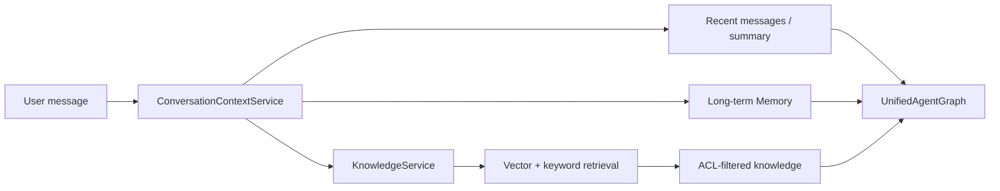

# RAG 与 Agent 上下文流程

## 核心原则

RAG 是 Agent 的上下文能力，不是独立 Agent，也不应绕过统一运行图。`agent.md` 定义某个 Agent 是否可以读取知识，部署配置决定知识后端是否开启。



## 写入

`rag-ingest` 将 PDF、Word、Markdown、HTML、JSON 或 CSV 解析为文档，按内容类型分块，写入租户隔离的 Knowledge Store。每个 Chunk 可带 ACL 角色，检索时先过滤再返回。

```powershell
agentkit --tenant company_alpha rag-ingest docs/knowledge --roles support_agent
agentkit --tenant company_alpha rag-query "退货期限" --agent customer_service --roles support_agent
```

## 读取

1. 验证 conversation 属于当前 tenant/agent/user。
2. 读取 Agent 的 `context_policy.rag`。
3. 使用用户问题检索 Agent 允许的 Collection。
4. 应用租户、角色和 Collection 过滤。
5. 将格式化片段写入 `request.context.agent_context.knowledge`。
6. Capability Handler 仅读取这个受控上下文。

## 与 Memory 的区别

- RAG：企业文档和知识，主要按租户、Collection、ACL 隔离。
- Memory：用户稳定偏好和长期事实，按 tenant/agent/user 隔离。
- Conversation：当前会话的近期消息和摘要，按 conversation 隔离。

## 评测

RAG 应分开评测检索和最终回答：

- Hit Rate / Recall / Precision / MRR。
- ACL 越权用例。
- 无命中时的降级行为。
- 引用是否来自返回的 Chunk。
- 不同 Agent 的 Collection 隔离。
