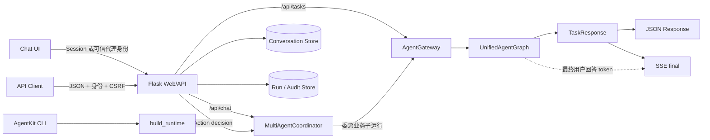
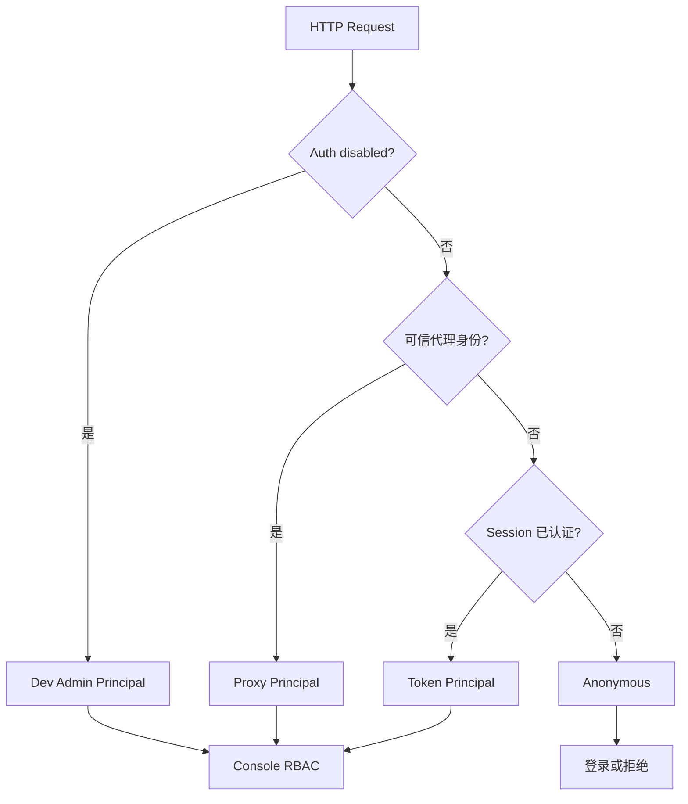
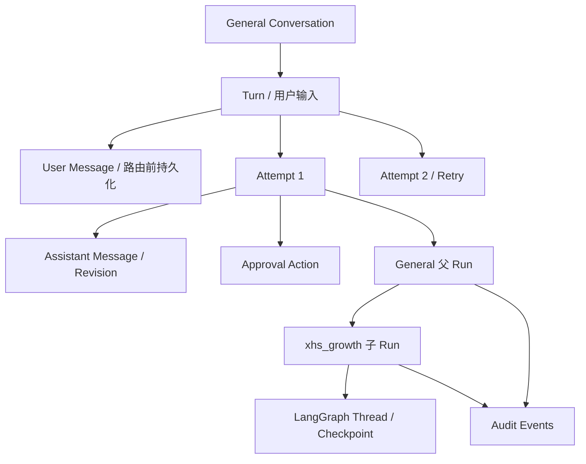

# 接入与接口层

## 1. 本章定位

接入层负责把浏览器、系统集成和命令行请求转换为统一的 `TaskRequest`，建立可信身份与业务角色，选择 Chat 或显式 Task 入口，并把 `TaskResponse` 转换为 JSON 或 SSE。它不决定业务 Skill、不执行 Tool，也不在前端实现权限兜底。

核心源码入口：

- [`agentkit.web.app`](../../src/agentkit/web/app.py)：Flask 页面、REST/SSE API 和请求转换。
- [`agentkit.web.streaming`](../../src/agentkit/web/streaming.py)：同步 Agent 执行到 SSE 的桥接。
- [`agentkit.web.identity`](../../src/agentkit/web/identity.py)：Web Principal 解析和权限装饰器。
- [`agentkit.web.security`](../../src/agentkit/web/security.py)：登录、CSRF、Cookie 和响应安全头。
- [`agentkit.cli`](../../src/agentkit/cli.py)：CLI 接入。
- [`agentkit.core.contracts`](../../src/agentkit/core/contracts.py)：`TaskRequest` 与 `TaskResponse`。

## 2. 接入层职责与边界

| 接入层负责 | 接入层不负责 |
|---|---|
| 认证调用者并建立 `Principal` | 相信请求体自报的角色或用户身份 |
| 将 JSON、表单或 CLI 参数转换为内部契约 | 在路由层直接拼接任意 Prompt |
| 区分 General Chat 和显式 Agent Task | 绕过 Agent/Skill 白名单指定任意 Tool |
| 建立或校验会话归属 | 跨租户读取会话、Run 或发布素材 |
| 输出 JSON、SSE token/final/error 事件 | 把治理节点的结构化 JSON 当作 token 流输出 |
| 统一返回错误和 HTTP 状态 | 用 HTTP 成功替代业务 Run 的完成状态 |

接入层只做协议、身份和边界转换。意图理解、Capability 解析、输入补全、策略选择和审批都在统一业务图中完成。

## 3. 接口拓扑



两条业务入口的共同点是最终都调用同一个 `AgentGateway` 和 `UnifiedAgentGraph`。区别在于 Chat 入口先由 General Agent 持有会话、理解是否直接回答或委派，并建立父子 Run；Task 入口要求调用方明确指定 Agent，适用于系统集成、测试和故障隔离。

## 4. `TaskRequest` 与 `TaskResponse`

### 4.1 内部请求契约

`TaskRequest` 是不可变 dataclass：

```python
@dataclass(frozen=True)
class TaskRequest:
    user_id: str
    roles: list[str]
    text: str
    context: dict[str, Any]
```

字段语义：

| 字段 | 来源 | 约束 |
|---|---|---|
| `user_id` | 已认证 `Principal.subject`，本地开发才可能使用租户 UI 默认值 | 请求体不能覆盖已认证主体 |
| `roles` | Principal 的可信业务角色或租户映射 | 请求体中的 `roles` 被忽略并记录到 `ignored_payload_roles` |
| `text` | `text`，或兼容字段 `message` | 作为用户原始目标，不等同于已解析 Skill 参数 |
| `context` | 接入层允许的业务参数与可信运行字段 | 接入层注入 `agent`、公开 Principal 和角色来源 |

`context` 可以包含 `conversation_id`、`skill`、`skill_args`、`topic`、`top_n` 等业务字段；它们仍会经过 Agent 边界、Intent、Schema 和权限校验，不能直接赋权。

### 4.2 内部响应契约

`TaskResponse` 包含：

| 字段 | 说明 |
|---|---|
| `status` | 业务执行状态，例如 `completed`、`failed`、`blocked` 或 `waiting_for_approval` |
| `output` | 结构化业务结果、追问、审批预览或失败原因 |
| `run_id` | 当前 Agent 执行的 Run ID |
| `thread_id` | LangGraph Checkpoint/Resume 标识 |
| `agent` | 实际执行者 |
| `strategy` | 实际选择的执行策略 |
| `conversation_id` | General 会话 ID；无会话的 Task 可能为空 |
| `governance` | 路由、审批或策略的可解释摘要 |
| `audit_events` | 当前响应携带的审计事件摘要 |

Web 层不会直接把 `TaskResponse.to_dict()` 作为顶层返回，而是增加展示字段：

```json
{
  "interaction_mode": "unified",
  "agent": "xhs_growth",
  "strategy": "workflow",
  "conversation_id": "conversation-id",
  "run_id": "run-id",
  "assistant_text": "面向用户的统一摘要",
  "response": {
    "status": "waiting_for_approval",
    "output": {},
    "run_id": "run-id",
    "thread_id": "thread-id",
    "agent": "xhs_growth",
    "strategy": "workflow",
    "conversation_id": "conversation-id",
    "governance": {},
    "audit_events": []
  }
}
```

`assistant_text` 是面向聊天窗口的归一化文本；排障和系统集成应读取 `response.status`、`response.output` 和标识字段，不能只解析自然语言。

`thread_id` 是 Runtime/系统集成的 Checkpoint 标识，不是 Chat 浏览器的权威审批状态。Chat UI 从 Timeline 读取 durable Action，并只提交 `action_id`、决议版本和幂等键。

## 5. Chat 与 Task 两条入口

### 5.1 Chat：统一会话入口

`POST /api/chat` 和 `POST /api/chat/stream` 始终把内部 Agent 设置为 `general_agent`。显式 `@小红书` 不是把会话所有者改成 `xhs_growth`，而是让 General Agent 在当前消息创建受控委派。

```json
{
  "message": "@小红书 以 AI 改变生活为主题研究 Top 5 文案并发布",
  "context": {
    "conversation_id": "已有会话 ID；新会话可以省略"
  }
}
```

Chat 入口会校验：

1. 会话存在。
2. 会话属于当前租户、当前用户和 `general_agent`。
3. 会话状态为 `active`。
4. Principal 拥有 `chat:use`。

没有 `conversation_id` 时，`MultiAgentCoordinator` 创建 General 会话。一次委派形成 General 父 Run 和业务 Agent 子 Run，二者共享会话 ID，通过 `parent_run_id` 关联。

### 5.2 Task：显式 Agent 系统集成入口

`POST /api/tasks` 和 `POST /api/tasks/stream` 直接进入 `AgentGateway`。调用方必须指定已启用 Agent；调试时还可以显式指定该 Agent 已绑定的 Skill，从而隔离 General 路由变量。

```json
{
  "agent": "xhs_growth",
  "skill": "xhs.growth.campaign",
  "text": "以 AI 改变生活为主题研究 Top 5 内容并生成文案",
  "topic": "AI 改变生活",
  "top_n": 5
}
```

显式 `skill` 只提高 Capability 选择的确定性，仍必须满足：

- Skill 在目标 Agent 的 `allowed_skills` 中。
- 调用者业务角色拥有 Skill/Tool 所需权限。
- 参数通过 Skill JSON Schema。
- 副作用执行得到有效审批。

### 5.3 怎样选择入口

| 场景 | 推荐入口 | 原因 |
|---|---|---|
| 面向用户的持续对话 | `/api/chat/stream` | 保留 General 会话、记忆和父子追踪 |
| 后端系统明确调用某 Agent | `/api/tasks` | 不需要一次 General 路由 LLM 调用 |
| 调试 Capability 或输入解析 | `/api/tasks` + 显式 `skill` | 缩小变量范围 |
| 调试端到端委派 | `/api/chat` + `@Agent` | 同时覆盖 General 与业务子运行 |
| Chat 审批决议 | `/api/conversation-actions/{action_id}/decision` | 以 durable Action、版本和幂等键从原 Checkpoint 继续 |

## 6. SSE 流式执行

### 6.1 事件协议

`agentkit.web.streaming.stream_response` 在工作线程运行同步 Agent 管道，用有界队列向 HTTP 响应转发事件：

```text
: stream-open

event: token
data: {"delta":"逐段文本"}

event: final
data: {"interaction_mode":"unified", ...}
```

发生异常时以终止事件返回：

```text
event: error
data: {"error":"脱敏后的错误信息"}
```

只有最终面向用户的自然语言生成进入 `token` 事件。Intent、Capability、Plan、ReAct action 等治理 JSON 节点继续阻塞执行并通过 Schema 校验，不把内部决策过程流到客户端。

### 6.2 浏览器消费示例

以下示例假设已从页面取得 CSRF token：

```javascript
const response = await fetch("/api/chat/stream", {
  method: "POST",
  headers: {
    "Content-Type": "application/json",
    "X-CSRF-Token": csrfToken
  },
  body: JSON.stringify({
    message: "@客服 查询订单 ORDER-001 的物流状态",
    context: { conversation_id: conversationId }
  })
});

const reader = response.body.getReader();
const decoder = new TextDecoder();
while (true) {
  const { value, done } = await reader.read();
  if (done) break;
  console.log(decoder.decode(value, { stream: true }));
}
```

响应头设置 `X-Accel-Buffering: no`，用于提示反向代理不要缓冲 SSE。生产代理仍需按 [部署指南](../DEPLOYMENT.md) 正确配置超时和缓冲策略。

客户端断开后会停止向该连接投递事件，但这不等价于业务任务取消。Chat 与 Retry 使用 `continue_on_disconnect` 继续完成投影封口，浏览器随后从 Timeline 恢复；已经执行的外部副作用不会因浏览器关闭而自动回滚。

## 7. 身份、角色与可信上下文

### 7.1 Principal 来源

Web 身份按配置从以下来源解析：

1. **本地开发禁用认证**：创建合成的 `admin` Principal。
2. **可信反向代理 Header**：生产推荐，由网关完成 OIDC/SAML，再注入用户、邮箱、平台角色和业务角色。
3. **共享 Token Session**：控制台登录后创建受保护 Session。
4. 无有效来源时为匿名 Principal，受保护接口拒绝访问。



### 7.2 平台权限与业务权限

接入层先使用平台权限保护 API：

| 权限 | 典型接口 |
|---|---|
| `chat:use` | Chat、Conversation、发布素材读取 |
| `task:run` | 显式 Task |
| `task:approve` | 审批 Resume |
| `runs:view` | Run 列表和事件 |
| `governance:view` | Registry 和治理页面 |
| `runtime:admin` | Runtime reload |

进入 Runtime 后，可信业务角色再映射为 `content.research`、`order.read` 等业务权限。请求 JSON 中提交的 `roles` 不会成为可信权限来源；接入层把它记录为 `ignored_payload_roles`，便于审计客户端误用或越权尝试。

### 7.3 Web 安全边界

- 状态修改请求需要 CSRF token；代理和本地开发身份由其上游或开发边界负责。
- Session Cookie 使用 `HttpOnly`、`SameSite=Strict`，生产应启用 Secure。
- 响应默认带 CSP、`X-Frame-Options: DENY`、`nosniff`、`no-referrer` 和 `no-store`。
- 未配置认证时保护接口失败关闭，不会自动变成匿名管理员。
- XHS 发布素材接口只接受安全文件名和允许的图片扩展名，并受 `chat:use` 保护。

## 8. 会话投影、Retry 与审批恢复

### 8.1 Conversation、Turn、Attempt 与 Run 不是同一个对象



一个 Conversation 可以有多个 Turn；每个 Turn 只有一条 input-first User Message，但可以有多个 Attempt。Assistant Message、Revision 和审批 Action 都属于具体 Attempt。Run 负责执行追踪，不能作为聊天消息替换指令。

普通 Chat SSE 在开始路由前原子创建 Turn、User Message 和 Attempt，并把 `accepted` 作为第一帧返回，其中包含 `conversation_id`、`turn_id`、`attempt_id` 和 `created`。因此即使 SSE 随后断开，客户端也应读取 Timeline 恢复，不得自动改发阻塞 POST 或创建第二个 Turn。

### 8.2 Retry 命令与 accepted-first SSE

失败、拒绝、中断或取消的最新 Attempt 通过以下命令显式重试：

```http
POST /api/conversation-turns/{turn_id}/attempts
Content-Type: application/json
X-CSRF-Token: <token>
```

```json
{
  "retry_of_attempt_id": "attempt-1",
  "idempotency_key": "retry-command-uuid"
}
```

服务端验证 Attempt 属于当前租户、用户和 Turn，并要求 `retry_of_attempt_id` 指向该 Turn 的最新终态 Attempt。命令先创建 Attempt N+1，再以 SSE 第一帧返回新的 `accepted.attempt_id`，之后才重新进入业务图。相同 `idempotency_key` 重复提交会返回同一个 Attempt，不会再次启动协调器。

Retry 不覆盖 Attempt 1：旧 Message、Revision、Action、preview、失败摘要和 Run/Audit 全部保留；Timeline 默认折叠旧 Attempt 只是显示策略。SSE 中断后客户端使用 `GET /api/conversations/{conversation_id}/timeline` 重建；若连 `accepted` 帧也丢失，则用原 `client_message_id` 请求 `GET /api/conversations/timeline?client_message_id=...` 定位已持久化 Turn。

### 8.3 durable Action 审批请求

Chat 审批以 Timeline 中的 `action_id` 和 `version` 为准：

```http
POST /api/conversation-actions/{action_id}/decision
Content-Type: application/json
X-CSRF-Token: <token>
```

```json
{
  "decision": "approved",
  "expected_version": 1,
  "idempotency_key": "approval-command-uuid"
}
```

`decision` 只能是 `approved` 或 `rejected`；`expected_version` 提供乐观并发控制，`idempotency_key` 防止重复决议。流式客户端可使用同路径的 `/decision/stream` 变体。服务端从 durable Action 反查 thread、Skills、父子 Run 和可信角色，再从 Checkpoint 继续；浏览器不提交或持有权威 `thread_id`。历史浏览器 Resume/Approve 接口已停用并返回 410。

Resume 不是重放原始请求。若 Checkpoint 缺失或失效，Action 标记为 `invalidated`、Attempt 标记为 `interrupted`，已有 Timeline 记录保留，用户需要显式创建新的 Retry Attempt。

## 9. 错误模型与状态语义

### 9.1 HTTP 错误与业务状态

| 类别 | 示例 | 表达方式 |
|---|---|---|
| 普通接口输入错误 | 未启用 Agent、请求字段格式错误 | HTTP 400 + `{"error":"..."}` |
| Action 决议字段错误 | `decision` 非法、缺少/非法 `expected_version` 或 `idempotency_key`、出现不支持字段 | HTTP 400 + `{"error":"..."}` |
| Retry 命令冲突 | 缺少/非法 `retry_of_attempt_id` 或 `idempotency_key`、来源 Attempt 不是最新终态 | HTTP 409 + `{"error":"..."}` |
| 未认证/平台权限不足 | 未登录、缺少 `chat:use` 等平台权限 | 302/401/403/503，取决于认证状态 |
| Action RBAC/作用域失败 | 缺少 `task:approve`，或 Action 不属于当前租户/用户 | 权限不足为 HTTP 403；外部作用域统一为 HTTP 404 |
| CSRF 失败 | 状态修改请求缺 token | HTTP 400 |
| 资源或作用域不存在 | Turn、Attempt 或会话不存在，或不属于当前租户/用户 | HTTP 404；不泄露外部作用域是否存在 |
| 状态冲突 | 运行中会话删除、不可重试 | HTTP 409 |
| 内部存储错误 | 删除后端失败 | HTTP 503 + 通用文本，细节写服务日志 |
| Agent 业务结果 | 追问、Review 阻止、审批等待、执行失败 | HTTP/SSE 成功承载 `TaskResponse.status` |

“HTTP 200”只表示接口成功返回结构化结果，不代表 Agent 一定完成业务目标。客户端必须读取 `response.status`。

### 9.2 SSE 错误

流式接口在响应已建立后不能再可靠改变 HTTP 状态，因此生产线程异常通过 `event: error` 返回。客户端必须同时处理网络断开、`error` 事件和 `final.response.status`。

## 10. 源码入口

| 关注点 | 源码 |
|---|---|
| Chat/Task 请求转换 | [`src/agentkit/web/app.py`](../../src/agentkit/web/app.py) 中的 `_task_request`、`_prepare_chat_command`、`_run_chat`、`_run_task` |
| durable Action 决议 | [`src/agentkit/web/app.py`](../../src/agentkit/web/app.py) 中的 `_action_decision_payload`、`_require_action_scope`、`_decide_action`、`api_conversation_action_decision` |
| Retry Attempt 命令 | [`src/agentkit/web/app.py`](../../src/agentkit/web/app.py) 中的 `_prepare_retry_command`、`api_retry_conversation_turn` |
| SSE | [`src/agentkit/web/streaming.py`](../../src/agentkit/web/streaming.py) 中的 `stream_response` |
| 身份解析 | [`src/agentkit/web/identity.py`](../../src/agentkit/web/identity.py) 中的 `resolve_principal` |
| Web 安全 | [`src/agentkit/web/security.py`](../../src/agentkit/web/security.py) 中的 `configure_security` |
| 核心契约 | [`src/agentkit/core/contracts.py`](../../src/agentkit/core/contracts.py) 中的 `TaskRequest`、`TaskResponse` |
| 平台权限 | [`src/agentkit/core/identity.py`](../../src/agentkit/core/identity.py) |
| CLI | [`src/agentkit/cli.py`](../../src/agentkit/cli.py) |
| General 协调 | [`src/agentkit/core/multi_agent.py`](../../src/agentkit/core/multi_agent.py) |
| 业务 Gateway | [`src/agentkit/core/gateway.py`](../../src/agentkit/core/gateway.py) |

## 11. 调试与测试

### 11.1 调试顺序

1. 先用 `/livez` 确认 Web 进程存活，再用 `/readyz` 验证 Runtime 与审计存储可用；`/healthz` 仅为兼容入口。
2. 在浏览器 Session 中确认 Principal 和 CSRF；403 先看平台权限，不能直接归因于 Agent。
3. 用 `/api/tasks` + 显式 `agent/skill` 隔离业务图问题。
4. 用 `/api/chat` + 显式 `@Agent` 验证 General 父子委派。
5. 从 `/api/runs/<run_id>` 查看事件，再沿 `children` 下钻业务子 Run。
6. 流式问题同时检查 `token/final/error` 和代理缓冲。

生产探针与监控端点：

- `GET /livez`：公开、常量时间，不初始化 Runtime。
- `GET /readyz`：公开，探测当前租户 Runtime 和 Audit Store；失败返回 503，响应不包含底层异常文本。
- `GET /metrics`：需要 `runs:view` 权限，输出 Prometheus 文本；标签不包含租户、用户、会话或 Run ID。

本地启动与日志命令见 [部署指南](../DEPLOYMENT.md)。

### 11.2 测试证据

- [`tests/integration/test_chat_api.py`](../../tests/integration/test_chat_api.py)：Chat/Task、会话、删除和父子 Run API。
- [`tests/integration/test_conversation_timeline_api.py`](../../tests/integration/test_conversation_timeline_api.py)：Timeline、Retry Attempt、Action 决议、租户/用户作用域与旧端点移除。
- [`tests/integration/test_streaming_api.py`](../../tests/integration/test_streaming_api.py)：SSE token、final、error 和断开行为。
- [`tests/integration/test_web_auth.py`](../../tests/integration/test_web_auth.py)：登录、CSRF、RBAC 和安全响应头。
- [`tests/integration/test_safety_api.py`](../../tests/integration/test_safety_api.py)：入口安全阻止和审计。

## 12. 面试表达

### 一句话定位

> AgentKit 的接入层把多种协议统一为受信任的 `TaskRequest`，Chat 负责 General 会话和父子 Run，Task 负责显式系统集成，两条入口最终共用同一治理图、权限和审计。

### 关键权衡

- **为什么保留 `/api/tasks`？** Chat 适合自然语言协调，但系统集成和故障隔离需要显式 Agent/Skill，避免额外路由不确定性。
- **为什么不信任请求体角色？** 身份和权限必须来自认证边界；否则调用者可以通过 JSON 自我提权。
- **为什么 SSE 只流最终回答？** Intent、Plan、Tool 决策属于受 Schema 约束的治理过程，不应暴露隐藏推理，也不适合作为不完整 token 被客户端消费。
- **HTTP 200 是否代表成功？** 不是。接口成功和业务 Run 状态分离，客户端要读取结构化状态。

### 项目证据

回答时可以引用 `_prepare_chat_command` 的 input-first 接受、`_task_request` 忽略自报角色、`_prepare_retry_command` 创建 Attempt N+1、`_decide_action` 恢复 durable Action，以及 `stream_response` 的事件协议。

## 13. 当前限制与演进方向

**当前限制：**

- Flask 内置进程适合本地开发，生产并发和超时需要外部 WSGI/代理配置。
- SSE 连接断开只停止流事件投递，不等价于可持久化的通用任务取消。
- 接口返回仍以当前 Web 控制台需求为主，没有独立版本化的公共 OpenAPI 描述。
- 长任务仍由当前进程执行；跨 HTTP 生命周期的生产任务应迁移到持久 Worker/队列。

**演进建议：** 版本化 API、持久任务队列、独立取消协议和生成式 API Schema 属于未来能力，统一记录在 [ROADMAP](ROADMAP.md)，不能按当前功能使用。
