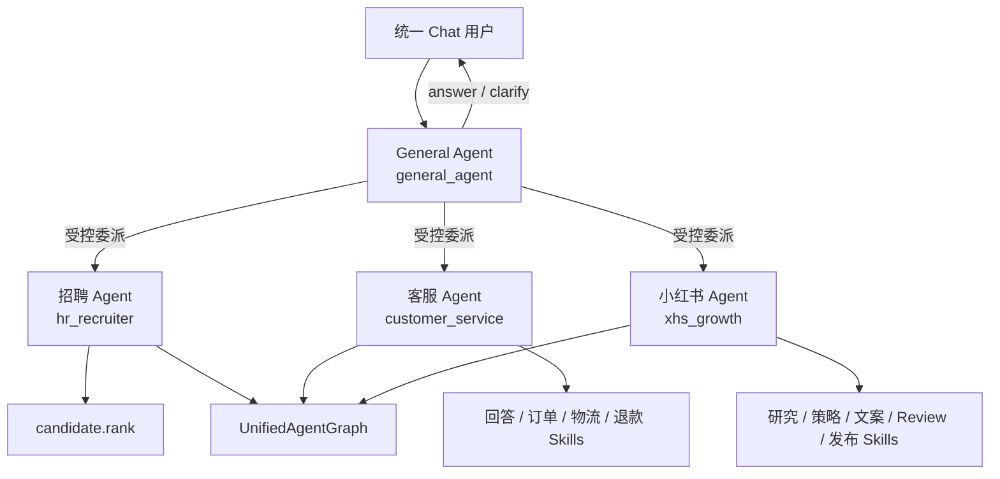
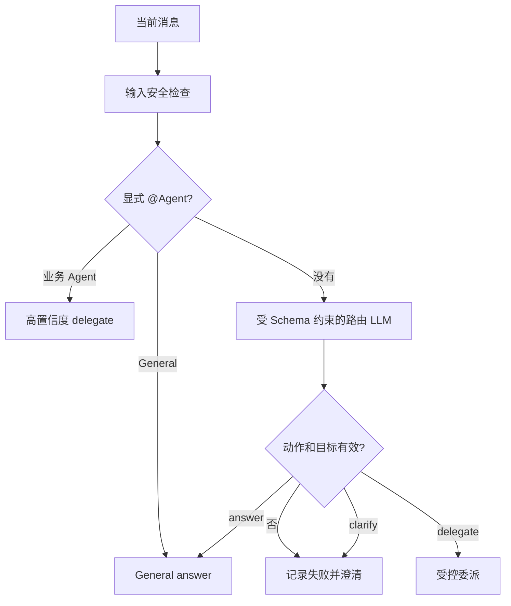
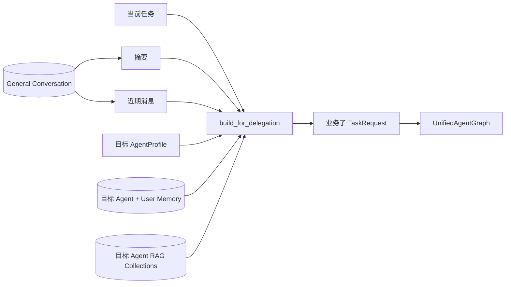
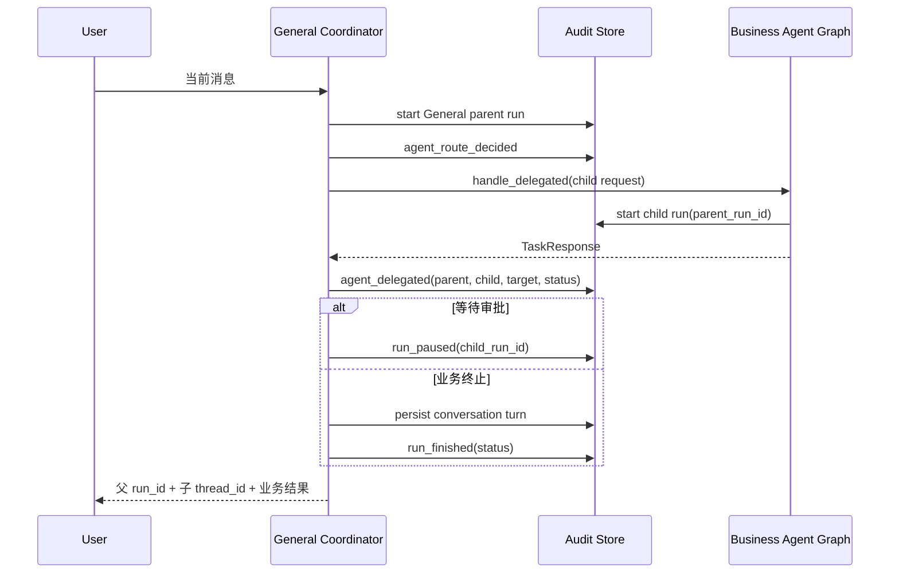

# Agent 架构设计

## 1. Agent 在 AgentKit 中是什么

在 AgentKit 中，Agent 不是“一个 Prompt 加一组函数”，也不是每个 LangGraph 节点都算一个 Agent。Agent 是一个可审计的业务身份与治理边界，定义：

- 所属业务域和对用户可说明的职责。
- 允许使用的 Skill 白名单。
- Memory、RAG 和 Artifact 的上下文边界。
- 默认与允许的执行策略。
- 是否允许动态选择和副作用。
- LLM、Tool、迭代、Plan、Token 和总时长预算。
- 路由关键词和正文业务指令。

这些信息来自 `agents/<folder>/agent.md` 的 YAML Front Matter 与 Markdown 正文，启动时由 [`declarative_catalog.py`](../../src/agentkit/runtime/declarative_catalog.py) 严格解析为 [`AgentProfile`](../../src/agentkit/core/contracts.py)。未知字段、非法策略、越级预算或不存在的 Skill 会在 Runtime 启动阶段失败，而不是运行到一半才暴露。

Agent 的非职责同样重要：

- 不重复实现 Skill 中的业务脚本。
- 不绕过 Skill 白名单直接选择 Tool。
- 不读取其他 Agent 的长期 Memory 或知识集合。
- 不自行扩大租户角色、预算或副作用权限。
- 不把 Intent、Router、Review 等内部图节点冒充成可独立对话的 Agent。

## 2. 当前 Agent 拓扑

当前注册 1 个协调 Agent 和 3 个业务 Agent：



| Agent | 业务域 | 默认策略 | RAG | 副作用 | 主要边界 |
|---|---|---|---|---|---|
| `general_agent` | `general.coordination` | Direct | 关闭 | 禁止 | 统一聊天、澄清、能力协调，不持有业务 Tool |
| `hr_recruiter` | `hr.recruitment` | Direct | 招聘政策、职位集合 | 禁止 | 候选人排序，不读取客服或社媒上下文 |
| `customer_service` | `support.customer_service` | Direct | 客服 FAQ | 允许受控副作用 | 订单、物流、退款；退款不能在 ReAct 中直接执行 |
| `xhs_growth` | `marketing.social_growth` | Workflow | 关闭 | 允许受控副作用 | 研究、生成、Review、冻结内容、审批后发布 |

所有业务 Agent 共用 `UnifiedAgentGraph`，差异由 Manifest、绑定 Skill、Context Policy、租户角色和业务 Handler 表达。这样新增 Agent 不需要复制路由、审批、持久化和审计骨架。

## 3. Agent Manifest

### 3.1 文件结构

Agent 声明由一份 `agent.md` 组成：

```markdown
---
schema_version: 1
release_version: 1.0.0
id: hr_recruiter
domain: hr.recruitment
description: 招聘筛选与候选人排序 Agent。
skills: [candidate.rank]
context:
  memory: {...}
  rag: {...}
  artifacts: {...}
execution:
  default_strategy: direct
  allowed_strategies: [direct, batch, plan_execute]
  allow_dynamic_selection: true
  allow_side_effects: false
autonomy:
  max_model_calls: 12
  max_tool_calls: 20
  max_iterations: 8
  max_plan_steps: 8
  max_replans: 1
  max_tokens: 30000
  timeout_seconds: 300
routing_keywords: [招聘, 候选人, 简历, 排序]
---

# 招聘 Agent

只读取当前租户授权的招聘知识、职位和候选人数据……
```

`schema_version` 表示声明结构版本，当前只接受整数 `1`；`release_version` 表示 Agent 行为发布版本，必须使用严格 SemVer。Skill Package 顶层使用相同字段。Catalog 在 Runtime 启动前拒绝不支持的 Schema 或非法版本，运行审计中的 `agent_loaded`、`capability_resolved` 会记录实际装载版本，从而支持回滚、问题复现和 Eval 基线关联。

YAML Front Matter 是机器可验证的治理契约；Markdown 正文是 Agent 业务指令的唯一来源。不要在 Python Runtime 中再维护一份同义 Prompt。

### 3.2 关键字段

| 字段 | 作用 | 校验 |
|---|---|---|
| `id` | Runtime 唯一 Agent ID | 非空，租户启用列表和目录必须能解析 |
| `domain` | 业务域隔离和能力匹配 | 非空 |
| `description` | General 能力卡和治理 UI 的安全摘要 | 非空，不等同于完整正文指令 |
| `skills` | 可用 Capability 白名单 | 所有 ID 必须存在 |
| `context.memory` | 近期窗口、长期检索和 Token 上限 | 当前 scope 固定为 `agent_user` |
| `context.rag` | 可访问知识集合和 Top K | Agent 未启用时不能因全局开关被强行注入 |
| `context.artifacts` | 可读写 Artifact 类型 | Runtime 按 Agent 和 Run 继续隔离 |
| `execution` | 默认/允许策略、动态选择和副作用开关 | 默认策略必须在允许列表中 |
| `autonomy` | 硬预算 | 不能超过全局预算，必须为有效正数 |
| `routing_keywords` | General/Router 的确定性信号 | 仅辅助路由，不自动赋权 |

### 3.3 租户启用与显示目录

Agent 声明存在并不代表每个租户都可用。租户 JSON 的 `enabled_agents` 决定注册范围，`agent_directory` 只提供显示标签和别名：

```json
{
  "enabled_agents": [
    "general_agent",
    "hr_recruiter",
    "customer_service",
    "xhs_growth"
  ],
  "agent_directory": {
    "xhs_growth": {
      "label": "小红书 Agent",
      "aliases": ["小红书", "XHS", "内容增长"]
    }
  }
}
```

`AgentDirectory` 在启动时拒绝引用未启用 Agent 或冲突别名。它向 General 路由只暴露最小能力卡：ID、标签、别名、Domain、Description、Skills 和路由关键词，不暴露完整系统指令、凭据或 Tool 实现。

## 4. General Agent

General Agent 是统一聊天入口和会话所有者，负责：

1. 对普通交流直接回答。
2. 信息不足时澄清。
3. 根据已启用业务 Agent 的最小能力卡提出委派。
4. 建立 General 父 Run，并把业务结果写回同一会话。
5. 维持限长会话摘要、近期消息和 General 自己的长期 Memory。

General Agent 明确没有业务 Skill，`allow_side_effects=false`。它不能因为“知道某个 Tool 存在”而直接执行订单、招聘或发布操作。

### 4.1 路由决策

无显式 `@Agent` 时，`MultiAgentCoordinator._route` 调用 `runtime.agent-route` Context Pack，只允许输出：

- `answer`：General 自己回答。
- `clarify`：General 追问。
- `delegate`：委派给能力卡中的已启用业务 Agent。

Runtime 再验证动作和目标。LLM 返回未知 Agent、非法动作或不符合 JSON Schema 时，系统记录 `agent_route_failed`，返回受控澄清，不会假装已发起子 Agent。



### 4.2 为什么 General 上下文保持简单

General 只需要当前会话摘要、近期消息和业务 Agent 能力卡。它不需要加载所有 Skill 详情或 Tool Schema。这样可以：

- 降低路由 Token 成本。
- 避免业务指令互相污染。
- 防止 General 冒充业务 Agent。
- 让 Skill 继续采用渐进式披露，由目标 Agent 命中后再装载。

## 5. 业务 Agent

业务 Agent 接收委派后进入统一业务图，在自己的 Manifest 和租户权限范围内完成：

1. Intent 结构化。
2. Capability 解析。
3. Skill Schema 参数补全。
4. 执行策略选择。
5. Skill/Tool/Context 调用。
6. Review、审批、持久化和审计。

业务 Agent 不是长期运行的独立进程。当前实现中它是由 Registry 编译出的 `AgentProfile`，通过 `TaskRequest.context.agent` 选择，并在一次 Run 中约束统一图。

### 5.1 招聘 Agent

- 绑定 `candidate.rank`。
- 可以读取招聘政策和职位知识集合。
- 允许 Direct、Batch、Plan-and-Execute，不允许副作用。
- 典型业务值来自确定性评分、候选人数据 Tool 和受控总结 LLM。

### 5.2 客服 Agent

- 绑定回答、订单、物流和退款 Skills。
- 启用客服 FAQ RAG。
- 允许 Workflow、只读 ReAct 和受限 Plan。
- 退款等写操作必须进入固定 Workflow 与审批，不能由 ReAct 自主提交。

### 5.3 小红书 Agent

- 完整活动使用固定 Workflow，研究步骤可以使用只读 ReAct。
- 关闭 RAG，研究证据来自 XHS Tool 和可选媒体理解。
- 允许生成和 Review 内容，但只允许发布已审核、冻结并带 Hash/幂等键的内容。
- 浏览器、OCR 和发布策略属于绑定 Tool/Provider，不改变 Agent 核心契约。

## 6. 单轮 `@Agent` 与自动委派

### 6.1 单轮语义

`AgentMentionParser` 只解析当前消息，不保存“当前 Agent”状态：

```text
第一轮：@招聘 帮我排序候选人  → 当前轮委派 hr_recruiter
第二轮：解释一下刚才的结论    → 重新交给 General 判断
```

同一消息只能显式指定一个 Agent。未知别名或多个不同 Agent 会返回 `needs_clarification`，不会任选一个执行。

显式 `@Agent` 的优先级高于 General 路由 LLM：

- 别名必须由当前租户 `AgentDirectory` 解析。
- 目标必须是已启用 Agent。
- `@General Agent` 表示当前轮由 General 直接回答。
- 解析后会从任务文本中去掉 `@别名`，避免把路由标记当业务实体。

### 6.2 自动委派

没有显式提及时，General 使用能力卡、当前消息、摘要和近期消息判断。能力卡是候选集合，不是授权集合；Runtime 会再次验证目标。

设计权衡是“允许自然语言协调，但不允许 LLM 创造新 Agent”。对于自动化系统或确定性调试，应使用 `/api/tasks` 明确指定 Agent，而不是强迫 General 猜测。

## 7. A2A 上下文交接

当前 A2A 是进程内、受治理的 General → 业务 Agent 委派，不是开放网络协议。委派不创建第二个业务会话，而是共享 General 会话历史，同时切换到目标 Agent 自己的长期数据边界。



`ConversationContextService.build_for_delegation` 首先验证会话属于当前租户、用户和 `general_agent`，然后：

- 读取 General 会话的限长摘要和近期消息。
- 使用目标 Agent 的 `memory.retrieval_k` 检索 `tenant + target_agent + user` 长期 Memory。
- 只查询目标 Agent Manifest 声明的 RAG Collection。
- 把结果写入子请求的 `agent_context`。

子请求同时携带：

- `agent=target_agent`。
- `parent_run_id`。
- `trace_conversation_id`。
- `original_user_message`。
- 去除 `conversation_id` 后的原业务参数。

这使业务图可以关联原会话，但不会把 General 会话误认成目标 Agent 自己拥有的业务会话。

## 8. 父子运行与可追溯性



关键关联键：

| 字段 | 作用 |
|---|---|
| `conversation_id` | 把多轮消息与多次父 Run 关联 |
| `run_id` | General 响应对外暴露的父 Run ID |
| `parent_run_id` | 子 Run 指向父 Run |
| `child_run_id` | `agent_delegated` 和 `run_paused` 指向业务执行 |
| `thread_id` | 子业务图的 Checkpoint/审批恢复 ID |
| `assistant_agent_id` | 会话消息记录实际回答者，不改变会话所有者 |

审批恢复时，协调器通过 `thread_id + tenant + user` 查找子 Run，再验证父 Run、会话和目标 Agent，调用 Gateway Resume，最后把终态写回原 General 会话。

## 9. 隔离、权限与失败传播

### 9.1 隔离矩阵

| 资源 | 隔离边界 | 委派时行为 |
|---|---|---|
| General 会话 | tenant + general_agent + user + conversation | 共享摘要和近期消息 |
| 长期 Memory | tenant + target_agent + user | 切换到目标 Agent 作用域 |
| RAG | 目标 Agent Manifest 的 Collections + 租户 | 不继承 General 或其他 Agent 集合 |
| Skill | 目标 Agent `allowed_skills` | Runtime 再校验 |
| Tool | Skill 白名单 + 角色权限 +风险 | General 不传递额外 Tool 权限 |
| Artifact | tenant + run + Agent 可读写类型 | 按目标 Agent Policy 访问 |
| Audit | tenant + run/parent/conversation | 父子事件可下钻但不混写身份 |

### 9.2 失败传播

- 输入 Safety 阻止：父 Run 记录 `safety_blocked` 并终止，不委派。
- `@Agent` 解析失败：General 返回澄清，不创建业务子 Run。
- General 路由 LLM 或 Schema 失败：记录 `agent_route_failed` 和受控 `agent_route_decided`，不生成虚假进度。
- 业务子 Run 返回失败/阻止/拒绝：父 Run 使用相同业务状态终止，并保留子 Run 证据。
- 业务子 Run 等待审批：父 Run 记录 `run_paused`，不会提前写入完成消息。
- 协调流程抛出未处理异常：`_fail_parent_run` 保证父 Run 进入 `failed` 终态，避免 UI 永久显示运行中。

## 10. 为什么 Intent 和 Capability 不是 Agent

`IntentDecomposer`、`IntentRouter`、`SchemaInputResolver`、`StrategySelector` 和 Review 都是统一业务图节点。把它们称为 Agent 会带来三个问题：

1. **职责虚增**：每个节点都要单独管理身份、记忆、会话和权限，但它们本质上只是受控转换。
2. **上下文膨胀**：多 Agent 对话会重复加载历史和能力描述，增加 Token 与协调失败面。
3. **追溯混乱**：业务 Agent 的一次决策链被拆成大量“Agent 对话”，反而难以说明谁对副作用负责。

AgentKit 只在存在稳定业务身份、独立能力边界、独立上下文策略和可审计责任时建立 Agent。Intent/Capability 节点通过 Context Pack 和 JSON Schema 获得有限 LLM 自主性，但仍属于目标业务 Agent 的一次 Run。

## 11. 源码入口与调试

| 关注点 | 源码 |
|---|---|
| Agent 声明 | [`agents/`](../../agents) |
| Agent YAML 严格模型与编译 | [`src/agentkit/runtime/declarative_catalog.py`](../../src/agentkit/runtime/declarative_catalog.py) |
| Runtime Agent Registry | [`src/agentkit/core/registry.py`](../../src/agentkit/core/registry.py) |
| 能力卡、别名和 @解析 | [`src/agentkit/core/multi_agent.py`](../../src/agentkit/core/multi_agent.py) 中的 `AgentDirectory`、`AgentMentionParser` |
| General 协调与委派 | 同文件的 `MultiAgentCoordinator` |
| A2A 上下文 | [`src/agentkit/runtime/conversation_context.py`](../../src/agentkit/runtime/conversation_context.py) 中的 `build_for_delegation` |
| 统一业务图 | [`src/agentkit/core/langgraph_agent.py`](../../src/agentkit/core/langgraph_agent.py) |
| 租户启用和别名 | [`tenants/company_alpha.json`](../../tenants/company_alpha.json) |

推荐调试顺序：

1. 在治理 Registry 中确认 Agent 已启用、别名唯一、Skill 绑定正确。
2. 检查父 Run 的 `agent_route_decided`；显式 `@Agent` 应为 `explicit_mention`。
3. 检查 `agent_delegated` 中的 target、child Run 和 status。
4. 下钻子 Run，检查 `agent_loaded`、`intent_understood` 和 `capability_resolved`。
5. 上下文问题检查 `build_for_delegation` 的租户、所有者 Agent、用户和会话验证。
6. 审批后没有回写时检查 `run_resumed`、子终态和父 `run_finished`。

## 12. 测试证据

- [`tests/unit/test_multi_agent.py`](../../tests/unit/test_multi_agent.py)：能力卡、别名和单轮 `@Agent` 解析。
- [`tests/unit/test_multi_agent_service.py`](../../tests/unit/test_multi_agent_service.py)：answer/clarify/delegate、父子 Run、路由失败、审批恢复和持久化。
- [`tests/unit/test_multi_agent_audit.py`](../../tests/unit/test_multi_agent_audit.py)：父子关联、运行投影和异常状态。
- [`tests/integration/test_agent_isolation.py`](../../tests/integration/test_agent_isolation.py)：并发 Agent 请求和上下文隔离。
- [`tests/unit/test_delegated_context.py`](../../tests/unit/test_delegated_context.py)：共享 General 历史但使用目标 Agent Memory/RAG。
- [`tests/integration/test_unified_agent_graph.py`](../../tests/integration/test_unified_agent_graph.py)：业务 Agent 进入统一图的端到端行为。

## 13. 面试表达

### 一句话定位

> AgentKit 是“一个 General 会话协调入口 + 多个声明式业务 Agent + 一套统一治理图”的多 Agent 架构；Agent 负责业务身份和权限边界，图节点负责受控决策，Skill/Tool 负责实际能力。

### 常见追问

**这是 Multi-Agent 吗？**

是。General 与业务 Agent 有独立 Manifest、职责、上下文策略、Skill 白名单和父子 Run。但它不是多个自由 Agent 互相聊天，而是中心协调、受控委派的企业 Multi-Agent。

**为什么不是所有流程都交给 General？**

General 只加载最小能力卡。业务指令、Memory、RAG、预算和 Tool 权限由目标 Agent 隔离，能减少 Prompt 污染和越权面。

**A2A 如何传上下文？**

共享经过限长处理的 General 会话摘要与近期消息；长期 Memory 和 RAG 切换到目标 Agent 作用域；通过父子 Run、会话和 Thread 保持追溯与恢复。

**为什么 Intent、Router 不算 Agent？**

它们没有独立业务责任和上下文所有权，只是业务 Run 中受 Schema 约束的决策节点。过度 Agent 化会增加 Token、状态和协调复杂度。

### 项目证据

可以引用四份 `agent.md`、`AgentDirectory.business_cards` 的最小披露、`AgentMentionParser` 的单轮语义、`build_for_delegation` 的作用域切换，以及 `agent_route_decided/agent_delegated` 父子事件。

## 14. 当前限制与演进方向

**当前限制：**

- A2A 是同一 AgentKit Runtime 内的受控委派，不是跨服务的开放 A2A 协议。
- 当前协调拓扑是 General 中心式，不支持业务 Agent 任意互相递归委派。
- 一条消息只能显式 `@` 一个 Agent，不支持多 Agent 同轮并行会商。
- General 路由能力依赖结构化 LLM 输出；失败时选择安全澄清而不是自动猜测。
- Agent 的 Memory scope 当前固定为 `agent_user`，没有团队共享记忆层。

**演进建议：** 跨服务 Agent 协议、层级委派、团队共享 Memory 和多 Agent 并行协作需要新的身份、授权、事务、预算和故障传播契约，当前只记录在 [ROADMAP](ROADMAP.md)，不能按现有能力使用。
