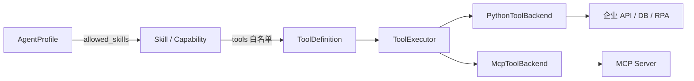
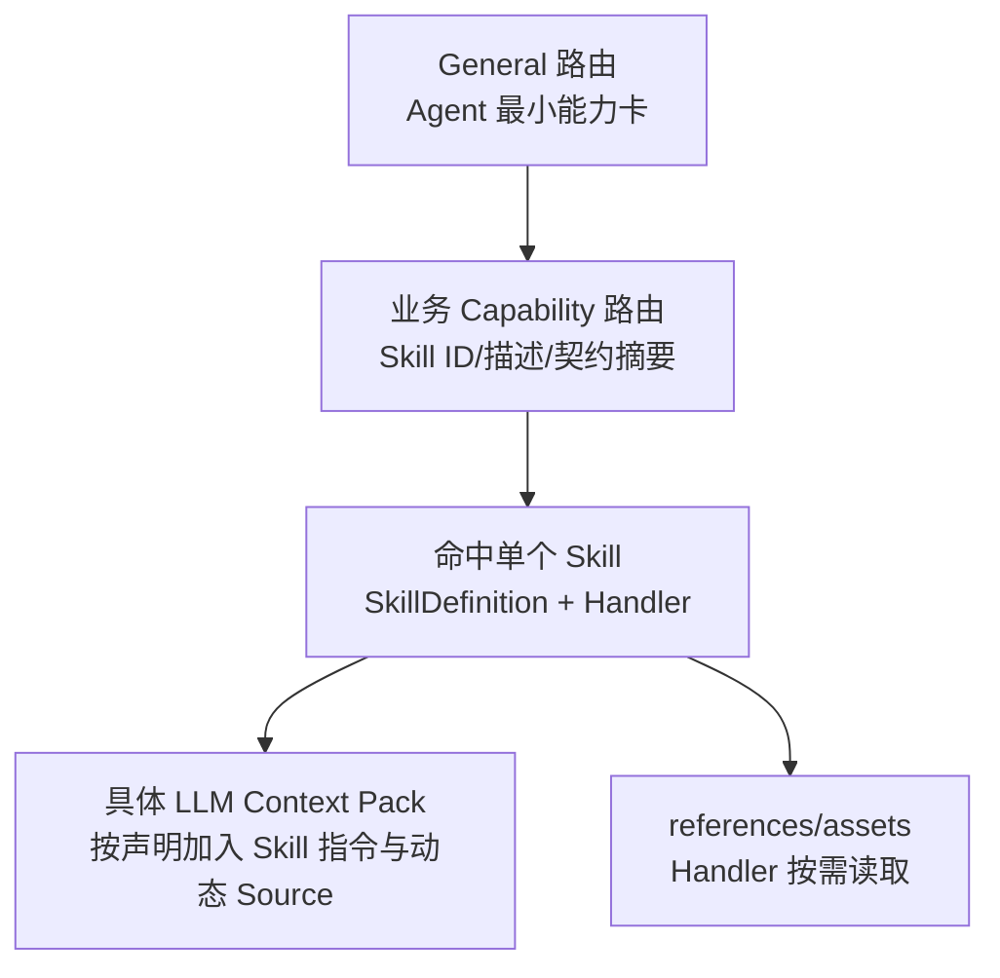
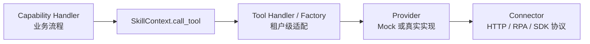
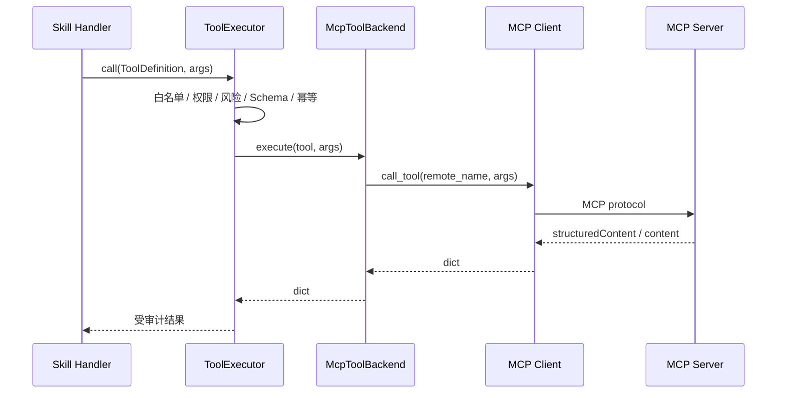
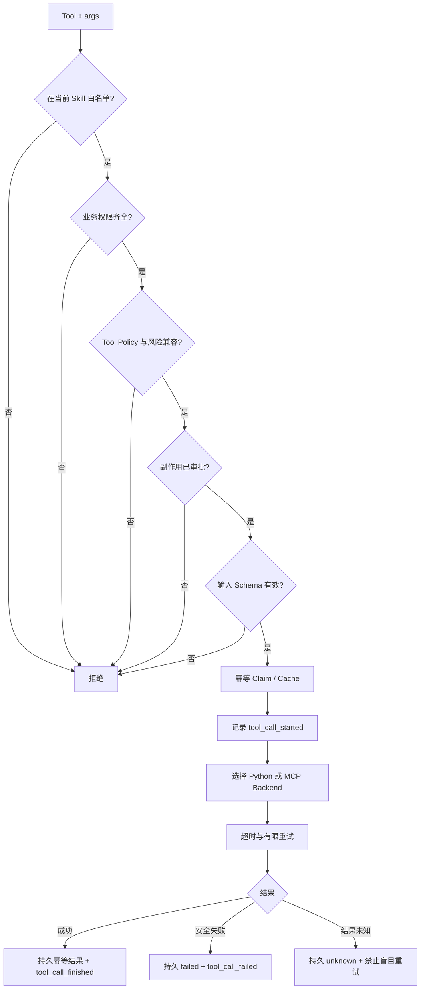

# Skill、Tool 与 MCP

## 1. 本章定位

Agent 定义“谁可以做什么”，Skill 定义“业务能力怎样完成”，Tool 定义“怎样访问外部系统”。MCP 是 Tool 的一种执行后端，不是绕过 AgentKit 治理的第二套 Agent 系统。



本章区分以下概念：

- **Skill Package**：`skills/<package>/` 下完整、可迁移的业务能力目录。
- **Capability/SkillDefinition**：`skill.yaml` 中可由 Runtime 选择和执行的单个能力。
- **ToolDefinition**：对 Python 或 MCP 调用的声明式治理契约。
- **Provider/Connector**：实现某类外部能力的可替换适配层。
- **ToolExecutionBackend**：Runtime 统一调用 Python/MCP/未来沙箱的协议。

## 2. Skill Package 目录

当前 Skill 根目录采用可跨 Codex、Claude Code 等工具复用的布局，同时增加 AgentKit 运行时契约：

```text
skills/
└── xhs-growth-campaign/
    ├── SKILL.md
    ├── skill.yaml
    ├── scripts/
    │   ├── handlers.py
    │   ├── providers.py
    │   └── tools.py
    ├── references/
    └── assets/
```

| 文件/目录 | 作用 | 是否自动进入 LLM Context |
|---|---|---|
| `SKILL.md` | 人和 Agent 可读的业务说明、适用场景和流程 | 只有目标 Context Pack 明确允许 Skill 指令时才进入 System Message |
| `skill.yaml` | Capability、Tool、Schema、策略、权限、预算和入口 | 作为 Runtime 契约；Router 只获得必要摘要 |
| `scripts/handlers.py` | Capability Handler 和固定 Workflow | 不进入 Prompt，直接执行 Python |
| `scripts/tools.py` | Tool Handler/Factory 和运行时适配 | 不进入 Prompt |
| `scripts/providers.py` | Mock/真实外部 Provider 装配 | 不进入 Prompt |
| `references/` | 评分规则、业务参考和渐进披露资源 | 只列出资源，不自动加载全文 |
| `assets/` | 模板、图片等静态资源 | 不自动进入 Prompt |

`SkillFileStore` 读取 `SKILL.md` Front Matter、正文和资源清单，并把它们附加到已由 `skill.yaml` 编译出的 `SkillDefinition`。这保留了通用 Skill 目录结构，同时让 AgentKit 拥有严格的运行契约。

## 3. `SKILL.md` 与 `skill.yaml` 的分工

### 3.1 `SKILL.md`：业务指令来源

最小结构：

```markdown
---
name: candidate-rank
description: Rank candidates for a job requisition...
---

# Candidate Rank

Use this skill when...
```

Front Matter 只要求 `name` 和 `description`；Markdown 正文是 Skill 业务指令的唯一来源。它可以解释适用场景、流程、证据要求和资源，但不能授予 Runtime 权限。

### 3.2 `skill.yaml`：机器可验证契约

一个 Package 可以声明多个 Tool 和 Capability：

```yaml
package_id: customer-service
tools:
  - id: logistics.track
    provider: python
    entrypoint: scripts.tools:track_logistics
    description: 根据订单号查询物流轨迹。
    risk: read_only
    permissions: [logistics.read]
    idempotent: true
    timeout_seconds: 10
capabilities:
  - id: logistics.diagnose
    domain: support.customer_service
    description: 基于订单和物流 Observation 诊断配送问题。
    entrypoint: scripts.handlers:diagnose_logistics
    execution:
      reasoning: react
      orchestration: single
      tool_policy: read_only
      allow_dynamic_selection: true
    permissions: [order.read, logistics.read]
    tools: [commerce.order.get, logistics.track]
    input_schema: {...}
    output_schema: {...}
```

声明加载器使用 Pydantic `extra="forbid"`，因此拼错字段会在启动阶段失败。引用校验还会拒绝：

- Agent 绑定不存在的 Capability。
- Capability 引用不存在的 Tool。
- 非 Workflow Capability 声明 `composes`。
- Workflow 组合自身、重复或未知 Capability。
- ReAct 配置 `side_effect` Tool Policy。
- Skill 预算超过绑定 Agent，或 Agent 预算超过全局预算。

## 4. Skill 的渐进式披露

AgentKit 不会把所有 Skill 全文一次性塞进 General 或业务 Agent Prompt。披露分四层：



1. **General 层**：只看到业务 Agent 的 ID、Description、Skill ID 和关键词，不看到 `SKILL.md` 全文。
2. **Capability 路由层**：只对当前业务 Agent 的 Skill 候选做匹配；Plan 只使用能力摘要，不加载全部 Skill 指令。
3. **执行层**：选中 `SkillDefinition` 后，Runtime 才创建 `SkillContext` 和允许的 Tool 集合。
4. **LLM 节点层**：只有 Context Pack 明确启用 Skill 指令时，`ContextAssembler` 才把选中 Skill 的正文放入 System Message。`references/` 和 `assets/` 仍不会自动进入上下文。

这样既保留通用 Skill 的渐进披露理念，又防止业务能力目录变成无限 Prompt。

## 5. Capability 契约

运行时 `SkillDefinition` 的关键字段：

| 字段 | 作用 |
|---|---|
| `name/domain/description` | 唯一 ID、业务域与路由摘要 |
| `input_schema` | 参数补全和执行前 JSON Schema 校验 |
| `output_schema` | Strategy 执行结果的结构化约束 |
| `permissions` | 执行该业务能力需要的业务权限 |
| `execution` | Reasoning、Orchestration、Tool Policy 和动态选择开关 |
| `autonomy` | Skill 局部 LLM/Tool/迭代/Token/时间上限 |
| `tools` | 可调用 Tool 白名单 |
| `handler` | Python 业务入口 |
| `review` | 通用 Review 与有限修订策略 |
| `batch_key` | Batch 分片字段 |
| `composes` | 组合 Workflow 的子 Capability 列表 |
| `keywords` | 确定性路由信号 |
| `skill_instructions/resources` | `SKILL.md` 正文与资源索引 |

### 5.1 `SkillContext`

Handler 接收 `SkillContext` 和已解析参数。Context 提供：

- 当前租户、Run、Agent、Skill 和原始 `TaskRequest`。
- 已编译 Tool 映射。
- `ContextInvocationService`，用于受治理的 LLM 节点。
- `ToolExecutor`，通过 `ctx.call_tool()` 调用外部能力。
- Run 级 Artifact Store，通过 `ctx.write_artifact()` 传递大对象引用。

生产 Handler 应调用 `ctx.call_tool()`，不能直接调用 Tool 函数绕过超时、幂等和审计。只有单元测试中未注入 Executor 时，`SkillContext` 才回退到本地 Handler。

## 6. Tool 契约

`ToolDefinition` 描述一次外部执行：

| 字段 | 说明 |
|---|---|
| `name` | 稳定 Tool ID，供 Skill 白名单引用 |
| `provider` | `python` 或 `mcp` |
| `risk` | `read_only`、`governed` 或 `side_effect` |
| `permissions` | 业务角色必须拥有的权限 |
| `input_schema` | 对外参数 Schema；下划线开头的内部参数不参与公共校验 |
| `entrypoint` | Python Tool 函数入口 |
| `factory_entrypoint` | 按租户创建真实/Mock Handler 的工厂入口 |
| `server/tool` | MCP Server ID 和远端 Tool 名 |
| `supports_batch` | Tool 是否声明批量输入能力 |
| `idempotent` | 是否允许按重试策略安全重试 |
| `timeout_seconds` | 单 Tool 超时覆盖 |

Tool 不直接选择自己何时运行；它只能在当前 Skill 白名单和策略允许时由 `ToolExecutor` 调用。

## 7. Handler、Provider 与 Connector

业务代码按以下方向依赖：



- **Handler** 组织业务步骤和 Artifact，不处理浏览器安装或凭据细节。
- **Tool Handler/Factory** 把声明式 Tool ID 绑定到当前租户 Provider。
- **Provider** 实现 Mock、Playwright、企业 API 等可替换业务端口。
- **Connector** 封装 HTTP、浏览器、OCR 或第三方 SDK 协议。

例如 XHS `skill.yaml` 的 Tool 使用 `factory_entrypoint: scripts.tools:build_handlers`。Runtime 启动时按租户创建搜索、发布和指标 Handler，Agent/Capability ID 不因 Mock 与 Playwright 切换而改变。

## 8. Python Tool 与 MCP Tool

### 8.1 Python Tool

`PythonToolBackend` 调用编译后的 Python Handler，并要求返回 `dict`。适合：

- 本地确定性计算。
- 已有 Python SDK 或内部服务适配。
- Playwright/RPA 连接器。
- 需要自定义 Provider Factory 的能力。

### 8.2 MCP Tool

MCP Tool 在 `skill.yaml` 声明 `provider: mcp`、`server` 和远端 `tool`。`McpToolBackend` 根据租户 `mcp_servers` 找到 Client，当前 `StdioMcpClient` 每次调用建立独立 Session，避免跨线程共享异步连接。

MCP 只替换最后一段执行通道：



因此 MCP Server 不能绕过 Agent Skill 白名单、业务 RBAC、副作用审批、幂等、超时和审计。

## 9. `ToolExecutor` 治理顺序

一次 Tool 调用经历以下顺序：



具体控制：

1. **白名单**：Tool 必须属于当前候选 Skill 的 `tools`。
2. **权限**：Tool 所需权限必须是调用者可信业务角色的子集。
3. **策略风险**：`none` 禁止 Tool；`read_only` 只允许只读；`governed` 不能直接执行副作用。
4. **审批**：`side_effect` Tool 必须位于 `approved_side_effects`。
5. **Schema**：只校验公共参数，防止 LLM 或客户端传入非法结构。
6. **幂等**：使用租户隔离的 Store Claim；命中已完成结果时直接返回缓存。
7. **超时/重试**：仅 `idempotent=true` 或具备本地幂等键的调用可按配置重试。
8. **执行后端**：Provider 只能选择已注册 Backend。
9. **审计/Trace**：记录开始、次数、耗时、缓存、失败和结果未知，不记录原始敏感幂等值。

线程超时会让当前 Run 解除等待并返回失败，但 Python 线程不能被强制终止。因此副作用 Tool 仍必须依赖服务端幂等和事后对账，不能只依赖本地 timeout。

## 10. 三种业务 Skill 形态

| 业务 | Capability 形态 | LLM 使用 | Tool | 关键治理 |
|---|---|---|---|---|
| 招聘评分 | `candidate.rank`，Batch Handler | 排序后的说明可调用受控总结 Context | ATS 职位与候选人只读 Tool | 批量分片、确定性评分、招聘权限、无副作用 |
| 客服 | 回答、订单、物流、退款四个 Capability | FAQ 回答、只读 ReAct 物流诊断 | 订单/物流只读，退款副作用 | RAG、订单 Schema、退款 Workflow/审批/幂等 |
| XHS | `xhs.growth.campaign` 组合 Workflow + 原子 Capability | 文章生成、Review、修订和只读 ReAct | 搜索、发布包、发布、指标 | Artifact、证据 Review、冻结内容、审批后 RPA |

三者不是三套框架。它们共享 `SkillDefinition`、`SkillContext`、策略、Context Invocation、ToolExecutor 和审计，只通过声明及 Handler 表达业务差异。

## 11. Capability 组合与 Artifact

只有 `orchestration: workflow` 的 Capability 可以声明 `composes`。`xhs.growth.campaign` 组合研究、提取、比较、策略、文案、Review、修订、发布准备和指标能力。

组合关系用于：

- 启动时验证子能力存在且无自身/重复引用。
- 让 Plan/Router 理解完整 Workflow 是一个对外能力。
- 在 UI Agent Network 中显示关系。
- 让固定 Handler 使用 Artifact 交接步骤输出。

`composes` 不会自动生成业务 Workflow；实际步骤仍由主 Capability Handler 实现。这样稳定流程保持代码可测试，同时声明可用于治理和可视化。

## 12. 源码入口与调试

| 关注点 | 源码 |
|---|---|
| Skill Package 读取和资源安全路径 | [`src/agentkit/core/skill_store.py`](../../src/agentkit/core/skill_store.py) |
| `SkillDefinition` / `ToolDefinition` / `SkillContext` | [`src/agentkit/core/contracts.py`](../../src/agentkit/core/contracts.py) |
| `skill.yaml` 严格模型和交叉校验 | [`src/agentkit/runtime/declarative_catalog.py`](../../src/agentkit/runtime/declarative_catalog.py) |
| Registry | [`src/agentkit/core/registry.py`](../../src/agentkit/core/registry.py) |
| Tool 统一治理 | [`src/agentkit/core/tool_executor.py`](../../src/agentkit/core/tool_executor.py) |
| Python/MCP Backend | [`src/agentkit/core/tool_backends.py`](../../src/agentkit/core/tool_backends.py) |
| 招聘实例 | [`skills/candidate-rank/`](../../skills/candidate-rank) |
| 客服实例 | [`skills/customer-service/`](../../skills/customer-service) |
| XHS 实例 | [`skills/xhs-growth-campaign/`](../../skills/xhs-growth-campaign) |

调试时按以下顺序缩小范围：

1. `validate-catalog`：先确认 YAML、引用、预算和入口可编译。
2. Registry：确认当前租户启用 Agent 后，相应 Capability/Tool 被选择性注册。
3. `capability_resolved`：确认选中了预期 Skill。
4. `inputs_resolved`：确认 Skill Schema 必填参数已补全。
5. `strategy_selected`：确认 Tool Policy 与 Skill 声明一致。
6. `tool_call_started/finished/failed`：确认白名单、Provider、耗时和失败分类。
7. 幂等事件：结果未知时先对账，不要直接增大重试次数。

## 13. 测试与质量门禁

- [`tests/unit/test_declarative_catalog.py`](../../tests/unit/test_declarative_catalog.py)：严格 YAML、引用、预算、组合和入口。
- [`tests/unit/test_catalog_policies.py`](../../tests/unit/test_catalog_policies.py)：Agent/Skill 策略与风险矩阵。
- [`tests/unit/test_tool_executor.py`](../../tests/unit/test_tool_executor.py)：权限、风险、Schema、超时、重试、幂等和审计。
- [`tests/unit/test_tool_backends.py`](../../tests/unit/test_tool_backends.py)：Python/MCP Backend。
- [`tests/unit/test_scaffold.py`](../../tests/unit/test_scaffold.py)：Skill/Agent 脚手架。
- [`tests/unit/test_social_growth_workflow.py`](../../tests/unit/test_social_growth_workflow.py)：组合 XHS Workflow 和 Artifact。

声明变更至少运行：

```powershell
agentkit --tenant company_alpha validate-catalog
agentkit --tenant company_alpha validate-contexts
```

## 14. 面试表达

### 一句话定位

> Skill 是 AgentKit 的业务能力和渐进披露单元，Tool 是受治理的外部执行契约；Python 与 MCP 只是在 ToolExecutor 后面的不同后端，不能改变权限、风险、幂等和审计边界。

### 常见追问

**Skill 与 Codex Skill 是否相同？**

目录和渐进披露理念兼容，但 AgentKit 增加 `skill.yaml`、Handler、Tool、Schema、预算、Review 和运行时注册，用于企业执行而不是只提供模型说明。

**为什么脚本放在 Skill 内？**

业务 Handler、Provider 和 Tool 适配与能力一起迁移和版本化；跨业务通用协议连接器仍放在 `src/agentkit/connectors/`。

**MCP 是否让 Tool 更自主？**

不会。MCP 只替换后端传输，仍由同一个 Skill 白名单、Tool Policy、RBAC、审批、超时和幂等层调用。

**如何防止 LLM 调错工具？**

工具不是全局自由集合。候选来自目标 Agent 的 Skill，ToolExecutor 再执行白名单、权限、风险、审批和 Schema 五层拒绝。

## 15. 当前限制与演进方向

**当前限制：**

- Skill 资源清单可被治理 UI 展示，但 `references/` 没有通用的自动按需检索协议，需 Handler 明确读取。
- MCP 当前提供同步 stdio Client，每次调用建立 Session，不是共享长连接或远程 MCP Gateway。
- Tool 契约当前严格校验输入并要求 Backend 返回对象，但没有独立的 Tool 输出 JSON Schema 字段。
- `composes` 用于声明关系和校验，不自动编译任意 YAML Workflow。
- Python Tool 在线程池超时后无法强杀底层线程，外部副作用必须由服务端幂等兜底。

**演进建议：** 长连接 MCP Pool、远程 Tool Gateway、沙箱 Backend、Tool 输出 Schema 和通用资源检索协议属于未来能力，记录在 [ROADMAP](ROADMAP.md)。
