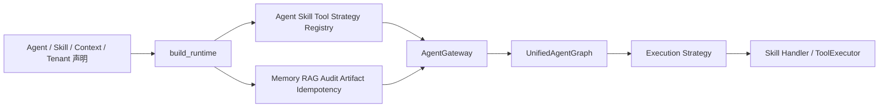
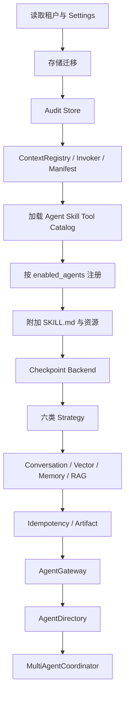
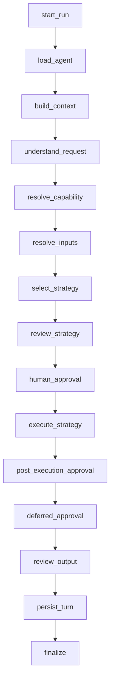
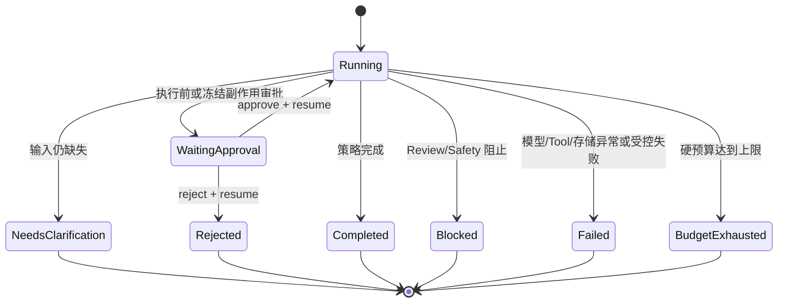
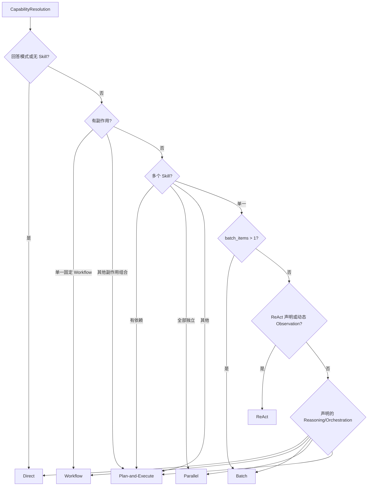
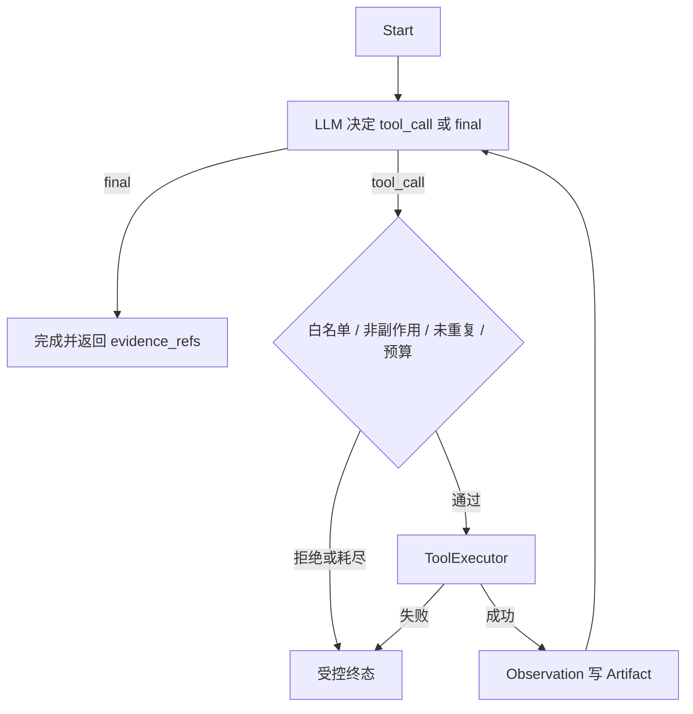
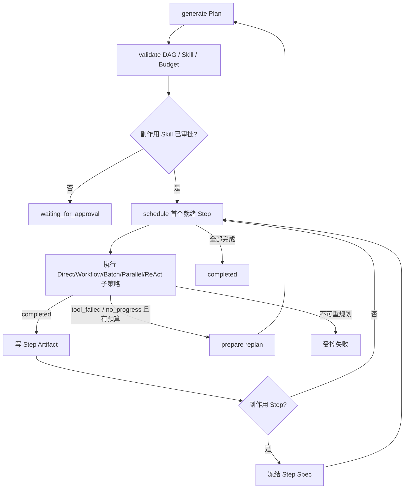
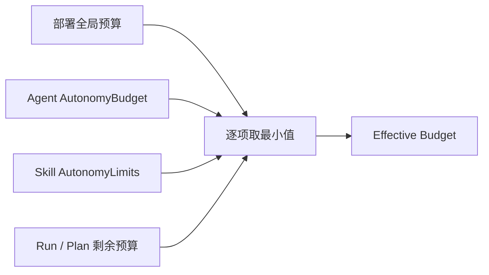

# 执行运行时与 LangGraph

## 1. 本章定位

执行运行时把声明式 Agent、Skill、Tool、Context、存储和 Provider 编译成一套统一治理图。它负责“按什么顺序决策、选择哪种策略、怎样限制自主性、何时暂停或终止”，但不包含招聘、客服或 XHS 的业务步骤。

关键源码：

- [`runtime/bootstrap.py`](../../src/agentkit/runtime/bootstrap.py)：唯一 Runtime 装配入口。
- [`core/gateway.py`](../../src/agentkit/core/gateway.py)：所有显式 Agent 请求和审批恢复的公开网关。
- [`core/langgraph_agent.py`](../../src/agentkit/core/langgraph_agent.py)：统一业务 `StateGraph`。
- [`core/execution/`](../../src/agentkit/core/execution)：策略模型、选择器和六类执行实现。
- [`core/langgraph_runtime.py`](../../src/agentkit/core/langgraph_runtime.py)：LangGraph 1.x v2 输出协议适配。

## 2. Runtime 启动装配

`build_runtime()` 按固定顺序构建一次租户 Runtime：

装配阶段的设计目的：

1. **启动前失败**：未知 Agent/Skill/Tool、非法预算、Context Source 或 MCP 配置不进入运行期。
2. **租户选择性注册**：只注册 `enabled_agents` 可达的 Capability 和 Tool，减少可见攻击面。
3. **统一实例**：Web 和 CLI 调用相同 `build_runtime`，避免两套行为。
4. **版本可追溯**：Runtime Manifest 保存租户配置和 Context Pack Hash。
5. **后端可替换**：SQLite/PostgreSQL、Python/MCP、Mock/真实 Provider 在同一上层契约后装配。

`AgentKitRuntime` 暴露 Gateway、Chat Coordinator、Conversation Store、Context Registry、删除/运行状态服务和 Manifest。`chat_service` 字段名称为兼容形状保留，但实现已经是 `MultiAgentCoordinator`，不存在第二套旧 Chat Runtime。

## 3. `AgentGateway`

`AgentGateway` 是所有业务 Agent 请求和审批恢复的唯一入口：

- `handle(request)`：显式业务请求，可在缺少会话时创建目标 Agent 会话。
- `handle_delegated(request)`：General 委派请求，不创建第二个业务会话。
- `resume(thread_id, ...)`：从 LangGraph Checkpoint 继续。

Gateway 先做输入 Safety。通过后，把请求交给同一个 `UnifiedAgentGraph`。因此 Web `/api/tasks`、General 委派和审批恢复不会各自实现不同的策略、Tool 或持久化规则。

## 4. 统一业务图

### 4.1 节点主线

图结构保持线性，节点通过 `result` 和 `approval_required` 进行受控短路；审批节点使用 LangGraph `interrupt()` 暂停。这样每个请求都经过一致的审计边界，而不是为每种失败路径维护大量重复图边。

### 4.2 节点职责

| 节点 | 输入 | 输出/副作用 | 可能提前形成的结果 |
|---|---|---|---|
| `start_run` | `TaskRequest` | 创建 Audit Run，记录 Manifest Hash | 无 |
| `load_agent` | `context.agent` | 从 Registry 读取 `AgentProfile`，记录 `agent_loaded` | 未知 Agent → `capability_denied` |
| `build_context` | 会话、Agent Policy | 组装摘要、近期消息、Memory、RAG | 无会话时使用空会话上下文 |
| `understand_request` | 消息、Agent、Context | `IntentFrame`，记录 `intent_understood` | LLM/Schema 异常由网关失败处理 |
| `resolve_capability` | Intent、Agent Skill 白名单 | `CapabilityResolution` | 未绑定/未注册 → `capability_denied` |
| `resolve_inputs` | 请求参数、Intent Entity、Skill Schema | 规范化参数，记录置信度与 LLM 使用 | 仍缺必填字段 → `needs_clarification` |
| `select_strategy` | Complexity、Agent/Skill Policy | `StrategySelection` 和有效预算 | Policy 越界 → 失败 |
| `review_strategy` | 目标 Skill 和已批准集合 | 执行前待审 Skill | 无结果时继续 |
| `human_approval` | `approval_required` | `interrupt()` | 拒绝 → `rejected`；未决 →暂停 |
| `execute_strategy` | 目标、参数、策略、预算 | `StrategyResult`、Artifact、Metrics | 策略定义的受控终态 |
| `post_execution_approval` | `deferred_action` | 把冻结副作用标记为待审 | 无 deferred action 时跳过 |
| `deferred_approval` | 冻结 Tool Calls 与审批 | 审批后调用 ToolExecutor | 拒绝、再次暂停或完成 |
| `review_output` | 最终 `StrategyResult` | 执行通用 Output Review Chain，递归脱敏并记录安全摘要 | `pass/flag` 保留处理后的结果；`block` 形成稳定终态，绝不自动重跑业务流程 |
| `persist_turn` | 会话与终态 | 写用户/助手消息、摘要、长期 Memory | 等待审批时不写完成消息 |
| `finalize` | `StrategyResult` | 记录 `run_finished` | 无结果时归一为 `failed` |

### 4.3 状态路径

状态字符串是业务结果，不应被 HTTP 状态或 UI 文案替代。完整状态参考见 [集中参考](REFERENCE.md)。

## 5. Intent、Capability 与输入解析

### 5.1 Intent

`IntentDecomposer` 先用规则提取实体和业务信号，再通过 `runtime.intent` Context Pack 生成受 Schema 约束的 `IntentFrame`。Intent 包含目标、实体、目标类型、边界、置信度和澄清信息。

### 5.2 Capability

`IntentRouter` 的优先级：

1. 请求显式 `skills`。
2. 请求显式 `skill`。
3. Intent 的受约束业务 Skill Target。
4. Agent Skill 关键词确定性评分。
5. `runtime.capability-route` 的受约束 LLM 建议。

无论来源，候选必须属于当前 Agent 的 `allowed_skills` 且已经注册。多 Skill 有依赖时，Router 会优先寻找能够覆盖原子能力的声明式 Workflow；不存在覆盖 Workflow 才保留多 Skill Plan。

### 5.3 Complexity Assessment

Router 同时生成策略选择需要的复杂度事实：

- `candidate_skills`
- `estimated_steps`
- `has_dependencies`
- `needs_dynamic_observation`
- `has_side_effects`
- `batch_items`
- `independent_skills`
- `missing_information`
- `confidence`

这些字段来自 Skill 声明、实际输入、请求可信上下文和受约束 Capability 建议，不由自由 Prompt 单独决定。

### 5.4 输入解析

`resolve_inputs` 按顺序合并：

1. 显式 `skill_args`。
2. 请求 Context 中与 Skill Schema 同名的字段。
3. Intent 提取的 Entity。
4. 缺失时调用 `runtime.input-resolve`。

LLM 只能补充 Schema 声明的字段，结果再次通过 JSON Schema；仍不能确定才返回自然语言澄清。

## 6. 策略选择

### 6.1 当前默认是确定性选择

当前 `build_runtime` 构建 `StrategySelector` 时没有注入 `suggestion`，所以生产默认按确定性规则选择，`StrategySelection.llm_used=false`。Selector 保留可选 LLM 建议扩展点，但只有同时满足以下条件才可能接受建议：

- Runtime 显式注入 Suggestion。
- Agent `allow_dynamic_selection=true`。
- 所有候选 Skill `allow_dynamic_selection=true`。
- 候选中没有固定 Workflow。
- 建议策略仍通过 Agent、Skill、依赖和副作用 Policy。

因此“复杂到什么程度用 Plan”目前不是写在某段系统提示词中的模糊判断，而是 Router 的 Complexity 和 Selector 的规则。

### 6.2 确定性规则

最终校验拒绝：Agent 不允许的策略、副作用 Agent 禁止的任务、副作用使用 ReAct/Parallel/Batch、多 Skill ReAct、依赖 Parallel 和多 Skill Batch。

## 7. 六类执行策略与 LLM 调用

| 策略 | 选择条件 | 策略本身是否自动调用 LLM | 编排/并发 | 副作用边界 | 典型实例 |
|---|---|---|---|---|---|
| Direct | 回答模式或一个明确 Capability | 回答模式可通过 `answer_handler` 调 LLM；Skill 模式只调用 Handler，Handler 可自行调用 Context | 单次 | 由 Skill Tool Policy 和图审批决定 | 订单查询、原子文案生成 |
| Workflow | 一个声明为 Workflow 的 Capability | 不自动；固定 Handler 中的具体步骤决定是否调用 Context/LLM | 已知顺序 | 适合生成冻结副作用；可返回 `deferred_action` | XHS 完整活动、退款流程 |
| Batch | 一个 Capability + 列表 `batch_key` | 不自动；每个分片 Handler 决定 | 当前按分片顺序执行并确定性合并 | Selector 禁止副作用 Batch | 候选人批量评分 |
| Parallel | 多个无依赖 Capability | 不自动；每个 Handler 决定 | 线程池并发，传播 ContextVar | 明确禁止副作用 Capability | 多个独立只读能力 |
| ReAct | 一个 Skill 需要根据 Observation 选择 Tool | 是；每轮 `StructuredReactModel.decide` 调 `runtime.react-action` | decide → tool → decide | 只允许非副作用 Tool；遇副作用返回 deferred action | XHS 研究、物流诊断 |
| Plan-and-Execute | 多 Skill 有依赖、动态多步或非固定副作用组合 | 是；Plan 生成调用 `runtime.plan-generate`，子策略还可能调用 LLM | DAG 验证后逐个就绪 Step；有限 Replan | 副作用 Step 审批且完成后冻结 | 多能力依赖任务 |

关键结论：Direct、Workflow、Batch、Parallel 只是调用 Skill Handler 的方式。若 Handler 没有 Context/LLM 调用，它们就不会额外调用 LLM。ReAct 和 Plan 的决策循环由结构化模型驱动，必然包含模型调用，除非在调用前因预算或校验直接终止。

## 8. Direct、Workflow、Batch 与 Parallel

### 8.1 Direct

- Answer 模式没有 Skill 时，默认返回 Goal；配置 `answer_handler` 时调用最终回答生成。
- Skill 模式只允许一个明确 Capability。
- 调用 Handler 后返回 `completed`，业务 Handler 负责结构化输出。

### 8.2 Workflow

- 只允许一个入口 Capability，且其 Orchestration 必须是 `workflow`。
- Handler 执行开发期已知步骤。
- 完整输出写入 Run Artifact，避免后续 Prompt 携带全部对象。
- `deferred_action` 转成执行后审批；否则只允许 `completed/blocked/failed/needs_clarification/rejected`。

### 8.3 Batch

- Skill 必须声明 `batch_key`，实际参数必须是列表。
- Runtime 按租户 `batch_size` 分片，向 Handler 注入 `_batch_shard=true`。
- Handler 可以提供 `merge_batch`，否则返回各分片 `results`。
- 当前 `BatchStrategy` 本身顺序执行分片；批量不等同于并行。

### 8.4 Parallel

- 至少两个无依赖 Capability。
- 每个 Capability 可使用独立参数对象。
- 线程数取 `max_concurrency` 与任务数的较小值。
- 使用 `contextvars.copy_context()` 传播 Run ID、Usage、Budget 和 Stream Sink。
- 任一 Future 抛错会让策略失败；没有副作用补偿语义。

## 9. ReAct 子图

ReAct 模型只看到：当前目标、已验证参数、允许 Tool 的安全摘要、Observation 引用和剩余预算。每次 Tool 结果写入 Artifact，下一轮只携带摘要与引用。

终止保护：

- Tool 不在 Skill 白名单 → `strategy_rejected`。
- 副作用 Tool → `deferred_action`，不在循环中直接执行。
- 相同 Tool + 参数重复 → `no_progress`。
- 模型异常 → `model_failed`。
- Tool 异常 → `tool_failed`。
- Model/Tool/Iteration/Token/Timeout 达到上限 → `budget_exhausted`。

系统记录决策摘要、Tool、参数、Observation 引用和计数，不保存隐藏思维链。

## 10. Plan-and-Execute 子图

Plan 模型只获得候选 Skill 的 ID、描述、输入输出 Schema、Reasoning、Orchestration 和 Tool Policy，不获得所有 `SKILL.md` 全文。

Plan 校验包括：

- Step 数不超过 `max_plan_steps`。
- Step ID 唯一。
- Skill 必须属于本次候选集合。
- 依赖存在，`args_from` 只能引用显式依赖。
- DAG 无环。
- Replan 不能删除或修改已完成的副作用 Step。

当前 Scheduler 每次选择一个就绪 Step 执行；Plan 的 DAG 表达依赖，但没有自动并行执行多个就绪 Step。若需要并行，Plan Step 可选择受 Policy 允许的 `ParallelStrategy`。

## 11. 预算与自主性

### 11.1 七个硬预算

- `max_model_calls`
- `max_tool_calls`
- `max_iterations`
- `max_plan_steps`
- `max_replans`
- `max_tokens`
- `timeout_seconds`

有效预算按全局 → Agent → Skill 逐层取更小值。多 Skill Plan 的总预算先受全局和 Agent 限制，每个 Step 再应用对应 Skill 上限和剩余预算。

预算耗尽返回受控状态，不继续“再试一次”。这让 Token、外部 Tool 次数和总耗时成为 Runtime 强制约束，而不是系统提示词建议。

### 11.2 固定 Workflow 与局部自主性

企业默认设计是：

- 已知、可验证、涉及副作用的流程优先固定 Workflow。
- 不确定但只读的观察决策放入 ReAct。
- 多能力、存在依赖的任务使用 Plan，并限制 Step/Replan。
- LLM 建议只能在声明允许的集合内选择，不能创造 Skill 或 Tool。

这同时保留稳定性和自主决策，不需要在“完全固定”与“完全自由 Agent”之间二选一。

## 12. LangGraph Checkpoint、Interrupt 与 v2 协议

### 12.1 Checkpointer

支持：

- `memory`：测试和单进程临时运行。
- `sqlite`：本地跨进程恢复。
- `postgres`：多实例生产共享恢复。
- `none`：无审批恢复需求的受限场景。

每次业务执行使用唯一 `thread_id`；ReAct 和 Plan 子图基于 Run/Agent/Skill 派生子 Thread。

### 12.2 Interrupt/Resume

统一图在审批节点调用公开的 `langgraph.types.interrupt`。Resume 使用 `Command(resume=True)`，同时把批准/拒绝决策写回原 `TaskRequest.context`，使后续 ToolExecutor 能校验已批准副作用。

### 12.3 v2 是 LangGraph 1.x 的输出协议

`invoke_graph_v2` 调用 `graph.invoke(..., version="v2")` 并只把 `GraphOutput.value` 的字典状态交给业务层。这里的 v2 是 LangGraph 1.1+ 输出协议，与依赖包的主版本号无关；当前项目依赖仍是 LangGraph 1.x。业务代码不读取旧的 `__interrupt__` 私有形状。

## 13. Artifact 交接

Workflow、ReAct 和 Plan 都把大结果写入 Run 级 Artifact Store：

- Workflow 保存完整结果并返回引用。
- ReAct 保存每个 Observation，后续只使用摘要与 `artifact_id`。
- Plan 保存 Step 输出，用 `args_from` 显式映射下游参数。

Artifact 降低 Prompt 膨胀，但不自动授权跨 Run 或跨 Agent 访问。可读写类型仍受 Agent Context Policy 限制。

## 14. 源码入口与调试

| 关注点 | 源码 |
|---|---|
| Runtime 装配 | [`src/agentkit/runtime/bootstrap.py`](../../src/agentkit/runtime/bootstrap.py) |
| Gateway/Checkpointer | [`src/agentkit/core/gateway.py`](../../src/agentkit/core/gateway.py) |
| 统一图 | [`src/agentkit/core/langgraph_agent.py`](../../src/agentkit/core/langgraph_agent.py) |
| Intent | [`src/agentkit/core/intent.py`](../../src/agentkit/core/intent.py) |
| Capability Router | [`src/agentkit/core/router.py`](../../src/agentkit/core/router.py) |
| 输入解析 | [`src/agentkit/core/schema_input_resolver.py`](../../src/agentkit/core/schema_input_resolver.py) |
| 策略选择 | [`src/agentkit/core/execution/selector.py`](../../src/agentkit/core/execution/selector.py) |
| 策略实现 | [`src/agentkit/core/execution/`](../../src/agentkit/core/execution) |
| LangGraph v2 适配 | [`src/agentkit/core/langgraph_runtime.py`](../../src/agentkit/core/langgraph_runtime.py) |

调试一个请求时按节点事件定位：

1. `agent_loaded`：Agent 是否存在。
2. `context_built`：会话上下文是否建立。
3. `intent_understood`：Intent 类型是否正确。
4. `capability_resolved`：候选 Skill 是否正确。
5. `inputs_resolved`：缺失字段、置信度和 LLM 补全。
6. `strategy_selected`：实际策略、理由和预算。
7. `strategy_finished`：策略受控终态。
8. `output_reviewed`、`run_paused/resumed/finished`：治理与持久化。

## 15. 测试证据

- [`tests/unit/test_strategy_selector.py`](../../tests/unit/test_strategy_selector.py)：确定性选择、动态建议和 Policy 回退。
- [`tests/unit/test_execution_strategies.py`](../../tests/unit/test_execution_strategies.py)：Direct/Workflow/Batch/Parallel。
- [`tests/unit/test_react_strategy.py`](../../tests/unit/test_react_strategy.py)：ReAct 预算、重复动作、白名单和 Artifact。
- [`tests/unit/test_plan_strategy.py`](../../tests/unit/test_plan_strategy.py)：DAG、预算、Replan、审批和冻结 Step。
- [`tests/integration/test_react_graph.py`](../../tests/integration/test_react_graph.py)：真实 LangGraph ReAct 子图。
- [`tests/integration/test_plan_graph.py`](../../tests/integration/test_plan_graph.py)：真实 LangGraph Plan 子图。
- [`tests/integration/test_unified_agent_graph.py`](../../tests/integration/test_unified_agent_graph.py)：统一业务图端到端路径。
- [`tests/integration/test_approval_resume.py`](../../tests/integration/test_approval_resume.py)：Interrupt/Resume。

## 16. 面试表达

### 一句话定位

> AgentKit 用一套显式 LangGraph 治理图统一所有业务 Agent，再根据声明和复杂度确定性选择 Direct、Workflow、Batch、Parallel、ReAct 或 Plan；固定流程负责稳定性，ReAct/Plan 只在白名单和硬预算内提供局部自主性。

### 常见追问

**只有 ReAct 和 Plan 才算 Agent 吗？**

不是。Agent 是业务身份与治理边界，策略只是执行方式。很多企业 Agent 请求使用 Direct 或固定 Workflow 更稳定。

**Direct、Workflow、Batch、Parallel 会调用 LLM 吗？**

策略本身通常只调用 Handler。Handler 若调用 Context/LLM 才产生模型调用；ReAct 和 Plan 的决策子图明确调用结构化模型。

**什么时候使用 Plan？**

多 Skill 有依赖、动态多步或无法由覆盖 Workflow 承载的副作用组合。复杂度来自声明和结构化解析，最终受 `max_plan_steps/max_replans` 限制。

**企业如何控制自主性？**

Agent/Skill 双白名单、确定性策略优先、Tool Risk、审批、Schema、Artifact 和七个硬预算共同限制 LLM 决策空间。

## 17. 当前限制与演进方向

**当前限制：**

- 默认 Runtime 没有向 `StrategySelector` 注入 LLM Suggestion，策略选择为确定性规则。
- Batch 当前顺序执行分片，不是批量并行框架。
- Plan Scheduler 每次执行一个就绪 Step，不自动并行整个 DAG。
- Python Tool 超时不能强杀底层线程。
- ReAct/Plan 的模型质量仍受 Context Schema 和 Provider 输出质量影响，结构合法不代表业务正确。

**演进建议：** 可解释的策略建议器、并行 DAG Scheduler、持久任务 Worker、可取消执行器和远程沙箱需要新的调度与事务契约，统一记录在 [ROADMAP](ROADMAP.md)。
