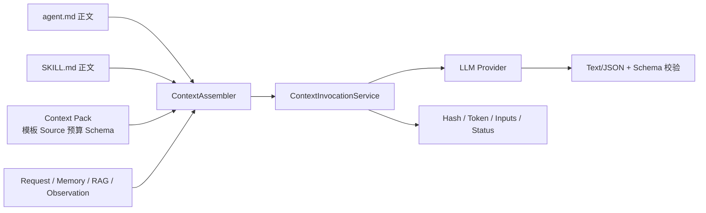
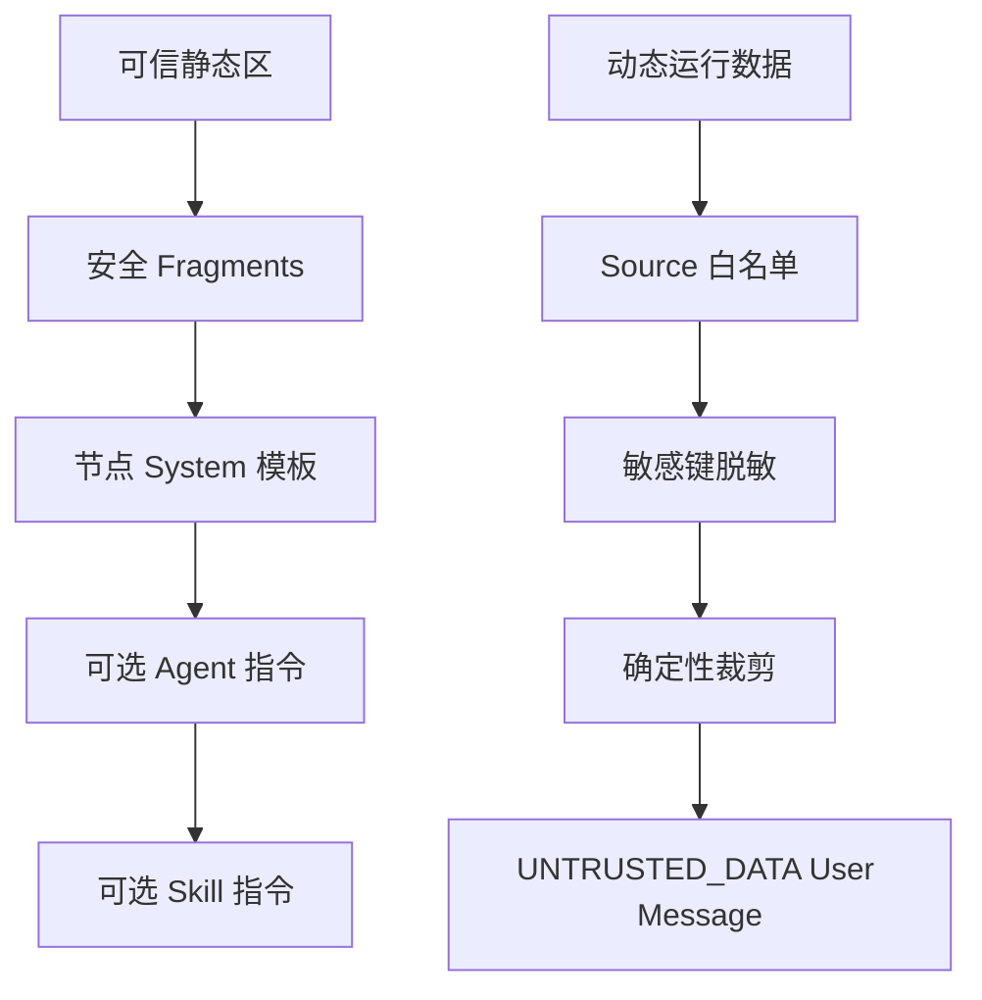
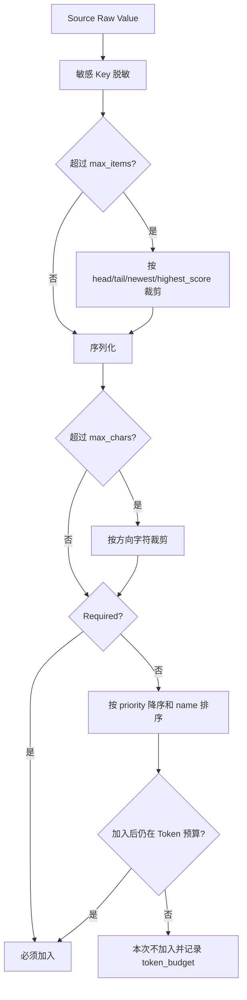
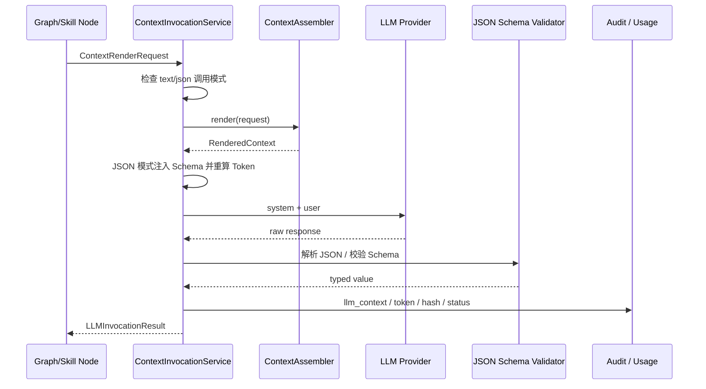
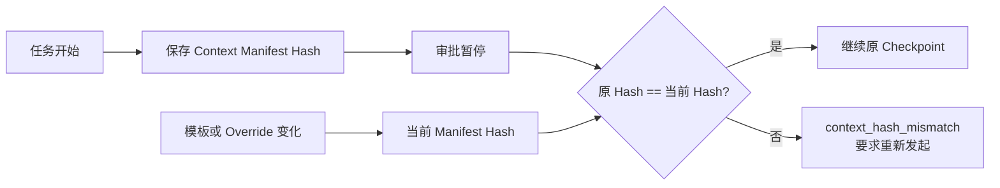

# LLM Context 装载与治理

## 1. 本章定位

Context 层决定每个生产 LLM 节点能看到什么、放在 System 还是 User、最多占用多少 Token、输出必须符合什么 Schema，以及审计可以记录哪些元数据。

它解决的不是“怎样写一段更聪明的 Prompt”，而是企业运行中的五个问题：

1. Agent、Skill、Memory、RAG 和 Tool Observation 不能无限混装。
2. 动态外部数据不能覆盖安全指令。
3. Token 裁剪必须确定、可解释、可测试。
4. 结构化节点的输出必须在执行前通过 Schema。
5. 审批恢复必须确认使用的 Context 版本没有变化。



## 2. 四类上下文来源

### 2.1 Agent 指令

来源是 `agents/<id>/agent.md` 正文，表达长期业务身份、职责和禁止事项。`Context Pack.instructions.agent=true` 时才进入该节点的 System Message。

### 2.2 Skill 指令

来源是选中 Skill Package 的 `SKILL.md` 正文，表达业务流程和证据要求。`Context Pack.instructions.skill=true` 且调用请求携带目标 `SkillDefinition` 时才进入 System Message。

### 2.3 Context Pack 静态契约

Context Pack 定义某个 LLM 节点自己的：

- System/User 模板。
- 强制安全 Fragment 和节点附加 Fragment。
- 动态输入 Source 白名单。
- Serializer、Truncator 和单输入上限。
- Token 预算和响应保留。
- Text/JSON 输出模式与 JSON Schema。
- 审计元数据策略。

### 2.4 运行时动态数据

包括请求、会话摘要、近期消息、Memory、RAG、候选 Skill/Agent、Tool Observation、已完成 Artifact 和剩余预算。它们只能通过 `context.yaml` 声明的 Source 进入 User Message；未声明值被忽略。



## 3. 目录边界

```text
contexts/
├── runtime/                    # 框架公共 LLM 节点
│   ├── intent/
│   ├── agent-route/
│   ├── capability-route/
│   ├── input-resolve/
│   ├── react-action/
│   ├── plan-generate/
│   ├── general-answer/
│   ├── memory-extract/
│   ├── memory-summary/
│   ├── rag-query-rewrite/
│   └── rag-rerank/
├── business/                   # 某个 Skill 内的业务 LLM 节点
│   ├── candidate-rank/summary/
│   └── xhs-growth-campaign/
│       ├── article-generate/
│       ├── article-revise/
│       └── content-review/
├── fragments/                  # 强制或可复用安全片段
└── overrides/<tenant-selector>/
```

当前仓库共有 15 个 Pack：11 个 Runtime Pack、4 个 Business Pack。

`contexts/business/` 与根目录 `skills/` 不重复：

- `skills/` 保存完整可移植能力：`SKILL.md`、`skill.yaml`、脚本、Workflow、Tool 和资源。
- `contexts/business/` 只保存这个能力内部某一次 LLM 调用的上下文契约。
- 每个 Business Pack 必须声明 `owner: skill` 和 `owner_skill`；Runtime Pack 不能声明 `owner_skill`。

## 4. Context Pack 结构

一个 Pack 至少包含：

```text
context.yaml
system.md
user.md
output.schema.json   # 仅 JSON 输出需要
```

示例：

```yaml
id: runtime.intent
version: 1
owner: runtime
templates:
  system: system.md
  user: user.md
fragments: [json-only]
instructions:
  agent: true
  skill: false
inputs:
  - name: message
    source: request.message
    required: true
    priority: 100
    max_chars: 4000
  - name: summary
    source: conversation.summary
    required: false
    priority: 60
    max_chars: 4000
    truncate: newest
limits:
  max_input_tokens: 6000
  response_reserve_tokens: 1200
output:
  mode: json
  schema: output.schema.json
audit:
  record_input_names: true
  record_content_hashes: true
  record_rendered_content: false
```

### 4.1 标识和所有者

- ID 必须以 `runtime.` 或 `skill.` 开头。
- ID 和 Owner 必须与目录路径一致。
- Version 是正整数；修改契约或模板时应显式提升。
- Business Pack 必须关联根 Skill。

### 4.2 模板

System 模板禁止动态变量。User 模板只能引用 `inputs.name` 中声明的变量，残留或未知 `{{ variable }}` 会在启动阶段失败。

### 4.3 输入

每个输入声明：

| 字段 | 作用 |
|---|---|
| `name` | User 模板变量名 |
| `source` | Runtime 注册的 Source ID |
| `required` | 缺失时立即失败还是忽略 |
| `priority` | 可选输入的预算装载顺序，100 最高 |
| `serializer` | `text` 或稳定排序的 `canonical_json` |
| `max_items` | 列表级上限 |
| `max_chars` | 序列化后的字符级上限 |
| `truncate` | `head/tail/newest/highest_score` |

Source 必须在 `ContextSourceRegistry` 注册；Pack 不能自由访问任意 Python 对象。`exclude` 进一步禁止敏感或不相关来源，并在加载时检查与 `inputs` 冲突。

### 4.4 输出

- `mode: text`：通过 `invoke_text` 或 `invoke_streaming` 调用，不能为空。
- `mode: json`：必须声明 Draft 2020-12 JSON Schema，通过 `invoke_json` 调用。

调用接口和 Pack 模式不匹配会在调用模型前失败。

## 5. `ContextRegistry`

`ContextRegistry` 在 Runtime 启动时一次性加载并冻结全部 Pack：

1. 扫描 `runtime/**/context.yaml` 和 `business/**/context.yaml`。
2. 使用 Pydantic 严格校验，未知字段失败。
3. 校验目录、ID、Owner、Owner Skill 和模板路径。
4. 强制注入 `security-boundary`、`untrusted-data`、`no-hidden-reasoning` Fragment。
5. 校验 Fragment 名称和文件安全路径。
6. 校验 Source、Serializer、Truncator、重复输入和 `exclude`。
7. 校验 JSON Schema 本身合法。
8. 校验 `max_input_tokens + response_reserve_tokens` 不超过全局窗口。
9. 对标准化定义、模板、Fragment 和 Schema 计算 SHA-256。
10. 应用受限租户 Override 并单独计算 Override Hash。

Registry 不访问会话、RAG 或 LLM。它只把静态契约编译成可复现的 `ContextDefinition`。

## 6. 装载顺序与安全边界

`ContextAssembler._render_system` 的顺序固定为：

```text
强制安全 Fragment
→ Pack 额外 Fragment
→ 节点 System 模板
→ 可选 Agent 指令
→ 可选 Skill 指令
```

动态输入全部放在 User Message，并包裹：

```text
UNTRUSTED_DATA_BEGIN
...渲染后的动态数据...
UNTRUSTED_DATA_END
```

设计含义：

- RAG 文档、Tool Observation、用户输入即使包含“忽略系统指令”，也只是不可信数据。
- 租户 Override 不能替换安全 Fragment、Source 白名单、预算或输出 Schema。
- `agent.md`/`SKILL.md` 只有 Pack 显式允许才进入 System，不会在所有节点全局注入。
- JSON Schema 由 Runtime 注入可信 System 区域，业务模板不重复复制。

Assembler 还会递归扫描动态字典 Key；包含 `secret/token/password/credential/cookie/authorization` 的值在渲染前替换为 `[REDACTED]`。这不是完整 DLP，只是最后一道 Context 防泄漏保护。

## 7. Token 预算与确定性裁剪

### 7.1 有效预算

Assembler 使用：

```text
effective_limit = min(
  Pack.max_input_tokens,
  request.global_token_limit - Pack.response_reserve_tokens
)
```

`request.global_token_limit` 由调用节点根据模型窗口、Agent 上限、Skill/Run 剩余预算传入。因此完整约束是多层逐步收紧，而不是 Pack 单独决定。

### 7.2 裁剪算法



规则：

1. Required 输入全部先加入；若 System + Required 已超预算，抛 `ContextTooLargeError`，不静默丢证据。
2. Optional 输入按 Priority 从高到低、Name 稳定排序。
3. 单个 Optional 加入后超预算则整体跳过，不进行不可解释的随机截断。
4. `max_items/max_chars` 与 Token 预算裁剪分别记录原因、前后数量或字符数。
5. 当前使用启发式 Token Estimator，最终 Provider Token 可能有小幅差异，因此必须保留响应预算。

## 8. `ContextInvocationService`

它是生产 LLM 节点的唯一上层入口：



提供三种方法：

- `invoke_text`：非流式文本。
- `invoke_json`：结构化 JSON，去除 reasoning 标签/JSON 围栏后解析并校验。
- `invoke_streaming`：面向最终用户的文本流；调用结果仍以完整文本和元数据返回。

JSON Schema 文本在调用前追加到 System，并计入输入 Token。如果注入 Schema 后超预算，调用直接失败，不发送截断的 Schema。

## 9. Runtime 与 Business Context Pack

### 9.1 Runtime Pack

| Pack | 作用 | 输出 |
|---|---|---|
| `runtime.agent-route` | General answer/clarify/delegate | JSON |
| `runtime.general-answer` | General 最终对话回答 | Text |
| `runtime.intent` | 结构化业务 Intent 和 Entity | JSON |
| `runtime.capability-route` | 受约束 Skill 建议和依赖 | JSON |
| `runtime.input-resolve` | 只补全 Skill Schema 允许的字段 | JSON |
| `runtime.react-action` | 单步 Tool Call 或 Final | JSON |
| `runtime.plan-generate` | 受限 DAG Plan | JSON |
| `runtime.memory-extract` | 从成功对话提取稳定事实 | JSON |
| `runtime.memory-summary` | 压缩会话窗口 | Text |
| `runtime.rag-query-rewrite` | 生成检索查询 | JSON |
| `runtime.rag-rerank` | 对候选知识重排 | JSON |

### 9.2 Business Pack

| Pack | Owner Skill | 作用 |
|---|---|---|
| `skill.candidate-rank.summary` | `candidate.rank` | 将确定性评分转成受控摘要 |
| `skill.xhs-growth-campaign.article-generate` | `xhs.growth.campaign` | 基于证据生成文章 |
| `skill.xhs-growth-campaign.article-revise` | `xhs.growth.campaign` | 根据 Review Findings 有限修订 |
| `skill.xhs-growth-campaign.content-review` | `xhs.growth.campaign` | 基于证据和质量状态输出审核 JSON |

Business Pack 不授予 Tool 权限，也不决定 Skill 是否可路由；这些边界仍由 Agent/Skill/Runtime 控制。

## 10. Context Manifest 与审批一致性

Registry 对 Pack 清单计算 `manifest_hash`，Runtime Manifest 保存：

- Context ID。
- Version。
- Content Hash。
- Override Hash。
- 输入 Token 上限和响应保留。

业务 Run 的 `start_run` 把当前 Manifest Hash 写入 LangGraph State。审批恢复时，`UnifiedAgentGraph.resume` 对比 Checkpoint 中的原 Hash 与当前 Runtime Hash：



这防止用户审核的是旧 Prompt 生成的冻结内容，恢复时却悄悄使用新 Context 继续执行。

## 11. 租户 Override

租户配置通过 Context ID 映射到 `contexts/overrides/<tenant-selector>/...`。Override：

- 必须使用工作区相对路径。
- 必须位于当前租户自己的 Override 根目录。
- 目录只能直接包含 `system.md` 和/或 `user.md`。
- 不能修改 `context.yaml`、Fragment、Source、预算或 Schema。
- System Override 仍不能引用动态变量。
- User Override 仍只能引用原 Pack 已声明变量。

标准 Content Hash 和 Override Hash 分开记录，既能知道基础版本，也能识别租户定制。

## 12. 审计与隐私

成功调用记录：

- Context ID、Version、Agent ID、Skill ID。
- 估算输入/输出 Token 和模型标签。
- Included/Truncated Input 名称。
- Context、Override 和 Output Schema Hash。
- `context_truncated` 详情与 `llm_context` 状态。

失败调用记录 `llm_context_failed`、错误 Code/Type 和可用 Hash，不记录原始动态内容。

### 12.1 渲染内容调试

`ContextDebugSampler` 只有同时满足以下条件才采样：

1. Runtime 环境为 `development`。
2. `AGENTKIT_CONTEXT_DEBUG_RENDERED_ENABLED=true`。
3. 对应 Pack 的 `audit.record_rendered_content=true`。

当前 15 个生产 Pack 全部配置为 `false`，所以单独打开环境变量不会记录完整 Prompt。这是安全默认值。若本地临时调整某 Pack，还会经过手机号、邮箱、命名 Secret 脱敏，并受内存容量、字符上限和 TTL 限制；生产不应启用。

系统不记录隐藏思维链。ReAct/Plan 只记录决策摘要、结构化 Action/Plan、Tool/Artifact 引用和预算计数。

## 13. Golden 测试与变更流程

每个 Pack 对应 `tests/golden/contexts/*.json` 的完整脱敏 Render。推荐流程：

1. 修改或新增 Pack。
2. 运行 `agentkit --tenant company_alpha validate-contexts`。
3. 更新 Golden Snapshot，并评审 System/User 分层、输入集合、裁剪和 Schema。
4. 运行 Context 单元、隔离、并发和业务 Eval。
5. 发布不可变版本，记录 Runtime Manifest Hash。
6. 不在审批暂停期间热改 Pack；Hash 变化后原任务必须重新发起。

Golden 的价值不是固定措辞，而是让安全 Fragment、指令注入、输入白名单和输出 Schema 的变化进入代码评审。

## 14. 源码入口与调试

| 关注点 | 源码 |
|---|---|
| Pack 契约 | [`src/agentkit/core/context/models.py`](../../src/agentkit/core/context/models.py) |
| 加载、Override、Hash | [`src/agentkit/core/context/registry.py`](../../src/agentkit/core/context/registry.py) |
| Source/Serializer/Truncator | [`src/agentkit/core/context/sources.py`](../../src/agentkit/core/context/sources.py) |
| 脱敏、裁剪、System/User 装配 | [`src/agentkit/core/context/assembler.py`](../../src/agentkit/core/context/assembler.py) |
| 模型调用、Schema 和审计 | [`src/agentkit/core/context/invocation.py`](../../src/agentkit/core/context/invocation.py) |
| 生产 Pack | [`contexts/`](../../contexts) |
| Golden | [`tests/golden/contexts/`](../../tests/golden/contexts) |

调试顺序：

1. `validate-contexts` 失败：先看 Context ID/目录、Source、模板变量、Schema 和预算。
2. LLM 未收到某字段：检查 Pack 是否声明 Source、调用者 `values` 是否用相同 Source Key、是否被 `exclude`。
3. 输入被丢弃：检查 `context_truncated` 的 `max_items/max_chars/token_budget`。
4. JSON 失败：检查 `llm_context_failed.error_code`、原始 Pack Schema 和模型是否输出唯一 JSON 值。
5. 审批不能恢复：检查 `context_hash_mismatch` 和部署版本。
6. 看到不该出现的 Agent/Skill 指令：检查 `instructions.agent/skill` 和调用者是否传错 Profile。

## 15. 测试证据

- [`tests/unit/test_context_models.py`](../../tests/unit/test_context_models.py)：严格契约。
- [`tests/unit/test_context_registry.py`](../../tests/unit/test_context_registry.py)：目录、Fragment、Schema、Override 和 Hash。
- [`tests/unit/test_context_assembler.py`](../../tests/unit/test_context_assembler.py)：指令层级、脱敏、Required、Priority 和裁剪。
- [`tests/unit/test_context_invocation.py`](../../tests/unit/test_context_invocation.py)：Text/JSON 调用、Schema、Token 和审计。
- [`tests/unit/test_context_golden.py`](../../tests/unit/test_context_golden.py)：15 个 Pack 的脱敏 Golden。
- [`tests/integration/test_context_runtime.py`](../../tests/integration/test_context_runtime.py)：真实 Context 与业务调用集成。
- [`tests/integration/test_durable_execution.py`](../../tests/integration/test_durable_execution.py)：审批恢复时 Manifest Hash 一致性。

## 16. 面试表达

### 一句话定位

> AgentKit 把每个生产 LLM 调用做成版本化 Context Pack：静态安全指令进 System，动态数据按 Source 白名单和 Token 预算进不可信 User 区，输出再经过 Schema、Hash 和审计，从而让 Prompt 成为可治理契约而不是散落字符串。

### 常见追问

**为什么还要 `contexts/`，不能只用 `agent.md` 和 `SKILL.md` 吗？**

Agent/Skill 指令定义长期身份和业务规则；不同 LLM 节点需要不同输入、预算、模板和输出 Schema。Context Pack 管理的是“某一次调用契约”，职责不同。

**怎样控制 Token？**

Pack 设输入/响应预算，调用者传入模型/Agent/Run 剩余上限；Required 先保证，Optional 按优先级确定性加入，所有裁剪可审计。

**怎样防 Prompt Injection？**

强制安全 Fragment 和节点指令只在 System，RAG/Tool/用户数据只在 `UNTRUSTED_DATA` User 区；Source 白名单、敏感 Key 脱敏和 Schema 继续收紧。

**为什么审批恢复要比较 Hash？**

防止审核前后 Context 契约漂移，保证恢复执行与用户看到、审核的版本一致。

## 17. 当前限制与演进方向

**当前限制：**

- Token 估算为启发式，不是每个 Provider 的精确 tokenizer。
- Optional 输入超出总预算时整体丢弃，没有语义压缩器自动生成更短版本。
- Source Registry 是代码白名单，新增 Source 需要代码和测试，不支持租户动态注册。
- 当前所有生产 Pack 禁止记录渲染 Prompt；深度问题需依赖 Golden、Hash 和本地受控复现。
- Override 只允许 System/User 文本，不支持租户修改 Schema 或预算，这是刻意的安全限制。

**演进建议：** Provider 精确 Tokenizer、结构化语义压缩、Context 变更差异报告和自动文档清单可以演进，但必须保持 Source、System/User 和 Hash 边界，统一记录在 [ROADMAP](ROADMAP.md)。
