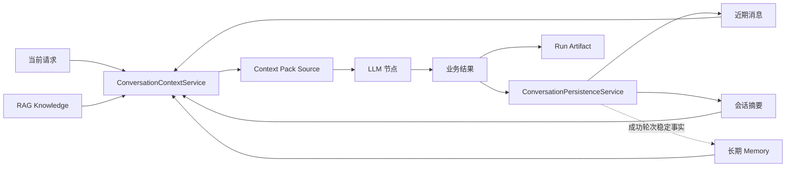
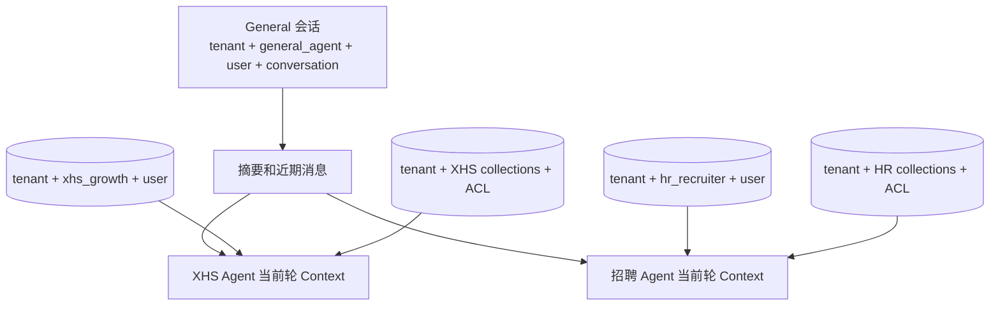
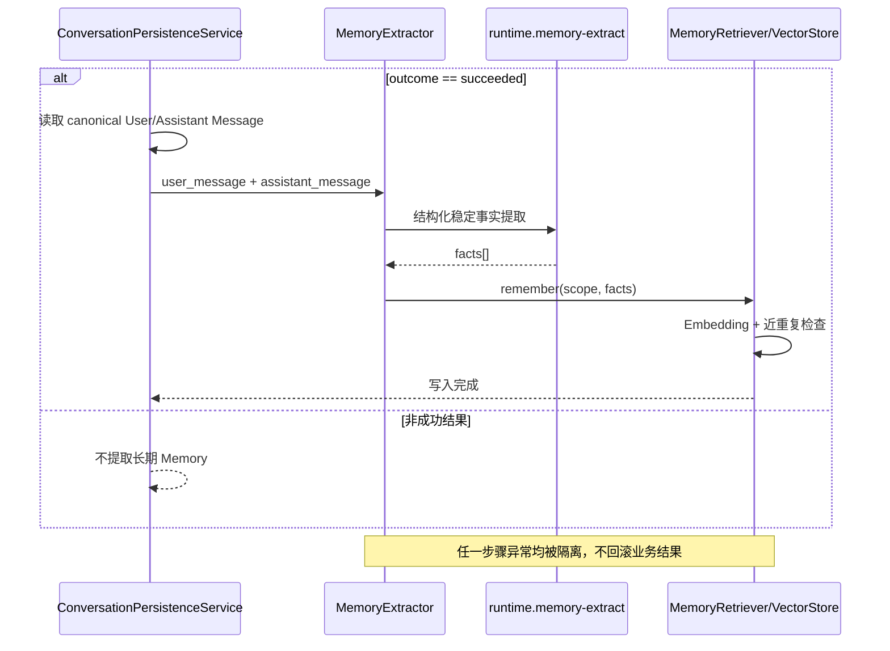
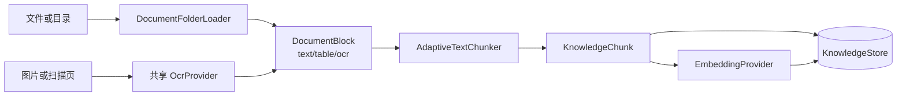
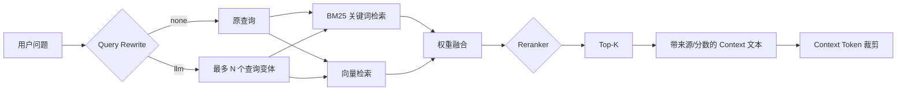

# Memory 与 RAG

## 1. 本章定位

AgentKit 把“模型本轮需要看到的信息”拆成不同生命周期、不同可信级别和不同隔离范围的数据层，而不是把所有历史直接拼进 Prompt。

本章回答五个问题：

1. 会话历史、会话摘要、长期 Memory、RAG Knowledge 和 Run Artifact 有什么区别。
2. General Agent 委派给业务 Agent 时，哪些上下文共享，哪些必须隔离。
3. 一轮对话结束后，哪些内容被持久化，哪些稳定事实进入长期 Memory。
4. 企业知识如何摄取、切分、检索、重排并受控注入 Context。
5. XHS 媒体理解和 RAG 如何复用同一个 OCR Provider，并保持显式关闭语义。



Context 的模板、预算、安全边界和输出 Schema 见 [LLM Context 装载与治理](05_CONTEXT_ENGINEERING_AND_GOVERNANCE.md)。

## 2. 五类信息不是一种 Memory

| 信息层 | 来源 | 生命周期 | 主要作用域 | 是否向量化 | 失败影响 |
| --- | --- | --- | --- | --- | --- |
| 近期消息 | 当前会话 canonical Turn 输入/输出 | 会话级 | `conversation_id` | 否 | 无法恢复短期上下文 |
| 会话摘要 | 超出窗口的历史消息折叠 | 会话级 | `conversation_id` | 否 | 主任务继续，旧历史可能缺失 |
| 长期 Memory | 成功对话中提取的稳定事实 | 跨会话 | `tenant_id + agent_id + user_id` | 是 | 主任务继续，下轮少个性化信息 |
| RAG Knowledge | 企业文档摄取产生的 Chunk | 独立知识生命周期 | `tenant_id + collection + ACL` | 可同时关键词与向量化 | 启用 RAG 的回答证据减少或失败 |
| Run Artifact | 某次执行的大对象、证据或冻结结果 | Run/审计级 | `tenant_id + run_id` | 否 | 影响追溯或后续步骤，不应伪装成长期记忆 |

关键边界：

- 对话消息是“发生过什么”，长期 Memory 是“以后仍可能有用的稳定事实”。
- RAG 是企业知识，不是用户偏好；不能把检索结果写成用户事实。
- Artifact 是执行证据和步骤间交接物，不应该每轮全部塞入模型。
- 这五层最终都必须通过 Context Source 白名单和 Token 预算，不能自行绕过 Context Pack。

## 3. 会话所有权与委派边界

Web 聊天入口的会话所有者是 `general_agent`。用户通过 `@小红书` 指定当前轮或 General 自动委派时，业务 Agent 不创建一份独立、割裂的聊天历史。

`ConversationContextService.build_for_delegation()` 的语义是：

- 验证会话属于当前 `tenant_id + owner_agent_id + user_id`。
- 共享 General 会话的摘要和近期消息，保证业务 Agent 理解当前对话。
- 使用目标业务 Agent 的 `context_policy`。
- 长期 Memory 按目标 `agent.name` 检索，而不是使用 General 的 Memory。
- RAG 按目标 Agent 声明的 Collection、调用者角色和租户读取。



因此，“知道聊天内容”和“共享所有长期记忆”是两回事。业务 Agent 可以看到完成当前任务所需的会话主线，但不会读取其他 Agent 的长期 Memory。

## 4. Agent Context Policy

每个 [`agent.md`](../../agents/general/agent.md) 声明 Memory 和 RAG 策略。加载后形成 `AgentProfile.context_policy`：

```yaml
context:
  memory:
    enabled: true
    window_turns: 6
    max_context_tokens: 4000
    retrieval_k: 4
  rag:
    enabled: false
    collections: []
    top_k: 5
    max_context_tokens: 1200
```

这些字段决定“Agent 可以读取什么和读多少”；部署级 Settings 提供后端、切分、检索器和全局上限。两层职责不能混淆：

- Agent Manifest 选择能力和业务 Collection。
- Runtime Settings 装配具体 Store、Embedding、OCR、Query Rewrite 和 Reranker。
- Context Pack 再对最终注入文本做输入预算与安全隔离。

## 5. 近期消息与会话摘要

### 5.1 近期窗口

`ConversationContextService` 从 Conversation Projection 读取近期 canonical 消息，并按 `window_turns * 2` 限制装载量，因为一轮通常包含 User 和 Assistant 两条消息。只有成功且被选为 `canonical_attempt_id` 的 Attempt 会进入 LLM Context；失败输出、审批卡片、旧 Retry Attempt 和 UI 状态仍保留在 Timeline，但不会重新注入模型。Assistant 历史再通过 `normalize_persisted_assistant_text()` 规范化，避免把旧的内部结构或错误显示带回上下文。

窗口不是“永久保留最近 N 条”的存储策略；原始消息仍保存在 Conversation Store，窗口只控制本轮装载。

### 5.2 Canonical 摘要

`ConversationPersistenceService._update_summary()`：

1. 读取会话消息边界，并从 Conversation Projection 取得 canonical Context。
2. 保留最近 `window_turns * 2` 条不折叠。
3. 选择已滑出近期窗口的 canonical 消息。
4. 调用 `runtime.memory-summary` Context Pack 重新折叠；Retry 改变 canonical Attempt 后不会残留旧失败内容。
5. 保存摘要文本、覆盖到的 Message ID 和 Token 估算。

摘要失败只记录 `memory_summary_failed`，不会把已经完成的业务任务改成失败。这是刻意的可用性选择：摘要是下一轮优化，不属于当前业务事务。

## 6. Conversation Projection 与写入语义

Conversation Store 使用四层可恢复模型：

- `Turn`：一次用户输入；同一 `client_message_id` 幂等返回同一个 Turn。
- `Attempt`：一次执行；Retry 通过 `retry_of_attempt_id` 创建 Attempt N+1。
- `Message`：User 输入、Assistant 输出或 Revision；可见历史只追加且不可覆盖。
- `Action`：审批 preview、版本、决策和决策者；它是 durable 服务端状态，不依赖浏览器内存。

写入顺序是 input-first：API 接受请求后，先原子保存 Turn、User Message 和 Attempt，再开始路由。路由失败、Agent 失败、Tool 失败、SSE 断开或审批恢复失败都不能删除这条输入。流式 Assistant Message 先 checkpoint，再以 `sealed`、`failed` 或 `interrupted` 封口；Revision 通过 `supersedes_message_id` 形成追加链。

Timeline 返回所有可见 Attempt、Message、Revision 与 Action，并默认折叠旧 Attempt。LLM Context 则只读取每个 Turn 的 canonical 成功 Attempt。`ConversationPersistenceService.finalize_canonical_turn()` 只在成功封口后验证租户、所有者、会话状态和 canonical 输出，再更新摘要与长期 Memory。

Retry 不接受旧 Run 作为消息替换指令，也不会改写 Attempt 1。它创建 Attempt 2，并保留旧输入、输出、失败摘要、审批 preview 与决策；父子 Run 关系继续用于运行追踪和审计。

## 7. 长期 Memory 写入链路

只有 `outcome == "succeeded"` 的轮次会尝试提取长期 Memory。失败、阻止、拒绝或等待审批的中间状态不会写入稳定事实。



### 7.1 提取什么

`MemoryExtractor` 使用受治理的 `runtime.memory-extract` Context Pack，期望返回字符串列表。适合长期保存的内容包括稳定偏好、明确身份事实和未来任务仍有用的约束；一次性指令、工具输出、推理过程和未验证猜测不应保存。

### 7.2 去重与向量化

`MemoryRetriever.remember()`：

1. 对候选事实生成 Embedding。
2. 在同一 `MemoryScope` 内查询最相近记录。
3. 超过去重阈值时跳过近重复事实。
4. 保存文本、Kind、来源会话和向量。

Memory 的作用域固定为：

```text
(tenant_id, agent_id, user_id)
```

`conversation_id` 是来源追溯字段，不是检索作用域；因此同一用户可以跨会话复用同一 Agent 的事实，但不同 Agent、用户或租户无法互读。

### 7.3 后端

- SQLite Conversation Store 可作为默认线性向量 Store，适合本地和小规模作用域。
- PostgreSQL + pgvector 支持持久化向量查询。
- `VectorStore` 和 `EmbeddingProvider` 是协议边界，可替换实现而不修改 `ConversationContextService`。

当前每个用户-Agent 作用域通常只有有限事实，SQLite 精确扫描是可接受的起点；数据规模扩大后再引入 ANN 索引，避免过早复杂化。

## 8. 长期 Memory 读取链路

当 Agent 的 Memory Policy 启用且 Runtime 装配了 Memory Reader 时：

1. 用当前用户消息生成查询向量。
2. 只在 `tenant_id + agent_id + user_id` 作用域内检索。
3. 按相似度和最小分数过滤，最多返回 `retrieval_k` 条。
4. 交给 Context Pack 的 Memory Source。
5. 再受 `max_context_tokens` 和 Pack 总预算限制。

Memory 召回不是系统指令。它与用户输入、RAG 和 Tool Observation 一样属于不可信动态数据，不能覆盖安全规则。

## 9. RAG 摄取链路

完整操作命令见 [`docs/RAG_WORKFLOW.md`](../RAG_WORKFLOW.md)，这里关注框架协议。



### 9.1 Loader 与 Block

Loader 把文件解析成语义 Block，并保留标题、URI、页码、来源路径、ACL Role 和业务 Metadata。OCR 结果也是 `kind=ocr` 的 Block，不是特殊的第二套知识系统。

### 9.2 自适应切分

`AdaptiveTextChunker` 对普通文本、表格和 OCR 文本使用独立长度上限，并保留重叠字符。Chunk 继承：

- `tenant_id`
- `document_id`
- `title` / `uri`
- `chunk_index`
- `metadata`
- `acl_roles`

### 9.3 Embedding 与 Store

`KnowledgeIngestionPipeline` 先写 Chunk，再批量生成并关联向量。当前 Store 后端：

- `chroma`：默认持久知识库。
- `memory`：进程内实现，适合测试，不适合作为生产持久层。

## 10. RAG 查询链路

`KnowledgeService.retrieve()` 构造 `RetrievalQuery`，显式携带：

```text
tenant_id, tenant_selector, run_id, user_id, agent_id,
roles, text, top_k, filters.collection
```



### 10.1 混合召回

默认可同时启用关键词和向量检索，通过 `rag_keyword_weight` 与 `rag_vector_weight` 融合。若两者权重都为 0，Runtime 回退为纯关键词检索，避免构造空 Retriever。

### 10.2 查询改写

- `none`：只检索原问题，成本最低且确定性最高。
- `llm`：通过 `runtime.rag-query-rewrite` 生成有限变体；失败时保留原问题，不阻断检索。

### 10.3 重排

- `none`：保持融合顺序。
- `keyword`：按查询词覆盖度做确定性加分。
- `llm`：把有限候选交给 `runtime.rag-rerank`；失败时保留原始排序。

### 10.4 Context 注入

每个命中被格式化为带 Chunk ID、标题、来源、页码和分数的文本，然后作为 RAG Source 进入 Context Pack。`top_k` 只限制条数，`rag_context_cap_tokens` 和 Agent `max_context_tokens` 继续限制总文本量。

## 11. RAG 隔离与授权

RAG 至少有四道边界：

1. `KnowledgeDocument` 和 `KnowledgeChunk` 写入 `tenant_id`。
2. `KnowledgeService` 实例绑定一个 `tenant_id` 与 `tenant_selector`。
3. 查询携带调用者 `roles`，Store 按 `acl_roles` 过滤。
4. Agent Manifest 通过 `collections` 只允许业务需要的 Collection。

`user_id`、`agent_id` 和 `run_id` 用于策略、审计和可追溯，但不能代替租户与 ACL 检查。知识库数据不能因为“模型可能需要”而跨 Collection 或跨租户召回。

## 12. OCR 是共享 Provider

XHS 图片内容理解和 RAG 文件摄取共同依赖 [`agentkit.core.ocr.OcrProvider`](../../src/agentkit/core/ocr.py)：

```python
class OcrProvider(Protocol):
    @property
    def enabled(self) -> bool: ...

    def analyze(
        self,
        image_bytes: bytes,
        *,
        mime_type: str,
        hint: str = "",
    ) -> OcrResult: ...
```

统一契约让模型、Endpoint、超时、图片大小限制和错误脱敏只维护一次。RAG Loader 只关心 Provider 是否启用，不直接依赖 Ollama。

### 12.1 硬关闭语义

```env
AGENTKIT_OCR_PROVIDER=none
```

此时装配 `NoneOcrProvider`：

- `enabled == false`
- 返回 `status=skipped`、`reason=ocr_not_configured`
- 不发起 HTTP
- 不隐式回退到其他 OCR 或多模态模型

RAG 还需显式打开：

```env
AGENTKIT_RAG_OCR_ENABLED=true
```

有效 OCR 的条件是“RAG OCR 开关打开且共享 Provider 启用”。只有其中一个成立都不会调用 OCR。

### 12.2 Ollama

当前内置远程实现：

```env
AGENTKIT_OCR_PROVIDER=ollama
AGENTKIT_OCR_URL=http://localhost:11434/api/generate
AGENTKIT_OCR_MODEL=glm-ocr:latest
AGENTKIT_OCR_TIMEOUT_SECONDS=120
AGENTKIT_OCR_MAX_IMAGE_BYTES=10485760
```

`ollama` 使用 `/api/generate` 契约。容器访问宿主机或 WSL 时可以把 Host 改为 `host.docker.internal` 等可达地址；框架不应再以“必须是 localhost”限制合法部署地址。Endpoint、模型和网络可达性必须在部署环境单独验证。

## 13. 关键配置

| 配置 | 默认值 | 作用 |
| --- | ---: | --- |
| `AGENTKIT_RAG_ENABLED` | `false` | 装配全局 RAG 服务 |
| `AGENTKIT_RAG_STORE_BACKEND` | `chroma` | `chroma` 或 `memory` |
| `AGENTKIT_RAG_TOP_K` | `5` | 默认召回条数 |
| `AGENTKIT_RAG_CONTEXT_CAP_TOKENS` | `1000` | RAG 注入上限 |
| `AGENTKIT_RAG_QUERY_REWRITE` | `none` | `none` 或 `llm` |
| `AGENTKIT_RAG_RERANKER` | `none` | `none`、`keyword` 或 `llm` |
| `AGENTKIT_RAG_OCR_ENABLED` | `false` | 摄取时允许 OCR |
| `AGENTKIT_OCR_PROVIDER` | `none` | OCR 硬关闭或 Provider ID |
| `AGENTKIT_OCR_URL` | `/api/generate` | Ollama Endpoint |
| `AGENTKIT_OCR_MODEL` | `glm-ocr:latest` | OCR 模型 |

Memory 的窗口、召回数和上下文上限主要来自 Agent Context Policy；Embedding Provider 和 Store Backend 来自部署配置。

## 14. 失败语义与降级

| 失败点 | 当前处理 | 设计原因 |
| --- | --- | --- |
| 摘要 LLM 失败 | 记录 `memory_summary_failed`，主任务成功 | 摘要服务下一轮 |
| Memory 提取失败 | 返回空事实 | 不把辅助记忆纳入业务事务 |
| Memory 向量写入失败 | 吞掉写回异常 | 下轮仍可重新提取 |
| LLM Query Rewrite 失败 | 使用原问题 | 保持基础检索可用 |
| LLM Rerank 失败 | 使用融合顺序 | 不让排序增强成为单点 |
| OCR Provider 为 `none` | 明确 `skipped` | 禁止隐式网络调用 |
| OCR 调用失败 | 摄取报告 Warning/Skip 或显式错误 | 不伪造图片文本 |
| RAG 无命中 | 返回空 Knowledge | 上层应说明证据不足，不得编造 |

“降级”不等于“把缺失证据当作已验证”。尤其在 Review 节点中，OCR 未配置、详情抓取失败和 RAG 无命中必须作为证据质量信号，而不是自动通过审核。

## 15. 源码入口与调试

| 关注点 | 源码入口 |
| --- | --- |
| 会话上下文装配 | [`runtime/conversation_context.py`](../../src/agentkit/runtime/conversation_context.py) |
| 会话持久化与摘要 | [`runtime/conversation_persistence.py`](../../src/agentkit/runtime/conversation_persistence.py) |
| 会话/Memory Store | [`core/memory/store.py`](../../src/agentkit/core/memory/store.py) |
| 长期事实提取 | [`core/memory/extractor.py`](../../src/agentkit/core/memory/extractor.py) |
| 向量写入与召回 | [`core/memory/retrieval.py`](../../src/agentkit/core/memory/retrieval.py) |
| RAG 基础契约 | [`core/rag/base.py`](../../src/agentkit/core/rag/base.py) |
| 摄取管线 | [`core/rag/ingest.py`](../../src/agentkit/core/rag/ingest.py) |
| 混合检索与重排 | [`core/rag/retrieval.py`](../../src/agentkit/core/rag/retrieval.py) |
| RAG Runtime 装配 | [`core/rag/service.py`](../../src/agentkit/core/rag/service.py) |
| OCR 契约 | [`core/ocr.py`](../../src/agentkit/core/ocr.py) |
| OCR 装配 | [`runtime/ocr.py`](../../src/agentkit/runtime/ocr.py) |

排查顺序：

1. 确认 Agent Manifest 是否启用 Memory/RAG，并声明正确 Collection。
2. 确认请求的 `tenant_id/user_id/conversation_id/agent_id` 与存储记录一致。
3. 检查 Context Build Audit 中是否有 Memory/Knowledge 输入。
4. 检查 Store 是否有对应作用域记录和 ACL。
5. 检查 Embedding、OCR、Query Rewrite/Reranker Provider 日志。
6. 最后检查 Context Token 裁剪，避免“检索到了但未装入”。

## 16. 测试证据

- [`tests/unit/test_conversation_context.py`](../../tests/unit/test_conversation_context.py)：所有权、委派与装配。
- [`tests/unit/test_conversation_persistence.py`](../../tests/unit/test_conversation_persistence.py)：canonical 封口、摘要和失败隔离。
- [`tests/integration/test_memory_semantic.py`](../../tests/integration/test_memory_semantic.py)：长期 Memory 的跨会话语义召回。
- [`tests/unit/test_memory_retrieval.py`](../../tests/unit/test_memory_retrieval.py)：作用域、相似度和去重。
- [`tests/unit/test_rag.py`](../../tests/unit/test_rag.py)：摄取、混合检索、ACL、改写与重排。
- [`tests/unit/test_rag_ocr.py`](../../tests/unit/test_rag_ocr.py)：RAG OCR 开关和摄取。
- [`tests/unit/test_ocr.py`](../../tests/unit/test_ocr.py) 与 [`test_ollama_ocr.py`](../../tests/unit/test_ollama_ocr.py)：共享契约、硬关闭和 Ollama。

## 17. 面试表达

可以用下面这段话概括：

> AgentKit 没有把 Memory 等同于聊天记录。Timeline 保留全部 Turn/Attempt/Message/Action，LLM Context 和摘要只使用 canonical 成功输出；长期语义 Memory 继续按租户/Agent/用户隔离，企业 RAG 带 Collection 与 ACL，Artifact 只服务于执行追溯。委派时共享 General 会话主线，但目标 Agent 只读取自己的长期 Memory 和知识域。Memory 写回采用最终一致的辅助能力，失败不回滚业务；RAG 采用混合检索、可选 LLM 改写/重排和 Context Token 门禁。OCR 是 XHS 与 RAG 共用 Provider，`none` 是不发网络请求的硬关闭状态。

## 18. 当前限制与演进方向

**当前限制：**

- SQLite Memory 向量检索是作用域内精确扫描，适合小规模而非大规模 ANN。
- Chroma 是当前默认知识 Store；分布式生产部署需规划共享持久卷、备份和并发策略。
- Memory 提取是异步语义上的“尽力而为”，当前没有独立补偿队列。
- RAG 的 `user_id` 与 `agent_id` 进入查询契约，但强授权核心仍是租户、ACL 和 Collection。
- OCR 只内置 `none` 与 `ollama`；更多多模态 Provider 需实现同一 `OcrProvider` 协议。
- 仓库提供离线 RAG Eval 数据结构，但生产知识准确率仍需要业务 Golden Dataset。

推荐演进方向包括独立 Memory 写回队列、大规模向量后端、知识版本/失效治理、引用级正确性评估和多模态证据 Artifact。它们属于规划能力，统一记录在 [ROADMAP](ROADMAP.md)，不能当作当前已实现功能。
