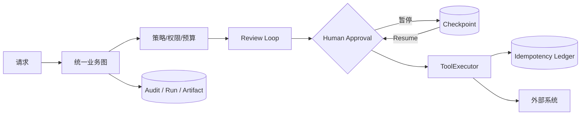
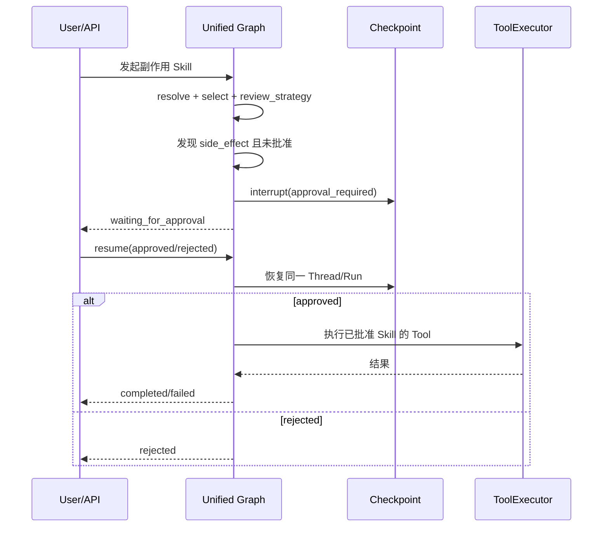
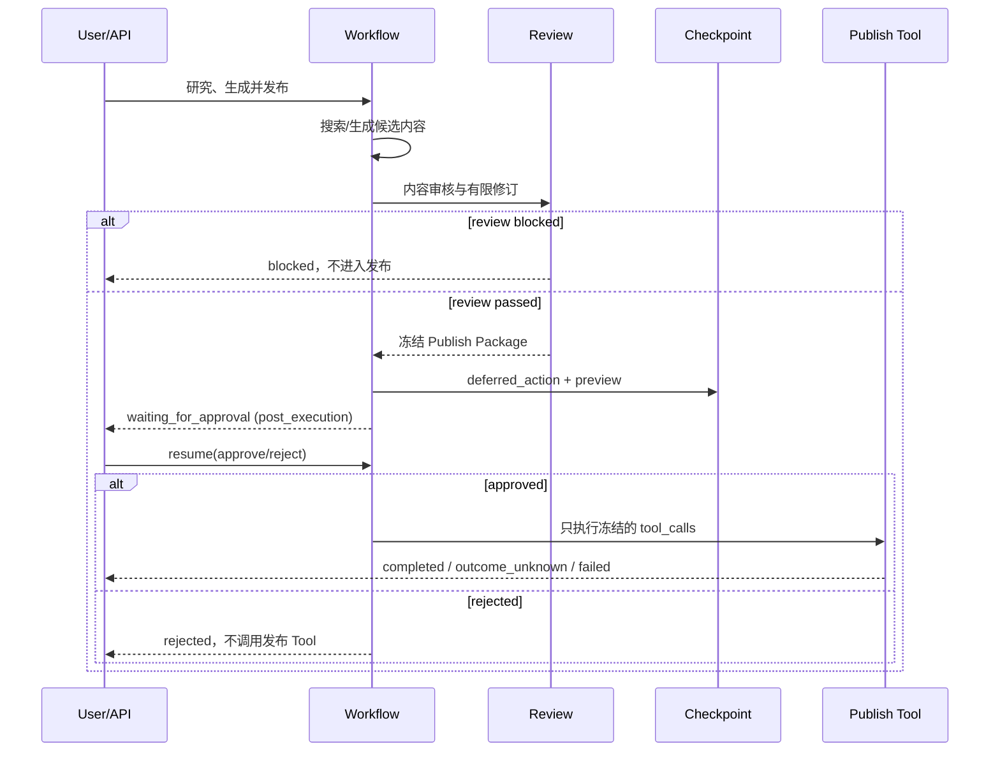
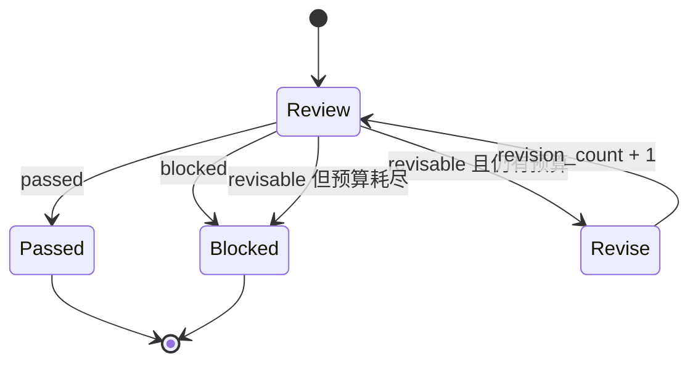
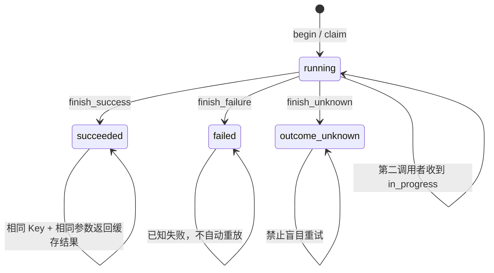

# 治理与可靠执行

## 1. 本章定位

企业 Agent 的稳定性不是要求 LLM 永远正确，而是把不确定判断、业务审核和外部副作用放进可观测、可暂停、可恢复、有上限的状态机。

AgentKit 的可靠执行由五组机制共同构成：

1. 执行策略和 Tool 白名单控制可做什么。
2. Human Approval 控制高风险动作何时可以发生。
3. Review Loop 控制候选内容是否通过以及最多修订几次。
4. LangGraph Checkpoint 保持暂停前状态并支持进程重启后恢复。
5. Idempotency Ledger 防止重试造成重复副作用，并显式表达结果未知。



统一图和六类执行策略见 [执行运行时与 LangGraph](04_EXECUTION_RUNTIME_AND_LANGGRAPH.md)。

## 2. 三种不同的“审核”

| 机制 | 审核对象 | 决策者 | 结果 | 是否暂停 |
| --- | --- | --- | --- | --- |
| Strategy Review | 选中的 Skill 是否含副作用 | 声明与规则 | 生成审批清单 | 可能 |
| Content/Business Review | 候选结果是否满足质量/合规要求 | 确定性规则或受治理 LLM | `passed/revisable/blocked` | 否，有限循环 |
| Human Approval | 是否授权执行高风险动作 | 人 | approve/reject | 是，LangGraph Interrupt |

不要把三者合并成一个模糊的 `review` 节点：

- 内容质量通过不等于人已授权发布。
- 人批准操作不应绕过 Tool 权限、Schema 和幂等检查。
- Review 不通过应先在有限预算内修订，而不是重新运行整个 Agent 或无限循环。

## 3. 双检查点审批模型

AgentKit 支持两类副作用工作流，它们的审批时点不同。

### 3.1 执行前审批

当 Capability 本身声明 `tool_policy=side_effect`，且尚未被批准时，统一图在 `execute_strategy` 前暂停。

适用场景：参数在执行前已经明确，不需要先生成复杂冻结内容，例如直接提交退款或执行某个确定的管理动作。



审批清单来自候选 Skill 中的副作用声明，而不是模型随意指定。批准的 Skill 再映射到该 Skill 允许的副作用 Tool，ToolExecutor 仍会执行权限、白名单、Schema 和幂等检查。

### 3.2 执行后审批

复杂 Workflow 可以先完成无副作用的研究、生成和 Review，把最终要执行的动作冻结为 `deferred_action`，然后再暂停。

XHS 发布使用这种模式：用户审批的是确定的标题、正文、图片卡片和发布参数，而不是一张空白授权支票。



恢复时 `_deferred_approval` 从 Checkpoint 读取冻结 Tool Call，并用 `ToolPolicy.SIDE_EFFECT` 和明确批准的 Tool 集合创建新的 ToolExecutor。研究和文案生成不会再跑一遍。

## 4. Approval 状态与恢复契约

统一审批判断由 [`approvals.py`](../../src/agentkit/core/approvals.py) 管理：

- `required`：计划中需要人工审批的 Skill。
- `pending`：既未批准也未拒绝。
- `rejected`：明确拒绝。

LangGraph 通过 `interrupt()` 持久化暂停点。API 恢复调用必须提供原 `thread_id`，并把 `approved_skills`、`rejected_skills` 和决策上下文传入。

恢复不是发起一个新业务任务：

- 使用同一 Run ID 和 Thread。
- 从 Checkpoint 后续节点继续。
- 已完成的路由、输入解析、研究和生成不重复执行。
- 已完成的副作用不能通过 Resume 重新执行。
- 已结束或并非等待审批的 Thread 再 Resume 会失败。

## 5. Context Hash 防漂移

任务开始时，Runtime 把当前 `context_manifest_hash` 写入 LangGraph State。恢复前比较：

```text
checkpoint.context_manifest_hash == current_runtime.manifest_hash
```

若 Prompt、Fragment、Schema 或租户 Override 已变化，抛出 `ContextHashMismatchError` 并记录 `context_hash_mismatch`，不继续执行。

这是审批语义的一部分：用户批准的是暂停时看到的业务内容和当时的规则版本。部署新 Context 后静默恢复旧任务会破坏“所见即所批”。

## 6. 通用 Review Loop

Review 并非 XHS 专用脚本，而是 [`core/review.py`](../../src/agentkit/core/review.py) 提供的通用有限状态机。Skill 可以通过 `ReviewPolicy` 决定是否启用以及最大修订次数。



### 6.1 数据契约

`ReviewDecision`：

- `status`: `passed | revisable | blocked`
- `reason`: 面向审计和用户解释的原因
- `findings`: 结构化问题清单
- `metadata`: 业务扩展信息

`ReviewLoopResult` 保存最终 Candidate、Decision、修订次数和完整 History。`ReviewTransition` 把每次 `review/revise` 及 Attempt 暴露给 Audit/Artifact。

### 6.2 有限修订

执行规则：

1. 审核当前 Candidate。
2. `passed` 立即结束。
3. `blocked` 立即结束，不修订。
4. `revisable` 且仍有预算时，调用 Reviser 生成新 Candidate。
5. 再审核新 Candidate。
6. 达到 `max_revisions` 后仍是 `revisable`，强制转为 `blocked`。

Reviewer 或 Reviser 抛异常时包装为 `ReviewExecutionError(stage, attempt, cause)`，不会被误判为内容通过。

### 6.3 为什么不是“打回整个 Agent 重来”

整图重跑会重复搜索、增加 Token、改变证据集合，并可能重复副作用。有限 Review Loop 只修改明确的 Candidate，保留原证据、Artifact 和次数预算，失败语义也更稳定。

## 7. XHS 是实例，不是架构特例

XHS Workflow 把通用机制组合为：

```text
研究证据 → 生成文案 → Content Review
  → revisable: 只修订文案（有限次数）
  → blocked: 停止，不发布
  → passed: 冻结 Publish Package → 人工审批 → 发布 Tool
```

其他业务同样可以复用：

- 招聘 Agent：候选人排序公平性审核后再输出。
- 客服 Agent：退款方案规则审核后再等待人工授权。
- 入职 Agent：资料完整性审核后再创建 HRIS 记录。

通用层提供状态机和治理；Skill 提供 Reviewer/Reviser 的业务逻辑与 Schema。

## 8. Checkpoint、Thread 与 Run

| 标识 | 作用 |
| --- | --- |
| `conversation_id` | 用户聊天容器，可包含多个 Turn |
| `turn_id` | 一次已持久化的用户输入 |
| `attempt_id` | Turn 的一次执行；Retry 创建下一 Attempt |
| `message_id` | 输入、输出或 Revision 的追加记录 |
| `action_id` | durable 审批 preview、版本与决策 |
| `run_id` | 一次业务执行及其 Audit/Cost/Artifact 关联键 |
| `parent_run_id` | General 根 Run 与业务 Agent 子 Run 的链路 |
| `thread_id` | LangGraph Checkpoint 恢复键 |
| `checkpoint` | 暂停点的图状态、下一节点和 Context Hash |

SQLite/PostgreSQL Checkpointer 允许进程重启后恢复。生产环境只允许 `approval_checkpointer=sqlite|postgres`；`memory` 和 `none` 会在配置加载时被拒绝，多实例必须共享 PostgreSQL。恢复不依赖 Python 进程内对象，但必须确保新进程加载相同租户配置、Agent/Skill 声明、Context Manifest 和持久化后端。

父子 Run 场景下，业务子 Agent 等待审批时，General 根会话的有效状态也应投影为 `waiting_for_approval`，而不是错误显示已完成。

## 9. 失败重试与 Resume 不同

| 操作 | 适用状态 | Run ID | 执行位置 | 会话显示 |
| --- | --- | --- | --- | --- |
| Resume | `waiting_for_approval` | 相同 | Checkpoint 后继续 | 更新同一 Attempt |
| Retry | `failed/interrupted/rejected/cancelled` | 新 Run | 新 Attempt 重新进入业务图 | 保留旧 Attempt 并追加 Attempt N+1 |
| Reconcile | 历史脏非终态 | 原 Run 对账为终态 | 不重执行业务 | 封口或标记可重试 |

Retry 命令使用 `turn_id + retry_of_attempt_id + idempotency_key`。Store 只允许最新终态 Attempt 创建下一 Attempt，并用唯一键避免重复 Retry；旧 Attempt 的 Message、Revision、Action、失败摘要和 Run 审计均不可变。Timeline 默认折叠旧 Attempt，避免视觉噪声，但不会隐藏或删除历史。

### 9.1 Checkpoint 失效

启动恢复对账发现审批 Checkpoint 缺失，或 Resume 因 Checkpoint 无法继续时，Runtime 不会从头自动重放副作用，也不会再次 POST 原聊天请求。对应 Action 原子变为 `invalidated`，Attempt 变为 `interrupted`，已有输入、审批 preview、Revision 和输出继续显示。用户可以显式 Retry 创建新的 Attempt，并重新经过需要的审批。

Context Manifest Hash 变化属于另一种拒绝恢复：旧 Checkpoint 仍在，但其规则版本已过期。Runtime 抛出 `ContextHashMismatchError` 并要求重新发起，不能把旧批准静默应用到新 Prompt、Schema 或租户 Override。

用户已批准后，若恢复执行返回业务失败，Action 保留 `approved` 决策，Attempt 变为 `failed` 并追加失败摘要；只有成功完成副作用时 Action 才变为 `completed`。

## 10. 幂等账本

副作用 Tool 使用稳定 `_idempotency_key`。账本主范围为：

```text
(tenant_id, tool_name, idempotency_key)
```

业务参数移除传输字段 `_idempotency_key` 后计算 Canonical SHA-256。相同 Key 但参数不同会触发冲突，而不是错误复用旧结果。



### 10.1 begin 的可能结果

- 新记录：调用者获得 `claimed`，可以执行外部 Tool。
- `succeeded`：返回持久化结果，不再次执行。
- `running`：抛 `IdempotencyInProgressError`。
- `failed`：抛 `IdempotencyFailedError`。
- `outcome_unknown`：抛 `IdempotencyOutcomeUnknownError`。
- 同 Key 不同参数：抛 `IdempotencyConflictError`。

SQLite 使用立即事务 Claim；PostgreSQL 使用唯一约束和行锁。二者遵循相同协议。

## 11. 结果未知不是普通失败

外部发布请求可能已经被平台接收，但浏览器导航、回执页或网络在确认前失败。这时真实状态不是 `failed`，而是 `outcome_unknown`。

正确处理：

1. 把 Idempotency 记录标记为 `outcome_unknown`。
2. 记录 `idempotency_outcome_unknown` Audit 事件。
3. 告知用户需要在外部系统对账。
4. 使用业务唯一键、平台记录或人工确认判断是否已经成功。
5. 对账后由明确流程修正，不直接重复提交。

盲目重试可能产生重复发帖、重复退款或重复入职记录。即使操作“看起来失败”，只要无法证明未发生，就不能自动重放。

## 12. Run 状态与用户态 Outcome

内部状态用于治理和排障，Web 用户主要看到收敛后的 Outcome：

| 内部状态 | 用户态 Outcome | 含义 |
| --- | --- | --- |
| `idle` | `idle` | 尚无任务 |
| `running` | `processing` | 执行中，不允许删除 |
| `completed` | `succeeded` | 完成 |
| `waiting_for_approval` | `action_required` | 等待审批 |
| `needs_clarification` | `action_required` | 需要补充信息 |
| `failed` | `not_completed` | 执行失败，可重试 |
| `cancelled` | `not_completed` | 已取消，可重试 |
| `rejected` | `not_completed` | 人工拒绝 |
| `blocked` | `not_completed` | Review/Policy 阻止 |

`outcome_unknown` 主要是 Tool/Idempotency 的结果语义，不能伪装成 `completed`。它应体现在失败原因、Audit 和外部对账提示中。

这张 Outcome 表服务于运行追踪和删除门控。Chat 页面不再从 `ConversationExecution` 或空消息列表重建任务状态，而是直接渲染 Conversation Timeline 中的 Attempt 与 Action。

## 13. 运行追踪的历史状态纠正

`ConversationRunStateResolver` 根据最新根 Run、直接子 Run 和 Audit 投影操作状态，仅供运行追踪、对账与删除决策；可见聊天历史由 Conversation Projection 管理。Resolver 会修正以下历史脏状态：

- 根 Run 标记完成，但仍有活跃子 Run：投影为 `running` 或 `waiting_for_approval`。
- 父 Run 等待审批，但子 Run 已全部终止：写入 `run_reconciled`，结束为 `failed`。
- 父 Run 长期 `running`，已有失败事件、失败子 Run或所有子 Run 已结束：纠正为 `failed`。
- 执行超过平台最大时间再加保护窗口：纠正为 `failed`。

Reconcile 只修正状态，不重新执行工具或回滚外部系统。

## 14. 会话删除边界

会话删除是数据生命周期操作，不是业务事务回滚。

### 14.1 普通删除

允许删除没有活跃 Run、也不要求二次确认的会话。服务再次校验会话属于当前 `tenant_id + user_id + agent`。

### 14.2 二次确认强删

- `failed`：二次确认后可以强删。
- `waiting_for_approval`：二次确认后先把非终态父子 Run 写成 `cancelled`，再删除。
- 已 Reconcile 的失败会话：要求二次确认。

### 14.3 运行中禁止删除

`running` 状态即使调用 `terminate_and_delete()` 也会拒绝。当前实现没有把进程内 Tool 安全取消与外部事务补偿合并成一个“强停”按钮；必须等待执行完成，或先走独立的受治理取消能力。

### 14.4 删除什么、不删除什么

会话 Store 删除：

- Conversation
- Messages
- Summary
- 以该会话为来源的内部 Memory

外部向量 Memory 先按 `source_conversation_id` 删除；若失败，会话本体不删，避免留下无法定位的孤儿 Memory。

不会删除：

- Audit Run/Event
- Run Artifact
- 外部平台已经发生的副作用

因此删除会话不会让发帖、退款或 HRIS 记录消失，也不是合规审计擦除接口。

## 15. 可靠执行故障矩阵

| 现象 | 首要证据 | 禁止动作 | 推荐恢复 |
| --- | --- | --- | --- |
| 一直等待审批 | Thread State、`run_paused`、审批 Skill | 新发相同副作用任务 | Resume 原 Thread |
| Resume 后 Context 变化 | `context_hash_mismatch` | 绕过 Hash | 重新发起并重新审批 |
| Review 一直不过 | Review History/Artifact | 无限增加修订次数 | 修正证据或规则后新任务 |
| Tool 显示 in progress | Idempotency Ledger | 换 Key 重复提交 | 等待原调用并查询状态 |
| Tool outcome unknown | `idempotency_outcome_unknown` | 自动重试 | 外部对账 |
| 会话显示幽灵 running | 父子 Run、结束事件、Timeout | 直接删 Audit | Resolver Reconcile |
| 删除失败会话被拦 | `requires_second_delete_confirmation` | 数据库手删 | 二次确认强删接口 |

## 16. 源码入口

| 关注点 | 源码 |
| --- | --- |
| 通用 Review Loop | [`core/review.py`](../../src/agentkit/core/review.py) |
| 审批集合判断 | [`core/approvals.py`](../../src/agentkit/core/approvals.py) |
| 图中审批与恢复 | [`core/langgraph_agent.py`](../../src/agentkit/core/langgraph_agent.py) |
| 幂等协议和后端 | [`core/idempotency.py`](../../src/agentkit/core/idempotency.py) |
| Tool 幂等执行 | [`core/tool_executor.py`](../../src/agentkit/core/tool_executor.py) |
| 会话状态投影 | [`runtime/conversation_runs.py`](../../src/agentkit/runtime/conversation_runs.py) |
| 会话删除协调 | [`runtime/conversation_deletion.py`](../../src/agentkit/runtime/conversation_deletion.py) |

## 17. 测试证据

- [`tests/unit/test_review_loop.py`](../../tests/unit/test_review_loop.py)：通过、修订、阻止、预算耗尽和回调异常。
- [`tests/integration/test_approval_resume.py`](../../tests/integration/test_approval_resume.py)：执行前审批与恢复。
- [`tests/integration/test_xhs_publish_approval.py`](../../tests/integration/test_xhs_publish_approval.py)：冻结内容、执行后审批、失败刷新保留与 Attempt 2 Retry。
- [`tests/integration/test_conversation_timeline_api.py`](../../tests/integration/test_conversation_timeline_api.py)：Timeline、Action 命令与旧恢复端点移除。
- [`tests/integration/test_durable_execution.py`](../../tests/integration/test_durable_execution.py)：跨 Runtime 重启恢复和 Context Hash。
- [`tests/unit/test_idempotency.py`](../../tests/unit/test_idempotency.py)：Claim、缓存、冲突、失败与结果未知。
- [`tests/unit/test_conversation_run_state.py`](../../tests/unit/test_conversation_run_state.py)：父子 Run 投影和 Reconcile。
- [`tests/unit/test_conversation_deletion.py`](../../tests/unit/test_conversation_deletion.py)：普通删除、二次确认和运行中禁止删除。

## 18. 面试表达

可以这样说明：

> 我们没有依赖 Agent 自觉避免风险，而是把副作用声明、人工审批、有限 Review、Checkpoint 恢复和幂等账本做成 Runtime 能力。简单副作用在执行前审批；复杂 Workflow 先生成并审核冻结内容，再做执行后审批。恢复使用同一 Thread/Run，并校验 Context Manifest Hash；失效 Checkpoint 不会自动重放。Conversation Projection 在路由前保存输入，用 Turn/Attempt/Message/Action 保留完整可见历史，Retry 只追加 Attempt N+1，LLM Context 只消费 canonical 成功输出。Tool 使用租户级幂等账本区分成功缓存、执行中、已知失败、参数冲突和结果未知；结果未知必须外部对账。运行中禁止删除，失败或待审批只能二次确认强删，而 Audit、Artifact 和外部副作用始终保留。

## 19. 当前限制与演进方向

**当前限制：**

- Checkpoint 与业务数据库的高可用、备份和灾难恢复依赖部署方案，不由 LangGraph 自动解决。
- 当前会话强删只安全处理 `failed` 和 `waiting_for_approval`；没有通用运行中分布式取消协议。
- Idempotency 能防重复执行，但无法自动判断所有第三方系统的真实结果。
- Review 的业务质量取决于 Reviewer、Schema 和证据质量；通用循环本身不保证内容正确。
- 当前只处理根 Run 的直接子 Run 状态投影，更深层 A2A 图需要扩展关联查询。
- Audit/Artifact 保留策略和合规删除需要独立数据治理策略。

推荐演进包括可取消 Worker 协议、第三方对账 Adapter、Checkpoint 高可用、深层 Run DAG 投影和审批 SLA。它们是 [ROADMAP](ROADMAP.md) 中的规划项，不是当前承诺能力。
