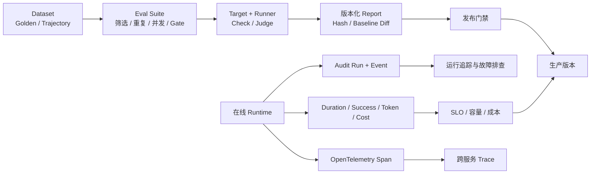
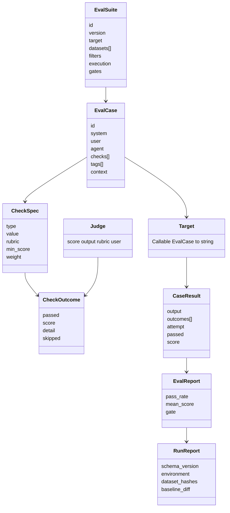
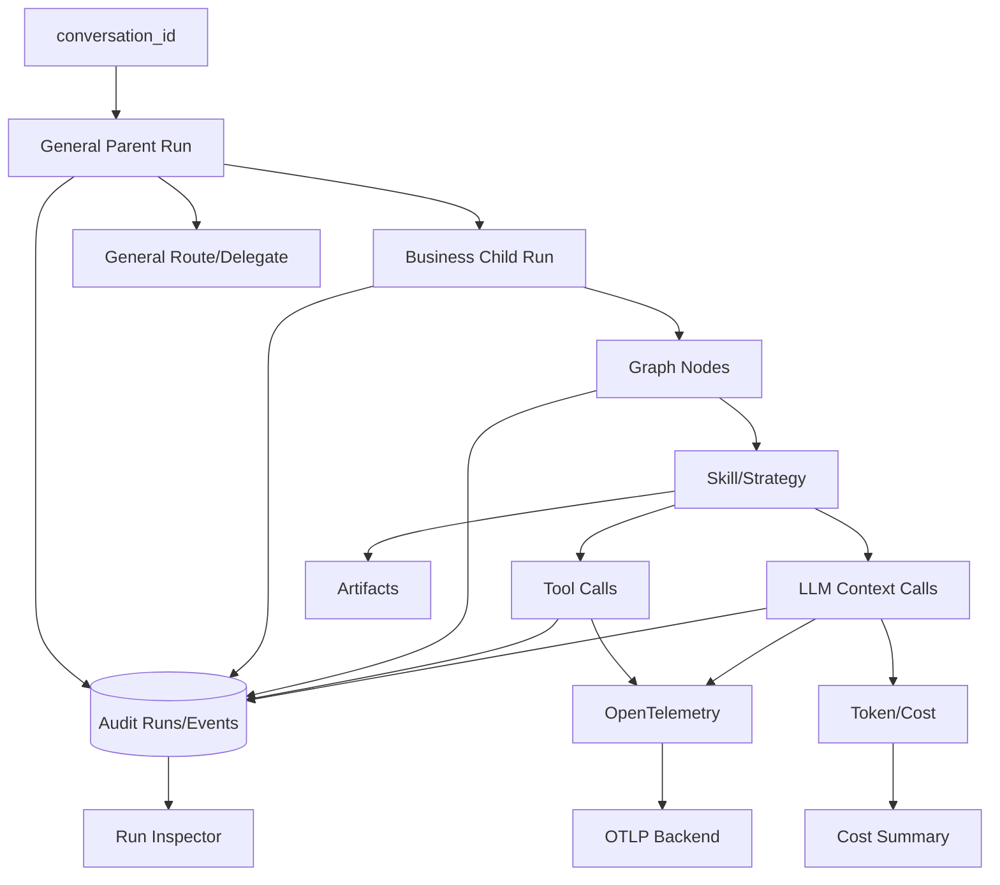
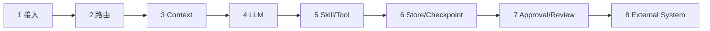

# 评估、可观测性与成本

## 1. 本章定位

企业 Agent 不能只回答“能不能跑通”，还要持续回答：

- 输出质量是否回归。
- 决策路径是否符合治理规则。
- 请求慢在哪里，P95/P99 是否恶化。
- Token、模型调用和 Tool 调用是否超过预算。
- Agent 带来的业务完成率、人工节省时间和风险变化是什么。
- 失败后能否凭证据定位到入口、路由、Context、LLM、Tool、存储或外部系统。

AgentKit 把这类能力分为三个平面：



离线 Eval 证明“这个版本在代表性样本上表现如何”；在线观测证明“真实请求发生了什么”。两者不能互相替代。

## 2. 质量证据金字塔

| 层级 | 证据 | 优点 | 局限 |
| --- | --- | --- | --- |
| 单元测试 | 纯函数、Schema、状态机、权限和预算 | 快、确定、适合 CI | 不覆盖真实模型波动 |
| 集成测试 | Fake LLM、完整 Gateway、审批、持久化 | 覆盖执行链路 | 仍非真实外部依赖 |
| 离线 Eval | Golden Dataset + Checks/Judge | 可衡量语义质量和轨迹 | 数据集代表性决定价值 |
| 预生产压测 | 真实网络、模型和存储 | 可测吞吐与尾延迟 | 成本高，需隔离副作用 |
| 生产观测 | Audit、Metrics、Trace、业务结果 | 最真实 | 需要隐私、采样和基线治理 |

推荐门禁顺序是：确定性测试先挡结构错误，再用离线 Eval 挡质量/轨迹回归，最后用预生产和生产数据管理容量与业务价值。

## 3. 离线 Eval 数据模型

[`src/agentkit/eval/`](../../src/agentkit/eval) 提供一个小型评估框架。



### 3.1 EvalCase

一个 Case 描述输入、目标 Agent、业务 Context、标签和检查列表。JSONL 示例：

```json
{
  "id": "xhs-review-before-publish",
  "agent": "xhs_growth",
  "user": "以 AI 改变生活为主题研究 Top 5，写一篇并发布",
  "context": {
    "topic": "AI 改变生活",
    "top_n": 5,
    "_eval_resume": {
      "approved_skills": ["xhs.growth.campaign"]
    }
  },
  "tags": ["xhs", "approval", "trajectory"],
  "checks": [
    {
      "type": "event_sequence",
      "value": ["intent_understood", "strategy_selected", "run_paused", "run_resumed"]
    },
    {
      "type": "json_path_equals",
      "value": {"path": "status", "equals": "completed"}
    }
  ]
}
```

`_eval_resume` 是 Eval 控制字段，Target 在构造真实 TaskRequest 前会移除，不会泄漏到业务 Agent Context。

轨迹数据还可以使用以下声明式期望：

- `expected_strategy`：转换为 `response.strategy` 的 `json_path_equals`。
- `expected_status`：转换为最终 `status` 的 `json_path_equals`。
- `expected_events`：转换为 `event_sequence`；未显式提供时，根据状态生成最小关键事件序列。

Case 必须至少产生一个可执行 Check。没有 `checks`，也没有可转换的轨迹期望时，Runner 会生成 `configuration` 失败，避免“没有验证任何内容却通过”的假绿灯。

### 3.2 Check

确定性 Check 当前包括：

- `contains/not_contains/icontains`
- `regex/equals/min_length/max_length`
- `no_pii/no_injection`
- `json_path_exists/json_path_equals`
- `event_sequence`
- `judge`

确定性 Check 应优先验证状态、Schema、安全和轨迹；只有难以规则化的帮助性、表达质量、事实相关性等再使用 Judge。

### 3.3 Judge

`LLMJudge` 按 Rubric 返回 1–5 分和一句原因。`min_score` 决定通过阈值，`weight` 决定该检查对 Case 总分的贡献。

Judge 失败会得到 0 分而不是让整个 Eval Runner 崩溃。没有配置 Judge 时，默认把 `judge` Check 标记为 `skipped`；Suite 设置 `gates.require_judge: true` 后，未配置 Judge 会变成非跳过失败。因此包含语义质量门禁的生产 Suite 应显式要求 Judge，不能依赖“跳过即通过”证明质量。

### 3.4 CaseResult 与 EvalReport

- Case 只有所有未跳过检查都通过才算通过。
- Case Score 是按 Weight 加权的 0–1 均值。
- Report 聚合 `total/passed/pass_rate/mean_score`。
- `gate(min_pass_rate, min_mean_score)` 同时满足两个阈值才通过。
- 单个 Target 异常被隔离为该 Case 失败，不中断其他 Case。
- `repetitions` 会为同一 Case 生成多个 Attempt，用于发现非确定性回归。
- `concurrency` 控制 Case 并发；结果仍按 Case 和 Attempt 保持稳定顺序。

## 4. 三种 Target

| Target | 执行范围 | 输出 | 速度/成本 | 适用门禁 |
| --- | --- | --- | --- | --- |
| `llm` | 直接调用配置 LLM | 模型文本 | 最快、最便宜 | Prompt/Judge 基础能力，不验证 Agent Runtime |
| `gateway` | 完整 Agent Gateway | 面向用户的最终文本或业务 JSON | 较慢 | 业务回答、权限、路由和完整链路 |
| `gateway-trace` | 完整 Gateway，可自动 Resume | 初始/最终响应 + Audit Event 序列 | 最慢、覆盖最全 | 策略、审批、父子 Run、轨迹和治理门禁 |

### 4.1 llm

`llm_target` 绕过 Agent、Skill、Context Registry 和 ToolExecutor，只用 Case 的 System/User 调用模型。它适合测试一个孤立 Prompt 或 Judge，不应被当作企业 Agent 的端到端评估。

### 4.2 gateway

`make_gateway_target` 构造真实 `TaskRequest`，经过 Agent Gateway 后优先提取 `final.message`、`output.message` 或 `final.summary`，否则序列化业务 Output。适合用户可见结果检查。

### 4.3 gateway-trace

返回完整 JSON Envelope：

- `initial_status`
- `status`
- `initial_response`
- `response`
- `audit_event_types`

若 Case 声明 `_eval_resume` 且初始状态是 `waiting_for_approval`，Target 会恢复原 Thread。因此可以验证“生成 → 暂停 → 审批 → 只执行冻结副作用”的完整轨迹。

## 5. Eval Suite 与运行方式

### 5.1 单数据集入口

`agentkit eval` 保留为快速执行单个数据集的入口：

```powershell
agentkit --tenant company_alpha eval evaluation/datasets/golden.jsonl `
  --target gateway-trace `
  --threshold 0.95 `
  --min-mean-score 0.85
```

门禁建议分层：

- PR：确定性 Case + Fake Provider，快且稳定。
- Nightly：真实模型的 `llm/gateway`，观察模型漂移。
- 发布候选：关键 `gateway-trace`、审批与失败路径。
- 定期：按生产失败聚类补充 Regression Case。

Golden Dataset 必须版本化，并同时记录模型、Provider、Context Manifest 和租户配置版本；否则分数变化无法归因。

### 5.2 企业级 Suite 入口

[`evaluation/suites/trajectory.yaml`](../../evaluation/suites/trajectory.yaml) 把数据集、Target、执行参数和 Gate 固化为可版本化配置：

```yaml
id: strategy-trajectory
version: "1"
target: gateway-trace
datasets:
  - ../datasets/trajectory.jsonl
execution:
  repetitions: 1
  concurrency: 1
gates:
  min_pass_rate: 1.0
  min_mean_score: 1.0
  require_judge: false
```

Suite 还支持以下过滤字段：

```yaml
filters:
  include_tags: [pr]
  exclude_tags: [slow, side-effect]
  case_ids: [direct-customer-answer]
```

过滤语义是：Case ID 必须匹配指定集合；`include_tags` 至少命中一个；命中任意 `exclude_tags` 时排除。不同阶段建议维护不同 Suite，而不是在 CI 命令中拼接隐含规则。

运行并自动持久化版本化报告：

```powershell
agentkit --tenant company_alpha eval-suite evaluation/suites/trajectory.yaml
```

指定报告位置并与历史基线比较：

```powershell
agentkit --tenant company_alpha eval-suite evaluation/suites/trajectory.yaml `
  --baseline evaluation/baselines/trajectory.json `
  --output evaluation/reports/trajectory-current.json
```

只检查 YAML、数据集路径、过滤结果、重复 ID 和空 Check，不调用模型、Gateway 或 Tool：

```powershell
agentkit eval-suite evaluation/suites/trajectory.yaml --validate-only --json
```

### 5.3 版本化报告

[`eval/report.py`](../../src/agentkit/eval/report.py) 生成 Schema Version 为 `1.0` 的 JSON 报告，包含：

- Suite ID/Version、Target、生成时间。
- Tenant、Provider、Model、Git Commit、Context Manifest Hash。
- 每个数据集的 SHA256，防止同名数据静默变化。
- Repetitions、Concurrency、Gate 阈值和 Gate 结果。
- 每个 Case/Attempt 的输出摘要、Check、得分和失败详情。
- 可选的 Pass Rate 与 Mean Score 基线差值。

未指定 `--output` 时，报告写入 `evaluation/reports/<suite>-<UTC时间>.json`。该运行目录已被 Git 忽略；需要长期保存的批准基线应复制到单独、受评审的基线目录后显式提交。

### 5.4 CI 与迭代闭环

当前 CI 执行：

```bash
uv run mypy src/agentkit/core
uv run agentkit validate-catalog
uv run agentkit validate-contexts
uv run agentkit eval-suite evaluation/suites/trajectory.yaml --validate-only
uv run pytest -q
```

Catalog、Context 与 Suite 校验都是确定性契约门禁，不执行真实副作用；真实 Runtime 行为由单元/集成测试覆盖。接入真实模型的 Nightly 或发布门禁时，应另行执行不带 `--validate-only` 的 `eval-suite`，并配置隔离租户、无真实副作用 Tool 或显式审批策略。

### 5.5 输出治理、审计与 Prometheus 指标

所有策略的最终 `StrategyResult` 都经过同一条 Output Review Chain。默认审查器递归脱敏字符串字段；审查器异常按 `fail_closed` 阻断，但不会重新执行 Skill、Tool 或副作用。审计事件 `output_reviewed` 只记录 action、finding code 和数量，不记录命中的敏感正文。

运行输入默认采用 `AGENTKIT_AUDIT_INPUT_MODE=redacted`。可选值为：

- `raw`：保留原文，仅允许在隔离调试环境短期开启。
- `redacted`：持久化脱敏文本，同时记录原输入 SHA-256 和字符长度。
- `hash`：仅持久化 `sha256:<digest>`，不保存可读原文。

`/metrics` 从 Audit Store 聚合运行状态、LLM Token/Cost 和事件平均耗时。它需要 `operations:view` 权限，并禁止租户、Run ID、用户输入等高基数或敏感标签。

可迭代流程：

1. 从生产失败、人工复核和新需求提炼 Case，去除敏感数据。
2. 为状态、权限、Schema、事件序列优先增加确定性 Check。
3. 只有语义质量难以规则化时增加 Judge，并设置 `require_judge: true`。
4. 按风险和运行成本打 Tag，把 Case 纳入 PR、Nightly 或 Release Suite。
5. 运行多次观察波动，保存批准基线并比较差异。
6. Gate 通过后发布；失败时按 Case、Attempt 和 Check 定位，而不是只看总分。

## 6. RAG 评估是独立维度

RAG 检索层提供 `RAGEvalCase` 和 Report，可用 `agentkit rag-eval` 计算 Hit Rate、MRR 等检索指标。回答质量 Eval 与检索质量 Eval 应分开：

- 检索 Eval 判断“相关 Chunk 有没有被召回、排名如何”。
- 回答 Eval 判断“模型是否正确使用证据、是否引用、是否拒绝无证据结论”。

只评最终回答会掩盖召回问题；只评 Hit Rate 也不能证明模型没有忽略证据。

## 7. 在线可追溯模型



### 7.1 核心关联键

| 键 | 用途 |
| --- | --- |
| `tenant_id` | 所有查询与聚合的第一隔离边界 |
| `user_id` | 用户请求、会话和授权范围 |
| `conversation_id` | 多轮聊天及多个根 Run 的容器 |
| `run_id` | 一次执行的 Audit、Cost、Log 和 Artifact 主键 |
| `parent_run_id` | General 根 Run 与业务子 Run 关系 |
| `agent_id` | 实际执行 Agent |
| `thread_id` | LangGraph Checkpoint/Resume 关联键 |

日志、Audit、Metrics 和 Trace 必须至少能够用 `run_id` 互相跳转；多 Agent 排障再通过 `parent_run_id` 还原整棵调用链。

## 8. Audit、Metrics 与 Trace 的分工

### 8.1 Audit

Audit 是持久业务证据：Run 起止、路由、策略、审批、Tool、Context Hash、成本和结果。SQLite 与 PostgreSQL 后端都支持租户过滤、父子 Run 查询和会话 Run 查询。

Audit 适合回答：

- 当时选择了哪个 Agent/Skill/Strategy，为什么。
- 哪个审批点暂停或拒绝。
- Tool 参数摘要、结果状态和幂等行为。
- LLM 用量和 Run 结果。

不应在 Audit 中记录 Secret、Cookie、完整 Prompt、图片 Base64 或隐藏思维链。

### 8.2 Metrics

`timed_event()` 可以把任意代码块的 `duration_ms + ok` 写成 Audit Event；异常时也记录失败耗时后重新抛出。`ToolExecutor` 已记录 Tool 完成耗时。

Audit Store 的 `event_timing_summary()` 当前按 Event Type 聚合 Count 和平均值。它不是完整时序数据库，也不直接计算 P95/P99；生产尾延迟应把原始事件或 OTel 数据导出到 Prometheus、ClickHouse、APM 等系统计算。

### 8.3 OpenTelemetry

Tracing 是可选能力：

```env
AGENTKIT_TRACING_ENABLED=true
AGENTKIT_TRACING_SERVICE_NAME=agentkit
OTEL_EXPORTER_OTLP_ENDPOINT=http://otel-collector:4318
```

未安装 OTel SDK 或未启用时，`span()` 是 No-op，不影响业务。当前核心 Span 包括：

- `llm.complete`
- `llm.stream`
- Tool 执行 Span

每个 Span 自动附加当前 `agentkit.run_id`。OTel 用于跨服务时间线，Audit 用于持久业务状态；不能只保留 Trace 而放弃 Audit。

## 9. 性能指标如何定义

### 9.1 不要问一个模糊的“Agent P95”

至少分开测量：

| 指标 | 起点 | 终点 | 是否包含人工等待 |
| --- | --- | --- | --- |
| Chat 首响应延迟 | HTTP/SSE 请求进入 | 首个可见事件/Token | 否 |
| 同步 Task 延迟 | `/api/tasks` 进入 | 返回终态或暂停态 | 否 |
| 自动执行时长 | `run_started` | `run_finished/run_paused` | 否 |
| Resume 执行时长 | Resume 接收 | 新终态 | 否 |
| 业务端到端时长 | 用户提交 | 完成/拒绝/取消 | 是，单独报告审批等待 |
| Tool 延迟 | Tool Call 开始 | Tool Result/Exception | 否 |
| LLM 延迟 | Provider 请求开始 | 完整响应 | 否 |

把人工审批等待混进执行 P95 会让 Runtime 性能失真；但业务端到端 SLA 又必须单独包含它。

### 9.2 P50/P95/P99 计算

对同一版本、租户类型、Agent、Skill、Strategy 和流量窗口内的成功/失败样本分别计算：

```text
P50 = 中位体验
P95 = 95% 请求不超过的延迟
P99 = 尾部风险
```

同时报告样本数、时间窗口、冷/热启动、模型、区域、并发度和超时剔除规则。低样本量的 P95 没有统计意义。

### 9.3 当前仓库能证明什么

仓库提供计时字段、Audit 聚合接口、OTel Span、测试和运行追踪，但没有附带真实生产流量数据。因此不能回答“核心接口 P95 是 800ms”之类的具体数字。

正确回答是：说明指标边界、埋点位置、查询方法和当前测量结果来源；没有压测或生产 Dashboard 就明确说尚无可信基线。

## 10. 性能优化设计

按收益和风险排序：

1. **策略降级**：能用 Direct/Workflow 就不使用 ReAct/Plan，减少模型往返和不确定循环。
2. **渐进式披露**：先加载 Agent/Skill 描述，命中后再加载详细说明和允许 Tool。
3. **Context 预算**：近期窗口、Memory Top-K、RAG Top-K、Chunk 和总 Token 分层限制。
4. **结构化小调用**：路由、提取和排序使用结构化输出，可配置较小模型。
5. **确定性增强优先**：RAG Query Rewrite/Rerank 默认关闭或使用关键词版本。
6. **Artifact 引用**：大结果写 Artifact，图状态和 Prompt 只传摘要/引用。
7. **有限循环**：Review、ReAct、Plan、Replan 都有次数与时间预算。
8. **并行只用于独立任务**：避免把有数据依赖或副作用顺序的步骤错误并行化。
9. **存储与连接治理**：生产使用 PostgreSQL/共享后端，并监控连接池、锁等待和慢查询。
10. **缓存只缓存可证明等价结果**：副作用只通过幂等账本复用成功结果，不能普通缓存。

优化必须同时跑质量 Eval；Token 减少但业务成功率下降，不算优化。

## 11. Token 与成本核算

每次 Provider 返回 `LLMUsage` 后，`CostTracker` 按配置单价计算：

```text
cost_usd = input_tokens / 1000 * input_price
         + output_tokens / 1000 * output_price
```

记录：

- 每调用 `llm_usage`
- 每 Run `run_cost`
- `calls/input_tokens/output_tokens/total_tokens/cost_usd`
- Provider 无精确 Usage 时的 `estimated_calls`

配置：

```env
AGENTKIT_COST_TRACKING_ENABLED=true
AGENTKIT_LLM_PRICE_INPUT_PER_1K=0
AGENTKIT_LLM_PRICE_OUTPUT_PER_1K=0
AGENTKIT_LLM_RUN_BUDGET_USD=0
```

单价和预算为 0 表示只计 Token 或不启用费用上限，具体取决于字段。`llm_run_budget_usd > 0` 时，在下一次 LLM 调用前检查本 Run 已累计费用；因此单次调用可能让最终金额略超预算，预算不是 Provider 级预授权上限。

成本需要按 `tenant/agent/skill/strategy/model` 分组，并与成功率、质量分和业务结果一起看。

## 12. 三层预算与成本控制

```text
部署全局上限
  └─ Agent Autonomy Budget
      └─ Skill Autonomy Budget
```

取最小值的维度包括 Model Calls、Tool Calls、Iterations、Plan Steps、Replans、Tokens 和 Timeout。Context Pack 另有输入/输出 Token Budget。

成本异常常见来源：

- Intent/输入解析反复失败导致额外 LLM 调用。
- ReAct 无进展循环。
- Plan 步骤过多或反复 Replan。
- RAG 注入大段重复 Chunk。
- Review 修订预算过高。
- 外部 Tool 超时后不安全重试。
- 父子 Agent 重复理解同一请求或重复生成答案。

## 13. 业务价值如何评估

Agent 的业务价值不能用“调用次数”或“生成字数”代替。建议建立输入、过程、结果、价值四级指标：

| 级别 | 示例 |
| --- | --- |
| 输入 | 请求数、独立用户、任务复杂度、可自动化占比 |
| 过程 | 路由准确率、一次澄清率、Tool 成功率、审批率、平均修订次数 |
| 结果 | 任务完成率、一次成功率、人工接管率、错误/重复副作用率 |
| 价值 | 人工节省时长、处理周期缩短、转化/满意度提升、合规风险变化、单位任务成本 |

### 13.1 对照实验

至少比较：

- 纯人工基线。
- 旧固定自动化或搜索工具。
- Agent 辅助但人工确认。
- Agent 自动完成低风险部分。

保证同类任务、相近难度和相同统计窗口。节省时间需要从任务创建到业务完成测量，不能只测模型响应。

### 13.2 不同 Agent 的价值指标

- 招聘：筛选周期、人工复核时间、Top-N 命中、偏差/投诉率。
- 客服：一次解决率、平均处理时长、转人工率、错误退款率。
- XHS：研究/成稿耗时、审核通过率、发布成功率；互动和增长必须做长期归因，不能把相关性当因果。
- General：自动路由成功率、澄清轮次、跨 Agent 任务完成率。

## 14. 稳定性排查框架



| 层 | 关键证据 | 常见问题 | 恢复动作 |
| --- | --- | --- | --- |
| 接入 | HTTP/SSE 状态、身份、`conversation_id` | 参数、Auth、断流 | 重放无副作用请求，修复客户端契约 |
| 路由 | `agent_route_decided`、`intent_understood`、`capability_resolved` | Agent/Skill 未绑定、意图低置信 | 检查 Manifest/Alias/Intent Eval |
| Context | Context ID/Hash、输入名、Token、裁剪事件 | 必填 Source 缺失、漂移、超预算 | 检查 Pack/Override/Source，不直接加大窗口 |
| LLM | Provider/Model、Span、Usage、Schema Error | 超时、限流、格式错误 | 可控重试、模型降级、Schema 修复 |
| Skill/Tool | Strategy、Tool Event、`duration_ms`、幂等状态 | 权限、Schema、浏览器、MCP | 修复 Provider；副作用先查幂等 |
| Store | DB 日志、Checkpoint、锁、连接 | 持久化失败、历史状态脏 | 恢复后端、Reconcile，禁止数据库硬改 |
| Approval/Review | `run_paused/resumed`、Review History | 审批丢失、修订耗尽 | Resume 原 Thread 或修复证据后新任务 |
| 外部系统 | 平台业务 ID、网络响应、对账记录 | 已执行但无回执 | 标记 `outcome_unknown`，人工/自动对账 |

排障必须从同一个 `run_id` 开始，再沿 `parent_run_id` 看子 Agent；不要先猜“模型有问题”。

## 15. 告警与 SLO 建议

建议至少建立：

- API 可用率和 5xx。
- Task 成功/失败/阻止/审批等待分布。
- Agent/Skill/Strategy P50/P95/P99。
- LLM 超时、Schema 失败、估算 Usage 比率。
- Tool 错误率、超时率、重试率、`outcome_unknown` 数量。
- Checkpoint Resume 成功率和等待时长。
- Context 超预算与截断率。
- 每任务 Token/Cost 和预算耗尽率。
- Conversation Reconcile 数量。

告警应按租户和业务风险分级。单次低风险生成失败与一次重复退款风险不是同一优先级。

## 16. 源码入口

| 关注点 | 源码 |
| --- | --- |
| Eval 数据模型 | [`eval/case.py`](../../src/agentkit/eval/case.py) |
| Target | [`eval/targets.py`](../../src/agentkit/eval/targets.py) |
| Check | [`eval/checks.py`](../../src/agentkit/eval/checks.py) |
| Judge | [`eval/judge.py`](../../src/agentkit/eval/judge.py) |
| Runner | [`eval/runner.py`](../../src/agentkit/eval/runner.py) |
| Eval Suite | [`eval/suite.py`](../../src/agentkit/eval/suite.py) |
| 版本化报告与基线比较 | [`eval/report.py`](../../src/agentkit/eval/report.py) |
| Audit 后端与聚合 | [`core/audit.py`](../../src/agentkit/core/audit.py) |
| 轻量计时 | [`core/metrics.py`](../../src/agentkit/core/metrics.py) |
| OpenTelemetry | [`core/tracing.py`](../../src/agentkit/core/tracing.py) |
| Token/成本 | [`core/cost.py`](../../src/agentkit/core/cost.py) |
| 成本设计摘要 | [`docs/cost_control.md`](../cost_control.md) |

## 17. 测试证据

- [`tests/unit/test_eval.py`](../../tests/unit/test_eval.py)：Checks、Judge、Runner 重复/并发、Gate 和 Gateway Trace。
- [`tests/unit/test_eval_suite.py`](../../tests/unit/test_eval_suite.py)：Suite 校验、过滤、报告持久化和基线差异。
- [`tests/integration/test_eval_llm.py`](../../tests/integration/test_eval_llm.py)：真实 Eval Runner 与模型接口。
- [`tests/integration/test_strategy_eval.py`](../../tests/integration/test_strategy_eval.py)：执行策略轨迹数据集。
- [`tests/integration/test_timing_events.py`](../../tests/integration/test_timing_events.py)：统一图关键事件顺序。
- [`tests/unit/test_cost.py`](../../tests/unit/test_cost.py)：Usage、价格、预算和 Audit。
- [`tests/unit/test_tracing.py`](../../tests/unit/test_tracing.py)：可选 OpenTelemetry 和 No-op 行为。

## 18. 面试问题回答模板

### 18.1 “核心接口 P95 是多少？”

> 我不会在没有生产样本时编数字。我们把首响应、同步 Task、自动执行、Resume、Tool 和 LLM 时延分开定义，并用 run_id 关联 Audit 与 OTel。仓库已有 Tool duration、Audit 聚合和 OTel Span，但没有附带生产流量，所以需要从目标环境的版本、模型、并发和时间窗口中计算 P50/P95/P99，再给出可信数字。

### 18.2 “做了哪些性能优化？”

> 先通过 Direct/Workflow 减少自主循环，再用渐进式 Skill 披露、Context/Memory/RAG Token 预算、Artifact 引用、有限 Review/ReAct/Plan 预算和可选确定性 Rerank 控制调用数。任何降成本优化必须同时通过业务与轨迹 Eval。

### 18.3 “Agent 带来的业务价值？”

> 用同类任务对照人工基线，比较完成率、一次成功率、人工接管、处理周期和单位任务成本，再看业务指标。不同 Agent 的价值指标不同；XHS 互动增长需要长期归因，不能把一次生成或相关性直接当收益。

### 18.4 “稳定性怎么排查？”

> 从 run_id 开始，沿父子 Run 按接入、路由、Context、LLM、Tool、存储、审批和外部系统分层定位。每层都有 Audit/Span/Artifact/幂等证据；遇到结果未知先对账，不能盲目重试副作用。

### 18.5 “哪些是 LLM，哪些有强制兜底？”

> LLM 可参与 Intent、输入补全、ReAct/Plan、内容生成、RAG 改写/重排和 Judge；Agent/Skill 白名单、策略允许集、预算、Schema、权限、审批、幂等、Context 隔离和最终状态机由代码强制。系统允许局部自主决策，但不允许 LLM 修改治理边界。

## 19. 当前限制与演进方向

**当前限制：**

- Audit 内置 timing 汇总是平均/最大等基础聚合，不直接提供分位数 Dashboard。
- OTel 目前重点覆盖 LLM 和 Tool，尚未给每个 Graph Node 建统一 Span。
- 仓库没有生产 P95/P99、吞吐和业务价值基线，不能从测试时长推断。
- Judge 存在模型偏差和波动，需要盲评样本、校准和确定性 Check 组合。
- Eval Dataset 规模和业务覆盖仍需持续扩充；当前仓库只有基础 Golden 与 12 条策略轨迹 Case。
- CI 默认只校验 Suite 契约；真实模型 Eval 需要在有模型凭据和隔离外部依赖的 Nightly/Release 环境运行。
- 版本化报告当前是文件输出，没有集中式 Eval Registry、趋势 Dashboard 或批准基线工作流。
- 成本预算在调用前按已累计金额检查，不能阻止单次昂贵调用造成小幅超额。
- 当前 Cost 以配置单价估算，不是云厂商账单对账系统。

推荐演进包括统一 Graph Node Span、生产指标导出、集中式 Eval Registry、Judge 校准集、业务价值实验平台和预算预估器。它们统一列入 [ROADMAP](ROADMAP.md)，并明确标注未实现。
