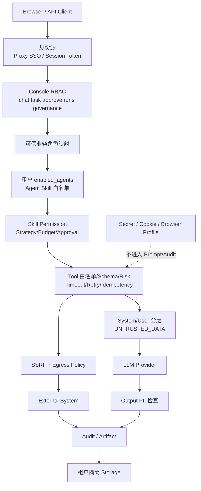
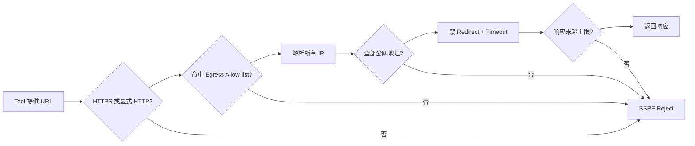
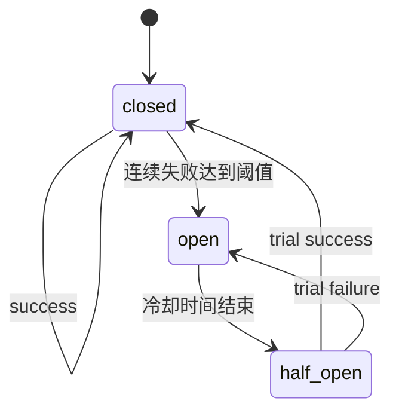

# 安全、多租户与可靠性

## 1. 本章定位

AgentKit 的安全模型不是一条“系统提示词”，而是一组独立、可测试、默认拒绝的边界。LLM 只能在这些边界内做局部决策，不能授予身份、修改白名单、扩大网络出口或绕过审批。

本章覆盖：

- Web 身份、Console RBAC 与业务角色。
- Agent、Skill、Tool、Context 和网络纵深防御。
- Conversation、Memory、RAG、Artifact、Audit、Checkpoint、幂等和浏览器状态的租户隔离。
- 超时、有限重试、限流、熔断、Failover 和并发边界。
- 单机本地部署与企业多实例部署的差异。

## 2. 纵深防御模型



任意一层允许不代表下一层自动允许。例如：用户有 `task:run` 只表示可调用 Task API，不表示拥有 `content.publish`；Skill 被 Agent 允许，也不表示其副作用 Tool 已经人工批准。

## 3. 身份来源

Web 层按配置解析 `Principal`：

1. **开发模式**：`web_auth_disabled=true` 时创建合成 Admin，仅适合本地开发。
2. **可信反向代理**：推荐生产方案；由 OIDC/SAML Proxy 或 API Gateway 认证，再转发可配置的用户、邮箱和角色 Header。
3. **共享 Token Session**：适合受控小规模管理 Console，不替代企业 SSO。
4. **匿名**：未建立身份时，受保护接口默认拒绝。

生产启用代理 Header 的前提是 AgentKit 只能从可信反向代理访问，并由代理清除客户端伪造的同名 Header。直接把应用暴露到公网会让 Header 信任模型失效。

## 4. Web Console RBAC

[`Principal`](../../src/agentkit/core/identity.py) 的 Console Role 映射到平台权限：

| 权限 | 典型接口 |
| --- | --- |
| `chat:use` | Chat、Conversation、Retry/Delete |
| `task:run` | 显式 Task 执行与流式执行 |
| `task:approve` | Approval Resume/Reject |
| `runs:view` | Run 列表与详情 |
| `governance:view` | 治理和 Registry 视图 |
| `runtime:admin` | Runtime Reload 等管理操作 |

`require_permission()` 在视图入口返回 403，不把权限判断交给前端隐藏按钮。默认 Role：

- `admin`：全部权限。
- `operator`：执行、审批、聊天、治理和 Run 查看。
- `member`：执行、聊天和 Run 查看。
- `viewer`：只看治理与 Run。

可通过配置覆盖映射，但未知权限和越权组合应在部署审查中拒绝。

## 5. 可信业务角色

Console Role 与业务 Role 是不同层：

- Console Role 回答“能否调用平台接口”。
- 业务 Role 回答“能否读取候选人、查询订单或发布内容”。

Chat/Task 请求中的 `roles` 不能被直接信任。Web 入口按以下来源生成业务角色：

1. 已认证 Principal 的 `claims.business_roles`。
2. 租户 `principal_business_roles` 映射。
3. Principal Role 与租户已知业务 Role 的交集。
4. 受控 UI Default（仅部署配置中的已知 Role）。

客户端提交的 Role 被记录为 `ignored_payload_roles`，不进入 `TaskRequest.roles` 的可信授权集合。

## 6. 业务 RBAC 与 Skill Policy

租户配置通过 `role_permissions` 把业务 Role 映射到细粒度 Permission。例如：

```json
{
  "recruiter": ["hr.job.read", "hr.candidate.read"],
  "growth_manager": ["content.research", "content.write", "content.publish"],
  "support_agent": ["order.read", "logistics.read", "refund.write"]
}
```

`PolicyGuard` 合并当前请求所有可信业务 Role 的 Permission，并检查 Skill 声明的 `permissions`：

- 缺少任意 Permission：拒绝 Skill。
- Permission 满足：继续检查是否需要审批。
- Approval 只解除“等待人工确认”，不补发缺失 Permission。

这是 RBAC，不是基于模型判断的推荐规则。

## 7. Agent、Skill 与 Tool 白名单

### 7.1 租户 Agent

`tenants/<selector>.json` 的 `enabled_agents` 决定该租户可加载哪些 Agent。`agent_directory` 只提供显示名和 Alias，不会注册一个未启用 Agent。

### 7.2 Agent Skill

每个 `agent.md` 的 Skill 列表是 Agent Capability 白名单。自动路由或 `@Agent` 不能选择目标 Agent 未绑定的 Skill。

### 7.3 Skill Tool

每个 Capability 只暴露自己的 Tool 列表。ToolExecutor 再检查：

1. Tool 是否在当前执行白名单。
2. Tool Permission 是否包含在可信授权集合。
3. Tool Policy 是否允许无副作用/副作用类型。
4. 输入是否符合 JSON Schema。
5. Side Effect 是否得到显式批准。
6. 幂等键是否安全。

MCP Tool 仍经过同一个 ToolExecutor；换成 MCP Backend 后，上层治理保持不变。

## 8. Content Safety

[`ContentSafetyGuard`](../../src/agentkit/core/safety.py) 提供依赖无关的启发式纵深防御：

- Prompt Injection 特征检测。
- Email、SSN、信用卡、IP 和常见 Secret Pattern 检测。
- PII 脱敏。
- 可插拔 Moderation Provider。

输入决策：

| Action | 含义 |
| --- | --- |
| `allow` | 无发现或 Safety 关闭 |
| `flag` | 有发现，允许继续并审计 |
| `block` | 配置为阻止且命中高严重度 Injection/Moderation |

默认 `safety_block_on_injection=false` 偏向 Flag，避免启发式规则误伤；高风险生产租户可以打开 Block，但必须用业务语料评估误报/漏报。

Safety 不是完整内容合规系统。正则漏检、变形攻击和多语言语义仍需 Context 隔离、业务 Review、权限、审批和外部 Moderation 共同防御。

## 9. Prompt Injection 边界

Prompt Injection 的核心防线不是正则，而是数据与指令分层：

- 安全 Fragment、节点规则、Agent/Skill 指令只进入 System。
- 用户输入、Memory、RAG、Tool Observation 只进入 `UNTRUSTED_DATA` User 区。
- Source Registry 决定每个 Context Pack 能读取哪些动态输入。
- 输出使用 JSON Schema 和业务状态机校验。
- Tool 名称、Permission 和审批集合由代码提供，模型不能创造权限。
- 不记录或依赖隐藏思维链。

详细装配规则见 [LLM Context 装载与治理](05_CONTEXT_ENGINEERING_AND_GOVERNANCE.md)。

## 10. Web 安全基线

[`configure_security()`](../../src/agentkit/web/security.py) 提供：

- Token 常量时间比较。
- Session 登录和 CSRF Token。
- `HttpOnly`、`SameSite=Strict`、可配置 `Secure` Cookie。
- CSP、`X-Frame-Options=DENY`、`nosniff`、No-Referrer 和 `Cache-Control: no-store`。
- 未配置身份源时保护接口 Fail Closed（503），而不是自动匿名 Admin。
- 登录错误不暴露服务端是否配置 Token。

未设置 `AGENTKIT_WEB_SECRET_KEY` 时会使用临时 Secret，重启后 Session 失效；生产必须配置稳定 Secret。`web_auth_disabled` 只能用于隔离的本地环境。

## 11. SSRF 与网络出口

外部 HTTP Tool 应使用 [`safe_request()`](../../src/agentkit/core/net.py)。应用层 Egress Policy 检查：

- 默认只允许 HTTPS；HTTP 必须显式打开。
- 可选 Domain Allow-list，支持精确域和子域。
- DNS 解析结果必须全部是公网地址。
- 阻止 Private、Loopback、Link-local、Multicast、Reserved 和 Unspecified IP。
- 禁止自动 Redirect，避免跳转绕过首个 Host 检查。
- 请求 Timeout 与响应大小上限。



应用层检查必须与 Kubernetes NetworkPolicy、云防火墙、Proxy Allow-list 等基础设施出口控制配合。DNS Rebinding、高权限代理和未使用 `safe_request` 的自定义 Connector 仍需代码审查。

## 12. Secret 管理

Secret 包括 LLM Key、Web Token、Session Secret、MCP 凭据、Cookie、浏览器 Profile 和外部系统 Token。

原则：

- 通过环境变量、Secret Manager 或挂载文件注入，不写入 Agent/Skill/Context 文档。
- Pydantic `SecretStr` 避免普通配置打印泄漏。
- Context Dynamic Dict 对包含 `secret/token/password/credential/cookie/authorization` 的 Key 脱敏。
- Audit 记录稳定摘要、Hash 和错误 Code，不记录完整 Header、Cookie、图片 Base64 或上游原始响应。
- 浏览器 Profile 权限最小化，备份/复制视同凭据操作。
- MCP Server 的环境变量与进程权限按租户隔离。

仓库中的 `.env.example` 只放占位与非敏感默认值；真实 `.env` 不应提交 Git。

## 13. 多租户配置模型

启动时 `resolve_tenant_id()` 选择 `tenants/<selector>.json`，并区分：

- `tenant_selector`：配置文件和 Context Override 目录选择器，例如 `company_alpha`。
- `tenant_id`：配置内部稳定业务租户键，例如 `AI-ABC`。

Runtime Manifest 保存租户配置 Path 和 SHA-256、启用 Agent、Context Manifest 等，便于审计当前装配版本。

租户配置控制：Agent 启用、Alias、UI 默认值、Role Permission、Principal Role 映射、Context Override、业务配置和 MCP Server。它不是用户请求可修改的数据。

## 14. 多租户数据隔离矩阵

| 资产 | 主要隔离键 | 当前后端/位置 | 主要泄漏风险 |
| --- | --- | --- | --- |
| Tenant Config | `tenant_selector` + 内部 `tenant_id` | `tenants/*.json` | 选错 Runtime、配置目录可写 |
| Conversation/Message/Summary | `tenant_id + agent + user_id + conversation_id` | SQLite/PostgreSQL | 只按 Conversation ID 查询 |
| 长期 Memory | `tenant_id + agent_id + user_id` | SQLite/PostgreSQL/pgvector | 跨 Agent 或 User 检索 |
| RAG Knowledge | `tenant_id + collection + acl_roles` | Chroma/Memory | 共享 Collection 无租户过滤、ACL 漏检 |
| Artifact | `tenant_id + run_id + artifact_id` | SQLite/PostgreSQL | 只凭 Artifact ID 读取 |
| Audit | `tenant_id + run_id` | SQLite/PostgreSQL | 管理查询忘记 Tenant Filter |
| Checkpoint | Tenant Runtime 的 Checkpoint DB + `thread_id` | SQLite Checkpointer | 多租户共库时 Thread 猜测/误路由 |
| Idempotency | `tenant_id + tool_name + idempotency_key` | SQLite/PostgreSQL | 不含 Tenant 导致结果串用 |
| Browser Profile | 配置根目录 + Site Key；Runtime 路径需按租户隔离 | 本地目录/挂载卷 | Cookie/Profile 被其他租户或 Worker 复用 |
| MCP 配置 | 租户 `mcp_servers` + Tool Manifest Server | 租户 JSON + 子进程 | 共享凭据、Server Command 越权 |

SQLite 默认 Runtime 会按租户选择主数据库与 Checkpoint 文件；PostgreSQL 查询仍必须显式使用 Tenant Filter。逻辑隔离不等于基础设施隔离，高敏感租户可采用独立数据库、密钥和 Worker。

## 15. 浏览器与 Profile 安全

Playwright Persistent Profile 包含登录态，安全级别等同 Cookie/Token。当前 Browser Lifecycle 对同一 Profile Path 使用进程内 Lock，防止单进程并发打开同一 Profile。

企业部署需额外保证：

- Profile 路径包含租户和账号维度。
- 同一 Profile 同时只由一个 Worker 持有。
- 挂载卷权限和备份加密。
- 人工登录窗口与服务器 Headless Worker 的职责明确。
- Browser Worker 运行在低权限容器/主机，不与核心 API 共享高权限文件系统。
- CAPTCHA/短信验证只允许人工完成，不做绕过自动化。

进程内 Lock 不能协调多主机；共享 Profile 也不适合多个 Chromium 进程并发写。远程专用 RPA Worker 属于演进方向，见 [ROADMAP](ROADMAP.md)。

## 16. LLM 限流

`build_rate_limiter()` 支持：

| Backend | 范围 | 适用场景 | 限制 |
| --- | --- | --- | --- |
| `process` | 单进程 | 本地开发、单 Worker | 多 Worker 有各自 Bucket，总 RPS 被放大 |
| `sqlite` | 同一主机/共享文件 | 单机多 Worker | 不适合多主机共享文件系统 |

SQLite Token Bucket 用 `BEGIN IMMEDIATE` 原子补充和消费；锁冲突视为暂未获得 Token并按检查间隔重试。

多主机生产需要 Redis/API Gateway/Provider 级限流等共享后端。当前代码保留 `build_rate_limiter` 扩展缝，但未内置 Redis Backend。

## 17. 熔断与 LLM Failover

`FailoverProvider` 按配置顺序尝试 Provider，每个 Provider 有独立的线程安全 Circuit Breaker：



- 异常或空输出计为失败。
- Open Provider 被跳过。
- 全部失败时抛 `LLMRequiredError`，不伪造答案。
- 非流式调用可切换到下一个 Provider。
- 流式调用只允许在首个 Chunk 前 Failover；已经向用户发送 Token 后失败必须上抛，避免重复输出。

Circuit Breaker 状态在进程内，不在多个 Worker/主机间共享。Failover Provider 还可能有模型能力、价格和数据驻留差异，必须使用相同输出契约并经过 Eval。

## 18. Tool 超时与有限重试

ToolExecutor 对每次调用应用 Tool Override 或全局 Timeout，并仅在安全条件下重试：

- Tool 声明 `idempotent=true`；或存在受控幂等键且没有持久账本冲突。
- 最多 `tool_max_retries + 1` 次。
- 指数退避。
- 每次尝试记录 Audit，最终失败归一化。

非幂等副作用默认只执行一次。`outcome_unknown` 禁止重试，必须外部对账。

当前同步 Tool 通过 ThreadPool Future 实现 Timeout：Future 超时会解除主 Run 等待，但 Python 无法强杀已开始的线程。Connector 必须自身设置网络/浏览器 Timeout，超时后仍在后台运行的 Handler 不能假定已取消。

## 19. Batch、Parallel 与并发池

| 模式 | 当前语义 | 安全边界 |
| --- | --- | --- |
| Batch | 一个 Capability，按 `batch_size` 顺序分片 | 当前不是并行；适合限流和内存控制 |
| Parallel | 多个无依赖 Capability，ThreadPool 并发 | 禁止副作用 Capability；Worker 数取任务数与 `max_concurrency` 最小值 |
| Tool Pool | 共享 ThreadPool 执行有 Timeout 的 Handler | 进程级资源，不能强杀超时线程 |

不要因为“任务多”就自动选择 Parallel。存在数据依赖、共享 Profile、共享事务或顺序副作用时必须使用 Workflow/Plan 的显式依赖关系。

## 20. 降级语义

| 组件失败 | 安全降级 | 不能做的事 |
| --- | --- | --- |
| 主 LLM | 熔断后切备用 Provider | 输出空文本当成功 |
| RAG Rewrite/Rerank | 原 Query/原排序 | 编造未召回证据 |
| Memory 写回 | 主任务完成，记录/忽略辅助失败 | 回滚已经完成的业务 |
| OCR 为 `none` | `skipped` | 隐式调用未知多模态服务 |
| 外部 Tool Timeout | 已知安全时有限重试 | 重试非幂等副作用 |
| 发布回执不确定 | `outcome_unknown` + 对账 | 直接再次发布 |
| Checkpoint Context 变化 | 拒绝 Resume | 绕过 Hash |
| 身份源未配置 | Web 受保护接口 Fail Closed | 自动匿名 Admin |

降级结果必须可观察，并在用户响应中区分“已完成”“未完成”“需要操作”和“结果未知”。

## 21. 单机本地与企业多实例

### 21.1 单机个人使用

可接受组合：

- SQLite 主存储、Checkpoint、Idempotency。
- SQLite 或进程级 LLM 限流。
- 本地持久浏览器 Profile。
- 单个 Web 进程或有限 Worker。
- Ollama/本地模型。

仍需配置 Web Token/Secret、备份数据目录、限制网络出口并保护 Browser Profile。

### 21.2 企业多实例生产

必须补齐：

- PostgreSQL 等共享事务存储和连接池。
- 多主机共享限流后端。
- Checkpoint 高可用与备份恢复。
- Artifact 对象存储或共享持久化策略。
- 独立 Browser/RPA Worker、调度和 Profile Lease。
- 集中 Secret Manager、OIDC/SAML、审计保留和密钥轮换。
- OTel/Metrics/Log 集中采集。
- 多实例幂等、取消、队列和对账机制。
- 生产压力测试和租户隔离测试。

“Docker 能启动”只证明镜像依赖可装配，不等于浏览器可见、Profile 可持久、数据库可高可用或多主机并发安全。

## 22. 安全与可靠性检查清单

### 上线前

- [ ] Web Auth 未关闭，生产 Cookie Secure。
- [ ] 代理 Header 只能由可信 Proxy 注入。
- [ ] Console RBAC 与业务 Role 映射最小化。
- [ ] Tenant 只启用需要的 Agent/Skill/MCP。
- [ ] Side Effect 有 Permission、Approval 和 Idempotency。
- [ ] Context Pack 通过 Golden 和 Prompt Injection 测试。
- [ ] Egress Allow-list 与基础设施网络策略一致。
- [ ] Secret 不在 Git、Prompt、Audit 或普通日志。
- [ ] Storage、Checkpoint、Browser Profile 有备份和访问控制。
- [ ] 限流、Timeout、熔断和 Failover 已在目标拓扑验证。
- [ ] 生产 Eval、压测和故障演练通过。

### 事件响应

- [ ] 从 `tenant_id + run_id` 定位父子 Run。
- [ ] 冻结相关幂等键和高风险 Tool。
- [ ] 检查是否为 `outcome_unknown` 并外部对账。
- [ ] 保存 Audit/Artifact/Trace，避免先删证据。
- [ ] 轮换可能泄漏的 Secret/Profile。
- [ ] 将真实失败补充为测试和 Eval Case。

## 23. 源码入口与测试证据

| 能力 | 源码 | 测试 |
| --- | --- | --- |
| Web Auth/CSRF/Header | [`web/security.py`](../../src/agentkit/web/security.py) | [`test_web_auth.py`](../../tests/integration/test_web_auth.py) |
| Principal/Console RBAC | [`web/identity.py`](../../src/agentkit/web/identity.py) | [`test_rbac.py`](../../tests/integration/test_rbac.py) |
| Skill Permission | [`core/policy.py`](../../src/agentkit/core/policy.py) | [`test_rbac.py`](../../tests/integration/test_rbac.py) |
| Safety | [`core/safety.py`](../../src/agentkit/core/safety.py) | [`test_safety_api.py`](../../tests/integration/test_safety_api.py) |
| SSRF/Egress | [`core/net.py`](../../src/agentkit/core/net.py) | [`test_net.py`](../../tests/unit/test_net.py) |
| LLM 熔断/Failover | [`llm/resilient.py`](../../src/agentkit/llm/resilient.py) | [`test_resilient.py`](../../tests/unit/test_resilient.py) |
| LLM 限流 | [`llm/rate_limit.py`](../../src/agentkit/llm/rate_limit.py) | [`test_rate_limit.py`](../../tests/unit/test_rate_limit.py) |
| Tool Timeout/Retry | [`core/tool_executor.py`](../../src/agentkit/core/tool_executor.py) | [`test_tool_executor.py`](../../tests/unit/test_tool_executor.py) |

## 24. 面试表达

> AgentKit 的安全不是依赖模型“听话”。入口先做身份与 Console RBAC，业务 Role 只从可信 Principal 映射，客户端提交 Role 被忽略；租户再限制 Agent，Agent 限制 Skill，Skill 限制 Tool，ToolExecutor 强制 Permission、Schema、Risk、Approval、Timeout 和 Idempotency。动态数据只进入不可信 User Context，网络出口做 SSRF/Egress 控制，存储按 tenant_id 和业务作用域过滤。稳定性侧有有限重试、限流、熔断和 Provider Failover，但我们明确区分单进程、单机多 Worker 和多主机能力；例如 SQLite 限流与浏览器 Profile Lock 都不是集群协调方案。

## 25. 当前限制与演进方向

- Safety Injection/PII 检测是启发式，不是完备分类器。
- `safe_request()` 是应用层工具，未自动拦截所有第三方库网络调用。
- Circuit Breaker 只在单进程共享；SQLite Rate Limiter 只适合同一主机共享文件。
- 默认 Checkpoint 和 Browser Profile 偏单机，缺少多主机 Lease/调度。
- MCP 当前只支持租户配置的 Stdio Server，凭据隔离依赖进程环境。
- Parallel 使用线程池，不是分布式队列。
- 没有内置远程沙箱、分布式取消和跨区域灾备。

对应演进项必须标记为未实现，并集中记录在 [ROADMAP](ROADMAP.md)。
