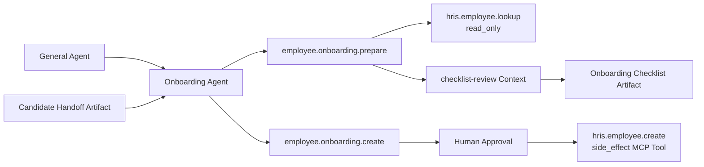
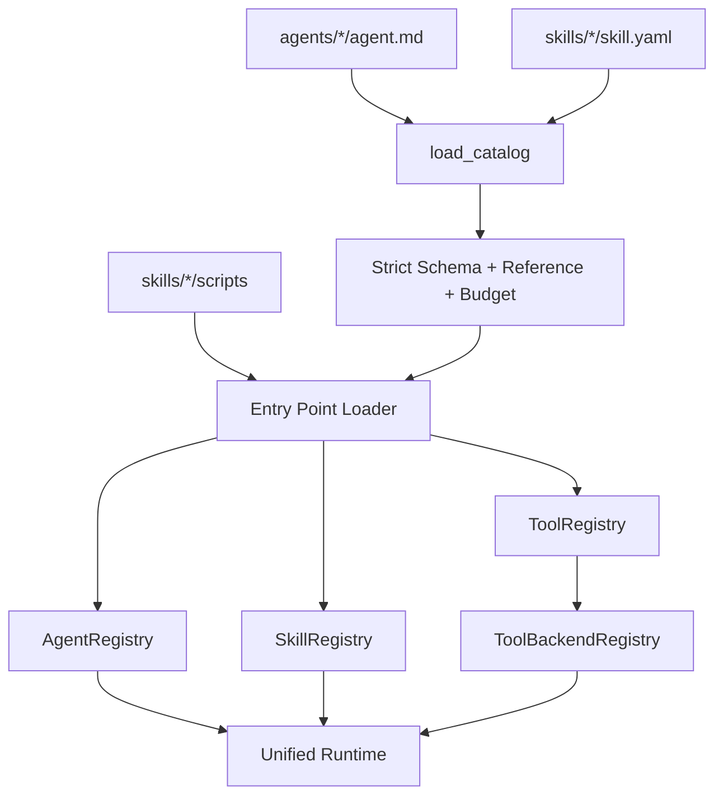

# 框架扩展开发指南

## 1. 本章定位

AgentKit 的扩展原则是“声明优先、契约稳定、治理复用”。新增业务不应复制一套 Runtime，而应组合：

```text
Agent Manifest
  → Skill Package / Capability
    → Python Tool 或 MCP Tool
      → Context Pack / Provider
        → 统一 Runtime、治理、审计和测试
```

本章提供新增 Agent、Skill、Tool、Context Pack、Provider 和 Execution Strategy 的操作清单，并用“入职 Agent + 员工资料 Skill + HRIS Tool”给出完整示例。

## 2. 扩展前先判断放在哪一层

| 需求 | 推荐扩展点 | 不推荐做法 |
| --- | --- | --- |
| 新的长期业务职责、权限域和上下文域 | Agent | 为每个小动作建 Agent |
| 可复用业务能力或 Workflow | Skill/Capability | 把流程写进 Agent Prompt |
| 对外系统/API/脚本调用 | Tool + Provider/Connector | 在 LLM 节点直接发 HTTP |
| 某个 LLM 节点的模板、输入、Schema | Context Pack | 把所有 Prompt 塞入 `agent.md` |
| 替换存储/OCR/媒体/Tool 执行实现 | Provider/Backend | 修改所有业务 Handler |
| 新的通用推理/编排状态机 | Execution Strategy | 把业务特例注册为全局策略 |
| 只改变一个租户的可用能力或措辞 | Tenant Config/Override | Fork 整套代码 |

判断是否需要新 Agent 的三个问题：

1. 是否有独立业务责任人或权限边界？
2. 是否需要独立长期 Memory/RAG/Artifact 作用域？
3. 是否需要与其他业务 Agent 独立评估和治理？

若都是否，优先新增 Skill，而不是 Agent。

## 3. 扩展生命周期


每一步都应能独立失败并给出明确错误，避免把声明错误拖到运行时 LLM 调用后才发现。

## 4. 脚手架命令

```powershell
agentkit new-tenant company_beta
agentkit new-agent onboarding_agent
agentkit new-skill employee-onboarding
```

生成位置：

```text
tenants/company_beta.json
agents/onboarding_agent/agent.md
skills/employee-onboarding/
├── SKILL.md
├── skill.yaml
└── scripts/
    └── __init__.py
```

注意：Skill 脚手架只生成声明和 Python 包骨架，`skill.yaml` 中默认的 `scripts.handlers:run` 仍需开发者创建对应文件/函数。这是占位契约，不是可直接运行的业务实现。

## 5. 新增 Agent

### 5.1 最小文件

`agents/<agent-id>/agent.md` 必须使用 YAML Front Matter，并包含非空正文：

```markdown
---
id: onboarding_agent
domain: hr.onboarding
description: 新员工资料收集、校验与入职流程协调 Agent。
skills: [employee.onboarding.prepare]
context:
  memory:
    enabled: true
    scope: agent_user
    window_turns: 6
    max_context_tokens: 4000
    retrieval_k: 4
  rag:
    enabled: true
    collections: [hr-policy, onboarding-handbook]
    top_k: 5
    max_context_tokens: 1200
  artifacts:
    readable: [candidate-handoff]
    writable: [onboarding-checklist]
execution:
  default_strategy: workflow
  allowed_strategies: [direct, workflow, plan_execute]
  allow_dynamic_selection: true
  allow_side_effects: true
autonomy:
  max_model_calls: 10
  max_tool_calls: 12
  max_iterations: 8
  max_plan_steps: 8
  max_replans: 1
  max_tokens: 24000
  timeout_seconds: 300
routing_keywords: [入职, 新员工, onboarding]
---

# 入职 Agent

只处理当前租户的新员工入职资料与流程；不得读取招聘评估原始资料，
除非通过明确的候选人交接 Artifact 获得授权字段。
```

### 5.2 字段检查

| 区域 | 必查内容 |
| --- | --- |
| Identity | `id/domain/description` 稳定且无重复 |
| Skills | 每个 Capability 都存在，最小授权 |
| Memory | 是否真的需要跨会话记忆；固定 `scope=agent_user` |
| RAG | 只声明业务需要的 Collection |
| Artifact | Read/Write Kind 明确，不用 `*` |
| Strategy | Default 必须在 Allowed 中 |
| Side Effect | 有副作用时显式允许，Skill/Tool 仍需审批 |
| Budget | 不超过全局预算，且覆盖绑定 Skill 上限 |
| Prompt | 正文写业务边界，不写脚本实现或 Secret |

### 5.3 租户启用与 Alias

在租户配置中显式加入：

```json
{
  "enabled_agents": ["general_agent", "onboarding_agent"],
  "agent_directory": {
    "onboarding_agent": {
      "label": "入职 Agent",
      "aliases": ["入职", "Onboarding", "新员工"]
    }
  }
}
```

`enabled_agents` 必须是非空白名单；引用未知 Agent 会在启动时失败。Alias 只帮助 General 路由和 UI，不扩大 Skill/Permission。

### 5.4 测试清单

- [ ] Manifest 严格解析，额外字段被拒绝。
- [ ] 未启用租户无法路由到该 Agent。
- [ ] `@入职` 只影响当前消息。
- [ ] 未绑定 Skill 返回 Capability Denied。
- [ ] Memory/RAG 使用目标 Agent 作用域。
- [ ] Budget 不超过全局，Skill 不超过 Agent。
- [ ] 父子 Run 和委派 Audit 可追溯。

## 6. 何时不应新增 Agent

以下情况通常只需 Skill/Tool：

- 同一业务域内增加一个查询动作。
- 只新增一个外部 API。
- 只修改 Prompt 或输出格式。
- 只为一个固定 Workflow 增加步骤。
- 只需要不同执行策略，不需要独立身份/权限/记忆。
- 为了“看起来是 Multi-Agent”而拆分 Router、Intent、Planner、Reviewer。

Intent、Capability Resolver、Planner 和 Review Node 是 Runtime 角色，不是业务 Agent。

## 7. 新增 Skill Package

### 7.1 目录结构

```text
skills/employee-onboarding/
├── SKILL.md                 # 渐进式披露的业务说明
├── skill.yaml               # 可执行声明
└── scripts/
    ├── __init__.py
    ├── handler.py           # Capability Handler/Workflow
    ├── tools.py             # 简单 Python Tool
    ├── providers.py         # 外部系统适配装配
    └── connectors.py        # HTTP/SDK/RPA 边界（按需）
```

`scripts/` 是本框架可跨 Codex/Claude Code 等环境共享的 Skill 实现载体，但 `skill.yaml`、Runtime Context、Tool Governance 是 AgentKit 的企业运行契约。

### 7.2 SKILL.md

写：目标、适用条件、业务流程、输入含义、输出、风险、证据和失败语义。

不写：Secret、部署地址、租户真实数据、可绕过权限的操作指南或与 `skill.yaml` 冲突的执行字段。

### 7.3 Capability 最小声明

```yaml
package_id: employee-onboarding
tools: []
capabilities:
  - id: employee.onboarding.prepare
    domain: hr.onboarding
    description: 校验新员工资料并生成入职清单。
    entrypoint: scripts.handler:run
    execution:
      reasoning: direct
      orchestration: workflow
      tool_policy: read_only
      allow_dynamic_selection: false
    autonomy:
      max_model_calls: 4
      max_tool_calls: 6
      max_iterations: 4
      max_plan_steps: 4
      max_replans: 0
      max_tokens: 8000
      timeout_seconds: 90
    permissions: [hr.employee.read]
    tools: [hris.employee.lookup]
    input_schema:
      type: object
      required: [candidate_id]
      properties:
        candidate_id: {type: string, minLength: 1}
        start_date: {type: string, format: date}
    output_schema:
      type: object
      required: [status, checklist]
      properties:
        status: {type: string}
        checklist: {type: array}
    keywords: [入职, 新员工, onboarding]
```

### 7.4 Execution 三个正交维度

| 字段 | 可选值 | 含义 |
| --- | --- | --- |
| `reasoning` | `direct/react/plan_execute` | 谁决定下一步 |
| `orchestration` | `single/workflow/batch/parallel` | 如何组织任务 |
| `tool_policy` | `none/read_only/governed/side_effect` | Tool 风险上限 |

不要把 `workflow` 当成 LLM 调用模式；Handler 内部是否调用 Context LLM 由业务实现决定。

### 7.5 组合 Capability

Workflow 可以用 `composes` 声明复用其他 Capability。约束：

- 只有 `orchestration=workflow` 可声明。
- 不得包含自身。
- 不得重复。
- 引用必须存在。

组合是可执行依赖，不代表 Agent 自动获得被组合 Capability；仍需在租户/Agent/权限和 Runtime 验证中检查。

### 7.6 测试清单

- [ ] `skill.yaml` Pydantic Strict Model 通过。
- [ ] Capability/Tool ID 全局不重复。
- [ ] Entry Point 在本 Package 的 `scripts/` 内。
- [ ] Handler 可调用且返回 Object。
- [ ] Input/Output Schema 有正常、缺失和非法样本。
- [ ] Permission Denied 与 Approval Path 有测试。
- [ ] Review/修订预算有上限。
- [ ] Tool/LLM/Token/Timeout Budget 有边界测试。
- [ ] Eval 覆盖成功、澄清、失败和越权。

## 8. 新增 Python Tool

### 8.1 声明

```yaml
tools:
  - id: hris.employee.lookup
    provider: python
    description: 按候选人编号读取已授权的入职资料。
    entrypoint: scripts.tools:lookup_employee
    risk: read_only
    permissions: [hr.employee.read]
    input_schema:
      type: object
      required: [candidate_id]
      properties:
        candidate_id: {type: string, minLength: 1}
    idempotent: true
    timeout_seconds: 15
```

### 8.2 Handler

```python
def lookup_employee(args: dict[str, object]) -> dict[str, object]:
    candidate_id = str(args["candidate_id"])
    return {"candidate_id": candidate_id, "status": "ready"}
```

Handler 必须返回 Dict。网络、数据库和 SDK 细节放 Connector/Provider；Tool Handler 负责契约转换、错误归一化和业务字段最小化。

### 8.3 工厂 Entry Point

需要租户配置或共享 Client 时，可使用 `factory_entrypoint`。工厂接收 Tenant Config，并返回 `{tool_id: callable}`。同一工厂在 Package 内缓存一次，避免为每个 Tool 重复创建 Client。

### 8.4 风险与幂等

- `read_only`：无外部副作用，可在安全条件下重试。
- `governed`：需要额外规则或敏感数据控制。
- `side_effect`：必须与 Agent/Skill Policy、Permission、Approval 和 Idempotency 一起设计。
- `idempotent=true` 只在业务上确实等价时声明；不要为了获得自动重试而伪造幂等。

### 8.5 测试清单

- [ ] Schema 拒绝多余/缺失/错误类型参数。
- [ ] Tool 白名单和 Permission 生效。
- [ ] Timeout 和可重试异常有确定语义。
- [ ] Side Effect 使用稳定幂等键。
- [ ] `outcome_unknown` 不自动重试。
- [ ] Audit 不记录 Secret 和完整敏感 Payload。

## 9. 新增 MCP Tool

Tool 声明保持 AgentKit 的稳定 ID，只替换执行 Backend：

```yaml
tools:
  - id: hris.employee.create
    provider: mcp
    description: 在 HRIS 创建已审批的新员工记录。
    server: hris
    tool: create_employee
    risk: side_effect
    permissions: [hr.employee.write]
    input_schema:
      type: object
      required: [employee, idempotency_key]
      properties:
        employee: {type: object}
        idempotency_key: {type: string, minLength: 8}
    idempotent: true
    timeout_seconds: 30
```

租户配置：

```json
{
  "mcp_servers": {
    "hris": {
      "transport": "stdio",
      "command": "python",
      "args": ["-m", "company_hris_mcp"]
    }
  }
}
```

当前 Runtime 只内置 Stdio MCP。每次调用创建并关闭 Session；MCP 结果必须是 Object，错误统一为 `ToolBackendError`。

保持 `hris.employee.create` 不变，可以以后把 Python 实现换成 MCP，而 Agent、Skill、Permission、Approval、Schema、Audit 和 Eval 不需要改变。

### MCP Tool 测试清单

- [ ] 缺失 Server 配置时启动失败。
- [ ] 未安装 MCP Extra 时给出明确依赖错误。
- [ ] 远端 Tool 名与本地稳定 Tool ID 分离。
- [ ] Structured Content 和普通 Content 都有适配测试。
- [ ] MCP Error 不被包装成成功 Dict。
- [ ] Side Effect 仍通过 ToolExecutor 和 Idempotency。

## 10. 新增 Context Pack

### 10.1 何时需要

只要新增或修改一个生产 LLM 节点，就应创建/修改 Context Pack，而不是在 Handler 内拼接匿名字符串。

- Runtime Pack：路由、输入解析、Planner、ReAct、Memory、RAG 等通用节点。
- Business Pack：某个 Skill 的生成、审核、摘要等节点。

### 10.2 目录

```text
contexts/business/employee-onboarding/checklist-review/
├── context.yaml
├── system.md
├── user.md
└── output.schema.json
```

### 10.3 最小声明

```yaml
id: skill.employee-onboarding.checklist-review
version: 1
owner: skill
owner_skill: employee.onboarding.prepare
templates:
  system: system.md
  user: user.md
fragments: [json-only, evidence-policy]
instructions:
  agent: true
  skill: true
inputs:
  - name: checklist
    source: skill.onboarding_checklist
    required: true
    priority: 100
    serializer: canonical_json
    max_chars: 12000
  - name: policy
    source: skill.onboarding_policy
    required: false
    priority: 60
    max_items: 5
    max_chars: 6000
exclude: [secrets, tool_credentials, employee.raw_documents]
limits:
  max_input_tokens: 7000
  response_reserve_tokens: 1000
output:
  mode: json
  schema: output.schema.json
audit:
  record_input_names: true
  record_content_hashes: true
  record_rendered_content: false
```

### 10.4 Source 与安全

- 新 Source（示例中的 `skill.onboarding_policy`）必须先在 `ContextSourceRegistry` 显式注册。
- Security Fragment 仍由 Assembler 强制注入。
- Dynamic Data 只进 User `UNTRUSTED_DATA`。
- 输出 JSON 必须有 Schema。
- 租户 Override 只允许 System/User 文本，不得改 Source、Schema 或 Budget。

### 10.5 变更流程

```powershell
agentkit --tenant company_alpha validate-contexts
python -m pytest tests/unit/test_context_golden.py -q
agentkit --tenant company_alpha eval evaluation/datasets/golden.jsonl --target gateway-trace
```

更新 Golden 时必须人工检查 System/User 分层、输入名单、裁剪、Schema 和 Hash 变化。

## 11. 新增 Provider

Provider 用于替换实现，不改变上层业务契约。

| Provider 类型 | 契约/Registry | 必须保证 |
| --- | --- | --- |
| Embedding | `EmbeddingProvider` | 稳定 Name/Dim、批量 Embed、持久向量兼容 |
| OCR | `OcrProviderRegistry` | `none` 硬关闭、错误不泄漏图片/响应 |
| Media Understanding | `MediaUnderstandingRegistry` | Asset→Evidence 可追溯、只读媒体 |
| Memory Vector Store | `VectorStore` | Scope 强制隔离、相似度语义一致 |
| RAG Store/Retriever | `KnowledgeStore/Retriever` | Tenant/ACL/Filter 强制执行 |
| Tool Backend | `ToolExecutionBackend` | 只负责执行，不绕过 ToolExecutor |
| LLM | `LLMProvider` | Complete/Stream/Usage、Timeout、结构化输出兼容 |

### Provider 实现步骤

1. 实现最小 Protocol。
2. 定义稳定 Provider ID。
3. 在 Runtime Builder/Registry 显式注册 Factory。
4. 配置只读取允许字段，Secret 使用安全类型。
5. 统一返回标准结果，不向上泄漏 SDK 对象。
6. 明确 Disabled/Skipped/Failed 语义。
7. 增加 Contract Test、错误脱敏和并发测试。
8. 更新 `.env.example` 与部署文档。

### Provider 测试清单

- [ ] 未配置时 Fail Closed 或明确 `skipped`。
- [ ] Provider ID 与 Factory 返回 ID 一致。
- [ ] Timeout、空结果、非法响应、超限输入可预测。
- [ ] 多租户 Scope 和 Secret 不泄漏。
- [ ] 与上层 Context/Tool/Artifact 契约兼容。
- [ ] 替换前后跑同一 Eval Dataset。

## 12. 新增 Execution Strategy

### 12.1 何时需要

只有出现可跨业务复用、现有六类策略无法表达的通用状态机时才新增。例如真正的长期异步 Saga，而不是“某个 Skill 多了两个步骤”。

现有策略：`direct/workflow/batch/parallel/react/plan_execute`。多数业务应在这些策略内组合 Skill。

### 12.2 契约

实现 `ExecutionStrategy`：

- 稳定 `name`。
- `execute(context, request) -> StrategyResult`。
- 使用 `ExecutionContext` 的受治理 Invoker、Artifact、Context Invoker 和 Budget。
- 不直接实例化未授权 Tool/LLM Client。
- 返回明确 Status、Output、Artifact References 和 Metrics。

然后在 `StrategyRegistry` 与 Runtime Builder 注册，并扩展：

- `ExecutionStrategyName` 枚举。
- Agent Allowed Strategy 校验。
- Strategy Selector 规则。
- Budget/失败/审批语义。
- Unit、Integration、Trajectory Eval 和文档。

### 12.3 测试清单

- [ ] 策略选择是确定规则或结构化建议，不只靠 Prompt。
- [ ] Agent 未允许时拒绝。
- [ ] Model/Tool/Iteration/Timeout Budget 强制生效。
- [ ] Side Effect 不绕过审批与幂等。
- [ ] 失败、No Progress、Resume 和 Artifact 语义完整。
- [ ] `gateway-trace` 有成功和失败轨迹。

## 13. 完整示例：入职 Agent

### 13.1 目标

招聘 Agent 完成录用后，General Agent 可把“准备入职”任务委派给 `onboarding_agent`。当前示例只使用现有会话委派和 Artifact 引用，不假设尚未实现的跨 Agent 分布式事务协议。

### 13.2 文件清单

```text
agents/onboarding_agent/agent.md
skills/employee-onboarding/SKILL.md
skills/employee-onboarding/skill.yaml
skills/employee-onboarding/scripts/__init__.py
skills/employee-onboarding/scripts/handler.py
skills/employee-onboarding/scripts/tools.py
skills/employee-onboarding/scripts/providers.py
contexts/business/employee-onboarding/checklist-review/context.yaml
contexts/business/employee-onboarding/checklist-review/system.md
contexts/business/employee-onboarding/checklist-review/user.md
contexts/business/employee-onboarding/checklist-review/output.schema.json
tests/unit/test_employee_onboarding.py
tests/integration/test_onboarding_agent.py
evaluation/datasets/onboarding.jsonl
```

### 13.3 业务能力拆分



建议拆成两个 Capability：

- `employee.onboarding.prepare`：读取交接 Artifact、查询 HRIS、生成和审核清单，无副作用。
- `employee.onboarding.create`：消费冻结清单并创建员工，需要 `hr.employee.write`、人工审批和幂等键。

### 13.4 注册顺序

1. 创建 Tool 声明与 Python/MCP 实现。
2. 创建 Capability，并绑定最小 Tool/Permission。
3. 创建 Business Context Pack 和 Output Schema。
4. 创建 Agent，绑定两个 Capability 和 Artifact Kind。
5. 租户启用 Agent、Alias、Role Permission 和 MCP Server。
6. `load_catalog()` 严格解析全部声明。
7. `register_catalog()` 编译 Handler 并注册 Agent/Skill/Tool。
8. Runtime 注册 Context/Provider/Tool Backend。
9. 跑 Unit/Integration/Eval。
10. 更新 Framework Reference、Deployment 和业务 Runbook。

### 13.5 交接边界

招聘 Agent 不直接调用入职 Agent 的 Python 函数。General 通过父子 Run 委派；候选人交接只传最小必要 Artifact 引用与摘要。入职 Agent 使用自己的 Memory/RAG 和 Permission。

若创建 HRIS 记录失败，不应回滚招聘结果；通过新 Run、Idempotency 和对账处理。这是业务流程边界，不是当前框架自动提供的 A2A 事务。

## 14. Catalog 如何装配



启动校验包括：

- Agent/Capability/Tool ID 重复。
- Agent 引用未知 Capability。
- Capability 引用未知 Tool/Composed Capability。
- Agent Budget 超全局，Skill Budget 超 Agent。
- Default Strategy 不在 Allowed。
- ReAct + Side Effect 非法组合。
- Python/MCP Provider 必填字段。
- Entry Point 必须位于当前 Package 的 `scripts/`。
- Agent 正文不能为空。

不要捕获这些错误后继续启动；声明不一致应 Fail Fast。

## 15. 代码与文档入口

| 扩展面 | 实现入口 |
| --- | --- |
| 脚手架 | [`runtime/scaffold.py`](../../src/agentkit/runtime/scaffold.py) |
| 声明加载/编译 | [`runtime/declarative_catalog.py`](../../src/agentkit/runtime/declarative_catalog.py) |
| Agent/Skill/Tool Registry | [`core/registry.py`](../../src/agentkit/core/registry.py) |
| Tool Backend | [`core/tool_backends.py`](../../src/agentkit/core/tool_backends.py) |
| Context Registry | [`core/context/registry.py`](../../src/agentkit/core/context/registry.py) |
| Execution Strategy Registry | [`core/execution/registry.py`](../../src/agentkit/core/execution/registry.py) |
| OCR/Media Registry | [`core/ocr.py`](../../src/agentkit/core/ocr.py)、[`core/media.py`](../../src/agentkit/core/media.py) |

## 16. 仓库级验证

```powershell
agentkit --tenant company_alpha validate-contexts
python -m pytest tests/unit/test_scaffold.py -q
python -m pytest tests/unit/test_declarative_catalog.py -q
python -m pytest tests/unit/test_context_registry.py -q
python -m pytest tests/unit/test_tool_backends.py -q
python -m ruff check .
python -m ruff format --check .
```

新增业务至少还要运行对应 Integration Test 和 `gateway-trace` Eval，不能只以 Catalog 加载成功作为完成。

## 17. Pull Request 测试清单

- [ ] 需求确实需要当前扩展层，未过度拆 Agent/Strategy。
- [ ] Manifest、Schema、Permission、Risk、Budget 和 Approval 完整。
- [ ] 业务代码只在 Skill `scripts/`，通用协议才进入 `src/agentkit`。
- [ ] Connector/Provider 不泄漏 SDK 对象或 Secret。
- [ ] Context Pack 有 Source 白名单、Token 上限、Schema 和 Golden。
- [ ] 正常、缺参、越权、Timeout、失败和恢复均有测试。
- [ ] Side Effect 有幂等与 `outcome_unknown` 处理。
- [ ] 多租户隔离有负向测试。
- [ ] Eval 覆盖用户结果与关键事件序列。
- [ ] Framework/Deployment/Reference 文档同步。

## 18. 常见反模式

| 反模式 | 问题 | 正确方式 |
| --- | --- | --- |
| 在 Agent Prompt 写 API 调用步骤 | 无 Schema/Timeout/Audit | 创建 Tool |
| Handler 直接调用未注册 LLM | 绕过 Context/Cost | 使用 ContextInvocationService |
| MCP 结果直接返回模型 | 越过 Tool Schema/脱敏 | 经 ToolBackend/ToolExecutor |
| 每个 Node 都拆 Agent | 上下文和治理复杂化 | 保持 Runtime Node |
| Skill Budget 大于 Agent | 权限上限倒置 | 启动时拒绝 |
| 通过增大 Prompt 修复缺参 | Token 增长且不稳定 | Schema + Input Resolver |
| 把 `none` Provider 当异常回退 | 产生隐式外部调用 | 保持硬关闭 |
| 非幂等副作用自动重试 | 重复业务操作 | Approval + Idempotency + Reconcile |

## 19. 面试表达

> AgentKit 的扩展不是复制一套 Agent Runtime。新业务先判断是 Agent、Skill 还是 Tool：只有独立责任、权限和上下文域才建 Agent；业务流程放 Skill，外部动作放 Tool。Agent/Skill/Tool 都通过严格 Manifest 和 Registry 装配，Context Pack 管理每个 LLM 节点，Provider 只替换实现而不改变上层契约。新增扩展必须同时补 Permission、Schema、Budget、Review/Approval、幂等、隔离测试和 gateway-trace Eval。这样既支持快速部署，又不会随着 Agent 数量增加失去稳定性。

## 20. 当前限制

- 脚手架生成的是最小骨架，未自动生成 Handler、Schema 测试和 Context Pack。
- 当前 MCP 只内置 Stdio Client。
- Provider Factory 注册仍需修改 Runtime Builder，尚无完全动态插件市场。
- 新 Execution Strategy 需要修改枚举和选择器，不是纯配置插件。
- Catalog Registry 当前启动时装配，不支持无风险热更新全部声明。
- 示例中的招聘→入职是委派与 Artifact 交接，不包含分布式 A2A 事务。

这些演进需求统一列入 [ROADMAP](ROADMAP.md)。
