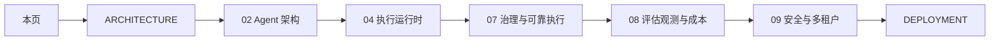
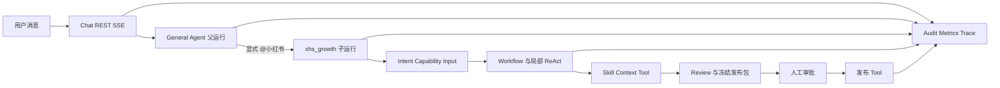

# AgentKit 框架详细手册

## 1. 文档定位

这套手册位于架构总览与源码实现之间，回答四类问题：

1. 一个请求如何从 Chat、REST、SSE 或 CLI 进入 AgentKit，并形成可追溯的父子运行。
2. Agent、Skill、Context、Tool、Memory、RAG 和 Runtime 分别负责什么，边界在哪里。
3. 如何定位关键源码、配置和测试，怎样调试及扩展一个企业能力。
4. 面试或架构评审时，如何用 AgentKit 的真实实现解释稳定性、自主性、成本和治理权衡。

建议先阅读 [统一 Agent 架构](../ARCHITECTURE.md)，再按本页选择开发者或架构评审路径。部署、安装和生产运维以 [部署与启动指南](../DEPLOYMENT.md) 为准；系统学习节奏以 [AI Agent 系统学习与面试指南](../AI_AGENT_系统学习与面试指南.md) 为准。

本手册不是逐函数 API 文档，也不复制上述文档。模块手册聚焦“当前代码如何工作、怎样验证、如何安全扩展”。

## 2. 当前实现基线

截至本手册对应的代码版本，AgentKit 的运行基线如下：

- 注册 1 个协调 Agent：`general_agent`。
- 注册 3 个业务 Agent：`hr_recruiter`、`customer_service`、`xhs_growth`。
- General Agent 是统一聊天会话的所有者，负责直接回答、澄清和受控委派，不直接拥有业务 Tool。
- 所有业务 Agent 共用一套 `UnifiedAgentGraph`，而不是各自维护一套不一致的运行图。
- Runtime 基于 LangChain Core 1.x、LangChain OpenAI 1.x 和 LangGraph 1.x，并使用 AgentKit 自定义 `StateGraph` 表达治理节点。
- Agent、Skill 和 Context 都采用声明式目录；启动时编译注册表并校验引用、预算、Schema 与租户边界。
- 固定 Workflow 是企业任务的默认稳定骨架；ReAct 和 Plan-and-Execute 只在声明允许的局部提供受限自主决策。
- 浏览器 RPA、XHS 发布、OCR 和媒体理解属于特定 Skill、Tool 或 Provider，不是 AgentKit 核心 Runtime 的启动前提。
- 本地开发可以使用 SQLite；多实例生产部署需要共享 PostgreSQL、Checkpoint、幂等、会话和向量存储。

需要确认依赖版本时查看 [LangChain/LangGraph 升级说明](../LANGCHAIN_LANGGRAPH_UPGRADE.md) 和 `pyproject.toml`，不要根据市场命名推断仓库版本。

## 3. 文档地图

| 文档 | 主要问题 | 建议读者 |
|---|---|---|
| [01 接入与接口层](01_INTERFACE_AND_ACCESS.md) | 请求怎样进入系统，Chat 与 Task 有何区别，身份和会话如何建立 | API 开发、前端、集成工程师 |
| [02 Agent 架构](02_AGENT_ARCHITECTURE.md) | General/业务 Agent 如何声明、委派、隔离和追溯 | Agent 开发、架构师 |
| [03 Skill、Tool 与 MCP](03_SKILLS_TOOLS_AND_MCP.md) | 业务能力如何渐进披露，外部调用如何治理 | 业务开发、平台开发 |
| [04 执行运行时与 LangGraph](04_EXECUTION_RUNTIME_AND_LANGGRAPH.md) | 统一图和六类策略怎样选择、调用 LLM 和终止 | Runtime 开发、架构师 |
| [05 LLM Context 装载治理](05_CONTEXT_ENGINEERING_AND_GOVERNANCE.md) | Prompt、Memory、RAG 和动态数据怎样受控进入 LLM | Prompt/Context 工程师 |
| [06 Memory 与 RAG](06_MEMORY_AND_RAG.md) | 近期对话、长期记忆、知识库和 Artifact 有何不同 | RAG、数据、Agent 开发 |
| [07 治理与可靠执行](07_GOVERNANCE_AND_DURABLE_EXECUTION.md) | 审批、Review、Checkpoint、幂等、重试怎样协作 | 平台、可靠性工程师 |
| [08 评估、观测与成本](08_EVALUATION_OBSERVABILITY_AND_COST.md) | 如何离线评估、在线追踪、衡量 P95、Token 和业务价值 | 测试、SRE、架构师 |
| [09 安全、多租户与稳定性](09_SECURITY_MULTI_TENANCY_AND_RELIABILITY.md) | 身份、权限、数据、网络和并发边界如何建立 | 安全、平台、SRE |
| [10 扩展开发指南](10_EXTENSION_GUIDE.md) | 怎样新增 Agent、Skill、Tool、Context 或 Provider | 所有扩展开发者 |
| [集中参考](REFERENCE.md) | 契约、状态、事件、配置、注册关系和源码在哪里 | 日常查询 |
| [限制与演进路线](ROADMAP.md) | 当前没有实现什么，合理的演进前提是什么 | 技术负责人 |

已有专题文档继续承担各自职责：

- [部署与启动指南](../DEPLOYMENT.md)：安装、配置、Docker、Linux、多实例、运维和上线检查。
- [RAG 工作流](../RAG_WORKFLOW.md)：知识摄取和 RAG 实操流程。
- [成本控制](../cost_control.md)：Token 与预算控制专题。
- [XHS 浏览器与搜索](../XHS_WEB_SEARCH.md)：小红书特定连接器和运行条件。
- [Web UI 设计](../web/WEB_UI_REDESIGN.md)：管理界面和交互设计。

## 4. 开发者阅读路径

如果目标是尽快参与开发，按“入口 → 能力 → 执行 → 上下文 → 数据 → 扩展”阅读：

每读完一章，至少完成以下动作：

1. 打开“源码入口”中的主类或主函数。
2. 找到对应单元测试和集成测试。
3. 在运行追踪中定位该模块产生的事件。
4. 用贯穿示例解释输入、输出、失败和终止条件。

## 5. 架构评审与面试阅读路径

如果目标是解释企业级设计，按“职责边界 → 自主性 → 可靠性 → 证据 → 生产边界”阅读：

推荐使用以下回答结构：

1. **结论**：AgentKit 采用统一治理图，固定 Workflow 承担稳定主链路，局部开放 ReAct/Plan 自主性。
2. **机制**：说明 Agent/Skill/Tool/Context 的契约、预算、权限和审批边界。
3. **证据**：引用具体类、配置、审计事件或测试。
4. **权衡**：说明为什么没有把所有节点都做成自主 Agent，哪些场景仍需人工或确定性逻辑。
5. **指标**：落到成功率、P95、Token、成本、审批等待和业务完成率。

## 6. 贯穿示例

模块手册使用同一个请求串联各层：

> `@小红书 以“AI 改变生活”为主题，研究小红书 Top 5 文案，比较后写一篇原创文案并发布。`

这个示例包含路由、输入解析、外部研究、LLM 内容生成、证据 Review、冻结副作用、人工审批和浏览器 Tool，适合观察完整企业链路。它只是贯穿示例，不代表 XHS 是框架内核；招聘和客服同样复用统一契约与治理图。

## 7. 共同术语

| 术语 | 在 AgentKit 中的含义 |
|---|---|
| Agent | 业务身份和治理边界，声明可用 Skill、上下文策略、执行策略和预算 |
| General Agent | 统一会话所有者与协调入口，负责回答、澄清或受控委派 |
| 业务 Agent | 在特定业务域内运行的 Agent，如招聘、客服、小红书增长 |
| Skill / Capability | 可复用业务能力契约，包含 Schema、编排、权限、预算、Tool 和 Handler |
| Tool | 对企业 API、数据库、浏览器或 MCP 的受治理执行入口 |
| Context Pack | 某个 LLM 节点的模板、输入白名单、预算、裁剪与输出 Schema |
| Memory | 与用户和 Agent 作用域绑定、从历史对话提取的稳定事实 |
| RAG | 从租户知识集合检索外部企业知识，作为回答或决策证据 |
| Artifact | Run 内大对象或步骤产物的持久引用，避免全部塞进 Prompt |
| Run | 一次可追踪执行；General 父 Run 可以关联业务 Agent 子 Run |
| Thread | LangGraph Checkpoint 的恢复标识，用于审批暂停和继续 |
| Strategy | Direct、Workflow、Batch、Parallel、ReAct 或 Plan-and-Execute 执行方式 |
| Provider | 某类外部能力的可替换实现，如 LLM、Embedding、OCR、Tool Backend |

## 8. 事实与规划标记

手册使用四类语义：

- **当前实现**：能够在声明、源码、配置或测试中找到直接证据。
- **设计理由**：解释当前实现为何采用该边界，以及稳定性、成本和自由度之间的权衡。
- **当前限制**：当前代码明确不支持或只支持部分场景。
- **演进建议**：尚未实现，只能出现在章节末尾或 [ROADMAP](ROADMAP.md)。

阅读时不要把历史设计稿视为现状。`docs/superpowers/specs/` 记录决策过程，当前事实仍以生产源码、声明、配置和测试为准。

## 9. 文档维护规则

以下变更需要同步更新对应模块文档和 [集中参考](REFERENCE.md)：

- Agent、Skill、Tool 或 Context 声明契约发生变化。
- 统一业务图节点、状态、策略或预算字段发生变化。
- API、CLI、审批恢复或会话状态发生变化。
- Memory、RAG、Artifact、Checkpoint、Audit 的存储和隔离边界发生变化。
- Eval Target、审计事件、关键配置或部署能力发生变化。

文档引用源码时使用相对路径并写明类或函数名，不依赖容易漂移的行号。生产凭据、Cookie、完整渲染 Prompt、隐藏推理和用户敏感数据不得进入文档。纯内部重构且外部契约不变时，不强制修改手册。
