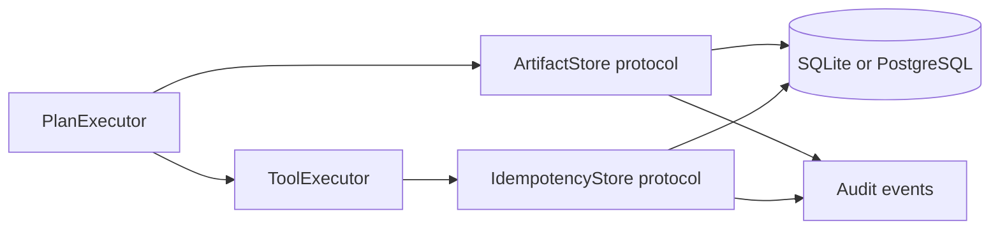

# Durable Execution Foundation Design

## Purpose

Make AgentKit's existing governed LangGraph runtime durable enough for enterprise action flows before adding a distributed queue. This project persists workflow artifacts and idempotency decisions across process restarts, protects side-effecting tools from duplicate execution, and introduces a small schema-migration mechanism.

The production backend is the PostgreSQL database already used by Docker Compose. SQLite remains a behaviorally equivalent local-development backend. This design introduces no Redis, message queue, object store, or background worker.

## Scope

This project adds:

- A persistent artifact store for JSON-serializable workflow outputs.
- A persistent idempotency ledger for tool calls that supply `_idempotency_key`.
- Backend-neutral protocols with SQLite and PostgreSQL implementations.
- Explicit idempotency outcomes: `running`, `succeeded`, `failed`, and `outcome_unknown`.
- A versioned migration runner that owns AgentKit runtime tables.
- Audit events that make artifact persistence and idempotency decisions observable.
- Contract tests that execute against SQLite and, when configured, PostgreSQL.

## Non-goals

- Moving HTTP execution to an asynchronous queue or creating worker processes.
- Resuming a workflow from an arbitrary step after an in-process crash.
- Persisting binary artifacts or large documents in PostgreSQL.
- Adding distributed LLM rate limiting, shared circuit breakers, or a full task scheduler.
- Retrofitting connector-specific business ledgers such as Xiaohongshu publication; those remain authoritative for their external system.

The following project will add durable queued execution, worker leases, cancellation, and step-level recovery. This foundation deliberately supplies its storage contracts first.

## Current constraints

- `PlanExecutor` creates a per-run `InMemoryArtifactStore`; `artifact_written` audit events contain references but not recoverable payloads.
- `ToolExecutor` caches `_idempotency_key` results only in its process-local instance.
- SQLite and PostgreSQL runtime schemas are created with `CREATE TABLE IF NOT EXISTS`, without schema versioning.
- Existing audit/run tables and approval checkpointers must remain backward compatible.

## Design overview

`PlanExecutor` receives a persistent artifact store built from the configured storage backend. `ToolExecutor` receives an idempotency store plus tenant and run context. Existing handlers continue to use `SkillContext.write_artifact` and `SkillContext.call_tool`; no domain-pack API changes are required.

## Artifact persistence

### Contract

`ArtifactStore` gains persistent implementations with the existing `put`, `get`, and `list` operations. `list` is scoped to the run that constructed the store. A record contains:

- `artifact_id`: generated opaque identifier.
- `run_id` and `tenant_id`: mandatory ownership scope.
- `kind`, `summary`, and JSON metadata.
- `payload_json`: canonical JSON payload.
- `payload_sha256`: SHA-256 of the canonical payload bytes.
- `created_at`.

Payloads must be JSON-serializable. The store canonicalizes them with sorted keys and UTF-8 encoding before hashing. A configurable maximum payload size is enforced before database insertion; the default is 1 MiB. A caller receives a clear artifact-size error rather than silently truncating data.

### Tables

`workflow_artifacts` has primary key `artifact_id`, an index on `(tenant_id, run_id, created_at)`, and a foreign key from `run_id` to `task_runs.run_id` where supported. Artifact payloads are PostgreSQL `JSONB` and SQLite `TEXT` containing JSON.

Only the metadata/reference is exposed in normal task responses and audit records. Payload retrieval is an explicit store operation, which keeps responses and audit event volume bounded.

## Persistent idempotency

### Key and request identity

The ledger is used only if a tool call includes a non-empty `_idempotency_key`. Its uniqueness key is:

`(tenant_id, tool_name, idempotency_key)`.

The ledger stores a canonical hash of arguments after removing `_idempotency_key`. Therefore, reusing a key for different business arguments raises an `IdempotencyConflictError`; it never returns a potentially incorrect cached result.

### State transitions

| State | Meaning | Duplicate-call behavior |
| --- | --- | --- |
| `running` | A caller has claimed the key but has not finished. | Return `IdempotencyInProgressError`; never issue another external call. |
| `succeeded` | Result JSON is durable. | Return the stored result with `cached=true`. |
| `failed` | A known pre-submit or safe failure occurred. | Return the stored failure; no automatic replay in this project. |
| `outcome_unknown` | The request may have reached the external system but confirmation was lost. | Return `IdempotencyOutcomeUnknownError`; human or connector-specific reconciliation is required. |

`begin` is atomic. SQLite uses a transaction and PostgreSQL uses `INSERT ... ON CONFLICT` plus row locking. A claimed key is completed by `finish_success`, `finish_failure`, or `finish_unknown`. A process restart leaves a `running` record intact; a later duplicate is blocked rather than risking a duplicate side effect. A later queue/worker project will introduce leased recovery and reconciliation for abandoned claims.

### ToolExecutor behavior

For a persistent key, `ToolExecutor` first calls `begin`:

1. A stored `succeeded` result is returned without invoking the handler.
2. A `running`, `failed`, or `outcome_unknown` result is surfaced as a typed execution error and audited.
3. A new claim invokes the handler under the existing timeout/retry rules.
4. Normal success records `succeeded` and the JSON result.
5. A timeout records `outcome_unknown` for non-idempotent tools; retryable/idempotent tools record `failed` only when the failure is known to have occurred before a side effect.

This does not claim exactly-once delivery. It provides at-most-one framework attempt for each persistent idempotency key and makes uncertain external outcomes explicit.

## Migration system

The runtime gains `core.migrations` with numbered, idempotent migrations. A `schema_migrations` table records each applied version and timestamp. Both backends use the same ordered migration list; backend-specific SQL is hidden inside migration functions.

The initial migration adopts creation of the existing `task_runs` and `audit_events` tables, indexes, `workflow_artifacts`, and `tool_idempotency_records`. Existing databases without a migration record are upgraded safely because every creation step remains idempotent. Future schema changes are append-only migrations rather than implicit changes in store constructors.

`agentkit init-db` runs migrations before checking storage readiness. Runtime bootstrap also runs migrations on startup so a normal deployment cannot begin writing to an outdated schema.

## Audit and observability

New events are:

- `artifact_persisted`: artifact id, kind, SHA-256, payload byte count, and storage backend.
- `idempotency_claimed`: tool and key digest; never the raw key.
- `idempotency_cache_hit`: tool and key digest.
- `idempotency_conflict`: tool and key digest.
- `idempotency_in_progress`: tool and key digest.
- `idempotency_outcome_unknown`: tool and key digest, timeout/error category.
- `schema_migrated`: version and backend, emitted by CLI/bootstrap logging rather than tied to a task run.

Raw artifact payloads, raw idempotency keys, and tool results are not duplicated into audit events. Normal task-level audit continues to record tool lifecycle timing.

## Code boundaries

- `core/artifacts.py`: protocols, record types, in-memory implementation, and persistent builders.
- `core/idempotency.py`: idempotency protocol, outcome/result types, SQLite/PostgreSQL stores, canonical hashing.
- `core/migrations.py`: storage migration runner.
- `core/executor.py`: create a persistent run-scoped artifact store.
- `core/tool_executor.py`: coordinate the persistent ledger around calls with `_idempotency_key`.
- `runtime/bootstrap.py` and CLI initialization: run migrations and inject backend-specific stores.
- `config.py`: artifact payload-size limit and any backend-neutral storage options.

Business packages continue to own connector-specific reconciliation. The XHS publication ledger remains in place; its durable key complements, rather than is replaced by, the generic tool ledger.

## Failure handling

- Database write failure before a side effect: fail the run; do not call the external tool.
- Database failure after an external handler returns but before `succeeded` can be recorded: surface `outcome_unknown` when the write cannot be proven absent; do not retry automatically.
- Artifact payload over limit or non-serializable: fail the workflow step before a downstream consumer sees an invalid reference.
- Duplicate key with different arguments: fail closed with a conflict error.
- Duplicate key while running or unknown: do not invoke the external tool.

## Tests and acceptance criteria

Unit tests will cover canonical hashing, size checks, artifact round trips, result reuse, key conflicts, running/failed/unknown states, and audit payload redaction.

Integration tests will cover:

- A new executor instance reusing a successful idempotency result without invoking the tool again.
- A duplicate mutation after a simulated timeout returning `outcome_unknown` without a second call.
- Persisted artifacts being read by a fresh runtime after restart.
- Idempotent migration execution against a pre-existing runtime database.
- Existing approval resume and XHS publication behavior remaining unchanged.

The acceptance bar is zero duplicate calls for a repeated `(tenant, tool, idempotency key)` in SQLite and PostgreSQL contract tests, and durable artifact retrieval after runtime recreation.
