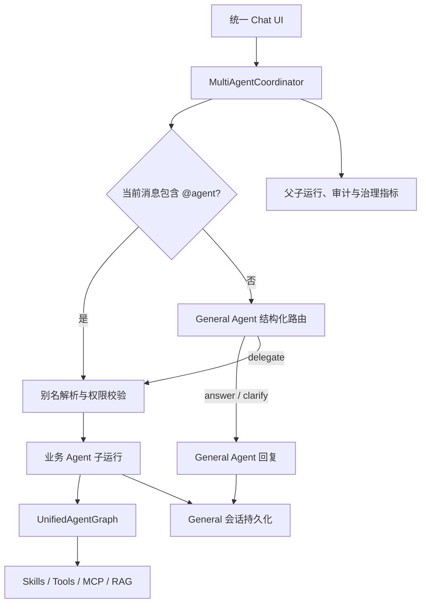

# General Agent 多 Agent 聊天设计

## 目标

将 AgentKit 从“用户先选择一个 Agent 再发起任务”升级为“单一聊天入口 + General Agent 协调业务 Agent”的企业级多 Agent 交互框架，同时保持现有运行追踪、审批、治理指标、技能权限和审计能力。

本期必须满足：

- 根路径默认进入类似 ChatGPT 的统一聊天界面。
- General Agent 是会话所有者，负责普通交流、澄清和选择业务 Agent。
- `@招聘`、`@客服` 等显式提及只对当前消息生效；下一条未提及的消息重新交给 General Agent。
- General Agent 始终看到当前会话的完整短期上下文、压缩摘要和长期记忆。
- 业务 Agent 仅获得执行当前任务所需的会话快照，以及自己的 RAG、长期记忆、Skills、Tools 和治理策略。
- General Agent 与业务 Agent 的父子运行关系、路由原因、工具执行和最终结果均可追溯。
- Operations、Governance、审批、指标和现有直接任务 API 保持可用。
- Agent、Skill、Tool 的真实注册关系可在动态图中查看，不维护第二份手工拓扑。

## 非目标

- 本期不实现同一条消息并行调用多个业务 Agent。
- 本期不实现业务 Agent 之间任意点对点通信；所有委派都经过 General Agent 和 Runtime。
- 本期不暴露模型的隐藏思维链，只展示可审计的结构化决策摘要和执行事件。
- 本期不引入消息队列、独立 Agent 服务或跨进程 A2A 协议。
- 本期不移除 `/api/tasks` 的指定 Agent 调用能力；它仍用于系统集成和调试。

## 核心语义

### 单一会话所有者

每个 UI 会话都以 `general_agent` 作为持久化所有者。用户消息和最终回复只写入这一个会话，因此切换执行者不会把历史拆成多个互不相干的对话。

业务 Agent 是某一轮的执行者，不是会话所有者。消息记录增加可选的 `agent_id`，用于标记回复来自 General Agent 还是某个业务 Agent。

### `@agent` 只影响当前消息

服务端按租户配置解析当前消息中的一个显式提及：

- `@招聘 帮我筛选这份简历`：当前轮确定性路由到 `hr_recruiter`。
- 下一条 `候选人还有什么风险？`：不继承上轮执行者，重新交给 General Agent 判断。
- General Agent 仍能看到上一轮用户问题和招聘 Agent 的回复。
- 同时提及多个 Agent 时返回明确澄清，不隐式选择其中一个。
- UI 的提及建议只改善输入体验；服务端解析和权限校验才是权威结果。

别名由租户配置维护，并且只能映射到当前租户启用的 Agent。Agent ID 和显示名称也可作为提及词。

### 未提及消息的混合路由

未包含显式提及的消息进入 General Agent：

1. 小模型/低成本模型根据 Agent 能力卡、当前消息和会话摘要产生结构化决策：`answer`、`clarify` 或 `delegate`。
2. Runtime 校验目标 Agent 是否启用、是否越权、是否出现自委派以及任务描述是否有效。
3. `answer` 和 `clarify` 由 General Agent 生成回复。
4. `delegate` 由 Runtime 创建业务 Agent 子运行并执行，General Agent 不直接获得业务工具权限。

显式 `@agent` 跳过路由模型，但不跳过租户权限、安全策略和审计。

## 运行架构

### 组件职责

- `MultiAgentCoordinator`：聊天入口协调器；创建 General 会话、解析提及、调用 General 路由/回答、委派业务 Agent、持久化最终对话并组装追踪信息。
- `AgentMentionParser`：仅解析当前消息，返回规范 Agent ID 和移除提及后的任务文本。
- `AgentDirectory`：从 Registry、租户启用列表和别名配置生成受权限约束的能力卡。
- `GeneralDecision`：严格的结构化路由结果，禁止模型直接指定未注册工具。
- `AgentGateway.handle_delegated`：运行业务 Agent，但不创建业务 Agent 会话，也不重复写入会话历史。
- `ConversationContextService.build_for_delegation`：在验证 General 会话归属后，为目标 Agent 组合共享的近期对话、目标 Agent 的长期记忆和 RAG 结果。

### 上下文边界

General Agent 上下文包括：

- General Agent 的 `agent.md`；
- 当前会话摘要和近期消息；
- General Agent 的长期记忆；
- 当前租户可用 Agent 的 ID、名称和简短能力描述；
- 当前用户消息；
- 路由或回答上下文包。

业务 Agent 上下文包括：

- 目标 Agent 的 `agent.md`；
- 与目标 Agent 绑定且按渐进式披露命中的 Skill 详情；
- 目标 Agent 的工具和 MCP 权限；
- 当前会话的摘要和近期消息快照；
- 目标 Agent 自己的长期记忆和 RAG 结果；
- General Agent 生成的明确任务描述和原始用户消息。

业务 Agent 不获得其他 Agent 的系统提示词、Skill 详情和工具权限。

## 数据与追踪

### 会话消息

`conversation_messages` 增加可空的 `agent_id`：

- 用户消息为空或记为 `general_agent`；
- General Agent 回复记为 `general_agent`；
- 被委派的业务回复记为实际业务 Agent ID。

历史接口返回该字段，UI 据此显示回复身份。

### 父子运行

`task_runs` 增加：

- `agent_id`：本次运行的实际 Agent；
- `parent_run_id`：业务子运行指向当前 General 父运行；
- `conversation_id`：追踪所属的 General 会话。

每条聊天消息创建一个 General 父运行。发生委派时再创建业务子运行。审批暂停时保留业务线程 ID；恢复执行后仍关联同一个父运行和 General 会话。

对外追踪返回：

- 路由类型：`explicit_mention`、`general_answer` 或 `general_delegate`；
- 目标 Agent 和安全的决策摘要；
- 父运行、子运行及其状态；
- 已有的工具、模型、审批、预算和错误审计事件。

不记录或展示隐藏思维链。

## UI 设计

### 统一聊天入口

- `/` 直接进入 `/chat`。
- 左侧栏包含“新建对话”和 General 会话历史。
- 主区域只显示聊天，不再要求用户预先选择 Agent。
- 输入框支持 `@` 候选菜单和键盘选择；发送后不保存任何“当前 Agent”状态。
- 每条助手消息显示实际回复 Agent、执行状态和可折叠追踪摘要。
- Operations、Governance 和 Agent Network 作为次级入口保留。

### Agent Network

动态图由 `/api/registry` 的实时数据生成：

- 中心节点：General Agent；
- 第一层：租户启用的业务 Agent；
- 第二层：Agent 绑定的 Skills；
- 第三层：Skill 暴露的本地 Tools 和 MCP Tools；
- 边表示协调、绑定和调用关系；
- 支持缩放、拖拽、悬停高亮、节点详情、类型筛选和降级列表；
- 动效使用本地 SVG/CSS/JavaScript，不依赖外部 CDN。

## 失败与安全策略

- 未知提及：返回可用 Agent 列表，不交给模型猜测。
- 多个提及：要求用户明确一个执行者。
- General 路由到禁用 Agent：Runtime 拒绝并让 General 澄清。
- 子运行失败：父运行标记失败，保留子运行错误和审计事件，不伪造成功回复。
- 子运行等待审批：父运行保持等待状态，UI 使用原线程恢复；恢复后写入一次最终消息。
- 模型结构化输出无效：有限重试后降级为 General 澄清，不自动执行工具。
- 会话、运行和历史查询始终校验租户与用户归属。

## 兼容性

- `/api/chat` 使用新的多 Agent 协调器。
- `/api/tasks`、CLI 和已有按 Agent 调用方式继续使用 `AgentGateway`。
- 已有 Workflow、ReAct、Plan、Direct、Batch、Parallel 执行模式不变；多 Agent 只是它们之上的会话协调层。
- Operations 和 Governance 继续读取同一运行及审计存储，新字段只增强查询能力。

## 验收标准

1. 新建会话后发送普通问候，由 General Agent 回复并持久化。
2. 发送 `@招聘 ...` 时只在当前轮调用招聘 Agent；下一轮未提及消息重新由 General Agent 决策。
3. 刷新页面或切换历史会话后，对话内容、实际回复 Agent 和会话摘要仍存在。
4. General Agent 可以根据能力卡自动委派一个业务 Agent，Runtime 会阻止未启用目标。
5. 委派运行能从父运行查询到子运行，Operations/Governance 指标仍正常展示。
6. 子运行需要审批时可暂停并恢复，最终只向 General 会话写入一轮回复。
7. Agent Network 与 Registry 一致，新增 Agent/Skill 后无需修改图代码。
8. SQLite 与 PostgreSQL 迁移、单元测试、集成测试和 Web 路由测试全部通过。

## 后续扩展建议

- 在当前单子 Agent 委派稳定后，增加显式 DAG 计划和多个子 Agent 的串并行协作。
- 引入 Agent 能力版本、成本、延迟和成功率，让 General 路由同时考虑质量与预算。
- 将 Agent 间任务契约标准化为可版本化输入/输出 Schema，为跨服务 A2A 做准备。
- 增加人工固定路由、禁止路由和灰度策略，满足更严格的企业治理要求。
