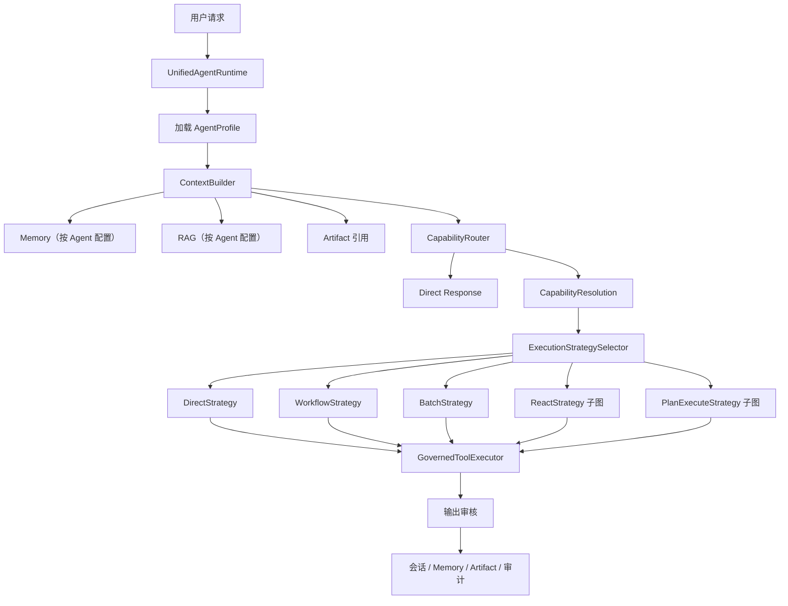
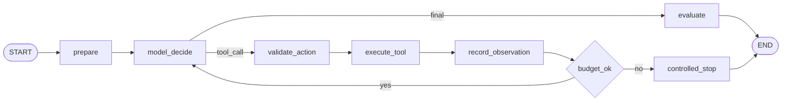
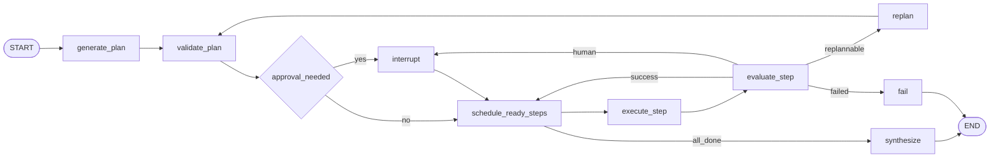

# 统一 Agent Runtime 与可插拔执行策略设计

## 1. 背景

当前 AgentKit 已有声明式 `agent.md`、`skill.yaml`、LangGraph 治理图、Memory、RAG、审批、ToolExecutor、Artifact、审计和持久化能力，但运行模型仍存在以下结构性问题：

1. `customer_service` 通过 `actions_enabled=false` 进入回答型 ChatService，`hr_recruiter` 与 `xhs_growth` 进入行动型 LangGraph，形成两套 Agent 请求路径。
2. `ExecutionMode` 同时混合推理策略、编排方式和工具权限，`workflow`、`batch`、`no_tool`、`react`、`plan_execute` 不是同一维度。
3. `react` 只有声明值，没有可运行的通用模型—工具循环。
4. `plan_execute` 只允许路由到单个 Skill，不能生成和执行受约束的多 Skill DAG。
5. Python Tool 与未来 MCP Tool 缺少统一的来源描述和执行后端抽象。
6. `domain_packs/`、`pack_registry`、旧脚手架和声明式目录并存，增加理解与维护成本。

本项目是新项目，本次改造不保留旧接口、旧配置或旧目录的兼容层。目标是直接形成一套概念清晰、代码干净、可用于后续企业 Agent 场景的统一架构。

浏览器服务化、Linux 远程人工接管和通用沙盒执行不属于本次范围。现有浏览器连接器继续作为小红书 Tool 的实现边界使用。

## 2. 设计目标

### 2.1 功能目标

1. 所有业务 Agent 使用同一个 Runtime、同一请求状态和同一治理链路。
2. Agent 通过 `agent.md` 声明身份、Prompt、Memory、RAG、Skill 白名单和自主预算。
3. Skill 通过 `skill.yaml` 声明推理策略、编排方式、工具风险策略、输入输出和执行入口。
4. Tool 和 MCP Tool 编译为统一运行时契约，并经过相同权限、预算、超时、审批、幂等与审计。
5. 完整实现 Direct、Workflow、Batch、Bounded ReAct 和多 Skill Plan-and-Execute。
6. 执行策略支持 Skill 默认值、确定性规则、LLM 建议和 Policy 最终校验。
7. 允许研究型 Agent 在授权工具集合和自主预算内自主选择工具、调整方向和有限重新规划。
8. 高风险副作用始终由确定性节点执行，不允许在 ReAct 循环中直接发生。

### 2.2 工程目标

1. 每种执行策略有独立模块、状态、测试和失败语义。
2. 不在单个 Executor 中继续堆积模式分支。
3. Agent、Skill、Tool 声明在启动时完成严格校验，失败时拒绝启动。
4. 所有执行路径可审计、可计量、可中断、可恢复、可评测。
5. 删除旧兼容代码、旧配置和失效测试，不保留双轨行为。

## 3. 非目标

本次不实现：

- 浏览器 Worker 服务化、noVNC、远程浏览器租约；
- 容器、gVisor、Kata 或 MicroVM Tool 沙盒；
- 任意 MCP Server 的自动发现市场；
- 跨 Agent 自由对话、Handoff 或 Supervisor 多 Agent 编排；
- 无限制自主模式；
- 基于模型隐藏思维链的审计；
- 对旧 `domain_packs`、`actions_enabled`、`ExecutionMode` 或旧租户配置的兼容迁移。

MCP 范围限定为：定义并实现统一 Tool Provider 协议、MCP Tool 声明解析、受治理调用边界和可测试的 MCP Client Adapter。实际连接哪个企业 MCP Server 由部署配置决定。

## 4. 总体架构



统一架构表示所有 Agent 共享相同协议、上下文构建、策略选择、工具治理和持久化能力，不表示每次请求必须执行同样数量的节点。简单问答走轻量 Direct 分支，复杂任务进入相应策略子图。

## 5. 声明式数据模型

### 5.1 Agent Manifest

`agents/<agent-id>/agent.md` 是业务 Agent 的唯一声明入口。

```yaml
---
id: customer_service
domain: support.customer_service
description: 客服问答与售后处理 Agent。
prompt_file: prompts/agents/customer_service.md

skills:
  - customer.answer
  - order.lookup
  - logistics.diagnose
  - refund.apply

context:
  memory:
    enabled: true
    scope: agent_user
    window_turns: 6
    max_context_tokens: 4000
  rag:
    enabled: true
    collections:
      - customer-service-faq
    top_k: 5
    max_context_tokens: 1200
  artifacts:
    readable:
      - support-case
    writable:
      - support-case

execution:
  default_strategy: direct
  allowed_strategies:
    - direct
    - workflow
    - react
    - plan_execute
  allow_dynamic_selection: true
  allow_side_effects: true

autonomy:
  level: medium
  max_model_calls: 12
  max_tool_calls: 16
  max_iterations: 8
  max_plan_steps: 8
  max_replans: 1
  max_tokens: 30000
  timeout_seconds: 300
---
```

Agent Manifest 编译为新的 `AgentProfile`，其中包含：

- 身份与领域；
- Skill 白名单；
- ContextPolicy；
- ExecutionPolicy；
- AutonomyBudget。

Agent 不重复声明 Tool 白名单。运行时通过 `Agent → Skills → Tools` 计算最终可用 Tool 集合，避免双重配置产生不一致。

### 5.2 Skill Manifest

删除旧 `execution_mode`，改为正交执行声明：

```yaml
capabilities:
  - id: logistics.diagnose
    domain: support.customer_service
    description: 根据订单、物流和知识证据诊断配送问题。
    entrypoint: scripts.handlers:diagnose

    execution:
      reasoning: react
      orchestration: single
      tool_policy: read_only
      allow_dynamic_selection: true

    autonomy:
      max_iterations: 5
      max_model_calls: 8
      max_tool_calls: 8
      timeout_seconds: 120

    permissions:
      - order.read
      - logistics.read

    tools:
      - commerce.order.get
      - logistics.track
      - knowledge.search

    input_schema:
      type: object
      required: [order_id]
      properties:
        order_id: {type: string, minLength: 1}

    output_schema:
      type: object
      required: [summary, evidence]
      properties:
        summary: {type: string}
        evidence: {type: array}
```

执行维度：

- `reasoning`: `direct | react | plan_execute`；
- `orchestration`: `single | workflow | batch | parallel`；
- `tool_policy`: `none | read_only | governed | side_effect`。

Skill 的自主预算不得超过 Agent 的自主预算，运行时使用逐项最小值作为有效预算。

### 5.3 Tool Manifest

Python Tool 和 MCP Tool 使用同一清单结构：

```yaml
tools:
  - id: commerce.order.get
    provider: python
    entrypoint: scripts.tools:get_order
    description: 查询订单。
    risk: read_only
    permissions: [order.read]
    idempotent: true
    timeout_seconds: 15

  - id: knowledge.github.search
    provider: mcp
    server: github
    tool: search_code
    description: 通过企业 GitHub MCP 搜索代码。
    risk: read_only
    permissions: [source.read]
    idempotent: true
    timeout_seconds: 30
```

运行时 `ToolDefinition` 增加：

- `provider: python | mcp`；
- `risk: read_only | governed | side_effect`；
- `permissions`；
- `input_schema`；
- `execution_backend`；
- Python entrypoint 或 MCP server/tool 引用。

## 6. 统一请求生命周期

所有 Web、CLI 和 API 请求进入同一 `UnifiedAgentGraph`：

```text
start
→ load_agent
→ build_context
→ understand_request
→ resolve_capability
→ resolve_inputs
→ select_strategy
→ review_strategy
→ execute_strategy
→ post_execution_approval
→ review_output
→ persist_turn
→ finalize
```

### 6.1 直接回答

未选择行动 Skill，或选中 `customer.answer` 时，进入 `DirectStrategy`：

```text
Agent Prompt
+ Memory
+ RAG（如果启用）
+ 当前问题
→ 单次主要 LLM 回答
```

不再通过 `actions_enabled` 进入独立 ChatService。原 ChatService 中会话、摘要、长期记忆和 RAG 组装能力拆为可复用的 `ConversationContextService` 与 `ConversationPersistenceService`，由统一图调用。

### 6.2 行动请求

Capability Router 不再强制只返回一个 Skill，而是返回结构化 `CapabilityResolution`：

```python
@dataclass(frozen=True)
class CapabilityResolution:
    response_mode: Literal["answer", "skill", "multi_skill"]
    primary_skill: str | None
    candidate_skills: tuple[str, ...]
    reason: str
    confidence: str
    complexity: ComplexityAssessment
```

规则明确、只需一个能力时设置 `primary_skill`；复杂请求可以返回多个 `candidate_skills`，由 Plan-and-Execute 在该集合内生成计划。候选集合只能来自当前 Agent 的 Skill 白名单。

解析完成后，运行时完成：

1. Agent Skill 候选集合与白名单校验；
2. 用户与租户权限校验；
3. JSON Schema 参数解析；
4. 风险和副作用识别；
5. 策略选择；
6. 有效自主预算计算；
7. 执行策略子图；
8. 输出审核和会话持久化。

## 7. ExecutionStrategy 抽象

```python
class ExecutionStrategy(Protocol):
    name: str

    def execute(
        self,
        *,
        context: ExecutionContext,
        request: StrategyRequest,
    ) -> StrategyResult: ...
```

`ExecutionContext` 只提供经过 Agent、Skill、用户权限和风险策略过滤后的能力：

- 当前 AgentProfile；
- 当前 SkillDefinition；
- 有效 AutonomyBudget；
- GovernedToolExecutor；
- ArtifactStore；
- Checkpointer；
- 审计接口；
- 脱敏上下文。

策略注册表：

```text
direct       → DirectStrategy
workflow     → WorkflowStrategy
batch        → BatchStrategy
parallel     → ParallelStrategy
react        → ReactStrategy
plan_execute → PlanExecuteStrategy
```

## 8. 策略选择

`ExecutionStrategySelector` 对 `CapabilityResolution` 使用四层决策：

1. 单 Skill 请求使用 Skill 声明的默认策略；多 Skill 请求使用 Agent 默认策略；
2. 确定性复杂度与风险规则；
3. 无法确定时的 LLM 结构化建议；
4. Policy 对最终建议做权限、风险和预算校验。

固定优先级：

```text
存在 side_effect
→ workflow 或 plan_execute；禁止纯 react

Skill 声明固定 workflow
→ workflow

批量字段达到阈值
→ batch

存在多个相互依赖 Skill，且可提前规划
→ plan_execute

下一步依赖未知 Observation
→ react

其他
→ direct
```

复杂度对象：

```python
@dataclass(frozen=True)
class ComplexityAssessment:
    candidate_skills: tuple[str, ...]
    estimated_steps: int
    has_dependencies: bool
    needs_dynamic_observation: bool
    has_side_effects: bool
    parallel_items: int
    missing_information: bool
    confidence: str
```

LLM 只能提出候选策略、候选 Skill 和复杂度证据，不能扩大 Agent Skill 白名单、Tool 白名单或风险权限。`primary_skill` 为空且存在多个候选 Skill 时，只允许选择 `plan_execute`、固定 `workflow` 或只读 `parallel`，不能把整个多 Skill 请求降为一个未验证的 Direct Handler。

## 9. Bounded ReAct

### 9.1 子图



### 9.2 Action 契约

模型必须返回结构化 Action：

```json
{
  "type": "tool_call",
  "tool_name": "knowledge.search",
  "arguments": {"query": "..."},
  "decision_summary": "需要补充官方资料证据"
}
```

或：

```json
{
  "type": "final",
  "answer": "...",
  "evidence_refs": ["artifact-1"]
}
```

只审计 `decision_summary`、Tool、参数摘要、Observation 摘要和预算变化，不请求或保存隐藏思维链。

### 9.3 边界

- ReAct 默认只允许 `read_only` Tool；
- `governed` Tool 必须由 Skill 和 Agent 同时允许；
- `side_effect` Tool 在 Action 校验阶段转为延迟动作并退出循环；
- 检测重复 Tool+规范化参数；
- 检测连续无新 Artifact、无新证据或等价 Observation；
- 每轮递增模型、Tool、Token、耗时计数；
- 达到任何预算上限时返回 `budget_exhausted`，不再调用模型或 Tool；
- 每轮状态可 Checkpoint，恢复后不得重复已完成 Tool 调用。

## 10. 多 Skill Plan-and-Execute

### 10.1 子图



### 10.2 Plan 契约

```json
{
  "goal": "诊断订单配送问题并提出解决方案",
  "steps": [
    {
      "id": "lookup_order",
      "skill": "order.lookup",
      "args": {"order_id": "ORD-001"},
      "depends_on": []
    },
    {
      "id": "track_logistics",
      "skill": "logistics.lookup",
      "args_from": {"tracking_id": "lookup_order.tracking_id"},
      "depends_on": ["lookup_order"]
    },
    {
      "id": "resolve_issue",
      "skill": "customer.issue.resolve",
      "depends_on": ["track_logistics"]
    }
  ]
}
```

### 10.3 确定性验证

- 所有 Skill 属于当前 Agent；
- 步骤数不超过有效预算；
- Step ID 唯一；
- 依赖存在且 DAG 无环；
- 参数与引用符合目标 Skill Schema；
- 用户权限覆盖所有步骤；
- 风险策略允许每个步骤；
- 副作用步骤具有审批计划和幂等要求；
- Plan 不能引用其他 Agent 的 Memory、RAG 集合或 Artifact 类型。

### 10.4 Step 执行

Plan Step 仍通过 Strategy Registry 执行，但有以下约束：

- 一个 Plan Step 可以使用 `direct`、固定 `workflow` 或受限 `react`；
- Step 子策略预算从 Plan 总预算中扣除；
- 可并行的无依赖只读步骤可通过 `ParallelStrategy` 执行；
- Step 输出以 Artifact 交接，不把全部原始结果追加到模型上下文；
- 已完成 Step 在恢复或 Replan 后复用，不重复执行。

### 10.5 Replan

只在以下情况允许 Replan：

- 只读外部数据与预期不一致；
- 某个可替代只读 Skill 或 Tool 暂时不可用；
- 原计划引用的信息不足，但仍在 Agent 白名单内存在可用能力。

Replan 不得：

- 增加 Agent 未绑定 Skill；
- 增加原计划未授权权限；
- 重复已成功副作用；
- 修改已审批冻结内容；
- 超过 `max_replans`。

## 11. Direct、Workflow、Batch 与 Parallel

### 11.1 Direct

适用于单次 LLM 回答、单 Skill Handler 或明确的一个只读 Tool。Direct 不表示无治理，仍执行上下文隔离、Schema、权限、预算、输出审核和审计。

### 11.2 Workflow

适用于开发时已知的稳定步骤。现有 XHS 增长活动保留为 Workflow，但迁移到新策略接口。工作流中的研究步骤以后可显式调用受限 ReAct 子策略；发布继续使用审批后的确定性 Tool。

### 11.3 Batch

适用于同一 Skill 对输入列表分片。Batch 由声明的 `batch_key` 和阈值触发，分片共享总预算但拥有独立 Tool 调用记录，最后由确定性 merge 或声明的 merge handler 合并。

### 11.4 Parallel

适用于多个无依赖、只读子任务。并发数受预算和 Tool 后端限制；存在副作用或共享非并发安全会话时禁止并行。

## 12. Tool 与 MCP 治理

统一 `GovernedToolExecutor` 按以下顺序执行：

```text
Tool 存在性
→ Agent/Skill 可见性
→ 用户权限
→ 输入 Schema
→ 风险策略
→ 人工审批状态
→ 调用预算
→ 幂等键
→ 后端执行
→ 输出 Schema
→ 脱敏审计
```

执行后端：

```python
class ToolExecutionBackend(Protocol):
    def execute(self, tool: ToolDefinition, args: dict[str, Any]) -> dict[str, Any]: ...
```

本次实现：

- `PythonToolBackend`：调用声明式 Python entrypoint；
- `McpToolBackend`：通过配置的 MCP Client 调用 `server/tool`；
- Backend Registry：按 `tool.provider` 选择后端。

ToolExecutor 保留统一超时、重试、幂等、审计和结果未知语义。MCP 连接失败不得绕过 Policy，也不得自动换用未声明 Tool。

## 13. 风险与审批

风险优先于复杂度：

| Tool 风险 | ReAct | Plan | Workflow | 审批 |
| --- | --- | --- | --- | --- |
| `read_only` | 允许 | 允许 | 允许 | 通常不需要 |
| `governed` | Agent/Skill 明确允许时可用 | 允许 | 允许 | 按 Policy |
| `side_effect` | 不直接执行 | 仅作为审批后 Step | 允许 | 强制或按 Policy 强制 |

副作用继续使用冻结参数、内容哈希、幂等键、延迟动作、结果确认和 `outcome_unknown` 对账机制。

## 14. 上下文、RAG 与隔离

RAG 是 Agent ContextPolicy，不是 Agent 类型：

```text
Agent Context
├─ System Prompt
├─ Recent Messages
├─ Conversation Summary
├─ Long-term Memory
├─ RAG Knowledge（可关闭）
├─ Artifact References
└─ Current Tool Observations
```

所有检索必须按以下边界过滤：

```text
tenant_id + agent_id + user_id + roles + collection allowlist
```

`xhs_growth` 默认关闭 RAG；`customer_service` 默认开启客服 FAQ RAG；`hr_recruiter` 可按企业招聘知识需求开启。是否启用只改变 ContextBuilder，不改变请求入口或 Agent Runtime。

## 15. 三个现有 Agent 的目标状态

### 15.1 Customer Service

新增最小可运行客服能力：

- `customer.answer`：Direct + RAG；
- `order.lookup`：Direct + 只读订单 Tool；
- `logistics.diagnose`：Bounded ReAct + 只读订单/物流/知识 Tool；
- `refund.apply`：固定 Workflow + 审批后的副作用 Tool。

测试使用 Mock Commerce Provider，不连接真实订单或退款系统。

### 15.2 HR Recruiter

- 单个明确请求：Direct 或 Plan-and-Execute；
- 多候选人：Batch；
- 多 Skill 招聘任务：Plan-and-Execute；
- 写操作继续要求审批。

### 15.3 XHS Growth

- `xhs.growth.campaign`：Workflow；
- 趋势研究可配置 Bounded ReAct，但本次不得改变发布风险边界；
- 分析与文案能力：Direct；
- 发布准备：Workflow/Plan Step；
- 真正发布：审批后确定性 Tool。

浏览器生命周期优化不在本次改造范围。

## 16. 失败语义

统一错误状态：

| 状态 | 含义 | 是否可自动重试 |
| --- | --- | --- |
| `needs_clarification` | 必填参数不足或无效 | 否，等待用户 |
| `strategy_rejected` | 动态策略超出 Agent/Skill Policy | 否，回退默认策略或结束 |
| `plan_invalid` | Plan DAG、Schema、权限或风险校验失败 | 最多重新生成一次只读计划 |
| `budget_exhausted` | 任一自主预算达到上限 | 否 |
| `no_progress` | ReAct 连续无新证据或重复动作 | 否 |
| `tool_failed` | Tool 明确失败且未产生副作用 | 按 Tool 策略有限重试 |
| `outcome_unknown` | 副作用可能已经发生 | 禁止自动重试，人工对账 |
| `waiting_for_approval` | 等待人工审批 | 从 Checkpoint 恢复 |
| `output_blocked` | 输出审核失败 | 否 |

任何策略失败都必须产生终态或显式中断，不允许静默循环。

## 17. 可观测性与成本

新增统一事件：

- `strategy_selected`；
- `strategy_rejected`；
- `autonomy_budget_initialized`；
- `react_iteration_started/finished`；
- `react_action_validated/rejected`；
- `plan_generated/validated/rejected`；
- `plan_step_started/finished`；
- `plan_replanned`；
- `tool_backend_selected`；
- `budget_exhausted`；
- `no_progress_detected`。

指标：

- 任务成功率；
- 策略分布；
- 平均/P95 模型调用数；
- 平均/P95 Tool 调用数；
- Token 和费用；
- ReAct 平均迭代数；
- Plan 平均步骤与 Replan 次数；
- Tool 选择正确率；
- 超时率、无进展率、人工介入率；
- 副作用重复率和结果未知率。

## 18. 删除与替换范围

直接删除：

- `src/agentkit/domain_packs/`；
- `src/agentkit/runtime/pack_registry.py`；
- `agentkit new-pack` 和旧 Pack 脚手架；
- `actions_enabled` 作为 Chat/Action 分流依据；
- 旧 `ExecutionMode` 类型和旧 Planner/Executor 模式分支；
- 仅为旧兼容路径存在的测试、README 和文档内容。

直接替换：

- `ChatService` 的分流职责改为统一图使用的上下文与持久化服务；
- `PlanExecutor` 改为 Strategy Registry 与策略实现；
- `SkillDefinition.execution_mode` 改为结构化 ExecutionPolicy；
- `ToolDefinition` 改为统一 Provider/Risk/Backend 契约；
- 租户配置删除 `enabled_domains` 和 `actions_enabled`，只保留 `enabled_agents` 与 Agent/策略覆盖项；
- 删除 CLI `validate-packs` 与 `new-pack`；新增 `validate-catalog`、`new-agent`、`new-skill`，只生成和校验声明式目录。

## 19. 安全原则

1. LLM 不能扩大 Agent、Skill、Tool、权限和数据集合白名单。
2. Prompt 不是最终策略控制点，所有建议必须经过 Policy。
3. ReAct 不直接执行副作用。
4. Plan/Replan 不得重复成功副作用或修改冻结内容。
5. Tool 参数在执行前做 Schema 和敏感字段检查。
6. 日志不记录隐藏思维链、凭据、Cookie、Token、正文敏感字段或完整外部响应。
7. 恢复执行以 Checkpoint、Tool 幂等记录和 Artifact 为准，不依赖模型记忆。

## 20. 测试策略

### 20.1 声明与编译

- Agent RAG、Memory、ExecutionPolicy、AutonomyBudget 解析；
- Skill 三维执行声明解析；
- Python/MCP Tool 解析；
- Agent → Skill → Tool 引用校验；
- Skill 预算不能突破 Agent 预算；
- 未知策略、风险、Provider 拒绝启动。

### 20.2 策略选择

- 单 Skill 明确请求选择 Direct；
- 固定 Workflow 不被 LLM 改写；
- 批量输入选择 Batch；
- 多 Skill 依赖选择 Plan-and-Execute；
- 动态 Observation 任务选择 ReAct；
- 副作用任务拒绝纯 ReAct；
- LLM 建议越权时被 Policy 拒绝。

### 20.3 ReAct

- 自主选择不同只读 Tool；
- 多轮 Observation 后完成；
- 重复动作检测；
- 无进展停止；
- 模型/Tool/Token/时间预算；
- 副作用 Action 转延迟审批；
- Checkpoint 恢复不重复 Tool。

### 20.4 Plan-and-Execute

- 多 Skill DAG 执行；
- 依赖与 Artifact 交接；
- 无环校验；
- 参数引用校验；
- 只读并行步骤；
- 有限 Replan；
- Replan 越权拒绝；
- 已完成步骤不重复；
- 副作用审批、幂等和结果未知。

### 20.5 端到端

- Customer Service：Direct RAG、订单查询、ReAct 物流诊断、退款审批；
- HR：单候选人、多候选人 Batch、多 Skill Plan；
- XHS：RAG 关闭、Workflow 正常、发布审批边界不变；
- Python Tool 与 Fake MCP Tool 产生一致审计；
- 三个 Agent 的 Memory、RAG、Artifact、Skill 和 Tool 隔离；
- Web、CLI、SSE、恢复执行和评测入口统一。

## 21. 验收标准

1. 三个现有业务 Agent 全部进入统一 Agent Graph。
2. 代码中不存在基于 `actions_enabled` 的双 Runtime 分流。
3. 代码中不存在旧 `ExecutionMode` 与 `domain_packs/pack_registry`。
4. Customer Service 能启用 RAG 并执行 Mock 订单/物流/退款 Skill。
5. XHS 能关闭 RAG 并继续执行原有 Workflow 和审批发布。
6. Bounded ReAct 能在白名单只读 Tool 中自主决策，并在所有预算条件下可靠终止。
7. Plan-and-Execute 能执行受验证的多 Skill DAG，并支持最多配置次数的安全 Replan。
8. Python Tool 与 MCP Tool 使用同一治理、预算、审计和错误语义。
9. Agent 间上下文、知识、Artifact、Skill 和 Tool 隔离测试通过。
10. 全量单元/集成测试、Ruff、Mypy 通过，文档全部使用新术语和新目录结构。

## 22. 关键取舍

### 22.1 为什么不直接使用 LangChain `create_agent`

直接嵌入会形成第二套 Agent Runtime，审批、审计、Checkpoint、幂等和 Artifact 难以与现有治理图保持一致。本设计使用原生 LangGraph 策略子图，LangChain 模型与 Tool 协议仍可作为组件使用。

### 22.2 为什么不让 Prompt 单独选择策略

Prompt 输出不稳定且不能表达最终权限。Skill 默认、确定性规则和 Policy 提供稳定边界，LLM 只补充不确定性判断。

### 22.3 为什么 ReAct 默认只读

ReAct 会重复决策和调用，副作用结果可能未知。只读工具更适合探索；副作用必须退出循环，通过冻结参数、审批、幂等和确定性执行完成。

### 22.4 为什么彻底删除兼容层

项目尚未进入需要维护外部消费者的阶段。保留两套概念会增加长期认知负担和测试矩阵，直接采用新模型更符合当前项目目标。
