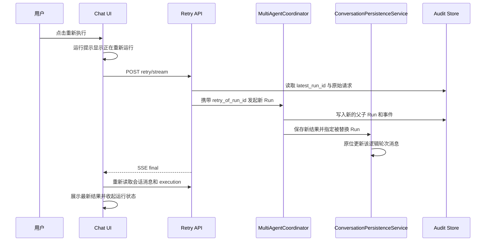

# 会话重试与用户态结果设计

## 1. 背景与问题

当前失败会话支持在原会话内重新执行，但实现仍把“重试”当作一条新的聊天请求：

1. 用户点击“重新执行”后，聊天区会短暂显示加载提示，独立状态卡却仍保持旧失败状态，导致用户误以为点击无效。
2. 每次重试都会再次持久化相同的用户消息和一条新的 Assistant 消息，运行次数越多，聊天窗口越拥挤。
3. `blocked`、`needs_clarification` 等内部状态没有用户态映射，界面最终显示“任务状态已更新”，无法说明任务是否完成。
4. Agent、Skill、Tool 等执行细节与业务结果混在同一信息层级。业务用户只需要在任务运行期间看到处理反馈；任务结束后的成功、审核拦截和补充信息要求均由 Assistant 消息表达，执行细节通过顶部“本轮追踪”查看。

本设计把“聊天轮次”和“执行尝试”分开：一次用户请求只形成一个逻辑聊天轮次；重试创建新的 Run，但更新该逻辑轮次的结果，不新增重复消息。

## 2. 设计目标

- 点击重试后立即、明确地显示“正在重新运行”。
- 重试期间保留原聊天内容，不用临时消息清空或占用聊天区。
- 一个逻辑轮次只展示一条用户消息和一条最新 Assistant 结果。
- 每次执行尝试继续生成独立 Run，并完整保留审计、事件、Artifact 和父子运行关系。
- 运行期间显示简洁的处理中反馈；任务结束后不再重复显示状态卡。
- 只有真正失败且服务端标记 `retryable=true` 时，显示“重新执行”按钮。
- 会话窗口不提供“查看详情”和“删除会话”；追踪入口统一使用顶部“本轮追踪”，删除入口只保留在历史会话列表。
- 技术状态、子 Agent、Skill 和 Tool 细节只在“本轮追踪”中展示。
- 保持当前路由、导航、主题、Agent 委派和治理机制不变。

## 3. 非目标

- 不实现手动停止运行中的任务。
- 不新增执行尝试时间线到聊天窗口。
- 不修改 General Agent 与业务 Agent 的路由策略。
- 不迁移或自动清理旧开发数据中已经存在的重复消息。本项目仍处于新项目阶段，新契约直接应用于后续写入。
- 不把运行追踪或审计日志删除、折叠为聊天消息。

## 4. 核心模型

### 4.1 逻辑聊天轮次与执行尝试

- 首次请求创建一个逻辑聊天轮次，同时创建父 Run。
- 重试创建新的父 Run，并在可信服务端上下文中携带 `retry_of_run_id`。
- `retry_of_run_id` 只能由重试 API 写入，普通聊天请求和浏览器请求体不能自行指定。
- 新 Run 完成后，持久化层按 `conversation_id + retry_of_run_id` 定位旧逻辑轮次，将用户消息与 Assistant 结果原位更新为新 Run 的结果。
- 如果旧 Run 没有形成消息，例如进程在持久化前失败，则按普通轮次补写一组消息。
- 如果旧数据形状异常，不能安全定位唯一轮次，则保留新结果并记录审计告警，避免因展示层异常覆盖业务执行结果。

消息表保存当前逻辑轮次的最新结果；审计表保存全部执行尝试。两者职责不同，不要求聊天消息承担审计历史职责。

### 4.2 用户态结果

`ConversationExecution` 保留内部 `status`，并增加稳定的用户态 `outcome`：

| 内部状态 | 用户态 outcome | 会话窗口行为 | 说明 |
|---|---|---|---|
| `idle` | `idle` | 不显示运行提示 | 尚未执行 |
| `running` | `processing` | 显示“正在处理”或“正在重新运行” | 由当前操作类型决定文案 |
| `completed` | `succeeded` | 收起运行提示 | 聊天区展示最新业务结果 |
| `waiting_for_approval` | `action_required` | 收起运行提示 | 保留现有审批入口 |
| `needs_clarification` | `action_required` | 收起运行提示 | Assistant 消息要求补充信息 |
| `failed`、`cancelled` 且 `retryable=true` | `not_completed` | 只显示“重新执行”按钮 | 详细技术原因进入顶部追踪 |
| `blocked`、`rejected`、`capability_denied` 及其他不可重试终态 | `not_completed` | 收起运行提示 | Assistant 消息表达业务结果 |

未知内部状态必须安全归入 `not_completed`，不能再次退化为“状态已更新”。

### 4.3 重试操作标识

用户点击重试后，前端立即渲染本地瞬时状态：

```json
{
  "status": "running",
  "outcome": "processing",
  "operation": "retry",
  "reason": "正在重新运行上一次请求，请稍候。",
  "retryable": false
}
```

服务端最终响应仍以真实 Run 状态为准。本地状态只负责即时反馈，不替代审计或服务端状态。

## 5. 数据流



## 6. 前端交互

### 6.1 点击重试

- 不调用会清空聊天区的 `showConversationNotice()`。
- 保留当前滚动位置和已有消息。
- 状态卡立即切换为“正在重新运行”。
- “重新执行”按钮禁用，并显示“重新运行中”。
- 输入框在本次重试完成前保持禁用，防止同一会话并发提交。
- 状态卡使用现有 `aria-live="polite"` 宣告变化。

### 6.2 任务结束后的呈现

- 成功：收起运行状态，聊天区只展示该轮最新业务结果。
- Review Block：收起运行状态，由 Assistant 消息说明审核未通过及原因，不显示“未完成”状态卡。
- 需要补充信息或等待审批：收起运行状态，由 Assistant 消息或现有审批控件说明下一步。
- 真正失败且 `retryable=true`：显示最小恢复操作区，只包含“重新执行”按钮，不显示状态标题、原因、详情或删除入口。
- 不可重试失败：收起运行状态，由 Assistant 消息说明结果；技术原因保留在顶部“本轮追踪”。
- 会话窗口不显示“查看详情”按钮，顶部“本轮追踪”是唯一追踪入口。
- 会话窗口不显示“删除会话”按钮；左侧历史会话列表继续提供删除入口。

### 6.3 信息密度

运行反馈保持紧凑，只在任务运行期间显示。任务结束后，聊天区只承载用户输入与业务结果；失败恢复区只保留“重新执行”按钮，不重复展示结果文案，也不承载内部状态消息。

## 7. 持久化与一致性

### 7.1 Store 契约

SQLite 和 PostgreSQL Conversation Store 增加同形的原子方法，用于按旧 Run 替换逻辑轮次：

- 校验 `conversation_id` 与旧 `run_id` 同时匹配。
- 原位更新用户消息和 Assistant 消息的 `run_id`、内容、Token 估算与实际回复 Agent。
- 更新会话 `updated_at`。
- 返回是否成功定位并替换唯一轮次。

### 7.2 摘要与长期记忆

- 原位替换保持消息 ID 不变。
- 如果被替换消息已经进入会话摘要，摘要必须失效并按当前消息重新生成，不能继续使用旧失败结果。
- 只有 `outcome=succeeded` 的逻辑轮次结果参与长期记忆提取；未完成、等待操作和执行尝试细节只进入审计。
- 重试替换失败时记录结构化审计事件，不静默吞掉数据一致性问题。

## 8. 错误处理

- Retry API 在新 Run 创建前失败：前端收起运行提示并恢复“重新执行”按钮，不改变聊天消息。
- SSE 中途断开：前端重新读取 execution；若服务端仍为 `running`，继续显示处理中，而不是直接判定失败。
- 新 Run 已完成但消息替换失败：Run 按真实结果结束，同时记录持久化错误；API 返回受控失败，避免向用户宣称结果已经保存。
- 用户切换会话：沿用 `chatSessionGuard`，旧重试结果不得覆盖新会话 UI。
- 未知内部状态：统一显示“未完成”，详情保留在追踪中。

## 9. 测试策略

### 9.1 Python 单元测试

- 内部状态到 `outcome` 的完整映射。
- SQLite/PostgreSQL 逻辑轮次原位替换。
- 无旧消息时补写新轮次。
- 异常消息形状不会误覆盖其他轮次。
- 摘要覆盖被替换消息时正确失效或重建。

### 9.2 API 集成测试

- 重试产生新 Run，旧 Run 保持失败终态。
- 重试后会话仍只有一条用户消息和一条最新 Assistant 结果。
- 多次重试仍不增加该逻辑轮次的消息数量。
- 审计中可以查询全部执行尝试。
- 服务端 execution 返回稳定 `outcome`。

### 9.3 前端契约与浏览器验收

- 点击重试后立即出现“正在重新运行”。
- 重试不会清空或追加聊天进度消息。
- 成功、Review Block、需要补充信息和不可重试失败结束后均不显示状态卡。
- 可重试失败只显示“重新执行”按钮。
- 会话窗口不显示“查看详情”和“删除会话”，顶部“本轮追踪”仍可打开追踪抽屉。
- 不再出现“任务状态已更新”。
- 桌面端与移动端运行提示、恢复按钮不遮挡输入框，不产生横向溢出。

## 10. 验收标准

1. 点击“重新执行”后，无需等待服务端首个 Token，用户即可看到运行反馈。
2. 同一用户请求重试任意次数，聊天区始终只保留一条用户消息和一条最新结果。
3. 审计与运行追踪仍可看到每次 Run，不因聊天去重而丢失。
4. 任务运行期间显示“正在处理”或“正在重新运行”，结束后立即收起运行状态。
5. 只有 `retryable=true` 的真正失败显示“重新执行”按钮，并且不附带重复状态文案。
6. 会话窗口没有“查看详情”和“删除会话”按钮；顶部追踪和历史会话删除入口保持可用。
7. 聊天区不再展示内部 Agent 状态，页面不再出现“任务状态已更新”这一模糊文案。
