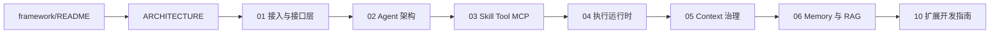
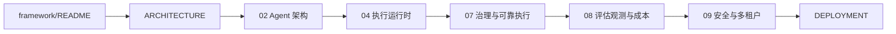
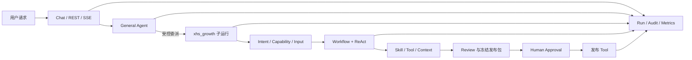

# AgentKit 框架详细文档体系设计

## 1. 背景

AgentKit 已有以下文档：

- `docs/ARCHITECTURE.md`：统一 Agent 架构、核心运行链路和企业治理边界。
- `docs/DEPLOYMENT.md`：本地、Docker、Linux、多实例部署和运维排障。
- `docs/AI_AGENT_系统学习与面试指南.md`：学习顺序、概念解释和面试准备。
- RAG、成本、XHS 和前端等专题文档。

现有文档已经能够回答“系统是什么”和“怎样部署”，但缺少一套按模块组织、能够从架构下钻到契约、源码、配置、调试、扩展和测试的开发手册。新加入项目的开发者仍需在多个设计规格、源码和测试之间自行拼装完整认识；架构评审和面试表达也缺少可直接引用的实现证据。

本设计建立 `docs/framework/` 文档集，作为 `ARCHITECTURE.md` 与源码之间的解释层。

## 2. 目标与非目标

### 2.1 目标

1. 同时服务新加入项目的开发者，以及架构评审和面试准备。
2. 采用“总索引 + 分层模块手册”，支持按需查阅和持续维护。
3. 解释接口接入、Agent、Skill/Tool/MCP、执行运行时、Context、Memory/RAG、可靠执行、评估观测、安全多租户和扩展开发。
4. 每个关键结论都能回到声明、契约、源码、配置或测试。
5. 使用 Mermaid 表达组件、时序、状态、数据流和治理关系。
6. 严格区分当前实现、设计理由、已知限制和演进建议。

### 2.2 非目标

1. 不重写或替代 `ARCHITECTURE.md`、`DEPLOYMENT.md` 和学习指南。
2. 不逐个函数翻译源码，不形成容易失效的 API 自动生成手册。
3. 不修改 AgentKit 运行时代码、契约或行为。
4. 不把规划能力描述成当前实现。
5. 不记录凭据、Cookie、完整运行 Prompt、隐藏推理或用户敏感数据。

## 3. 读者与阅读路径

### 3.1 开发者路径



### 3.2 架构评审与面试路径



## 4. 文档目录

新增目录和文件如下：

```text
docs/framework/
├── README.md
├── 01_INTERFACE_AND_ACCESS.md
├── 02_AGENT_ARCHITECTURE.md
├── 03_SKILLS_TOOLS_AND_MCP.md
├── 04_EXECUTION_RUNTIME_AND_LANGGRAPH.md
├── 05_CONTEXT_ENGINEERING_AND_GOVERNANCE.md
├── 06_MEMORY_AND_RAG.md
├── 07_GOVERNANCE_AND_DURABLE_EXECUTION.md
├── 08_EVALUATION_OBSERVABILITY_AND_COST.md
├── 09_SECURITY_MULTI_TENANCY_AND_RELIABILITY.md
├── 10_EXTENSION_GUIDE.md
├── REFERENCE.md
└── ROADMAP.md
```

`docs/framework/README.md` 是唯一总入口，负责：

- 定义文档定位、读者、阅读路径和术语。
- 链接 `ARCHITECTURE.md`、`DEPLOYMENT.md`、学习指南和各专题文档。
- 给出端到端请求主线和章节地图。
- 明确当前实现版本、文档证据规则和维护约定。

## 5. 各章节职责

### 5.1 `01_INTERFACE_AND_ACCESS.md`

解释 Web Chat、REST、SSE、CLI 和系统集成入口，覆盖：

- `/api/chat` 与 `/api/tasks` 的用途和差异。
- `TaskRequest`、`TaskResponse`、会话、父子运行和审批恢复契约。
- Web 身份、可信业务角色、权限检查和请求上下文边界。
- 同步与流式响应、错误状态和调试入口。

不重复部署端口、反向代理或容器启动命令；这些内容链接到 `DEPLOYMENT.md`。

### 5.2 `02_AGENT_ARCHITECTURE.md`

解释 Agent 在 AgentKit 中的定义与边界，覆盖：

- General Agent 与三个业务 Agent 的职责。
- 单轮 `@Agent`、自动委派和父子运行关系。
- `agent.md` 的声明结构、能力白名单、上下文策略和预算。
- A2A 上下文交接、隔离、失败传播和追溯。
- 为什么 Intent 与 Capability 是图节点而不是额外 Agent。

### 5.3 `03_SKILLS_TOOLS_AND_MCP.md`

解释业务能力层和外部执行层，覆盖：

- `SKILL.md`、`skill.yaml`、`scripts/` 和 `references/` 的职责。
- Skill 的渐进式披露、输入输出 Schema、编排、权限、预算和 Review。
- Python Tool、MCP Tool、Provider 与 Connector 的关系。
- `ToolExecutor` 的白名单、RBAC、Schema、风险、审批、幂等、超时、重试和审计顺序。
- XHS、招聘和客服作为三类不同 Skill 形态的实例。

### 5.4 `04_EXECUTION_RUNTIME_AND_LANGGRAPH.md`

解释统一业务图和执行策略，覆盖：

- Runtime 启动装配、Registry 和 Manifest。
- `UnifiedAgentGraph` 节点、状态、条件边和终止状态。
- Direct、Workflow、Batch、Parallel、ReAct、Plan-and-Execute 的选择条件和 LLM 调用位置。
- 自主预算、Plan/ReAct 子图、Artifact 交接和副作用冻结。
- LangGraph Checkpoint、Interrupt、Command 和 v2 GraphOutput。

### 5.5 `05_CONTEXT_ENGINEERING_AND_GOVERNANCE.md`

解释所有 LLM 节点如何获得受控上下文，覆盖：

- `agent.md`、`SKILL.md`、Context Pack 和运行时数据之间的关系。
- Runtime Context 与 Business Context 的目录边界。
- `context.yaml` 的 Source、Serializer、Truncator、预算和输出 Schema。
- `ContextRegistry`、`ContextAssembler`、`ContextInvocationService` 的装配顺序。
- 不可信数据边界、不可覆盖安全 Fragment、确定性裁剪、Token 预算和 Manifest Hash。
- 租户 Override、Golden 测试、调试采样和敏感 Prompt 保护。

### 5.6 `06_MEMORY_AND_RAG.md`

解释会话上下文、长期记忆和企业知识的区别，覆盖：

- 近期消息、会话摘要、长期 Memory、RAG 和 Artifact 的作用域。
- `ConversationContextService` 的组装顺序。
- Memory 提取、摘要、Embedding、向量检索和失败降级。
- RAG 摄取、加载、切分、OCR、检索、查询改写、重排和评估。
- SQLite/PostgreSQL/pgvector 后端及多租户、Agent、用户隔离。

### 5.7 `07_GOVERNANCE_AND_DURABLE_EXECUTION.md`

解释企业副作用和长任务如何可靠执行，覆盖：

- 执行前审批和执行后冻结内容审批。
- Review、有限修订和 Review 耗尽状态。
- Checkpoint、暂停、恢复、失败重试和原会话新 Run。
- 幂等键、结果未知、外部对账和不可回滚副作用。
- 会话状态投影、删除门控与审计保留边界。

### 5.8 `08_EVALUATION_OBSERVABILITY_AND_COST.md`

解释离线质量和在线运行质量，覆盖：

- EvalCase、Target、Check、Judge 和 Report。
- LLM、Gateway 和 Gateway Trace 三类评估目标。
- Golden Context、单元测试、集成测试和真实连接器测试边界。
- Run/Audit/Event、父子追踪、OpenTelemetry 和关键指标。
- Token、调用次数、延迟、预算、成本归因和 P95 分析方法。

### 5.9 `09_SECURITY_MULTI_TENANCY_AND_RELIABILITY.md`

解释横切治理边界，覆盖：

- 身份、角色、权限、Agent/Skill/Tool 白名单和租户配置。
- Prompt Injection、不可信数据、网络出口和 Secret 边界。
- 存储、会话、Memory、RAG、Artifact、Browser Profile 的隔离。
- 超时、重试、熔断、限流、并发、降级和故障分类。
- 单机与企业多实例部署的能力差异。

### 5.10 `10_EXTENSION_GUIDE.md`

以可执行清单说明如何新增：

- Agent。
- Skill/Capability。
- Python Tool 或 MCP Tool。
- Runtime/Business Context Pack。
- Memory、RAG、OCR、Media 或 Tool Backend Provider。
- Execution Strategy。

每种扩展都说明最小文件集合、注册路径、Schema、权限、预算、测试和文档同步要求。

### 5.11 `REFERENCE.md`

集中维护容易重复的大型参考表：

- 核心契约和状态枚举。
- API 与 CLI 入口。
- Agent、Skill、Tool、Context Pack 注册关系。
- 运行事件、配置项和源码地图。
- 关键测试到能力的映射。

正文模块只链接这些参考表，不复制完整内容。

### 5.12 `ROADMAP.md`

只记录当前限制、技术债和演进建议，并明确标注“未实现”。规划内容不得出现在当前实现流程图中。

## 6. 贯穿全书的请求主线

所有章节复用同一个真实示例：

> `@小红书 以“AI 改变生活”为主题，研究小红书 Top 5 文案，比较后写一篇原创文案并发布。`



各章只解释自己拥有的边界，通过链接指向相邻章节，避免重复。

## 7. 统一章节模板

每份模块文档按以下顺序编写：

1. 本章定位。
2. 职责与非职责。
3. 核心概念与关键契约。
4. Mermaid 组件图、时序图或状态图。
5. 当前实现与端到端数据流。
6. 关键源码入口。
7. 配置与租户覆盖。
8. 失败模式、错误传播和调试方法。
9. 扩展方法与稳定边界。
10. 测试、评估和发布门禁。
11. 面试表达：一句话定位、关键权衡、常见追问和项目证据。
12. 当前限制与演进方向。

并非每章机械复制相同篇幅；没有配置或状态机的模块可以缩短对应小节，但不得省略职责边界、源码证据和限制说明。

## 8. 事实、设计理由和规划的表达规则

每章使用以下语义标签：

- **当前实现**：有仓库声明、源码、配置或测试支撑。
- **设计理由**：解释当前实现选择的企业级权衡。
- **当前限制**：当前代码明确不支持或只支持部分场景。
- **演进建议**：尚未实现，只能进入对应章节末尾和 `ROADMAP.md`。

不得使用模糊的“系统支持”描述规划能力。涉及 XHS、浏览器、OCR 等特定 Agent 的实现，必须明确其属于业务 Skill/Tool，而不是 AgentKit 核心前提。

## 9. 证据与引用规则

1. 源码引用使用相对 Markdown 链接并写明类、函数或契约名称；不依赖容易漂移的行号。
2. 状态和接口以 dataclass、JSON Schema、API 路由和测试断言为准。
3. 配置说明同时核对 `config.py`、`.env.example`、租户 JSON 和 Runtime 装配入口。
4. 关键稳定性行为优先引用集成测试；局部契约引用单元测试。
5. Context 内容引用 Pack ID、Version、Source 和 Schema，不展示真实运行 Prompt。
6. 设计历史仅在需要解释权衡时链接 `docs/superpowers/specs/`，不把历史方案当作当前事实。

## 10. 验证与维护

### 10.1 编写完成后的验证

1. 扫描所有 Markdown 相对链接，确认目标存在。
2. 扫描文档引用的核心类、函数、配置项、状态和事件名，确认可在仓库找到。
3. 检查 Mermaid 围栏完整、节点 ID 唯一且文本可在 GitHub 渲染。
4. 扫描待办标记、待定标记、占位文本和未解释缩写。
5. 对照 `ARCHITECTURE.md`、`DEPLOYMENT.md` 和租户配置，检查 Agent 数量、版本、存储和执行流程一致。
6. 运行已有文档相关测试和必要的完整质量检查，确认文档修改未破坏仓库门禁。

### 10.2 后续维护触发条件

以下变更需要同步更新对应模块文档和 `REFERENCE.md`：

- Agent/Skill/Context 声明契约变化。
- 统一业务图节点、状态或策略变化。
- API、CLI、审批恢复或会话状态变化。
- Memory/RAG/Artifact/Checkpoint/Audit 存储边界变化。
- Tool 风险、权限、幂等或执行后端变化。
- Eval Target、运行事件、核心配置或部署能力变化。

纯内部重构且外部契约和行为不变时，不强制修改文档。

## 11. 验收标准

1. `docs/framework/README.md` 能导航到所有模块，并提供开发者和架构评审两条路径。
2. 十份核心模块文档、`REFERENCE.md` 和 `ROADMAP.md` 全部存在。
3. 每份核心模块文档至少包含一张 Mermaid 图、关键契约、源码入口、调试、测试和面试表达。
4. 所有相对链接可解析，关键代码符号和配置项可验证。
5. 文档不存在待办标记、待定标记、空章节或虚构能力。
6. 新文档与 `ARCHITECTURE.md`、`DEPLOYMENT.md`、README 和学习指南不存在事实冲突。
7. Git 变更只包含文档，不包含本地日志、数据库、浏览器 Profile 或其他用户文件。

## 12. 实施边界

本轮实施只创建和更新有效 Markdown 文档，不修改 Runtime、Agent、Skill、Context、测试逻辑或部署配置。编写过程中发现的代码缺口统一记录到 `ROADMAP.md`，不在文档任务中顺手修复。
