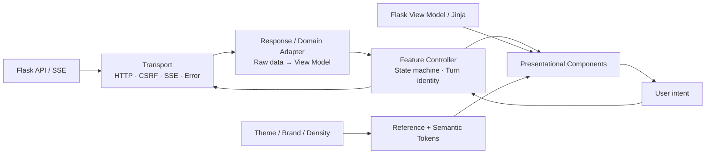
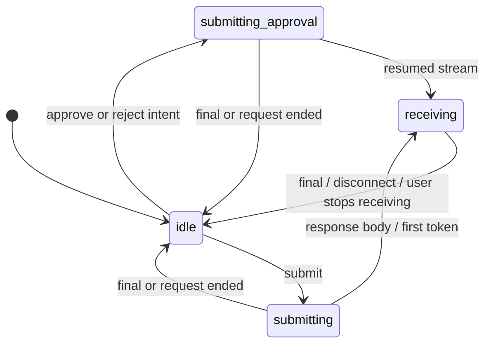
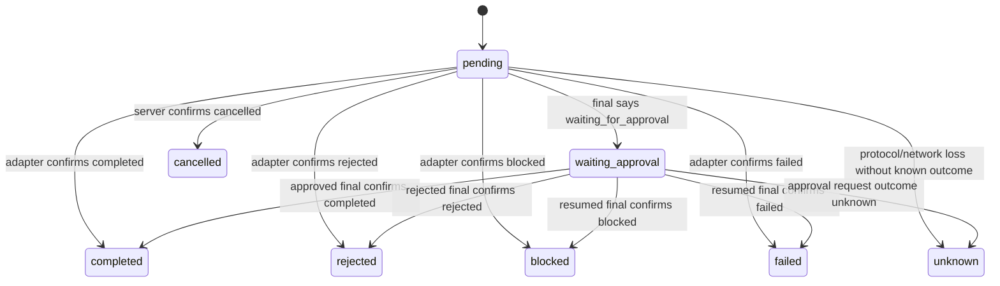

# AgentKit Web UI 改造设计

> 文档状态：Proposal
>
> 适用范围：`src/agentkit/web/` 及其后续 UI 演进
>
> 技术基线：Flask + Jinja + 原生 JavaScript + CSS
>
> 最后更新：2026-06-30

本文基于当前 Web 实现、现有页面截图和代码审查结果，定义 AgentKit 控制台的 UI 改造方向、Design Token、Theme 契约、组件边界、页面方案、迁移路径和验收标准。

本轮目标不是更换前端框架，也不是改变 AgentKit 的审批、权限、路由或执行逻辑，而是在现有 Flask 技术栈上形成一套可持续演进的 UI 工程体系。

---

## 1. 执行摘要

当前 UI 已经具备统一的暗色控制台风格，但整体显得笨重，主要原因不是颜色本身，而是以下因素叠加：

1. 固定侧栏、页头、KPI 和内容面板都占用较大空间，首屏有效信息密度偏低。
2. 几乎所有区域都使用相同的边框、阴影、圆角和强调线，主次层级不足。
3. Tenant、系统状态、Audit Store、Agent 状态等信息重复出现。
4. 小号全大写文字、宽字距、发光和脉冲效果较多，视觉噪声高于实际信息价值。
5. 表格被再次包裹在重面板中，形成“页面 → 卡片 → 表格容器”的多层边界。
6. Chat 页面把 Agent 配置、运行步骤、对话和技术结果平铺展示，主任务不够突出。
7. 部分状态是静态文案或不完整映射，视觉上可能表达出并不存在的健康或成功状态。
8. CSS 和 JavaScript 已分别增长到较大的单文件，展示逻辑、状态管理和业务输出渲染开始相互耦合。

### 1.1 目标体验

改造后的 UI 应符合以下关键词：

- **紧凑**：减少装饰性占位，让首屏承载更多有效信息，但不牺牲可读性和触控空间。
- **现代**：依赖清晰排版、留白、轻边界和渐进披露建立层级，而不是依赖普遍重阴影与发光。
- **专业**：所有状态可追溯、文案准确、交互可预测，技术信息与业务信息层次分明。
- **可扩展**：颜色、密度、品牌和 Theme 均通过稳定 Token 契约扩展。
- **可复用**：通用组件由明确 View Model 驱动，不读取业务原始响应，不推断权限或审批。
- **可访问**：键盘、读屏、缩放、对比度、动效偏好和移动端回流从组件设计阶段纳入。

### 1.2 非目标

- 不改变现有 Flask 路由、REST/SSE 协议和后端数据结构。
- 不改变 action/answer 分流、RBAC、审批和 Agent 执行语义。
- 不引入 React、Vue 或其他前端框架作为改造前提。
- 不为了“看起来丰富”而虚构趋势、健康状态、进度或业务指标。
- 不把移动端简单理解为桌面内容纵向堆叠。
- 不要求第一阶段引入 Design Token JSON、CSS 编译器或打包工具。

---

## 2. 关键技术决策

| 主题 | 决策 |
| --- | --- |
| 前端技术栈 | 保留 Flask、Jinja、原生 JavaScript 和原生 CSS，渐进改造。 |
| Token 载体 | 当前阶段以 CSS Custom Properties 为运行时事实来源。 |
| Token 分层 | Reference → System/Semantic → Component 三层。 |
| Theme | 首期交付 Dark；契约预留 Light、System、High Contrast，不要求首期同时实现。 |
| 品牌扩展 | `data-brand` 只允许覆盖品牌/主要操作范围，不得覆盖危险、告警、焦点和文本可读性。 |
| 密度 | `data-density` 独立于 Theme，支持 compact/comfortable，不通过换 Theme 改变组件尺寸。 |
| 组件形态 | Jinja macro 负责服务端初始结构；动态内容使用同一 class/data/ARIA 契约，优先通过 `<template>` 克隆。 |
| 状态来源 | 业务/API 提供事实状态；Adapter 统一映射；组件只负责呈现，不自行推断。 |
| 页面组织 | 每页一个主任务，次级详情通过 drawer、disclosure、popover 或详情区渐进展示。 |
| CSS 组织 | 使用 Cascade Layers 和按职责拆分的静态 CSS 文件，不依赖层叠偶然性。 |
| 规范兼容 | 命名和别名模型兼容 DTCG 思路；只有出现跨 Figma/Web/Mobile 交换需求时再引入 JSON Token 管线。 |

### 2.1 交付范围分层

为避免 UI 文档隐含扩大 API/业务范围，所有方案分为三层：

| 层级 | 当前范围 | 示例 |
| --- | --- | --- |
| **MVP：现有接口可完成** | 首期 UI 改造和验收范围 | Dark Token、compact density、Shell/页面布局、状态视觉映射、客户端 loading/error/stale guard、组件边界、键盘/焦点、reduced motion。 |
| **API-dependent：需要平台数据** | 先定义 UI 插槽和 fallback，不阻塞 MVP | 真实 System/Agent health、逐节点 Execution events、真实 Audit backend metadata、服务端过滤/分页、审批 risk summary、结构化 error code/request ID/status reconciliation、后端任务取消。 |
| **Future：设计系统扩展** | Token 契约现在预留，后续独立交付 | Light/System/High Contrast 完整 Theme、租户品牌配置、DTCG JSON 交换、构建期 Token 转换。 |

文档中的目标态方案不代表首期必须新增 API。MVP 遇到缺失数据时采用中性、诚实的 fallback；不得由前端模拟数据填补。

---

## 3. 当前实现与主要问题

### 3.1 全局 Shell

当前 [`base.html`](../../src/agentkit/web/templates/base.html) 同时展示侧栏 Tenant、顶栏 Tenant、静态 System Online 和 Audit Store 路径；
[`app.css`](../../src/agentkit/web/static/css/app.css) 将侧栏固定为 `268px`，页头本身又是一个高权重面板。

问题：

- 页面进入后，视觉注意力先被框架 metadata 吸引，而不是页面主任务。
- “System Online”没有真实健康数据依据。
- Audit Store 路径属于环境详情，不应占据每个页面的全局黄金位置。
- 侧栏在中小屏幕直接转成横向/纵向排列，缺少 drawer 或 compact rail 模式。

### 3.2 Overview

当前 [`overview.html`](../../src/agentkit/web/templates/overview.html) 使用五张等权 KPI 卡、两个表格面板、活动列表和 Capability 卡片。

问题：

- KPI 卡高度和间距偏大，五个指标视觉权重完全相同。
- `.panel.wide` 实际仍是单列跨度，容易产生非预期空白。
- Latest Activity 比静态 Business Impact 更具有操作价值，却没有获得更高层级。
- “Skills Online”等文案容易把“已注册”表达成“健康在线”。
- Capability 区缺少正式标题和清晰的页面叙事关系。

### 3.3 Chat

当前 [`chat.html`](../../src/agentkit/web/templates/chat.html) 将 Agent 大卡片、会话选择、固定高度聊天区、输入区、固定执行步骤和重复 Agent Status 同时放在首屏；
动态结果又渲染在整个 Chat layout 之后。

问题：

- 对话不是页面面积最大的主工作区。
- Agent 选择信息与右侧 Agent Status 重复。
- Answer Agent 也会看到行动型治理步骤，且结束后可能被统一标为完成。
- 聊天区最大高度仅 `360px`，形成页面滚动和内部滚动双重负担。
- 流式输出会持续强制滚到底部，用户向上阅读时会被打断。
- 会话切换、Agent 切换、SSE、审批和 DOM 渲染共享页面级状态，存在过期响应污染当前界面的风险。
- `renderBusinessOutput()` 直接识别 HR/XHS 字段，通用 Chat UI 已经感知领域业务。

### 3.4 Operations

当前 [`operations.html`](../../src/agentkit/web/templates/operations.html) 主要由运行表和通用事件表构成。

问题：

- 缺少搜索、状态/Agent/时间过滤和清空过滤入口。
- 只有状态 Badge 是链接，整行缺少明确的可操作提示。
- “Run Timeline”仍是普通表格，无法快速识别节点顺序、耗时、失败位置和展开详情。
- 在有限数据集和未来服务端分页之间没有明确边界。

### 3.5 Governance

当前 [`governance.html`](../../src/agentkit/web/templates/governance.html) 将 Agent、Tool、Skill、Prompt、Audit、Cost 等高密度数据平铺在同一页面。

问题：

- 所有 Registry 同时展开，页面缺少主要任务和查找路径。
- 宽表只能横向滚动，关键列与详情列没有分层。
- Audit Store 被固定标记为 SQLite，可能与真实部署不一致。
- 技术字段、文件路径、权限和 schema 更适合按需进入详情面板。

### 3.6 Login

当前 [`login.html`](../../src/agentkit/web/templates/login.html) 复用 `.page-shell` 和 `.sidebar-card`，并使用多处 inline style。

问题：

- 登录页会继承工作台侧栏偏移和 card 自动 margin，职责与布局不匹配。
- 登录按钮没有使用统一按钮组件。
- 错误颜色、间距和表单状态脱离 Design Token。
- 缺少独立 loading、显示/隐藏 token 和稳定错误区域。

### 3.7 可访问性与状态真实性

当前主要问题包括：

- 导航缺少 `aria-current` 和 Skip Link。
- Chat 输入只有 placeholder，没有稳定可访问名称。
- 自定义 Conversation listbox 缺少完整方向键、Home/End、Enter/Space、焦点归还和 `aria-selected`。
- 整个 Chat thread 使用 live region，逐 token 更新可能造成重复播报。
- 动态结果只平滑滚动，没有焦点管理。
- pulse 和 smooth scroll 未处理 reduced motion。
- muted 文本同时使用较低对比度和较小字号。
- 状态只覆盖 completed、running、failed，waiting、rejected、blocked、unknown 缺少完整语义。

### 3.8 基线截图追溯

本次用户提供的 Overview 宽屏截图记为 `OVERVIEW-BASELINE-2026-06-30`。原始浏览器视口、缩放比例和设备像素比尚未记录，因此截图只作为问题证据，不作为像素测量基准；Phase 0 必须将原图、真实视口和测试数据一起归档。

| 截图症状 | 实现根因 | 目标变化 | 验收方式 |
| --- | --- | --- | --- |
| 顶栏和侧栏占据大量首屏 | `268px` 固定侧栏；页头本身是重面板；metadata 重复 | `220–232px` 导航 + 轻量 Page Header；环境信息移入 Governance | `1440×900` 首屏仍能看到标题、核心 KPI 和主工作区 |
| 五张 KPI 卡高且等权 | 固定五列、大 padding、统一阴影 | compact `88px` / comfortable `96px` KPI strip；只保留 4–6 个最高优先级指标 | 首屏无需滚动即可扫描核心指标 |
| 面板层层套框，页面显重 | Panel、Table wrapper、背景均有边框/阴影 | 常规 surface 用轻边界；阴影只给 overlay | 视觉回归中常规内容不出现双重 elevation |
| Business Impact 下方与右侧出现大面积空白 | 通用两列网格；`.wide` 实际不跨列；内容高度差大 | 页面专属 12 列布局；Activity/Attention 按任务优先级排布 | 主要区域无意外空洞，内容顺序符合阅读任务 |
| Tenant、Online、Audit Store 抢占注意力 | 全局重复 metadata 和静态健康文案 | 每类全局事实只有一个权威位置；无健康数据时使用中性文案 | 页面不存在重复 Tenant；不再静态显示 Online |
| 小号大写文字与发光过多 | `0.62–0.7rem`、宽字距、pulse、普遍 accent | 辅助文字 `≥12px`；减少 uppercase；动效只用于真实变化 | 对比度、缩放和 reduced-motion 验收 |

---

## 4. UX 原则与业务边界

### 4.1 UX 原则

1. **任务优先**：页面结构首先服务用户当前任务，而不是展示所有平台能力。
2. **状态真实**：只展示有事实来源的在线、完成、失败、审批和进度状态。
3. **紧凑但不拥挤**：压缩重复边界和装饰，不压缩文字可读性、焦点和触控目标。
4. **渐进披露**：摘要先行；Plan、Audit、JSON、schema 和长说明按需展开。
5. **明确反馈**：loading、empty、partial、error、unknown、expired 都是独立状态，不能用空白代替。
6. **用户可控**：自动滚动、动效、Theme、详情展开不能抢夺阅读位置或焦点。
7. **响应式是重排**：不同宽度下改变信息优先级和交互容器，而不只是缩小或堆叠。
8. **可访问默认开启**：语义、键盘、焦点和状态公告是组件契约的一部分。
9. **未知安全回退**：未知状态、未知业务输出和 Theme 加载失败必须回退到可读的中性状态。

### 4.2 分层关系



### 4.3 各层职责

| 层 | 可以负责 | 不可以负责 |
| --- | --- | --- |
| Flask/业务层 | 权限、审批事实、Agent 能力、真实状态、指标计算、分页总量 | 通过颜色或 DOM 结构表达 UI 细节 |
| Transport | URL、CSRF、HTTP、SSE 解码、AbortSignal、标准错误 | 修改 DOM、判断业务成功、模糊失败后自动重复 action |
| Adapter | Raw response → 稳定 View Model；领域输出 → DomainResultVM | 发请求、操作焦点、执行审批 |
| Feature Controller | 请求 identity、stale guard、状态机、选中 Agent/Conversation、pending approval 集合 | 计算权限、伪造服务端完成状态、包含具体颜色 |
| Presentational Component | 布局、variant、键盘、焦点、loading/empty/error、responsive | 读取 raw API response、按 skill 名决定行为、构造可信业务 payload |
| Token/Theme | 颜色、字号、间距、形状、动效和视觉映射 | 判断在线、完成、审批或业务类型 |

### 4.4 不允许跨越的边界

- `StatusBadge` 不把任意字符串猜成 success；它只消费标准化的 `tone` 和可读 label。
- `StatCard` 不计算成功率；它只显示业务层已经给出的 label/value/helper。
- `DataTable` 不查询 API、不判断权限、不认识 HR/XHS 字段。
- `ApprovalCard` 不读取全局 `pendingApproval`，不构造审批 payload，不在服务端确认前显示 Approved。
- `ExecutionProgress` 不根据定时器模拟后端步骤，不把未发生步骤标为完成。
- `ChatMessage` 不直接识别 `ranked_candidates` 或 `campaign_summary`。
- 领域 Renderer 不发网络请求、不审批、不改变 Chat Controller 状态。
- Theme Switcher 只改变外观偏好，不改变状态、权限或数据。

---

## 5. 目标视觉与全局布局

### 5.1 全局 Shell

桌面目标结构：

- 侧栏由 `268px` 收窄到 `220–232px`。
- 可选 compact rail 为 `64px`，仅在图标和 tooltip 完整时启用。
- 页头使用 compact `min-height: 56px`、comfortable `min-height: 64px`，允许长标题/翻译自然增高，不再作为高阴影大卡片。
- Tenant 只保留一个权威展示位置。
- Audit Store、Runtime 版本和存储信息移到 Governance → Environment。
- System health 只有接入真实数据后才显示 Online；否则使用 Console ready/Configured 等非健康语义。
- 页面内容使用 12 列网格；主内容决定列宽，不再依赖模糊的 `.wide`。
- 常规内容通过背景层级和细边框区分；阴影只用于 dropdown、drawer、dialog、popover。

桌面 Shell 的目标关系如下；这是信息层级示意，不是像素级视觉稿：

```text
┌─ Global navigation 220–232 ─┬─ Page title / context ─────── Page actions ─┐
│ Brand                        ├─────────────────────────────────────────────┤
│ Overview                     │ Compact KPI / status strip                  │
│ Chat                         ├─────────────────────────────────────────────┤
│ Operations                   │                                             │
│ Governance                   │              Primary workspace              │
│                              │                                             │
│ Tenant / user menu           │                         Optional inspector  │
└──────────────────────────────┴─────────────────────────────────────────────┘
```

### 5.2 密度规范

| 项目 | Compact | Comfortable | Mobile/窄屏 |
| --- | ---: | ---: | ---: |
| 页面水平 padding | `20px` | `24px` | `16px`，极窄屏 `12px` |
| Page Header | `min-height: 56px` | `min-height: 64px` | `min-height: 56px`，允许换行增高 |
| 常规 Panel padding | `16px` | `20px` | `16px` |
| Panel/Grid gap | `12px` | `16px` | `12px` |
| KPI min-height | `88px` | `96px` | `72px` 或紧凑列表 |
| 表头高度 | `36px` | `40px` | `40px` |
| 表格行高 | `40px` | `48px` | `44px` 或摘要卡 |
| Control/Button 高度 | `36px` | `40px` | `44px` |
| Status Badge 高度 | `22px` | `24px` | `24px` |
| 正文 | `14px / 1.5` | `14px / 1.55` | `14px / 1.5` |
| 辅助文字 | `12px / 1.4` | `13px / 1.4` | `13px / 1.4` |
| 页面标题 | `26px` | `28px` | `24px` |
| 区块标题 | `16px` | `18px` | `18px` |
| Chat 文字行宽 | `72ch` | `76ch` | 容器宽度 |
| Chat Inspector | `304px` | `320px` | drawer/bottom sheet |

数据表 body 可取消额外 Panel padding，避免 Panel 与 Table wrapper 双重留白。以上为实现 Token 的默认值；响应式覆盖由布局规则决定，不再由开发者从范围中自行选择。

### 5.3 视觉减重规则

- 移除常规 Panel 的普遍重阴影，保留轻边框或相邻 surface 差异。
- 降低背景网格透明度；登录页和 Chat 工作区可完全移除网格。
- Accent 只用于主要操作、选中态、链接和关键焦点，不用于每个标题装饰。
- 减少全大写与超宽字距；仅保留在极短状态、表头或机器标识中。
- 每个独立任务或决策区域最多一个 primary action 视觉层级；例如 Chat Composer 的 Send 与当前 ApprovalCard 的 Approve 属于不同决策区域。
- 不使用无限 pulse 表达静态配置状态。
- 技术 ID 使用 monospace；业务正文和导航使用 sans-serif。

---

## 6. Design Token 系统

### 6.1 命名与层级

所有 Token 使用 `--ak-` 前缀：

```text
--ak-ref-*   Reference：原始调色板、尺寸、间距、字体、动效
--ak-sys-*   System/Semantic：Theme 必须实现的公共语义契约
--ak-cmp-*   Component：仅在组件需要稳定定制边界时定义
```

组件默认消费 System Token。不要为每条 CSS 声明机械创建 Component Token。

### 6.2 Reference Token

Reference Token 只描述原始设计值，不表达用途，组件不得直接消费：

```css
@layer tokens {
  :root {
    --ak-ref-color-neutral-0: #ffffff;
    --ak-ref-color-neutral-50: #f4f7fb;
    --ak-ref-color-neutral-200: #d7e0ea;
    --ak-ref-color-neutral-400: #93a4b8;
    --ak-ref-color-neutral-500: #52657b;
    --ak-ref-color-neutral-600: #3a4c63;
    --ak-ref-color-neutral-700: #263447;
    --ak-ref-color-neutral-750: #1a2635;
    --ak-ref-color-neutral-800: #172231;
    --ak-ref-color-neutral-850: #111a25;
    --ak-ref-color-neutral-900: #0d141d;
    --ak-ref-color-neutral-925: #0a1018;
    --ak-ref-color-neutral-950: #080c12;

    --ak-ref-color-teal-400: #2dd4bf;
    --ak-ref-color-teal-500: #14b8a6;
    --ak-ref-color-teal-alpha-12: rgba(45, 212, 191, 0.12);
    --ak-ref-color-cyan-300: #7dd3fc;
    --ak-ref-color-blue-950: #10243c;
    --ak-ref-color-blue-700: #295b91;
    --ak-ref-color-blue-400: #60a5fa;
    --ak-ref-color-blue-alpha-12: rgba(96, 165, 250, 0.12);
    --ak-ref-color-green-950: #0e2b25;
    --ak-ref-color-green-700: #1d705d;
    --ak-ref-color-green-400: #34d399;
    --ak-ref-color-amber-950: #302511;
    --ak-ref-color-amber-700: #7a5b1e;
    --ak-ref-color-amber-400: #f5b73d;
    --ak-ref-color-red-950: #32181c;
    --ak-ref-color-red-700: #7a3038;
    --ak-ref-color-red-400: #f87171;

    --ak-ref-color-scrim: rgba(3, 7, 12, 0.72);
    --ak-ref-shadow-raised: 0 8px 24px rgba(0, 0, 0, 0.28);
    --ak-ref-shadow-overlay: 0 16px 48px rgba(0, 0, 0, 0.42);

    --ak-ref-space-0: 0;
    --ak-ref-space-1: 0.25rem;
    --ak-ref-space-2: 0.5rem;
    --ak-ref-space-3: 0.75rem;
    --ak-ref-space-4: 1rem;
    --ak-ref-space-5: 1.25rem;
    --ak-ref-space-6: 1.5rem;
    --ak-ref-space-8: 2rem;

    --ak-ref-radius-sm: 0.375rem;
    --ak-ref-radius-md: 0.5rem;
    --ak-ref-radius-lg: 0.75rem;
    --ak-ref-radius-full: 999px;

    --ak-ref-duration-instant: 0ms;
    --ak-ref-duration-fast: 120ms;
    --ak-ref-duration-normal: 200ms;
    --ak-ref-ease-standard: cubic-bezier(0.2, 0, 0, 1);
  }
}
```

以上色值是初始建议，进入实现前必须用真实页面组合验证对比度，而不是把示例值视为不可变品牌规范。

### 6.3 System/Semantic Token

Semantic Token 表达用途，是 Theme 必须完整实现的契约。`tokens.css` 中的 Semantic section 同时提供完整的默认 Dark fallback，因此不再单独维护重复的 `theme-dark.css`；Light/High Contrast 只覆盖这套 System Token：

```css
@layer tokens {
  :root,
  :root[data-theme="dark"] {
    color-scheme: dark;

    --ak-sys-color-bg-canvas: var(--ak-ref-color-neutral-950);
    --ak-sys-color-bg-surface: var(--ak-ref-color-neutral-900);
    --ak-sys-color-bg-raised: var(--ak-ref-color-neutral-850);
    --ak-sys-color-bg-inset: var(--ak-ref-color-neutral-925);
    --ak-sys-color-bg-overlay: var(--ak-ref-color-scrim);

    --ak-sys-color-text-primary: var(--ak-ref-color-neutral-50);
    --ak-sys-color-text-secondary: var(--ak-ref-color-neutral-200);
    --ak-sys-color-text-muted: var(--ak-ref-color-neutral-400);
    --ak-sys-color-text-disabled: var(--ak-ref-color-neutral-500);
    --ak-sys-color-text-inverse: var(--ak-ref-color-neutral-950);

    --ak-sys-color-border-subtle: var(--ak-ref-color-neutral-750);
    --ak-sys-color-border-default: var(--ak-ref-color-neutral-700);
    --ak-sys-color-border-strong: var(--ak-ref-color-neutral-600);

    --ak-sys-color-accent-default: var(--ak-ref-color-teal-400);
    --ak-sys-color-accent-strong: var(--ak-ref-color-teal-500);
    --ak-sys-color-accent-soft: var(--ak-ref-color-teal-alpha-12);

    --ak-sys-color-brand-primary-bg: var(--ak-sys-color-accent-default);
    --ak-sys-color-brand-primary-fg: var(--ak-ref-color-neutral-950);
    --ak-sys-color-brand-primary-hover-bg: var(--ak-sys-color-accent-strong);
    --ak-sys-color-brand-primary-border: var(--ak-sys-color-accent-strong);

    --ak-sys-color-action-primary-bg: var(--ak-sys-color-brand-primary-bg);
    --ak-sys-color-action-primary-fg: var(--ak-sys-color-brand-primary-fg);
    --ak-sys-color-action-primary-hover-bg:
      var(--ak-sys-color-brand-primary-hover-bg);
    --ak-sys-color-link: var(--ak-sys-color-accent-default);
    --ak-sys-color-focus-ring: var(--ak-ref-color-cyan-300);

    --ak-sys-color-status-success-fg: var(--ak-ref-color-green-400);
    --ak-sys-color-status-success-bg: var(--ak-ref-color-green-950);
    --ak-sys-color-status-success-border: var(--ak-ref-color-green-700);
    --ak-sys-color-status-info-fg: var(--ak-ref-color-blue-400);
    --ak-sys-color-status-info-bg: var(--ak-ref-color-blue-950);
    --ak-sys-color-status-info-border: var(--ak-ref-color-blue-700);
    --ak-sys-color-status-warning-fg: var(--ak-ref-color-amber-400);
    --ak-sys-color-status-warning-bg: var(--ak-ref-color-amber-950);
    --ak-sys-color-status-warning-border: var(--ak-ref-color-amber-700);
    --ak-sys-color-status-danger-fg: var(--ak-ref-color-red-400);
    --ak-sys-color-status-danger-bg: var(--ak-ref-color-red-950);
    --ak-sys-color-status-danger-border: var(--ak-ref-color-red-700);
    --ak-sys-color-status-neutral-fg: var(--ak-ref-color-neutral-200);
    --ak-sys-color-status-neutral-bg: var(--ak-ref-color-neutral-850);
    --ak-sys-color-status-neutral-border: var(--ak-ref-color-neutral-600);

    --ak-sys-shadow-raised: var(--ak-ref-shadow-raised);
    --ak-sys-shadow-overlay: var(--ak-ref-shadow-overlay);

    --ak-sys-focus-width: 2px;
    --ak-sys-focus-offset: 2px;
    --ak-sys-motion-fast: var(--ak-ref-duration-fast);
    --ak-sys-motion-normal: var(--ak-ref-duration-normal);
    --ak-sys-motion-easing: var(--ak-ref-ease-standard);
  }
}
```

语义层禁止使用 `green`、`dark`、`teal-button` 等外观绑定命名。

### 6.4 Component Token

只有组件需要跨 Theme 保持可覆盖契约时才增加：

```css
:root {
  --ak-cmp-button-primary-bg: var(--ak-sys-color-action-primary-bg);
  --ak-cmp-button-primary-fg: var(--ak-sys-color-action-primary-fg);

  --ak-cmp-panel-bg: var(--ak-sys-color-bg-surface);
  --ak-cmp-panel-border: var(--ak-sys-color-border-subtle);

  --ak-cmp-chat-user-bg: var(--ak-ref-color-blue-alpha-12);
  --ak-cmp-chat-assistant-bg: var(--ak-sys-color-bg-raised);
}

@supports (background: color-mix(in srgb, currentColor, transparent)) {
  :root {
    --ak-cmp-chat-user-bg: color-mix(
      in srgb,
      var(--ak-sys-color-status-info-fg) 12%,
      transparent
    );
  }
}
```

Custom Property 中的未知函数可能直到消费时才失效，因此新 CSS 能力必须通过 `@supports` 覆盖可靠 fallback，不能只重复声明同一个变量。

### 6.5 Theme、Brand 与 Density 三个独立轴

```html
<html
  lang="{{ page_language | default('en') }}"
  data-theme="{{ theme | default('dark') }}"
  data-brand="{{ brand | default('default') }}"
  data-density="{{ density | default('compact') }}"
>
```

- `data-theme`：控制明暗、高对比和 surface/text/border 关系。
- `data-brand`：只控制 Logo、品牌 Accent、主要操作等有限范围。
- `data-density`：控制间距、行高、control 高度，不改变颜色。

```css
:root[data-density="compact"] {
  --ak-sys-size-control-sm: 2rem;
  --ak-sys-size-control-md: 2.25rem;
  --ak-sys-size-row: 2.5rem;
  --ak-sys-space-panel: var(--ak-ref-space-4);
}

:root[data-density="comfortable"] {
  --ak-sys-size-control-sm: 2.25rem;
  --ak-sys-size-control-md: 2.5rem;
  --ak-sys-size-row: 3rem;
  --ak-sys-space-panel: var(--ak-ref-space-5);
}
```

移动端触控目标仍需满足产品定义的最小尺寸，不能机械沿用桌面 compact control 高度。

Theme 规则：

1. `:root` 必须包含完整、安全的默认 Token。
2. Theme 只覆盖 System Token，不复制所有组件 CSS。
3. 未知 Theme 回退为默认 Dark，而不是留下半套变量。
4. 品牌覆盖必须成对提供并验证 `primary-bg/primary-fg/hover-bg/border`；不得改变 success/warning/danger、焦点和正文对比度。
5. 租户输入必须白名单化，不得直接拼入 `<style>`、URL 或任意 class。
6. 无 JavaScript 时必须保持默认 Theme 完整可用。
7. 优先由 Flask 根据 Cookie 渲染 `data-theme`，避免首屏闪烁。
8. 若使用本地偏好，使用外部 `theme-init.js`，兼容严格 CSP，不依赖 inline script。
9. OS forced-colors/high-contrast 优先于品牌美化。

偏好优先级固定为：合法用户偏好 → 合法租户默认 → `system` → 项目默认 Dark。Flask 必须先对白名单值进行规范化，模板中的 `default()` 不能替代安全校验。

首期以 Cookie 作为服务端与客户端共同的偏好来源；如果同时保留 localStorage，Theme 切换时必须同步 Cookie，且冲突时以 Cookie 中已验证的用户偏好为准。为支持无刷新切换，Theme CSS 应预加载并通过 selector 隔离，加载顺序为：Reference → 默认 Semantic/Dark → optional Themes → Brand → Density。

`system` 保存的是用户偏好，最终有效 Theme 由 `prefers-color-scheme` 解析：

```css
@media (prefers-color-scheme: light) {
  :root[data-theme="system"] {
    color-scheme: light;
    /* 与 Light Theme 相同的完整 Semantic Token 覆盖 */
  }
}
```

```css
@media (pointer: coarse) {
  :root {
    --ak-sys-size-control-sm: 2.75rem;
    --ak-sys-size-control-md: 2.75rem;
  }
}
```

触控目标取决于输入能力，不只取决于视口宽度；宽屏触控设备同样适用 coarse-pointer 覆盖。

主动选择的 `data-theme="high-contrast"` 是持久化 Theme；`prefers-contrast: more` 是对当前 Theme 的增强提示；`forced-colors: active` 则交由操作系统颜色接管。三者不得合并成同一个开关，也不得全局禁用 forced-color adjustment。

### 6.6 状态语义

业务原始状态必须先由 Adapter 映射成有限 UI 状态：

| 原始状态示例 | UI key | 默认 tone | 表达要求 |
| --- | --- | --- | --- |
| `completed`, `success` | `success` | success | 文字 + 完成图标 + 颜色 |
| `running`, `processing`, `streaming` | `running` | info | 当前动作或忙碌状态 |
| `waiting_for_approval`, `pending` | `waiting` | warning | 等待原因 + 下一步 |
| `rejected` | `rejected` | neutral | 明确“未执行”，不伪装失败或成功 |
| `cancelled` | `cancelled` | neutral | 仅服务端确认取消后使用；前端 Stop 不映射到此状态 |
| `blocked` | `blocked` | danger | 阻断原因和恢复条件 |
| `failed`, `error` | `failed` | danger | 错误摘要和恢复操作 |
| `configured`, `ready` | `configured` | neutral/info | 不得显示为 Online |
| 未知新状态 | `unknown` | neutral | 保留可读原始文本，不回退成成功 |

`online` 只有在存在真实健康来源和更新时间时才允许使用。

### 6.7 Typography、层级和动效 Token

建议定义：

- 字体族：`sans`、`mono`；系统字体必须作为可靠 fallback，不依赖远程字体才能正确布局。
- 字号：以 rem 实现 `0.75 / 0.8125 / 0.875 / 1 / 1.125 / 1.5 / 1.75rem`；表格中的 px 仅用于设计评审换算。
- 行高：compact metadata `1.35`，正文 `1.5`，长文本 `1.6`。
- 字重：regular `400`、medium `500`、semibold `600`、bold `700`。
- z-index：base、sticky、dropdown、drawer、modal、toast 六个有限层级。
- 动效：instant、fast `120ms`、normal `200ms`；禁止 `transition: all`。
- Control、表格行和 Header 使用 `min-block-size`，不使用会阻断文本缩放的固定 `height`。

统一焦点样式应使用真实 outline：

```css
:where(a, button, input, select, textarea, summary, [tabindex]):focus-visible {
  outline: var(--ak-sys-focus-width) solid var(--ak-sys-color-focus-ring);
  outline-offset: var(--ak-sys-focus-offset);
}
```

```css
@media (prefers-reduced-motion: reduce) {
  *,
  *::before,
  *::after {
    animation-duration: 0.01ms;
    animation-iteration-count: 1;
    scroll-behavior: auto;
    transition-duration: 0.01ms;
  }
}
```

CSS 规则不能可靠覆盖 JavaScript 显式传入的 smooth behavior；所有滚动 helper 也必须读取同一媒体偏好：

```js
const reduceMotion = matchMedia("(prefers-reduced-motion: reduce)").matches;

target.scrollIntoView({
  behavior: reduceMotion ? "auto" : "smooth",
  block: "nearest",
});
```

实现应监听偏好变化，不能只在页面加载时读取一次。

### 6.8 Required Token Manifest

实现阶段必须维护机器可读或测试可枚举的 Required Token 清单。以下分组为 Theme/Brand/Density 的最低公共契约：

| Token/模式 | 类型 | 必需 | 可覆盖轴 | 验证重点 |
| --- | --- | --- | --- | --- |
| `--ak-sys-color-bg-{canvas,surface,raised,inset,overlay}` | color | 是 | Theme | surface 层级可区分 |
| `--ak-sys-color-text-{primary,secondary,subtle,muted,disabled,inverse}` | color | 是 | Theme | 与对应 surface 的文本对比度；小字号辅助文案使用可达 4.5:1 的 subtle |
| `--ak-sys-color-border-{subtle,default,strong,interactive}` | color | 是 | Theme | 非文本 UI 对比度；interactive 与相邻 surface 至少 3:1 |
| `--ak-sys-color-accent-{default,strong,soft}` | color | 是 | Theme + approved Brand | 链接、选中、装饰的共享基础，不等同于按钮 |
| `--ak-sys-color-brand-primary-{bg,fg,hover-bg,border}` | color | 是 | Brand + Theme | bg/fg 必须成对验证 |
| `--ak-sys-color-action-primary-{bg,fg,hover-bg}` | color | 是 | Theme alias | 不允许 Brand 只替换背景 |
| `--ak-sys-color-status-{success,info,warning,danger,neutral}-{fg,bg,border}` | color | 是 | Theme | 每个 tone 作为完整组合验证 |
| `--ak-sys-color-focus-ring`、`--ak-sys-focus-{width,offset}` | color/length | 是 | Theme | focus 可见性和相邻对比度 |
| `--ak-sys-font-{sans,mono}`、字号/字重/行高尺度 | typography | 是 | Theme 可替换字体 | fallback、缩放和中英文排版 |
| `--ak-sys-radius-{sm,md,lg,full}` | length | 是 | Theme | inset、surface、overlay 维持 6/8/12px 的稳定层级，胶囊形态仅使用 full |
| `--ak-sys-size-{control-sm,control-md,row,stat-card}`、`--ak-sys-space-{panel,grid}` | dimension | 是 | Density | compact 不缩小正文、焦点或触控下限；卡片与网格不各自定义间距 |
| `--ak-sys-size-{sidebar,sidebar-narrow,page-header}`、`--ak-sys-space-page` | dimension | 是 | Layout + Density | Shell 不重复硬编码宽度，长标题允许自然增高 |
| `--ak-sys-motion-{fast,normal,easing}` | duration/easing | 是 | Motion preference | reduced-motion 可覆盖 |
| `--ak-sys-shadow-{raised,overlay}` | shadow | 是 | Theme | 仅 overlay/elevated 使用 |
| z-index 有限尺度 | number | 是 | 不允许 Brand 覆盖 | 不产生任意 z-index 竞争 |

Theme 完整性测试必须读取浏览器 computed value，验证变量非空且没有未解析引用；仅扫描变量名存在不能发现 alias 缺失或循环依赖。

Status icon 默认继承对应 `*-fg`；只有图标颜色确实需要独立对比度契约时才增加 `*-icon`，避免无意义复制 Token。

### 6.9 Token 治理规则

组件和页面 CSS 必须遵守：

- 原始颜色只允许出现在 Reference/Theme 文件。
- 禁止新增 inline style。
- 禁止用 `!important` 处理架构性层叠冲突。
- 禁止 `transition: all`。
- 禁止用 ID 选择器承担组件视觉样式。
- 禁止把关键文本仅放在伪元素 `content` 中。
- 禁止移除 outline 而不提供等价 `:focus-visible`。
- 禁止 JavaScript 根据具体颜色或视觉 class 推断业务状态。
- Breakpoint 暂以文档常量维护；CSS Custom Property 不能直接作为标准 media query 条件。

---

## 7. CSS 与静态资源组织

建议目录：

```text
src/agentkit/web/static/css/
├── layer-order.css
├── tokens.css               # Reference + Semantic/default Dark
├── themes/
│   ├── theme-light.css
│   └── theme-high-contrast.css
├── base.css                 # reset + typography + accessibility
├── layout.css               # shell + grids
├── components.css           # shared primitives/patterns
├── pages/
│   ├── login.css
│   ├── overview.css
│   ├── chat.css
│   ├── operations.css
│   └── governance.css
├── utilities.css
└── legacy.css               # 迁移期，最终删除
```

当前无 bundler 阶段先保持 4–6 个粗粒度请求；如果未来引入构建管线，再把 `components.css` 拆成源码模块并输出单一压缩产物。

统一层叠顺序：

```css
/* layer-order.css：必须最先加载 */
@layer reset, tokens, legacy, base, layout, components, pages, utilities, overrides;
```

在没有 bundler 的当前阶段：

- 使用多个顺序固定的 `<link>`，不要用多层 CSS `@import` 制造串行加载。
- `base.html` 提供页面样式 block，只加载必要 page CSS。
- Token/Base/共享组件全局加载，页面 CSS 按页加载。
- 后续若引入构建步骤，再合并和压缩产物，不改变源码分层。
- 旧 `app.css` 迁移期改名或包装为 `@layer legacy { ... }`；未分层 legacy 会压过所有普通 layered rules，禁止长期混用。
- 如果暂时无法包装 legacy，则在完成包装前不要启用 Cascade Layers，不能假设 `<link>` 顺序可以解决 unlayered/layered 优先级。
- 旧变量保留兼容别名，避免一次性重写。

兼容别名示例：

```css
:root {
  --bg: var(--ak-sys-color-bg-canvas);
  --surface: var(--ak-sys-color-bg-surface);
  --ink: var(--ak-sys-color-text-primary);
  --muted: var(--ak-sys-color-text-muted);
  --accent: var(--ak-sys-color-accent-default);
}
```

### 7.1 浏览器基线与渐进增强

实施前必须在项目支持矩阵中明确浏览器最低版本。以下能力均需要单独记录 fallback：

- Cascade Layers：legacy 未包装前不启用。
- `color-mix()`：Reference fallback + `@supports` 覆盖。
- `dvh`：先声明 `vh`，再声明 `dvh`。
- 原生 `<dialog>`/Popover：不支持时回退为普通 disclosure/drawer，不阻断核心任务。
- Container Query：可用于组件增强；全局 breakpoint 仍保留 media query fallback。
- forced-colors：使用 `Canvas`、`CanvasText`、`ButtonText`、`Highlight` 等系统颜色，不全局设置 `forced-color-adjust: none`。

```css
.viewport-shell {
  min-block-size: 100vh;
  min-block-size: 100dvh;
}
```

---

## 8. 通用组件体系与边界

每个组件必须记录：Purpose、Inputs、Variants、States、Events、Accessibility 和 Non-responsibilities。

### 8.1 基础组件

| 组件 | 主要输入/状态 | 业务边界 |
| --- | --- | --- |
| `Button` | label、icon、primary/secondary/danger/ghost、disabled、busy | 不决定用户是否有权限；只呈现调用方给出的状态。 |
| `IconButton` | icon、accessible label、tooltip、pressed | 不允许无名称图标按钮。 |
| `Field` | label、description、error、required、control | 不做业务校验，只展示标准化校验结果。 |
| `StatusBadge` | label、tone、icon、compact | 不接收 raw response，不把未知状态猜成 success。 |
| `InlineNotice` | info/warning/danger/success、title、message、actions | 不决定重试是否安全。 |
| `EmptyState` | title、description、optional action | 不自行判断业务空态原因。 |
| `Skeleton` / `Spinner` | label、size、delay | 只表达进行中；不能代替真实进度。 |
| `Disclosure` | title、meta、expanded、onToggle | 不加载业务数据；需要懒加载时由 controller 负责。 |
| `Dialog` / `Drawer` | title、open、actions、onClose | 负责 focus trap/return，不执行具体业务动作。 |
| `Tabs` | items、selectedId、onSelect、activation mode | 负责 Arrow/Home/End、ARIA 关联和焦点策略；无法完整实现时使用普通链接/独立路由。 |
| `Tooltip` | content、placement | 不能承载完成任务所必需的唯一信息。 |

### 8.2 布局与数据组件

| 组件 | 主要输入/状态 | 业务边界 |
| --- | --- | --- |
| `AppShell` | nav items、active item、tenant summary、user menu | 不判断当前路由权限，不生成健康状态。 |
| `PageHeader` | title、description、actions、context | 不显示无数据来源的全局 metadata。 |
| `Panel` | title、meta、actions、density | 不强制所有内容使用相同 elevation。 |
| `StatCard` | label、value、helper、tone、trend? | 不计算指标；无 trend 数据时不显示趋势。 |
| `DataTable` | caption、columns、rows、row action、empty state | 不 fetch、不做服务端分页、不解析领域字段。 |
| `FilterBar` | filter definitions、values、onChange、onClear | 只操作已声明过滤条件，不虚构全局搜索范围。 |
| `Timeline` | ordered events、status、time、duration、details | 不推断缺失节点，也不模拟进度。 |
| `KeyValueList` | items、copyable、masked | 不决定字段是否敏感；由调用方提供显示策略。 |
| `JsonViewer` | value、title、expanded、copy | 只用于技术详情，默认折叠，不承担业务摘要。 |

### 8.3 Chat 与治理组件

| 组件 | 主要输入/状态 | 业务边界 |
| --- | --- | --- |
| `AgentSwitcher` | AgentVM[]、selectedId、loading、disabled | 不根据 skill 推断 action/answer；使用 `actionsEnabled` 事实字段。 |
| `ConversationPicker` | RemoteData<ConversationVM[]>、selectedId | 不发请求；完整支持 keyboard/focus 契约。 |
| `ChatLog` | messages、stream draft、follow mode | 不负责 API；只在用户接近底部时自动跟随。 |
| `ChatMessage` | role、author、content、status、timestamp | 不读取领域 output；Markdown 必须经过安全渲染。 |
| `ChatComposer` | draft、phase、canSend、onSubmit、onCancel | 不直接构造可信 roles/approval；提交意图交给 controller。 |
| `ExecutionStatus` | agent kind、status、真实 steps、error | 不使用固定五步覆盖所有 Agent，不模拟未发生步骤。 |
| `ApprovalCard` | ApprovalViewVM、onIntent(approvalId, intent) | 不接触 thread/request payload；每张卡只发送实例 ID 与用户意图。 |
| `ExecutionDetails` | 已脱敏的 ExecutionDetailsVM | 默认折叠；不读取 raw payload，不与用户结果争夺首要层级。 |
| `StatusAnnouncer` | message、polite/assertive | 独立于可视聊天文本，避免逐 token 重复播报。 |
| `DomainResultRenderer` | DomainResultVM | raw 领域字段只在 DomainAdapter；Renderer 只读取领域 VM，不发请求、不审批。 |

### 8.4 推荐 View Model

以下为概念契约，不要求项目改用 TypeScript：

```text
RemoteData<T> =
  idle | loading | success(T) | empty | error(UiError)

UiError {
  code
  userMessage
  outcomeKnown
  retryable
  retrySafety: safe | confirm | unsafe | unknown
}

AgentVM {
  id
  label
  domain
  mission
  availability
  actionsEnabled
  allowedSkills
  demoPrompt
}

MessageVM {
  id
  role: user | assistant | system
  authorLabel
  content
  delivery: pending | streaming | complete | partial | stopped_receiving
  createdAt?
}

ApprovalViewVM {
  clientId
  agentId
  skills
  reason
  riskSummary?
  safeRequestSummary
  status: ApprovalStatus
}

ApprovalCommandContext {         # Controller 私有，不进入 DOM/View Model
  clientId
  threadId
  originalRequest
  skills
}

ExecutionDetailsVM {
  planRows
  auditRows
  safeJsonText?
}

ChatTurnVM {
  id
  kind: answer | action
  outcome: TurnOutcome
  conversationId
  assistantText
  approval?
  execution?
  domainResult?
  error?
}

ChatControllerPhase = idle | submitting | receiving | submitting_approval

TurnOutcome = pending | waiting_approval | completed | rejected |
              blocked | failed | unknown | cancelled

MessageDelivery = pending | streaming | complete | partial | stopped_receiving

ApprovalStatus = pending | approving | rejecting | approved |
                 rejected | expired | error | unknown
```

Controller 使用 `Map<clientId, ApprovalCommandContext>` 保存可信 command context；ApprovalCard 回调只能提交 `clientId + approve/reject intent`。不得把原始请求或可信 thread context 写进 DOM dataset。

### 8.5 领域输出隔离

当前通用 JavaScript 直接识别招聘和社媒字段。目标结构必须把 raw adaptation 与 presentation rendering 分开：

```text
DomainAdapter {
  id
  canAdapt(rawOutput, context)
  toViewModel(rawOutput, context)
}

DomainRenderer {
  kind
  render(container, DomainResultVM)
}
```

Adapter/Renderer Registry 可以按 kind 配对，内置实现可包括：

- `CandidateRankingAdapter` + `CandidateRankingRenderer`
- `SocialGrowthAdapter` + `SocialGrowthRenderer`
- `GenericObjectAdapter` + `GenericObjectRenderer`

约束：

- HR raw 字段只出现在 Candidate adapter；Renderer 只消费 CandidateResultVM。
- XHS raw 字段只出现在 Social Growth adapter；Renderer 只消费 SocialGrowthResultVM。
- Plan/Audit 属于平台 Execution Details，不属于领域 renderer。
- 未知输出必须落入 Generic fallback，不能导致空白或脚本异常。
- 如果未来后端提供 `output_kind/schema_version`，优先按显式类型选择 renderer。

---

## 9. 页面改造方案

### 9.1 Overview

用户应在 5–10 秒内回答：

- 当前是否有需要处理的运行、失败或审批？
- 最近发生了什么？
- 哪些 Agent/能力已经配置？

推荐结构：

1. 轻量 Page Header：标题、简短说明、刷新/时间上下文；不展示数据库路径。
2. 单行 KPI strip：桌面 4–6 项，高度不超过 `96px`。
3. 主区双栏：左侧约 65% Latest Activity，右侧约 35% Workforce/Attention。
4. Business Impact 作为次级紧凑表或列表。
5. Capability 作为带标题的次级区域，必要时并入 Workforce。

要求：

- “Skills Online”在无健康数据时改为“Skills Registered”。
- Latest Activity 展示 status、Agent、请求摘要、相对时间；用户 ID 降为次要信息。
- 不新增没有数据来源的趋势图。
- `1440×900` 首屏包含标题、4–6 个最高优先级 KPI 和至少 6 条活动。

### 9.2 Chat

页面唯一主任务是阅读对话并输入下一条消息。

桌面结构：

- 顶部紧凑 context bar：当前 Agent、当前会话、New Chat。
- 中央 Chat thread：占扣除 App Shell、Page Header 和 Composer 后可用视口工作区的至少 65%，并设置合理最小高度。
- 底部 sticky composer：textarea 自动增长，Enter 发送、Shift+Enter 换行；`event.isComposing` 为 true 或 composition 尚未结束时不得提交。
- 右侧 Inspector：compact `304px`、comfortable `320px`；默认折叠/摘要，仅行动型请求开始后展示真实执行状态。

关键变化：

- 常驻 Agent 大卡片改为紧凑 switcher/popover，详细能力按需展开。
- 移除右侧重复 Agent Status 列表。
- MVP 只展示客户端可确认的 Sending、Receiving response、Response complete；Action Agent 才展示服务端明确返回的治理信息。
- “检索上下文、保存会话、逐节点耗时”等内部阶段属于 API-dependent；没有节点事件时不得模拟。
- Execution steps 只能来自真实事件；现有 SSE 仅能确认 token/final/error 时，使用 Submitting/Receiving/Waiting approval/Outcome unknown 等诚实状态。
- Approval、结构化结果和错误嵌入对应消息或 Inspector，不再远离对话上下文。
- Plan、Audit、Raw JSON 收入折叠的 Execution Details。
- Demo Prompt 只在空会话以 suggestion chip 展示；“Use Demo Prompt”不能在文案不明确时直接执行。
- 用户离开底部后暂停自动滚动，并显示“跳到最新消息”。
- 每轮请求有独立 `turnId`；切换 Agent/Conversation 后，旧响应不得更新当前 UI。
- 每张 ApprovalCard 绑定自己的 `clientId`；可信 thread/request 快照只保存在 Controller 私有 Map 中，历史按钮不能操作最新全局对象。

响应式：

- `≥1200px`：Chat + Inspector 双栏。
- `768–1199px`：Inspector 改为 drawer。
- `<768px`：单栏；执行详情/审批使用 bottom sheet 或全宽卡片；composer 位于安全区上方。

### 9.3 Operations

页面目标是扫描运行、定位异常、查看单次运行详情。

推荐结构：

1. 紧凑状态 strip：Running、Waiting、Failed、Completed。
2. FilterBar：Search、Status、Agent、User、Time、Clear。
3. Master-detail：桌面左侧 62–68% 列表，右侧 32–38% 运行详情。
4. 真正的纵向 Timeline：节点、时间、duration、状态、错误摘要、可展开 payload。

边界：

- 当前 DOM 中已有的 50 条数据可做 client-side filter，但必须明确“visible records”。
- 全量搜索、服务端分页和跨时间范围统计需要后端契约，不能由 UI 假装完成。
- 整行可点击时必须同时支持键盘、焦点和明确链接语义。
- 默认表格只保留 5–6 个关键字段；长 request 单行截断，完整内容进入详情。
- `1440×900` 首屏目标展示至少 12 条运行。

### 9.4 Governance

页面目标是帮助管理员查找、比较和核对运行时配置。

推荐使用以下 Tabs：

1. Agents
2. Skills
3. Tools
4. Prompts
5. Audit & Cost
6. Environment

每个 Registry tab 包含搜索、Domain/权限过滤、紧凑表格和详情 drawer。主表只保留识别和比较字段；schema、权限全集、文件路径和描述进入详情。

Tabs 必须采用完整 TabList/Tab/TabPanel 键盘和 ARIA 契约；MVP 若不能完整实现，优先使用普通链接和独立页面/锚点，而不是半成品 ARIA tabs。

要求：

- MVP 在没有 backend metadata 时使用中性“Persistence”文案或隐藏 provider；真实 SQLite/PostgreSQL 类型属于 API-dependent，未报告时显示 Unknown/Not reported。
- Environment 集中承载 Audit Store、Runtime 版本、Tenant 和路径等技术 metadata。
- JSON/schema 默认折叠。
- 主表默认不超过 6 列，桌面首屏目标展示至少 10 条 Registry 记录。
- 手机端 tabs 可横滑；详情全屏打开。

### 9.5 Login

使用独立 `LoginShell`，不复用工作台 `.page-shell` 或 `.sidebar-card`。

推荐结构：

- 全屏安静背景，无控制台网格干扰。
- 居中 `380–420px` 登录卡，手机宽度为 `calc(100% - 32px)`。
- 品牌标识、标题、一句安全说明。
- Access Token Field；显示/隐藏为可选安全功能，必须提供可访问名称、pressed 状态和防肩窥提示。
- 单一全宽 primary button。
- 使用 `min-block-size` 预留错误区域，避免短错误造成布局跳动，同时允许长错误、翻译和文本缩放自然增高。
- 提交时按钮显示 busy，避免重复提交。

登录页不展示数据库路径或内部运行时细节。

### 9.6 低保真布局关系

以下只表达信息优先级与区域关系，不替代后续视觉稿：

```text
OVERVIEW · desktop
┌ Page header ───────────────────────────────────────────────────────┐
├ KPI strip: 4–6 highest-priority metrics ──────────────────────────┤
├ Latest activity (8 cols) ─────────────┬ Attention/workforce (4) ─┤
├ Business impact / capabilities (12 cols) ─────────────────────────┤

CHAT · desktop
┌ Agent + conversation context ─────────┬ Inspector toggle/actions ┐
├ Conversation thread (fluid) ──────────┼ Execution inspector (4) ─┤
├ Sticky composer ──────────────────────┴───────────────────────────┤

OPERATIONS · desktop
┌ Status strip ─────────────────────────────────────────────────────┐
├ Filters/search ───────────────────────────────────────────────────┤
├ Run list (8 cols) ────────────────────┬ Selected run/timeline (4)┤

GOVERNANCE · desktop
┌ Environment/registry summary ─────────────────────────────────────┐
├ Tabs or route links ──────────────────────────────────────────────┤
├ Registry table (8 cols) ──────────────┬ Detail drawer/panel (4) ─┤

MOBILE · common
┌ App bar + primary page action ┐
├ Primary content               ┤
├ Inline summary                ┤
└ Detail opens as drawer/sheet  ┘
```

---

## 10. Chat 交互状态机

Chat 不能用一个枚举同时表达“当前控制器忙不忙、文本是否收完、业务是否成功、审批是否确认”。目标模型拆为四个正交轴：

| 轴 | 作用 | 是否会回到 idle |
| --- | --- | --- |
| `ChatControllerPhase` | 当前页面交互是否正在提交/接收 | 会；只描述当前交互 |
| `TurnOutcome` | 一次不可变 Turn 的结果状态；Answer/Action 的“完成”语义不同 | 不会；历史 Turn 保留终态 |
| `MessageDelivery` | 某条助手消息的传输完整度 | 不会；partial/stopped_receiving 不等于业务取消 |
| `ApprovalStatus` | 某个 Approval 实例的提交状态 | 不会自动影响其他审批卡 |

### 10.1 Controller Phase



Controller 回到 idle 只表示页面可以接受下一次交互，不会把历史 `ChatTurnVM.outcome` 重置为 idle。

### 10.2 Turn Outcome



任何 `final` 事件都必须先经过 Adapter，根据 payload 的 status/output/error 映射 outcome；收到 final 不等于无条件 Completed。

MVP 的事实映射遵循下表；没有明确事实时宁可显示 generic error/unknown，也不能猜测更具体状态：

| 可观测事实 | 允许映射 | 不允许推断 |
| --- | --- | --- |
| Answer 收到合法 final 和完整 assistant text | `TurnOutcome=completed` 仅表示响应协议完成；UI 不显示业务成功徽章 | safety/refusal、后台 run status、检索或记忆保存是否分别成功 |
| Action final 明确 `status=completed/success` | `completed` | 仅因存在 final 就 completed |
| 现有兼容 envelope：有 `output.final`，没有 `output.error`，且 status 字段缺失/为空 | `completed`，并由 fixture 锁定 | 将未知非空 status 当成功；未知 status 必须映射 unknown |
| Action final 存在 `output.error`，即使 status 缺失 | `failed`；retrySafety 仍单独判断 | 失败就默认可安全重试 |
| Action final 明确 `waiting_for_approval/rejected/blocked/failed` | 对应 outcome | 将所有非 waiting 状态归为 completed |
| HTTP/结构化 error code 明确 checkpoint expired | `ApprovalStatus=expired` | 从普通错误字符串猜 expired |
| SSE `error` frame 但没有结构化业务状态 | `ApprovalStatus=error/unknown`；`TurnOutcome=failed/unknown`，取决于 outcome certainty | blocked、rejected、expired |
| 网络中断、缺少 final、协议解析失败 | `TurnOutcome=unknown`；已有文本为 `MessageDelivery=partial` | failed、cancelled、completed |
| 服务端明确确认 cancelled | `TurnOutcome=cancelled` | 将本地 Abort/Stop 当 cancelled |

`UiError.outcomeKnown` 的基础事实来自 Transport/Adapter；`retrySafety` 必须由 Adapter/Controller 再结合 `kind=answer/action`、是否收到 final 和副作用风险生成，Transport 不能单独决定 Action 是否可安全重试。

未来若 API 提供统一、显式的 `outcome/status/error_code/request_id`，应删除 legacy success-envelope 推断；在此之前必须用现有成功 fixture 锁定兼容映射，避免把正常 Action 全部显示为 unknown。

对于 Answer，MVP 的 `completed` 只属于 Turn 协议状态，不代表后台 run status 或答案业务质量；普通 ChatMessage 不应因此出现绿色“成功”Badge。若需要展示 safety blocked、memory save 或 audit run status，必须等待 API 提供显式事实。

### 10.3 Message Delivery 与 Approval

- `MessageDelivery`：`pending → streaming → complete`；流中断时为 `partial`；用户只停止前端接收时为 `stopped_receiving`。
- `ApprovalStatus`：`pending → approving/rejecting → approved/rejected`；明确过期为 `expired`；已知失败为 `error`；断线且结果不明为 `unknown`。
- Stop 只改变 MessageDelivery。若尚未获得 final，Action 的 TurnOutcome 通常仍为 `unknown`，不能被标记为 cancelled。

### 10.4 交互规则

- `unknown` 不得显示 Completed，也不得自动重复可能已经执行的 action。
- 收到部分 token 后断线，必须保留 `MessageDelivery=partial`，并附独立错误状态。
- “Stop”只表示前端停止接收/展示；除非后端明确确认取消，不得设置 `TurnOutcome=cancelled`。
- Agent/Conversation 切换使旧 turn 失效；即便后端继续执行，过期响应也不能污染当前视图。
- 服务端确认前，ApprovalCard 不得显示 Approved/Rejected。
- 错误消息不得伪装成带 Agent 名称的普通助手回复。
- loading conversation 时先清理旧内容或显示明确占位；失败不能继续展示上一会话正文。
- `UiError.retryable` 不能单独决定重试按钮；Action 还必须检查 `retrySafety`，结果未知时默认禁止无确认重放。
- 当前没有 request-id/status reconciliation API 时，`unknown` 只能明确告知用户结果未知并引导查看 Operations，不能承诺自动对账。

---

## 11. 响应式策略

断点以布局能力为准，不以具体设备品牌命名：

| 宽度 | Shell | 内容策略 |
| --- | --- | --- |
| `≥1440px` | 完整 `220–232px` 侧栏 | 12 列；允许 master-detail 和 Chat Inspector。 |
| `1200–1439px` | 窄侧栏或可折叠栏 | 降低间距；保留主要双栏。 |
| `768–1199px` | `64px` rail 或 drawer | 详情栏改 overlay drawer；表格保留关键列。 |
| `480–767px` | `56px` 顶部栏 + drawer | 单栏；表格转优先列/摘要卡。 |
| `<480px` | 顶部栏 + 全屏详情 | `12px` padding；审批、详情使用全屏或 bottom sheet。 |

验收规则：

- `360/375px` 下不得出现页面级横向滚动。
- 只有明确的数据表、代码块和 JSON Viewer 可以局部横向滚动。
- sticky 元素不能占移动视口高度超过 25%。
- 移动键盘弹出后 Chat composer 仍可见。
- 使用 `dvh` 处理移动视口，不只依赖 `vh`。
- 宽度不足时改变信息优先级，不能仅把所有 desktop panel 原样堆叠。

---

## 12. 无障碍与交互规范

最低要求：

- 普通正文对比度目标不低于 `4.5:1`；非文本 UI 和焦点边界目标不低于 `3:1`。
- 所有交互元素有清晰、统一的 `2px` focus indicator。
- 状态使用文字、图标和颜色共同表达。
- 当前导航使用 `aria-current="page"`，页面提供 Skip to content。
- 页面语言可配置；动态中文/英文内容必要时标注语言。
- 表格具有 caption 或可关联标题，`th` 使用正确 scope。
- Drawer/Dialog 管理初始焦点、focus trap、Escape 和焦点归还。
- Conversation listbox 若保留自定义实现，必须支持 Arrow Up/Down、Home/End、Enter/Space、Escape、type-ahead、`aria-selected` 和焦点归还；简单场景优先使用原生 `<select>`。
- Chat thread 使用适合消息日志的语义；流式阶段不逐 token 触发完整读屏播报。
- Processing/Completed 使用独立 `role="status"`；错误使用 `role="alert"`。
- 所有动画遵守 `prefers-reduced-motion`，并验证 forced-colors。
- 在 200%/400% 缩放下核心功能仍可完成，焦点不被 sticky 区域遮挡。

---

## 13. JavaScript 模块边界

不引入框架也可以逐步拆分：

```text
src/agentkit/web/static/js/
├── core/
│   ├── api-client.js
│   ├── sse-client.js
│   ├── errors.js
│   └── dom.js
├── components/
│   ├── dialog.js
│   ├── disclosure.js
│   ├── notice.js
│   └── data-table.js
├── features/
│   ├── chat/
│   │   ├── model.js
│   │   ├── controller.js
│   │   ├── response-adapter.js
│   │   ├── conversation-store.js
│   │   └── view.js
│   └── results/
│       ├── registry.js
│       ├── adapters/
│       │   ├── candidate-ranking-adapter.js
│       │   ├── social-growth-adapter.js
│       │   └── generic-adapter.js
│       └── renderers/
│           ├── candidate-ranking-renderer.js
│           ├── social-growth-renderer.js
│           └── generic-renderer.js
├── pages/
│   ├── chat-entry.js
│   ├── operations-entry.js
│   └── governance-entry.js
└── app.js                         # 迁移期入口，最终缩减或删除
```

`app.js` 最终只负责启动当前页面需要的 feature，不继续承载所有 API、状态机和 HTML 字符串。

### 13.1 模块加载契约

- 页面入口使用外部 `<script type="module" src="...">`；module 默认 defer，不再叠加 inline 初始化代码。
- Jinja 只负责生成入口 URL 和 JSON 配置节点；ES module 内部使用相对 URL import。
- `base.html` 提供 `scripts` block，各页面只加载自己的 entry point。
- 公共模块不得根据 `body[data-page]` 扫描并初始化无关功能。
- 开发期由 Flask static 提供模块；生产期至少使用明确 asset version query，未来构建管线改为内容哈希文件名。
- 严格 CSP 下不依赖 inline module；Theme 初始化同样使用外部小文件。
- Phase 4 新 Controller 必须先通过 legacy-view shim 驱动旧 DOM；同一页面不能同时存在两套可写状态源。

---

## 14. 渐进迁移路线

### Phase 0：基线与安全前置

- 保存 Overview、Chat、Operations、Governance、Login 的桌面/平板/手机截图。
- 建立 answer、action、waiting approval、rejected、blocked、failed、unknown output fixture。
- 增加 token 后断线、无 final、approval expired/error、approve/reject 断线、stale response、Stop 前/后 token fixture。
- 记录现有 API/SSE 协议，不在 UI 改造中修改。
- 建立 360、768、1280、1440 视口回归矩阵。
- 在任何视觉重构前先完成安全切片：模糊 SSE 失败不自动重放 action、无 final 不标记 Completed、过期响应不提交当前 UI。

### Phase 1：Token 与基础可访问性

- 建立 Reference/Semantic Token 和默认 Dark Theme。
- 提供现有变量兼容别名，确保视觉可渐进迁移。
- 统一正文、muted、border、focus、status 和 motion。
- 补齐 reduced motion、focus-visible、Skip Link、aria-current。
- 删除 Login inline style，建立独立 LoginShell。

### Phase 2：共享基础组件

- 抽取 Button、Field、StatusBadge、Notice、EmptyState、Disclosure、Dialog、Panel。
- 合并 Jinja `data_table` 与 JavaScript `tableHtml()` 的组件契约。
- 补齐 success/running/waiting/rejected/blocked/failed/unknown。
- 修复 `.panel.wide` 和全局 Shell 网格。

### Phase 3：Shell 与数据页面

- 迁移 AppShell、PageHeader、Sidebar 和响应式 drawer。
- 改造 Overview 信息层级。
- 改造 Operations FilterBar、列表和 Timeline。
- 改造 Governance tabs 和详情 drawer。

### Phase 4：Chat Transport、Adapter/Renderer 与状态机

- 抽取 API/SSE client 和标准 `UiError`。
- Raw response 统一转换为 ChatTurnVM、TurnOutcome、MessageDelivery、ApprovalStatus 和 UiError。
- 同步抽取 Candidate/Social Growth/Generic DomainAdapter 与 DomainRenderer，保证 raw 只在 Adapter 中解析。
- 引入 `turnId`、AbortController 和 stale guard。
- 将 pending approval 从单一全局对象改为按实例绑定。
- 明确 stream 中断、partial 和 unknown 语义。
- 通过只消费 View Model 的 legacy-view shim 驱动旧 DOM，验证新 Controller 后再删除旧状态写入路径；shim 不得继续调用读取 raw 的旧 `renderBusinessOutput()`。

### Phase 5：Chat 组件与结果呈现

- 依次迁移 ChatLog、Message、Composer、ConversationPicker、AgentSwitcher、ApprovalCard、ExecutionStatus。
- 将 action 结果和技术详情放回对应对话上下文。
- 将 Phase 4 Renderer 从旧结果容器迁入新的 ResultShell/ChatMessage。
- 删除旧字符串模板、dead render helper 和通用组件对 HR/XHS 字段的直接访问。

### Phase 6：Theme 扩展与收口

- 增加 Light、System、High Contrast Theme。
- 增加合法 Theme/Brand 白名单和偏好持久化。
- 完成 dark/light/high-contrast 截图回归。
- 删除旧变量别名、dead selector、dead renderer 和重复 CSS。

每个 Phase 都必须保证现有 Flask API 和业务测试无需因 UI 架构而改变。

每个 Phase 还必须定义独立 exit gate 和 rollback 点：组件/Controller 一次只迁移一个权威状态源；截图、fixture 或 E2E 未通过时可以回退该 Phase，而不需要撤销已稳定的 Token 和基础组件。

---

## 15. 测试与验收矩阵

### 15.1 工程门禁

- Token/Theme 完整性测试：MVP 默认 Dark，以及每个已经交付的可选 Theme，实现全部 required semantic tokens。
- Components/Pages 中不得新增 raw color、inline style、`transition: all`。
- 通用组件中不得出现具体领域字段名或 skill 名。
- 所有 raw API response 只能在 Adapter 中解析。
- 所有异步 UI 提交受 request identity/stale guard 保护。
- 未知状态和未知领域输出具有中性、可读 fallback。
- MVP 对 Dark 进行视觉回归；Light/High Contrast 在各自交付 Phase 加入同等门禁。
- axe 等自动检查无 serious/critical 问题；自动结果不能替代人工键盘测试。

### 15.2 交互场景

| 场景 | 验收标准 |
| --- | --- |
| Answer Agent | 发送、流式、完成、保存、恢复会话；不显示虚假审批步骤。 |
| Action complete | 状态、结果和真实 Execution Details 对应同一 turn。 |
| Waiting approval | ApprovalCard 只持有 clientId；Controller 私有 context 与具体 thread/request 绑定。 |
| 两张历史审批卡 | 点击 A 只能处理 A，不能操作最新全局审批。 |
| Reject | 服务端确认前不显示 Rejected。 |
| Stream token 后断线 | 保留 partial，显示连接错误，不自动重复 action。 |
| 无 final 断线 | 显示 unknown/error，不显示 Completed。 |
| 发送中切换 Agent | 旧响应不得更新新 Agent/Conversation UI。 |
| 快速切换会话 | 只显示最后一次选择；loading/error 不保留旧正文。 |
| 登录过期/401/403 | 使用可理解的认证/授权错误和重新登录入口，不显示含糊解析异常。 |
| Approval 409/expired | 有结构化事实时显示 expired；generic stream error 只能显示 error/unknown。 |
| Stop | MessageDelivery 进入 `stopped_receiving`；没有后端 final 时 TurnOutcome 保持 `unknown`，不进入 `cancelled`。 |
| Reduced motion | 无 pulse、强制 smooth scroll 或大幅位移动画。 |

Theme 专项还应覆盖：非法/空 Theme、Brand、Density；JavaScript 禁用；Cookie/localStorage 冲突；`system` 随 OS 偏好变化；forced-colors；Theme CSS 加载失败；alias 缺失/循环；每个 status 的 fg/bg/border 组合；所有已批准 Brand × Theme 组合。

### 15.3 页面可量化目标

- Overview 在 `1440×900` 首屏包含标题、4–6 个最高优先级 KPI 和至少 6 条活动。
- Chat 在 `1440×900` 中，消息线程占扣除 Shell/Header/Composer 后可用工作区高度至少 65%。
- Operations 在 `1440×900` 首屏展示至少 12 条运行记录。
- Governance 在 `1440×900` 首屏展示至少 10 条当前 Registry 记录。
- 页面在 `360/375/768/1024/1280/1440/1920px` 无非预期横向滚动。
- 普通辅助文字不低于 `12px`。
- 移动端主要触控目标不低于 `44×44px`。
- 每个独立任务或决策区域最多一个 primary action 视觉层级。
- Tenant、用户身份和系统状态各只有一个全局权威展示位置。
- 空闲 Chat 不长期展示完整执行流水线。

### 15.4 MVP Definition of Done

首期在不新增业务/API 契约的前提下必须满足：

1. 默认 Dark 使用完整 Token；Theme、Brand、Density 契约彼此独立并可后续扩展。
2. 通用组件只消费稳定 View Model，不读取业务 raw response。
3. Status、Approval、Execution 只展示有事实来源的状态。
4. Answer/Action 共享 Chat shell，但拥有准确的状态和进度文案。
5. 领域输出通过 Adapter + Renderer 隔离，未知 output 有 Generic fallback。
6. 键盘可以完成导航、会话选择、发送、审批和详情关闭。
7. 读屏不会逐 token 重复播报完整流式内容。
8. 移动端不是桌面卡片的简单纵向堆叠。
9. Dark 通过 Token 完整性、对比度和视觉回归验证。
10. 模糊 SSE 失败不自动重放 action，过期响应不污染当前 UI。
11. 现有 Flask API、权限和业务测试不因 UI 改造而改变。

### 15.5 目标态 Definition of Done

Future Theme/品牌阶段完成后额外满足：

1. Light、System、High Contrast 均实现 Required Token Manifest 并通过可访问性验证。
2. 用户偏好、租户默认、System 和项目默认遵循固定优先级且无首屏闪烁。
3. 合法 Brand 以成对颜色契约覆盖，所有 Brand × Theme 组合通过对比度测试。
4. forced-colors、reduced-motion、无 JavaScript 和 Theme 加载失败都有可用 fallback。
5. 如果引入 DTCG JSON，生成产物与 CSS Runtime Token 通过一致性测试。

---

## 16. 待确认事项

进入实现前需要产品/平台共同确认：

1. 是否存在可作为 System/Agent Online 依据的真实健康接口；没有则统一改为 Configured/Available。
2. Governance 是否需要真实展示 PostgreSQL/SQLite 等 backend metadata。
3. Operations 第一阶段只做 visible rows client-side filter，还是同步设计服务端分页协议。
4. Future Theme 的交付顺序是 High Contrast 优先，还是 Light/System 优先。
5. Sidebar compact rail 是否需要持久化用户偏好。
6. Future Brand 阶段允许覆盖哪些字段；建议只开放 Logo 和经过验证的 primary bg/fg/hover/border palette。
7. “Stop”是否只终止前端流，还是后续增加后端任务取消契约。
8. 审批卡是否能够获得 risk summary、原始请求摘要和副作用描述；没有数据时不得由 UI 编造。
9. 项目正式支持的浏览器最低版本，以及 dialog/popover/container query 的 progressive-enhancement 范围。

---

## 17. 参考规范

- [W3C WCAG 2.2 Understanding Documents](https://www.w3.org/WAI/WCAG22/Understanding/)
- [WAI-ARIA Authoring Practices：Listbox Pattern](https://www.w3.org/WAI/ARIA/apg/patterns/listbox/)
- [Design Tokens Community Group Technical Report 2025.10](https://www.designtokens.org/TR/2025.10/)

DTCG 报告用于保持未来 Token 交换格式的兼容方向；当前项目不需要为了遵循交换格式而提前引入 JSON Token 构建链。
